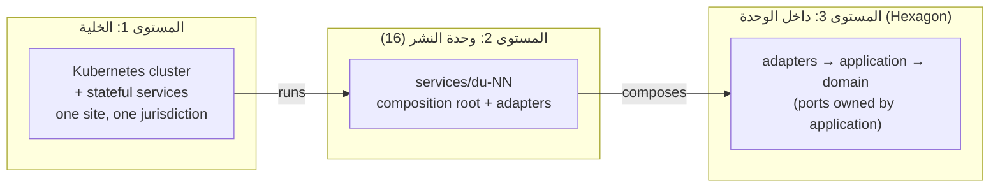
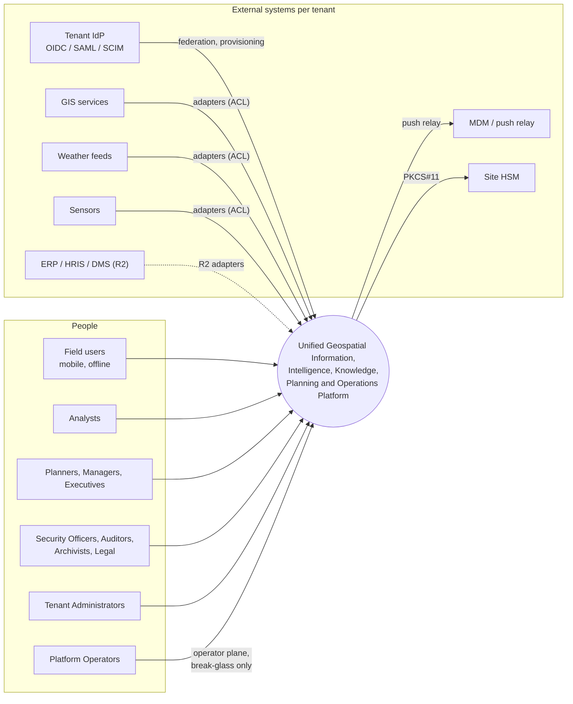
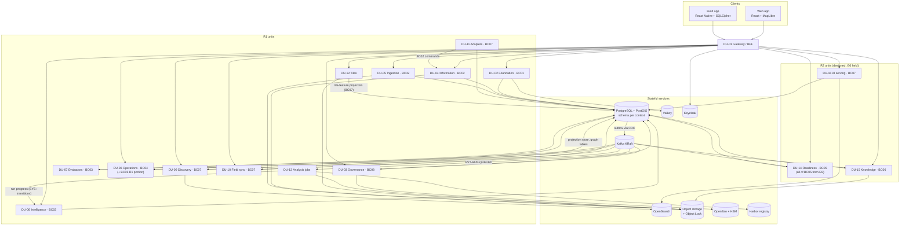

# 10 — نظرة عامة على المعمارية

هذه الوثيقة هي نقطة الدخول إلى تصميم المنصة. لا تضيف قرارات جديدة على مستوى النظام؛ تجمع القرارات المصادَق عليها في صورة واحدة من أعلى مستوى حتى داخل الوحدة، وتحيل كل عنصر إلى مصدره. القراران الجديدان الوحيدان هما [ADR-P17](../00-governance/decisions/ADR-P17.md) (المعمارية الداخلية) و[ADR-P18](../00-governance/decisions/ADR-P18.md) (هيكلية المستودع).

## 1. محركات المعمارية

ما يحدد شكل المعمارية ليس قائمة الميزات بل هذه القيود والصفات، مرتبة حسب أولوية شجرة المنفعة في المراجعة المعمارية (`16-reports/ARCHITECTURE-REVIEW-R1.md` §1):

| المحرك | الهدف القابل للقياس | ما فرضه على المعمارية |
|---|---|---|
| عدم الاستدلال | البيانات المخفية لا تغيّر أي مخرج: بحث، رسم، مواقف، بلاطات، تنبيهات | PEP قبل كل استرجاع؛ `allowed_scope` قبل العد (ADR-P06) |
| سحب الصلاحية فوري | يسري من الطلب التالي في كل المسارات | `security_version` + إعادة تحقق من النتائج (ADR-P06) |
| المساءلة الزمنية | «ماذا كنا نعرف في لحظة X» لكل قرار وتقييم وهوية | ادعاءات ثنائية الزمن لـT1 (ADR-P01) |
| لا كتابة صامتة | لا LWW ولا فقد في المزامنة | إصدار متفائل، تعارض بدل الكتابة فوق (ADR-P09) |
| الأداء | تنبيه حرج ≤ 5 ث؛ أمر ≤ 300 ms؛ بحث ≤ 1 ث عند 5,000 متزامن | وحدات منفصلة للمسارات الحرجة (DU-05، DU-07)؛ إسقاطات بحث |
| التوسع | 10× دون تغيير معماري | خلايا متماثلة (cell architecture) |
| الخصوصية | المحو يصل إلى النسخ الاحتياطية | إتلاف بالمفتاح (ADR-P08) |
| البيئة | معزولة عن الإنترنت، سيادية، ولاية واحدة لكل خلية | حزم موقَّعة offline (TD-17)؛ منع كل خروج شبكي |
| الفريق | بساطة تشغيلية كقيد ملزم (system-definition §6) | نمط داخلي واحد لكل الوحدات (ADR-P17)؛ مستودع واحد (ADR-P18) |
| التطور | الإصدار الرئيسي السابق للعقد مدعوم ≥ 6 أشهر (QAS-EVO-001) | إصدارات عقود متجاورة (FIT-14)؛ أجهزة ميدانية بإصدارات أقدم |

**المفاضلات المقبولة صراحة** (المراجعة المعمارية §3): الأمن يفشل مغلقًا ولو على حساب التوفر؛ النتائج تختلف لكل مستخدم فتقل فعالية الذاكرات المشتركة؛ ثنائية الزمن تضاعف حجم بيانات T1؛ بصمة تشغيلية كبيرة (8 خدمات ذات حالة لكل خلية).

## 2. الأنماط المعمارية المعتمدة

| النمط | ماذا يعني هنا | المصدر |
|---|---|---|
| Domain-Driven Design | 8 سياقات، 89 Aggregate، لغة موحّدة، خريطة سياقات بأنماط صريحة (OHS، Customer/Supplier، ACL) | `03-domain/` |
| Cell-based multi-tenancy | الخلية = عنقود Kubernetes + كل الخدمات ذات الحالة؛ ملفات shared / dedicated / sovereign بنفس الإصدار | ADR-P04، `cell-architecture.md` |
| خدمات حسب وحدة النشر | الـBC حد نموذج، ووحدة النشر حد تشغيل؛ 16 وحدة، تُفصل فقط لاختلاف التوسع أو العزل أو الفشل أو إيقاع التغيير | `deployment-units.md` |
| تكامل بالأحداث + transactional outbox | الحالة هي المصدر؛ الأحداث للتكامل والإسقاطات، لا event sourcing | ADR-P02، TD-04 |
| CQRS مخفف | الأوامر عبر الـAggregates؛ الاستعلامات من نماذج قراءة وإسقاطات مؤمَّنة | ADR-P06، TD-02 |
| تخويل خارجي (PEP / PDP) | سياسات كبيانات بإصدارات؛ PEP في كل وحدة؛ fail-closed | ADR-P11، TD-08 |
| Hexagonal (Ports & Adapters) | حلقات Domain / Application / Ports / Adapters متماثلة في كل وحدة | **ADR-P17** |
| API-first بعقود مولَّدة | OpenAPI / AsyncAPI تولّد stubs الخوادم والعملاء | TD-15 |
| Anti-Corruption Layer | الأنظمة الخارجية عبر محوّلات تكتب بأوامر BC02 | context-map، DU-11 |
| Offline-first ميداني | طابور أوامر على الجهاز، إعادة تطبيق على الخادم، تعارض بدل LWW | ADR-P09 |

## 3. مستويات الرؤية الثلاثة

| المستوى | الوثيقة التفصيلية |
|---|---|
| الخلية والنشر | `12-solution/cell-architecture.md`، و`22-deployment-design.md` (المرحلة 4) |
| وحدات النشر والمكوّنات | `12-solution/deployment-units.md`، و`12-components.md` (المرحلة 4) |
| داخل الوحدة | [11-hexagonal-reference.md](11-hexagonal-reference.md) |
| هيكلية المستودع | [13-project-structure.md](13-project-structure.md) |

## 4. C4 — المستوى 1: سياق النظام

المنصة لا تعتمد على أي خدمة إنترنت عامة (FIT-12). المصدر: `12-solution/c4-context.md`.

## 5. C4 — المستوى 2: الحاويات داخل الخلية (R1 + R2)

يحدّث هذا المخطط `12-solution/c4-containers.md` بإضافة وحدات R2 (DU-14، DU-15، DU-16)، ويبيّن مسار الأحداث عبر outbox بدل الاتصال المباشر.

**قواعد المستوى 2:** كل وحدة تكتب في schema سياقها فقط (FIT-01)؛ كل وحدة تحمل مقيّم OPA مضمَّنًا (TD-08) — لم يُرسم لكل وحدة تجنبًا للازدحام؛ القراءة العابرة للسياقات عبر OHS أو الأحداث فقط.

## 6. التكامل بين السياقات

| من | إلى | النمط | الاتساق |
|---|---|---|---|
| BC01 | الكل | OHS: `SecurityContext`، `AuthorityCheck` | متزامن |
| BC08 | الكل | OHS: `PolicyDecision`، التصنيف | متزامن، fail-closed |
| BC02 | BC03، BC04، BC06، BC07 | OHS + أحداث | استعلام متزامن؛ أحداث نهائية الاتساق |
| BC03 | BC04 | Customer/Supplier: مراجع التقييم بإصدار ثابت | مرجع ثابت |
| BC05 | BC04 | Customer/Supplier: `EligibilityCheck`، التوفر | متزامن، fail-closed |
| BC04 | BC05 | أحداث: تعيين المهمة وإكمالها | نهائي |
| الأنظمة الخارجية | BC07 | ACL ← أوامر BC02 | نهائي، مع السلالة |

المصدر الكامل: `03-domain/context-map.md`. الأحداث العابرة للسياقات المعلنة صراحة في `17-system-study/02-relationship-index.md` §21.3.

## 7. خريطة القرارات

| القرار | الموضوع | أين يظهر في التصميم |
|---|---|---|
| ADR-P01 | النموذج الزمني ثنائي الزمن | Domain في BC02؛ منفذ Clock |
| ADR-P02 | حالة + تاريخ + outbox، لا event sourcing | Unit of Work في `platform/` |
| ADR-P03 | مستويات الأهمية T1–T4 | نوع التخزين والتدقيق لكل خاصية |
| ADR-P04 | عزل المستأجرين الهجين | `tenant_id` أولًا في كل مفتاح؛ RLS؛ خلايا مخصصة |
| ADR-P05 | البصمة التقنية | TD-01..TD-19 |
| ADR-P06 | الأمن داخل الإسقاطات | `allowed_scope` في منفذ Read Model |
| ADR-P07 | الموقف Aggregate في BC03 | DU-06، DU-07 |
| ADR-P08 | المحو بالإتلاف بالمفتاح | منفذ Encryption؛ BC08 |
| ADR-P09 | المزامنة الميدانية | DU-10؛ `base_version` |
| ADR-P10 | تسمية مستويات الاستقلالية | AIL0–AIL5 في DU-16 |
| ADR-P11 | محرك السياسات | منفذ Authorization؛ OPA |
| ADR-P12 | خدمة الخرائط وأمن البلاطات | DU-12 |
| ADR-P13 | المعرّفات ULID + URN | `shared-kernel/identifiers` |
| ADR-P14 | حوكمة البيانات المرجعية | كتالوج RD (26 قائمة) |
| ADR-P15 | اللغة ومطابقة الكيانات | `shared-kernel/language`؛ BC02 ER |
| ADR-P16 | نظام الإحداثيات المعياري WGS 84 | BC02 الهندسة |
| **ADR-P17** | المعمارية الداخلية Hexagonal | كل وحدة نشر |
| **ADR-P18** | هيكلية المستودع | `contracts/`، `contexts/`، `platform/`، `services/` |
| **ADR-P19** | نتائج التخويل | 403 للمورد المرئي، `401 MFA_STEP_UP_REQUIRED`، `403 APPROVAL_REQUIRED` — `17-security-design.md` §3 |
| TD-01..TD-19 | التقنيات (PostgreSQL، Kafka، OpenSearch، OPA، Keycloak، OpenBao، Kubernetes...) | المحوّلات الخارجة |

## 8. ما لم يتغيّر وما أُضيف

- **لم يتغيّر:** السياقات، والـAggregates، والعقود، ووحدات النشر، والتقنيات، والقرارات المصادَق عليها.
- **أُضيف:** طبقة «كيف يُبنى من الداخل» (ADR-P17، ADR-P18، الوثيقتان 11 و13)، وتحديث مخطط الحاويات بوحدات R2.
- **يُكمَّل لاحقًا في هذه الدراسة:** قصص المستخدم، وتصميم الواجهات، ومخطط قاعدة البيانات، والمكوّنات لكل وحدة، ومسارات التشغيل، والأمن، والنشر (راجع [00-index.md](00-index.md)).
