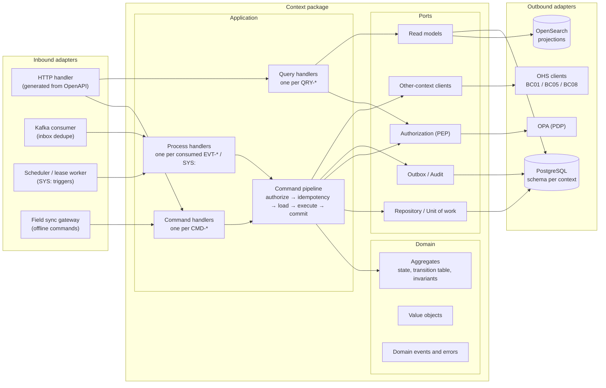
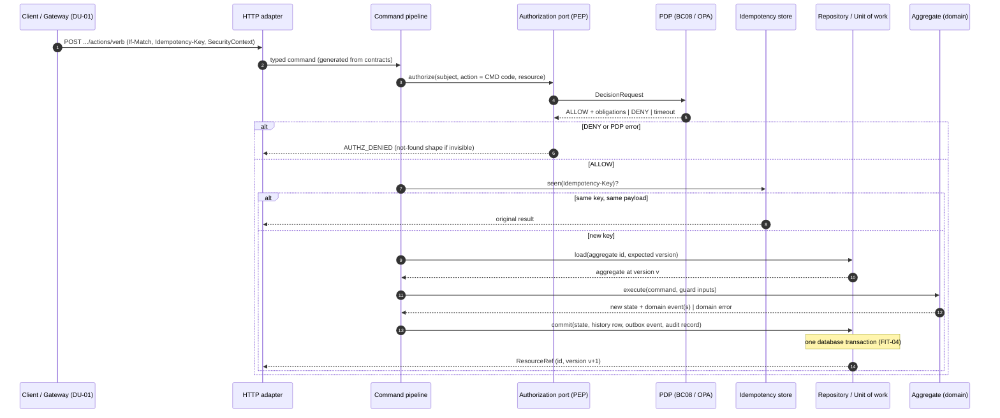
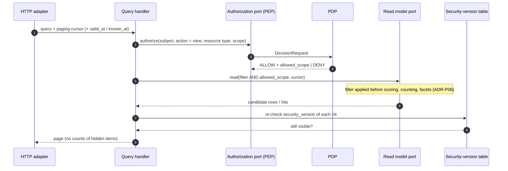
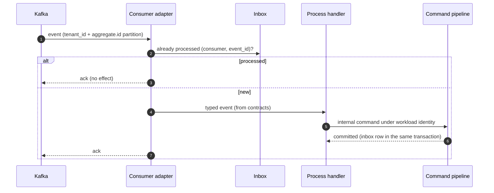
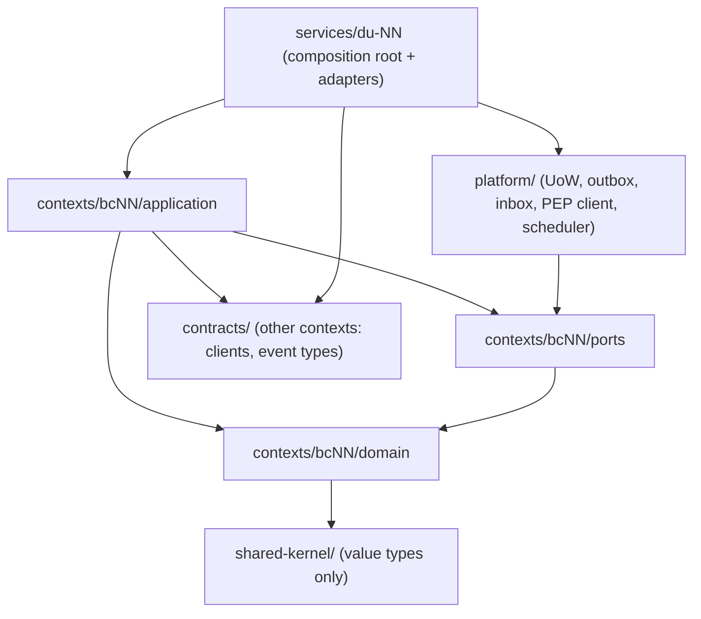

# 11 — المعمارية الداخلية المرجعية لكل وحدة نشر

هذه الوثيقة تحدد **كيف يُنظَّم الكود داخل كل وحدة نشر** — على الورق، قبل أي كود. هي تفصيل قرار [ADR-P17](../00-governance/decisions/ADR-P17.md)، وكل وحدة من الوحدات الـ16 في `12-solution/deployment-units.md` تتبعها بلا استثناء. توزيع الحزم في المستودع في [13-project-structure.md](13-project-structure.md) (ADR-P18).

## 1. الحلقات الأربع

| الحلقة | تحتوي | تعتمد على | لا تعتمد أبدًا على |
|---|---|---|---|
| **Domain** | الـAggregate (الحالة، جدول الانتقالات، الثوابت)، القيم (Value Objects)، أحداث المجال، أخطاء المجال | أنواع القيم في `shared-kernel/` | إطار عمل، قاعدة بيانات، رسائل، HTTP، ساعة النظام |
| **Application** | معالج لكل أمر، معالج لكل استعلام، معالج لكل حدث مستهلَك أو مُحفِّز مجدول، خط الأوامر (pipeline) | Domain، Ports | أي Adapter |
| **Ports** | واجهات تملكها طبقة التطبيق (القائمة الكاملة في §5) | أنواع Domain | أي تقنية |
| **Adapters** | الداخلة (HTTP، Kafka، المجدول، بوابة المزامنة) والخارجة (PostgreSQL، OPA، OpenSearch، التخزين، KMS، عملاء السياقات الأخرى) | Application، Ports، `platform/` | Adapter في وحدة أخرى |

**القاعدة الذهبية:** الاعتماد يتجه إلى الداخل فقط. تغيير قاعدة البيانات أو محرك الرسائل أو لغة الخدمة الساخنة (TD-03، TD-04، TD-15) يستبدل Adapter ولا يلمس Domain أو Application.

## 2. أين يسكن كل عنصر من المواصفات

كل عنصر في `spec/` له موقع واحد فقط في الكود. هذا الجدول هو جسر التتبع بين المواصفات والتنفيذ.

| عنصر المواصفات | المصدر | موقعه | ملاحظة |
|---|---|---|---|
| `AGG-*` | `03-domain/contexts/BC*/aggregates/` | Domain: جذر Aggregate | يحمل `version` للتزامن |
| مصفوفة الحالات × الأوامر (SL-05) | ملف الـAggregate | Domain: جدول انتقالات صريح داخل الـAggregate | كل خلية `✗` ترفع خطأ المجال المسمّى |
| `INV-*` | ملف الـAggregate | Domain: فحص داخل الـAggregate أو Value Object | لا يُفحص في Adapter |
| شرط الانتقال (Guard) | جدول الانتقالات | Domain؛ وما يحتاج بيانات خارجية يُجلب في Application قبل التنفيذ ويُمرَّر كمدخل | مثال: الأهلية من BC05 |
| `CMD-*` | `commands-slcNN.md` | Application: معالج أمر واحد | الحمولة = نوع مولَّد من `contracts/` |
| `QRY-*` | `queries-slcNN.md` | Application: معالج استعلام واحد | لا يحمّل Aggregate أبدًا |
| `POL-*` | `08-security/policies-slcNN.md` | Application: خطوة التخويل في الخط عبر منفذ Authorization؛ القرار من PDP (BC08) | الفشل = رفض (fail-closed) |
| `EVT-*` (إنتاج) | `events-slcNN.md` | Domain يُنشئ الحدث؛ منفذ Outbox يكتبه في نفس المعاملة | مفتاح التقسيم `tenant_id + aggregate.id` |
| مستهلكو `EVT-*` | عمود «المستهلكون» | Inbound Adapter (Kafka) ← معالج عملية في السياق المستهلِك | Inbox لمنع التكرار |
| مُحفِّز `SYS:` | جدول الانتقالات | Inbound Adapter (مجدول بعقود lease، TD-13) ← معالج عملية | هوية عبء عمل، نفس الثوابت |
| رموز الأخطاء | `05-contracts/errors-slcNN.md` | Domain يرفع خطأ مجال؛ Inbound Adapter يحوّله إلى رمز HTTP | التحويل في مكان واحد |
| `If-Match` / `VERSION_CONFLICT` | كل Aggregate | منفذ Repository: حفظ مشروط بالإصدار | 409 |
| `Idempotency-Key` | كل أمر | خط الأوامر + منفذ Idempotency Store | 422 عند نفس المفتاح بحمولة مختلفة |
| جداول `_history`، `outbox`، `audit_outbox`، `inbox` | `06-data/logical-model/` | `platform/` (Unit of Work)؛ لا يكتبها الكود مباشرة | FIT-04 |
| `security_version` | BC01، BC08 | منفذ SecurityContext؛ يُفحص في PEP وعند إعادة التحقق من نتائج الإسقاطات | ADR-P06 |
| `allowed_scope` | قرار PDP | معالج الاستعلام يمرّره إلى منفذ Read Model قبل الفرز والعد والترقيم | ADR-P06 |
| `SecurityContext`، `AuthorityCheck` | BC01 (OHS) | منفذ عميل سياق آخر | متزامن |
| `PolicyDecision` | BC08 (OHS) | منفذ Authorization | متزامن، fail-closed |
| `EligibilityCheck` | BC05 (OHS) | منفذ عميل سياق آخر في BC04 | fail-closed: `ELIGIBILITY_UNAVAILABLE` (THR-S03-04) |
| الإسقاطات (بحث، رسم، متجهات، بلاطات) | BC07 `discovery-architecture.md` | معالجات عملية في DU-09 تستهلك الأحداث وتكتب الإسقاط | كل وثيقة تحمل التسميات الأمنية |
| مفتاح الموضوع (crypto-shredding) | ADR-P08 | منفذ Encryption (KMS) يستدعيه Repository Adapter للحقول `pii` | لا يرى Domain المفتاح |
| الأمر الميداني دون اتصال | ADR-P09 | Inbound Adapter (بوابة المزامنة) ← نفس معالج الأمر | `base_version` بدل `If-Match`؛ التعارض يفتح حالة تعارض |

## 3. مسار الأمر (Command Pipeline)

كل أمر، من أي مدخل، يمر بنفس الخط بنفس الترتيب. هذا ما يجعل الضمانات الأربع (التخويل قبل الاسترجاع، المعاملة الواحدة، عدم التكرار، التدقيق) خاصية بنيوية لا شيئًا يتذكره كل مطوّر.

**حالات خاصة ضمن نفس الخط:**
- **إنشاء مرتبط في نفس وحدة العمل** (نمط CR-62، مثل طلب إمداد مع تخصيصه): مسموح **فقط** لـAggregates في نفس السياق ونفس الـschema؛ عبر السياقات يكون عبر حدث.
- **الساغا الوحيدة** هي تهيئة المستأجر (AGG-TENANT): خطوات idempotent وقابلة للتعويض يديرها BC01، كل خطوة أمر مستقل يمر بنفس الخط.
- **الالتزامات (obligations)** التي يعيدها PDP (تدقيق، حجب حقول، علامة مائية، موافقة، MFA) تُنفَّذ في الخط قبل الإرجاع، لا في المعالج.

## 4. مسار الاستعلام، والحدث الوارد، والمجدول

### 4.1 الاستعلام — لا Aggregate، والتصفية قبل العد

### 4.2 الحدث الوارد — مرة واحدة فعليًا

### 4.3 المجدول (`SYS:`)

المحفِّزات الزمنية (انتهاء الصلاحية، مهلة الموافقة، التصعيد) تُخزَّن كـ«سلال زمنية» في PostgreSQL، ويأخذها عامل داخل الوحدة المالكة بعقد lease (TD-13)؛ لا محرك workflow. العامل يحوّل المحفِّز إلى أمر داخلي يمر بخط الأوامر نفسه بهوية عبء عمل. منذ CR-72 لكل انتقال مجدول سيناريو قبول (`Scenario Outline: system-triggered transition`).

## 5. كتالوج المنافذ القياسية

المنافذ موجودة **فقط** عند حدود إدخال/إخراج حقيقية. لا منفذ لمنطق داخلي بحت.

| المنفذ | الاتجاه | المسؤولية | المحوّل الافتراضي | المصدر |
|---|---|---|---|---|
| Repository / Unit of Work | خارج | تحميل Aggregate بإصدار؛ حفظ الحالة + history + outbox + audit + inbox في معاملة | PostgreSQL (`platform/`) | ADR-P02، FIT-04، TD-01 |
| Authorization (PEP) | خارج | بناء DecisionRequest، تطبيق القرار والالتزامات و`allowed_scope`، ذاكرة ≤ 60 ث بمفتاح `security_version` | OPA مدمج (WASM) + حزم موقَّعة | ADR-P11، TD-08، authorization-model §5 |
| SecurityContext | خارج | هوية المستدعي، أدواره، نطاقه، تصريحه، `security_version` | عميل BC01 + نسخة Valkey | BC01 OHS، TD-11 |
| Idempotency Store | خارج | حفظ نتيجة كل `Idempotency-Key` | PostgreSQL | كل الـAggregates |
| Outbox / Audit Outbox | خارج | كتابة الحدث وسجل التدقيق داخل المعاملة | PostgreSQL؛ النقل عبر CDC (Debezium) إلى Kafka | TD-04 |
| Event Consumer + Inbox | داخل | استقبال الأحداث وإزالة التكرار | Kafka (Strimzi) | TD-04 |
| Scheduler | داخل | تحويل المحفِّزات الزمنية إلى أوامر داخلية | سلال PostgreSQL + lease | TD-13 |
| Read Model | خارج | قراءة الإسقاطات مع `allowed_scope` | OpenSearch أو جداول قراءة PostgreSQL | ADR-P06، TD-02 |
| Other-context Client | خارج | استدعاء OHS لسياق آخر (AuthorityCheck، EligibilityCheck، استعلامات as-of) | عميل مولَّد من `contracts/` | context-map |
| Encryption / Keys | خارج | تغليف وفك الحقول الشخصية بمفتاح الموضوع؛ الإتلاف | OpenBao Transit + HSM | ADR-P08، TD-07 |
| Object Storage | خارج | المرفقات، الأرشيف، الحزم | S3 + Object Lock | TD-06 |
| Clock | خارج | زمن الخادم لـ`recorded_at` | ساعة الخادم | ADR-P01 |
| Telemetry | خارج | سجلات، مقاييس، تتبّع | OpenTelemetry | TD-14 |

## 6. قواعد الاعتماد

**مسموح فقط ما في المخطط. ممنوع صراحة:**
1. Domain يستورد أي إطار عمل أو نوع قاعدة بيانات أو HTTP أو ساعة النظام.
2. سياق يستورد حزمة سياق آخر (`contexts/*` → `contexts/*`)؛ الوصول عبر `contracts/` فقط.
3. خدمة تستورد خدمة أخرى (`services/*` → `services/*`).
4. أي كود يقرأ جداول schema لا يملكها (FIT-01).
5. معالج أمر يستدعي PDP أو Repository مباشرة متجاوزًا الخط.
6. استعلام يعيد عدد عناصر قبل تطبيق `allowed_scope`.

هذه القواعد تُفحص آليًا في CI: FIT-20 (قواعد الاعتماد) وFIT-03 (قرار سياسة قبل كل استرجاع) في `13-verification/fitness-functions.md`.

## 7. أين يعمل كل سياق

| السياق | الحزمة | وحدات النشر التي تركّبها |
|---|---|---|
| BC01 Foundation | `contexts/bc01-foundation` | DU-02 |
| BC02 Information | `contexts/bc02-information` | DU-04 (الأوامر والاستعلامات)، DU-05 (الاستقبال عالي المعدل) |
| BC03 Intelligence | `contexts/bc03-intelligence` | DU-06 (الحالات والتقييمات)، DU-07 (المقيّمون التدفقيون) |
| BC04 Operations | `contexts/bc04-operations` | DU-08 |
| BC05 Readiness | `contexts/bc05-readiness` | DU-14 (R2؛ جزء R1 كان ضمن DU-08) |
| BC06 Knowledge | `contexts/bc06-knowledge` | DU-15 (R2) |
| BC07 Platform Intelligence | `contexts/bc07-platform` | DU-09 (الاكتشاف والإسقاطات)، DU-10 (المزامنة)، DU-11 (المحوّلات)، DU-16 (الذكاء الاصطناعي، R2) |
| BC08 Governance | `contexts/bc08-governance` | DU-03 |
| — | لا حزمة سياق | DU-01 (البوابة)، DU-12 (البلاطات)، DU-13 (مهام التحليل) |

تفصيل المكوّنات والمنافذ لكل وحدة في `12-components.md` (المرحلة 4).

## 8. أنماط خاصة

- **المحوّلات الخارجية (DU-11، ACL):** المحوّل Inbound Adapter يترجم نموذج النظام الخارجي ثم يستدعي أوامر BC02 عبر عقدها كأي عميل؛ لا يكتب في أي مخزن مباشرة (context-map قاعدة 3).
- **الذكاء الاصطناعي (DU-16):** الاسترجاع عبر منفذ Read Model بتخويل المستخدم فقط (PB-12)؛ أي كتابة تمر بخط أوامر السياق المالك بصلاحيات المستخدم وضمن مستوى الاستقلالية (AIL ≤ 3).
- **بناة الإسقاطات (DU-09):** معالجات عملية تستهلك الأحداث وتكتب وثائق بتسميات أمنية كاملة؛ إعادة البناء من المصدر ممكنة دائمًا (REQ-SRC-004، UC-078).
- **الادعاءات ثنائية الزمن (BC02):** `recorded_from/recorded_to` يحددها منفذ Clock في الخادم وحده؛ Domain يستقبل الزمن كمدخل ولا يقرأ الساعة.

## 9. الاختبار حسب الحلقة (ملخص)

| الحلقة | نوع الاختبار | المصدر |
|---|---|---|
| Domain | وحدة: كل خلية في مصفوفة الحالات وكل ثابت | ملفات الـAggregates، `invariant-properties-slcNN.md` |
| Application | سيناريوهات القبول (Gherkin) بمحوّلات في الذاكرة | `13-verification/acceptance/` (89 ملفًا) |
| Adapters | تكامل مع التقنية الفعلية؛ عقود OpenAPI/AsyncAPI | `05-contracts/` |
| الوحدة كاملة | Fitness functions، أداء، عدم استدلال | `fitness-functions.md`، `performance-test-strategy.md` |

التفصيل الكامل في `24-testing-strategy.md` (المرحلة 5).
