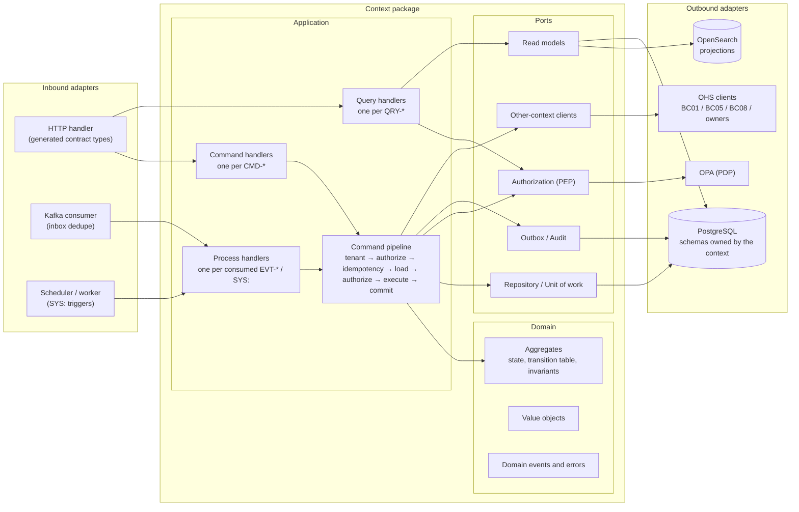
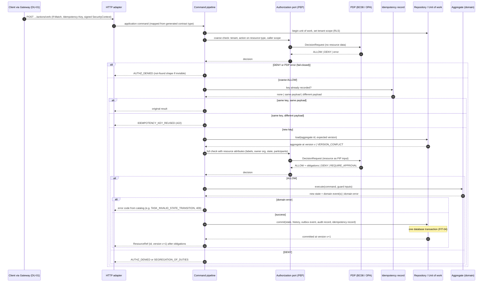
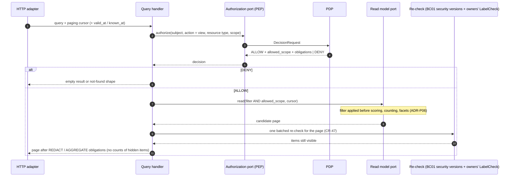
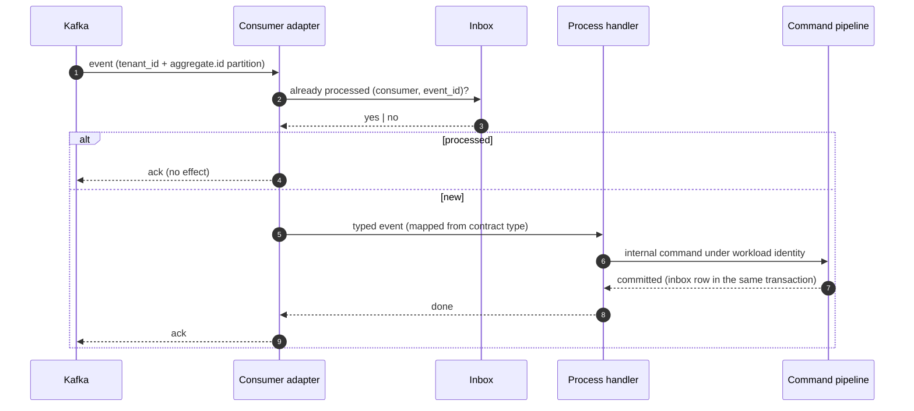
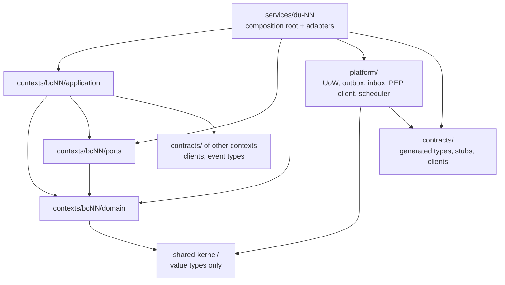

# 11 — المعمارية الداخلية المرجعية لكل وحدة نشر

هذه الوثيقة تحدد **كيف يُنظَّم الكود داخل كل وحدة نشر** — على الورق، قبل أي كود. هي تفصيل قرار [ADR-P17](../00-governance/decisions/ADR-P17.md)، وكل وحدة من الوحدات الـ16 في `12-solution/deployment-units.md` تتبعها بلا استثناء. توزيع الحزم في المستودع في [13-project-structure.md](13-project-structure.md) (ADR-P18).

## 1. الحلقات الأربع

| الحلقة | تحتوي | تعتمد على | لا تعتمد أبدًا على |
|---|---|---|---|
| **Domain** | الـAggregate (الحالة، جدول الانتقالات، الثوابت)، القيم (Value Objects)، أحداث المجال، أخطاء المجال | أنواع القيم في `shared-kernel/` | إطار عمل، قاعدة بيانات، رسائل، HTTP، ساعة النظام (FIT-10) |
| **Application** | معالج لكل أمر، معالج لكل استعلام، معالج لكل حدث مستهلَك أو مُحفِّز `SYS:`، خط الأوامر، أنواع الأوامر والاستعلامات الخاصة بالسياق | Domain، Ports | أي Adapter، أنواع العقود المولَّدة لنفس السياق |
| **Ports** | واجهات تملكها طبقة التطبيق عند حدود إدخال/إخراج حقيقية (القائمة في §5) | أنواع Domain | أي تقنية |
| **Adapters** | الداخلة (HTTP، Kafka، المجدول والعمّال) والخارجة (PostgreSQL، OPA، OpenSearch، التخزين، KMS، عملاء السياقات الأخرى) | Application، Ports، أنواع Domain، `platform/`، `contracts/` | Adapter في وحدة أخرى |

**القاعدة الذهبية:** الاعتماد يتجه إلى الداخل فقط. استبدال محرك الرسم أو الرسائل (TD-03، TD-04) يستبدل Adapter ولا يلمس Domain أو Application. إعادة كتابة مسار ساخن بلغة Go (TD-15) تُعيد تنفيذ وحدة واحدة كاملة خلف **نفس العقود ونفس سيناريوهات القبول**، ولا تمس بقية المنصة.

## 2. أين يسكن كل عنصر من المواصفات

كل عنصر في `spec/` له موقع واحد فقط في الكود. هذا الجدول هو جسر التتبع بين المواصفات والتنفيذ.

| عنصر المواصفات | المصدر | موقعه | ملاحظة |
|---|---|---|---|
| `AGG-*` | `03-domain/contexts/BC*/aggregates/` | Domain: جذر Aggregate | يحمل `version` للتزامن |
| مصفوفة الحالات × الأوامر (SL-05) | ملف الـAggregate | Domain: جدول انتقالات صريح داخل الـAggregate | كل خلية `✗` ترفع خطأ المجال المسمّى |
| `INV-*` (302) | ملف الـAggregate | Domain: فحص داخل الـAggregate أو Value Object | لا يُفحص في Adapter |
| شرط الانتقال (Guard) | جدول الانتقالات | Domain؛ وما يحتاج بيانات خارجية يُجلب في Application قبل التنفيذ ويُمرَّر كمدخل | مثال: الأهلية من BC05 |
| `CMD-*` | `commands-slcNN.md` | Application: معالج أمر واحد بنوع أمر خاص بالسياق | HTTP Adapter يحوّل نوع العقد المولَّد إلى نوع الأمر |
| `QRY-*` | `queries-slcNN.md` | Application: معالج استعلام واحد | لا يحمّل Aggregate أبدًا |
| `POL-*` | `08-security/policies-slcNN.md` | Application: خطوتا التخويل في الخط عبر منفذ Authorization؛ القرار من PDP (BC08) | الفشل = رفض (FIT-16) |
| `EVT-*` (إنتاج، 584) | `events-slcNN.md` | Domain يُنشئ الحدث؛ منفذ Outbox يكتبه في نفس المعاملة | مفتاح التقسيم `tenant_id + aggregate.id` |
| مستهلكو `EVT-*` | عمود «المستهلكون» | Inbound Adapter (Kafka) ← معالج عملية في السياق المستهلِك | Inbox لمنع التكرار |
| مُحفِّز `SYS:` (175) | جدول الانتقالات | حسب نوعه (§4.3): المجدول، أو معالج عملية على حدث، أو العامل، أو تقييم بعد أمر | هوية عبء عمل، نفس الثوابت |
| رموز الأخطاء | `05-contracts/errors-slcNN.md` | Domain يرفع خطأ مجال؛ Inbound Adapter يحوّله إلى رمز HTTP | التحويل في مكان واحد |
| `If-Match` / `VERSION_CONFLICT` | كل Aggregate | منفذ Repository: حفظ مشروط بالإصدار | 409 |
| `Idempotency-Key` | كل أمر | خط الأوامر + سجل Idempotency يُكتب داخل نفس المعاملة | 422 عند نفس المفتاح بحمولة مختلفة |
| جداول `_history`، `outbox`، `audit_outbox`، `inbox`، سجل Idempotency | `06-data/logical-model/` | `platform/unit-of-work`؛ لا يكتبها المعالج مباشرة | FIT-04 |
| `tenant_id` + RLS | ADR-P04 | خط الأوامر يضبط نطاق المستأجر لوحدة العمل؛ كل مفتاح يبدأ بـ`tenant_id` | FIT-02 |
| `security_version` | BC01، BC08 | منفذ SecurityContext؛ يدخل في مفتاح ذاكرة قرارات PEP | ADR-P06 |
| `allowed_scope` | قرار PDP | معالج الاستعلام يمرّره إلى منفذ Read Model قبل الفرز والعد والترقيم | ADR-P06 |
| إعادة التحقق من النتائج | ADR-P06 بتعديل CR-47 | الموضوع: مخزن `security_version` في BC01؛ الكائنات: `LabelCheck` مجمّع لكل صفحة إلى كل سياق مالك | لا جدول تسميات مركزي |
| `SecurityContext`، `AuthorityCheck` | BC01 (OHS) | منفذ عميل سياق آخر | متزامن |
| `PolicyDecision` | BC08 (OHS) | منفذ Authorization | متزامن، fail-closed |
| `EligibilityCheck` | BC05 (OHS) | منفذ عميل سياق آخر في BC04 | fail-closed: `ELIGIBILITY_UNAVAILABLE` (THR-S03-04) |
| الإسقاطات (بحث، رسم، متجهات) | BC07 `discovery-architecture.md` | معالجات عملية في DU-09 بنمط «notify + fetch» (§8) | كل وثيقة تحمل التسميات الأمنية |
| مفتاح الموضوع (crypto-shredding) | ADR-P08 | منفذ Encryption (KMS) يستدعيه Repository Adapter للحقول `pii` | لا يرى Domain المفتاح |
| الأمر الميداني دون اتصال | ADR-P09 | DU-10 يستقبل الدفعة ويمرّر كل أمر إلى عقد أوامر السياق المالك (§8) | `base_version` + `client_command_id`؛ التعارض يفتح حالة تعارض |

## 3. مسار الأمر (Command Pipeline)

كل أمر، من أي مدخل، يمر بنفس الخط بنفس الترتيب. هذا ما يجعل الضمانات (نطاق المستأجر، التخويل قبل الاسترجاع، المعاملة الواحدة، عدم التكرار، التدقيق) خاصية بنيوية لا شيئًا يتذكره كل مطوّر. التخويل على خطوتين لأن كثيرًا من السياسات تحتاج سمات المورد (مثلًا `POL-TASK-COMPLETE` يحتاج حالة المهمة، و`POL-TASK-APPROVE-SOD` يحتاج المكلَّف بها — `authorization-model.md` §4)، بينما FIT-03 يمنع أي وصول للبيانات قبل قرار سياسة.

**حالات خاصة ضمن نفس الخط:**
- **إنشاء مرتبط في نفس وحدة العمل** (نمط CR-62، طلب إمداد مع تخصيصه في BC05): مسموح **فقط** لـAggregates في نفس السياق؛ عبر السياقات يكون عبر حدث.
- **الساغا الوحيدة** هي تهيئة المستأجر (AGG-TENANT): خطوات idempotent وقابلة للتعويض يديرها BC01، كل خطوة أمر مستقل يمر بنفس الخط.
- **نتائج PDP غير ALLOW/DENY:** الالتزامات (تدقيق، علامة مائية، MFA) تُنفَّذ في الخط قبل الإرجاع. `REQUIRE_APPROVAL` و`CONDITIONAL` لأوامر تغيّر الحالة لا يوجد لهما مسار موحّد في المواصفات حاليًا **[Needs Review]**؛ يُثبَّت في `17-security-design.md` (المرحلة 4). في الاستعلامات: `REDACT` و`AGGREGATE` يطبّقهما معالج الاستعلام على النتائج (§4.1).

## 4. مسار الاستعلام، والحدث الوارد، والمحفِّزات النظامية

### 4.1 الاستعلام — لا Aggregate، والتصفية قبل العد

### 4.2 الحدث الوارد — مرة واحدة فعليًا

### 4.3 المحفِّزات النظامية (`SYS:`) — أربعة أنواع

ليست كل انتقالات `SYS:` مؤقِّتات. لكل نوع مدخل مختلف، لكنها كلها تنتهي بأمر داخلي يمر بخط الأوامر نفسه بهوية عبء عمل. منذ CR-72 لكل انتقال منها سيناريو قبول (`Scenario Outline: system-triggered transition`).

| النوع | أمثلة من المواصفات | المدخل |
|---|---|---|
| زمني | `SYS:valid_to reached` (AGG-AUTHORITY-GRANT وغيره)، `SYS:due passed (escalation policy)` (AGG-TASK) | مجدول الوحدة المالكة: سلال زمنية في PostgreSQL + عقد lease (TD-13) |
| شرطي بعد أمر | `SYS:all completion criteria satisfied` (AGG-TASK) | يُقيَّم بعد كل أمر يمس الشرط، ويُنفَّذ انتقالًا تاليًا بهوية النظام **[Derived]** — التفصيل لكل Aggregate في `12-components.md` |
| مدفوع بحدث | `SYS:plan version baselined without this task` (AGG-TASK)، `SYS:linked allocation committed` (BC05) | معالج عملية يستهلك الحدث المسبِّب (§4.2) |
| مدفوع بعامل | `SYS:worker lease acquired`، `SYS:completed` (AGG-ANALYSIS-RUN) | عامل الحوسبة (DU-13) يبلّغ عبر أمر داخلي على عقد BC03 |

## 5. كتالوج المنافذ القياسية

المنافذ موجودة **فقط** عند حدود إدخال/إخراج حقيقية. لا منفذ لمنطق داخلي بحت.

| المنفذ | الاتجاه | المسؤولية | المحوّل الافتراضي | المصدر |
|---|---|---|---|---|
| Repository / Unit of Work | خارج | ضبط نطاق المستأجر؛ تحميل Aggregate بإصدار؛ حفظ الحالة + history + outbox + audit + inbox + سجل Idempotency في معاملة | PostgreSQL (آليات `platform/unit-of-work`) | ADR-P02، ADR-P04، FIT-02، FIT-04، TD-01 |
| Authorization (PEP) | خارج | بناء DecisionRequest بخطوتيه، تطبيق القرار والالتزامات و`allowed_scope`، ذاكرة ≤ 60 ث بمفتاح `security_version` | OPA مدمج (WASM) + حزم موقَّعة | ADR-P11، TD-08، authorization-model §5 |
| SecurityContext | خارج | هوية المستدعي، أدواره، نطاقه، تصريحه، `security_version` | عميل BC01 + نسخة Valkey | BC01 OHS، TD-11 |
| Idempotency | خارج | قراءة سجل المفتاح؛ الكتابة تتم داخل وحدة العمل | PostgreSQL | كل الـAggregates |
| Outbox / Audit Outbox | خارج | كتابة الحدث وسجل التدقيق داخل المعاملة | PostgreSQL؛ النقل عبر CDC (Debezium) إلى Kafka | TD-04 |
| Event Consumer + Inbox | داخل | استقبال الأحداث وإزالة التكرار | Kafka (Strimzi) | TD-04 |
| Scheduler / Worker | داخل | تحويل المحفِّزات الزمنية وتقارير العمّال إلى أوامر داخلية | سلال PostgreSQL + lease؛ Kueue للعمّال | TD-12، TD-13 |
| Read Model | خارج | قراءة الإسقاطات أو جداول القراءة مع `allowed_scope` | OpenSearch أو جداول PostgreSQL | ADR-P06، TD-02 |
| Result Re-check | خارج | إعادة التحقق المجمّعة لكل صفحة: `security_version` للموضوع و`LabelCheck` للكائنات | BC01 KV + عملاء `LabelCheck` المولَّدة | ADR-P06 (CR-47) |
| Other-context Client | خارج | استدعاء OHS لسياق آخر (AuthorityCheck، EligibilityCheck، استعلامات as-of، التاريخ المنشور) | عميل مولَّد من `contracts/` | context-map |
| Encryption / Keys | خارج | تغليف وفك الحقول الشخصية بمفتاح الموضوع؛ الإتلاف | OpenBao Transit + HSM | ADR-P08، TD-07 |
| Object Storage | خارج | المرفقات، الأرشيف، الحزم | S3 + Object Lock | TD-06 |
| Clock | خارج | زمن الخادم لـ`recorded_at` | ساعة الخادم | ADR-P01 |
| Telemetry | خارج | سجلات، مقاييس، تتبّع | OpenTelemetry | TD-14 |

## 6. قواعد الاعتماد

- Adapters في `services/*` تنفّذ منافذ السياق مستخدمة آليات `platform/`؛ `platform/` نفسه لا يعرف أي منفذ أو نوع أعمال لسياق.
- السياق يستخدم عقود السياقات **الأخرى** فقط (عملاؤها وأنواع أحداثها)؛ أنواع عقده هو تحوّلها المحوّلات الداخلة في `services/` إلى أنواع التطبيق.

**مسموح فقط ما في المخطط. ممنوع صراحة:**
1. Domain يستورد أي إطار عمل أو نوع قاعدة بيانات أو HTTP أو ساعة النظام (FIT-10).
2. سياق يستورد حزمة سياق آخر (`contexts/*` → `contexts/*`)؛ الوصول عبر `contracts/` فقط (FIT-20).
3. خدمة تستورد خدمة أخرى (`services/*` → `services/*`) (FIT-20).
4. أي كود يقرأ جداول schema لا يملكها سياقه (FIT-01).
5. معالج أمر يستدعي PDP أو Repository مباشرة متجاوزًا الخط (FIT-03، FIT-20).
6. استعلام يعيد عدد عناصر قبل تطبيق `allowed_scope` (ADR-P06).

هذه القواعد تُفحص آليًا في CI: FIT-10 (نقاء Domain)، FIT-20 (حدود الوحدات)، FIT-03 وFIT-16 (قرار سياسة قبل الوصول، والفشل مغلق) في `13-verification/fitness-functions.md`.

## 7. أين يعمل كل سياق

| السياق | الحزمة | وحدات النشر التي تركّبها |
|---|---|---|
| BC01 Foundation | `contexts/bc01-foundation` | DU-02 |
| BC02 Information | `contexts/bc02-information` | DU-04 (الأوامر والاستعلامات)، DU-05 (الاستقبال عالي المعدل) |
| BC03 Intelligence | `contexts/bc03-intelligence` | DU-06 (الحالات والتقييمات)، DU-07 (المقيّمون التدفقيون) |
| BC04 Operations | `contexts/bc04-operations` | DU-08 |
| BC05 Readiness | `contexts/bc05-readiness` | R1: ضمن DU-08 (التأهيل والأهلية، SLC-03)؛ من R2: DU-14 |
| BC06 Knowledge | `contexts/bc06-knowledge` | DU-15 (R2) |
| BC07 Platform Intelligence | `contexts/bc07-platform` | DU-09 (الاكتشاف والإسقاطات)، DU-10 (المزامنة)، DU-11 (المحوّلات)، DU-16 (الذكاء الاصطناعي، R2) |
| BC08 Governance | `contexts/bc08-governance` | DU-03 |
| — | لا حزمة سياق | DU-01 (البوابة)، DU-12 (البلاطات)، DU-13 (مهام التحليل) |

تفصيل المكوّنات والمنافذ لكل وحدة في `12-components.md` (المرحلة 4).

## 8. أنماط خاصة

- **المزامنة الميدانية (DU-10):** بوابة المزامنة تستقبل دفعة الأوامر من الجهاز عبر البوابة (TB-01/TB-02)، ثم تمرّر كل أمر إلى عقد أوامر السياق المالك بـ`base_version` و`client_command_id`؛ أوامر الإضافة فقط لا تتعارض، وأوامر تغيير الحالة تُطبَّق فقط إذا طابق `base_version`، وإلا تُفتح حالة تعارض في BC02 (ADR-P09، FIT-15).
- **المحوّلات الخارجية (DU-11، ACL):** المحوّل يترجم نموذج النظام الخارجي ثم يستدعي أوامر BC02 عبر عقدها كأي عميل؛ لا يكتب في أي مخزن غير schema `integration` الخاص بـBC07 (context-map قاعدة 3).
- **الذكاء الاصطناعي (DU-16، R2):** الاسترجاع عبر منفذ Read Model بتخويل المستخدم فقط (PB-12). **لا أدوات «كتابة» في R2**: أدوات «الاقتراح» تنشئ AI Results في BC07 فقط، ويقرر الإنسان ثم ينفّذ عبر أوامر السياق المالك بصلاحياته (`grounded-ai-spec.md` §6، AIL ≤ 3).
- **بناة الإسقاطات (DU-09):** نمط «notify + fetch»: الحدث يشير فقط، ثم يُجلب أحدث محتوى من OHS السياق المالك بهوية عبء عمل الاكتشاف، ثم تُكتب الوثيقة بتسمياتها الأمنية؛ إعادة البناء الكاملة عبر واجهات تصدير بالمؤشر من كل مالك (`discovery-architecture.md`، REQ-SRC-004، UC-078).
- **البلاطات (DU-12، بلا سياق):** TD-10 يولّد البلاطات من PostGIS مباشرة. للحفاظ على FIT-01 يُنشر مصدر كل طبقة من السياق المالك لها كدالة أو view للقراءة فقط داخل schema ذلك السياق، مع صلاحية قراءة صريحة لهوية خدمة البلاطات، ولا يقرأ DU-12 جداول أي سياق مباشرة **[Derived]**. قائمة الطبقات ومالكوها تُثبَّت في `16-database-schema.md` (المرحلة 2).
- **إعادة البناء التاريخي (DU-15، R2):** `products-knowledge-archive-spec.md` يعيد بناء حالة Aggregate من `*_history`. عبر السياقات يجري ذلك باستعلام تاريخ منشور من السياق المالك (as-of)، لا بقراءة جداوله (FIT-01) **[Derived]**.
- **الادعاءات ثنائية الزمن (BC02):** `recorded_from/recorded_to` يحددها منفذ Clock في الخادم وحده؛ Domain يستقبل الزمن كمدخل ولا يقرأ الساعة.

## 9. الاختبار حسب الحلقة (ملخص)

| الحلقة | نوع الاختبار | المصدر |
|---|---|---|
| Domain | وحدة: كل خلية في مصفوفة الحالات وكل ثابت | ملفات الـAggregates، `invariant-properties-slcNN.md` |
| Application | سيناريوهات القبول (Gherkin) بمحوّلات في الذاكرة | `13-verification/acceptance/` (89 ملفًا) |
| Adapters | تكامل مع التقنية الفعلية؛ عقود OpenAPI/AsyncAPI | `05-contracts/` |
| الوحدة كاملة | Fitness functions، أداء، عدم استدلال | `fitness-functions.md`، `performance-test-strategy.md` |

التفصيل الكامل في `24-testing-strategy.md` (المرحلة 5).
