# المكوّنات (C4 المستوى 3)

ما بداخل كل وحدة من وحدات النشر الـ16: المحوّلات الواردة، ومعالجات التطبيق، والـAggregates، والمحوّلات الخارجة. المستوى 2 (الحاويات) في `10-architecture-overview.md` §4؛ الحلقات والمنافذ في `11-hexagonal-reference.md`؛ مكان كل مكوّن في المستودع في `13-project-structure.md` §2–§4.

## 1. القالب المشترك

كل وحدة تحمل حزمة سياق تتبع القالب نفسه (ADR-P17):

| الحلقة | المكوّن | العدد في الوحدة |
|---|---|---|
| Inbound | محوّل HTTP مولَّد من العقد؛ مستهلك Kafka مع inbox؛ مجدول الوحدة؛ مستقبل تقارير العمّال | حسب ما تستقبله الوحدة (§7.1) |
| Application | خط الأوامر ذو الخطوات العشر؛ معالج لكل `CMD-*`؛ معالج لكل `QRY-*`؛ معالج عملية لكل قاعدة `SYS:` أو حدث مستهلك | §7.1 |
| Domain | Aggregate لكل `AGG-*` بآلة حالاته وثوابته | §7.1 |
| Outbound | PostgreSQL (schema السياق)، OPA مضمَّن، إعادة فحص النتائج، OpenBao عند البيانات الشخصية، مخزن الكائنات، ناقل الـoutbox (CDC)، عملاء السياقات الأخرى | §7.2 |

المخطط في كل وحدة يعرض المكوّنات بالعدد لا بالاسم (معالج لكل أمر واستعلام)، والـAggregates بأسمائها؛ الأسماء الكاملة في قصص المستخدم وكتالوج الواجهات.

## 2. توزيع السياقات على الوحدات

السياق الذي يعمل في أكثر من وحدة يُوزَّع على مستوى الـAggregate **[Derived]** من مسؤولية كل وحدة في `12-solution/deployment-units.md`، لأن Aggregate واحدًا لا يُقسَّم بين وحدتين (حد الاتساق):

| السياق | التوزيع | المبرر |
|---|---|---|
| BC02 | DU-05: OBSERVATION، IMPORT-BATCH، ATTACHMENT؛ DU-04: الباقي | DU-05 «استقبال الملاحظات عالي المعدل، الاستيراد، الماسح» (WL-06a) |
| BC03 | DU-06: كل الـAggregates؛ DU-07: معالجات العملية لقواعد ALERT وSITUATION المدفوعة بحدث أو الشرطية (شرطها على بيانات سياقات أخرى فيصلها حدثًا) | DU-07 «مقيّمو العضوية والتنبيه (تدفقي)» ≤ 5 ثوانٍ؛ يكتب عبر خط أوامر DU-06 نفسه |
| BC05 | R1: AGG-QUALIFICATION-RECORD و`QRY-ELIG-CHECK` داخل DU-08 (schema `readiness`)؛ R2: كل BC05 في DU-14، ومعه Aggregates الإمداد والتمارين (SLC-18/19، R3) **[Derived]** | `11-hexagonal-reference.md` §7؛ `deployment-units.md` لا يذكر SLC-18/19 لـDU-14 (§5) |
| BC07 | DU-09: PROJECTION-VERSION والبحث والرسم؛ DU-10: SYNC-SESSION، SYNC-CONFLICT، PRELOAD-PACKAGE؛ DU-11: ADAPTER، INTEGRATION-CONNECTION، SENSOR-STREAM؛ DU-16: الذكاء الاصطناعي (6 Aggregates) | مسؤوليات DU-09/10/11/16 |
| الاستعلامات | حسب مسار العقد: `/discovery` ← DU-09، `/field` ← DU-10، `/integration` ← DU-11، `/ai` ← DU-16؛ البلاطات (`QRY-SIT-TILE`، `QRY-BASE-TILE`) ← DU-12 من الإسقاط؛ وإلا وحدة الـAggregate صاحب المورد | `14-api-design.md` §1؛ ADR-P06؛ `11-hexagonal-reference.md` §8 |

المقيِّم التدفقي في DU-07 لا يملك بيانات: يقرأ الأحداث (وschema `intelligence` قراءةً فقط، كما في `13-project-structure.md` §4) ويصدر أوامر داخلية على عقد DU-06، فيبقى حفظ الحالة والـoutbox في وحدة واحدة **[Derived]**. لذلك لا يظهر في مخططه خط أوامر ولا ناقل outbox (§7.2).

## 3. الوحدات بلا سياق

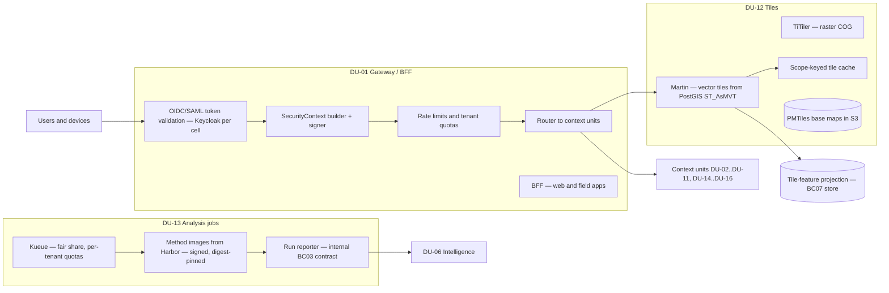

| الوحدة | المكوّنات | القواعد | المصدر |
|---|---|---|---|
| DU-01 | التحقق من الرمز، بناء SecurityContext موقّع، حدود المعدل والحصص، التوجيه، BFF | `tenant_id` من الرمز لا من الطلب؛ التطبيقات لا تثق بترويسة غير موقّعة؛ لا منطق أعمال | TB-01/02، TD-09، REQ-FND-018 |
| DU-12 | Martin، TiTiler، ذاكرة البلاطات بمفتاح نطاق الصلاحية، خرائط أساس PMTiles | يقرأ إسقاط ميزات البلاطات في مخزن BC07 لا مخازن المالكين (ADR-P06)؛ لا إصابة ذاكرة بين نطاقين (QAS-SEC-004) | TD-10، `11-hexagonal-reference.md` §8 |
| DU-13 | Kueue، صور طرق التحليل الموقّعة، مُبلِّغ التشغيل | التشغيل يقرأ ما يراه طالبه فقط، والنتيجة بتصنيف ≥ أعلى مدخلاتها (QAS-SEC-013)؛ يبلّغ BC03 بأمر داخلي (`SYS:` مدفوع بعامل) | TD-12، AGG-ANALYSIS-RUN |

## 4. المنافذ المستخدمة في كل وحدة

| المنفذ (`11-hexagonal-reference.md` §5) | الوحدات |
|---|---|
| Repository / Unit of Work، Idempotency، Outbox / Audit Outbox، Authorization، SecurityContext | كل وحدة تحمل Aggregates |
| Event Consumer + Inbox | كل وحدة لها قواعد `SYS:` مدفوعة بحدث، وDU-07، وبناة الإسقاطات في DU-09 |
| Scheduler / Worker | كل وحدة لها قواعد زمنية أو مدفوعة بعامل (§7.1) |
| Read Model، Result Re-check | كل وحدة لها استعلامات |
| Other-context Client | DU-04، DU-06، DU-07 (عقد DU-06)، DU-08، DU-09 (إشعار وجلب من OHS المالك)، DU-10، DU-11، DU-13 (تقارير BC03)، DU-14 وDU-15 (`AuthorityCheck`، واستعلامات تاريخ المالكين لإعادة البناء)، DU-16 (أوامر المالك عند قبول AI-RESULT باسم المراجع — ليست أداة كتابة للنموذج) (§7.2) |
| Encryption / Keys | الوحدات ذات Aggregates ببيانات شخصية (`17-security-design.md` §12.7) |
| Object Storage | DU-03، DU-04، DU-05، DU-10، DU-12، DU-15 (مثبتات التدقيق، الأدلة، المرفقات، الحزم، الخرائط الأساس PMTiles، الأرشيف، المنتجات) |

## 5. فجوات

| البند | الحالة |
|---|---|
| طوارئ BC04 (DOM-17، R3: RISK، INCIDENT) «مرشحة لوحدة مستقلة عند تصميمها» | **[Needs Review]** — في هذا الملف ضمن DU-08 كما هو حاليًا (`deployment-units.md`، ملاحظة) |
| اسم schema مخزن الإسقاطات في DU-09 | **[Missing]** (S-11) |
| توزيع BC02 بين DU-04 وDU-05 على مستوى الـAggregate | **[Derived]** — المصدر يوزع بالمسؤولية لا بالـAggregate |
| Aggregates الإمداد والتمارين (LOGISTICS-REQUEST، SHIPMENT، EXERCISE، SCENARIO، SIMULATION — SLC-18/19، R3) في DU-14 | **[Derived]** من ملكية BC05 — `deployment-units.md` لا يذكرها لـDU-14 |
| وحدات تحمل Aggregates من إصدار لاحق (DU-08: SLC-15، SLC-17؛ DU-11: SLC-16) | عمود الإصدار في §7.1 يعرضها؛ النشر يفعّل مساراتها بإصدارها (أعلام الميزات، `23-crosscutting.md`) |

## 6. قراءة الجداول

لكل وحدة: مخطط المكوّنات، ثم جدول الـAggregates بعدد أوامرها واستعلاماتها، ثم قواعد `SYS:` حسب نوع المحفِّز (`11-hexagonal-reference.md` §4.3)، ثم العمليات الداخلية ودون اتصال.

## 7. المكوّنات المولَّدة

<!-- BEGIN GENERATED: build_analysis_design.py -->

### 7.1 الملخص

| الوحدة | الـAggregates | أوامر | استعلامات | قواعد `SYS:` (زمني / شرطي / حدث / عامل) | الـschemas | الإصدار |
|---|---|---|---|---|---|---|
| DU-01 Gateway/BFF | — | — | — | — | — | R1 |
| DU-02 Foundation | 11 | 67 | 10 | 4 / 1 / 2 / 0 | `foundation` | R1 + R2 (1) |
| DU-03 Governance | 7 | 28 | 11 | 4 / 3 / 7 / 0 | `governance` | R1 |
| DU-04 Information | 15 | 79 | 23 | 2 / 5 / 3 / 0 | `information` | R1 + R2 (4) |
| DU-05 Ingestion | 3 | 13 | 4 | 1 / 3 / 0 / 3 | `information` | R1 |
| DU-06 Intelligence | 9 | 52 | 15 | 1 / 1 / 1 / 3 | `intelligence` | R1 + R2 (1) |
| DU-07 Evaluators | 0 | 0 | 0 | 0 / 3 / 0 / 0 | — | R1 |
| DU-08 Operations | 13 | 87 | 21 | 7 / 4 / 13 / 0 | `operations`, `readiness` | R1 + R2 (1) + R3 (2) |
| DU-09 Discovery | 1 | 4 | 5 | 2 / 1 / 0 / 1 | — | R1 |
| DU-10 Field sync | 3 | 9 | 4 | 2 / 5 / 0 / 2 | `field` | R1 |
| DU-11 Adapters | 3 | 18 | 3 | 1 / 2 / 0 / 0 | `integration` | R1 + R2 (2) |
| DU-12 Tiles | 0 | 0 | 2 | 0 / 0 / 0 / 0 | — | R1 |
| DU-13 Analysis jobs | — | — | — | — | — | R1 |
| DU-14 Readiness (R2) | 12 | 64 | 20 | 4 / 2 / 11 / 0 | `readiness` | R2 + R3 (5) |
| DU-15 Knowledge (R2) | 6 | 29 | 8 | 0 / 2 / 6 / 6 | `knowledge` | R2 |
| DU-16 AI Serving (R2) | 6 | 27 | 7 | 0 / 7 / 3 / 1 | `ai` | R2 |

عمود الإصدار: إصدار الوحدة، وبين قوسين عدد الـAggregates التي تصل في إصدار لاحق (من شريحة كل Aggregate، `01-business/system-definition.md` §4).

### 7.2 المكوّنات لكل وحدة

#### DU-02 Foundation

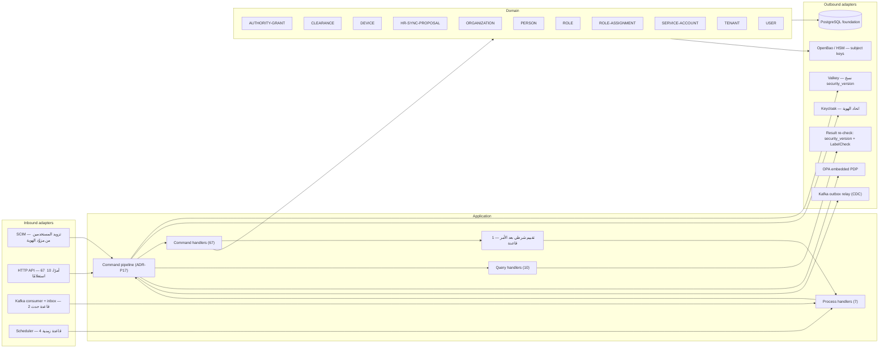

| الـAggregate | الأوامر | الاستعلامات |
|---|---|---|
| `AGG-AUTHORITY-GRANT` | 7 | 2 |
| `AGG-CLEARANCE` | 6 | 1 |
| `AGG-DEVICE` | 7 | 1 |
| `AGG-HR-SYNC-PROPOSAL` | 2 | 1 |
| `AGG-ORGANIZATION` | 8 | 1 |
| `AGG-PERSON` | 5 | 0 |
| `AGG-ROLE` | 4 | 0 |
| `AGG-ROLE-ASSIGNMENT` | 2 | 0 |
| `AGG-SERVICE-ACCOUNT` | 5 | 0 |
| `AGG-TENANT` | 11 | 1 |
| `AGG-USER` | 10 | 2 |

**استعلامات بلا Aggregate في الوحدة:** `QRY-SEC-CONTEXT`

**قواعد `SYS:` (زمني):** AUTHORITY-GRANT: valid_to reached؛ CLEARANCE: valid_to reached؛ HR-SYNC-PROPOSAL: 14 days without decision؛ ROLE-ASSIGNMENT: valid_to reached

**قواعد `SYS:` (شرطي بعد أمر):** HR-SYNC-PROPOSAL: newer HR change for the same person

**قواعد `SYS:` (مدفوع بحدث):** DEVICE: wipe confirmed by device؛ HR-SYNC-PROPOSAL: HRIS change received

**عمليات خاصة:** داخلية 5، دون اتصال 0 (`14-api-design.md` §7).

#### DU-03 Governance

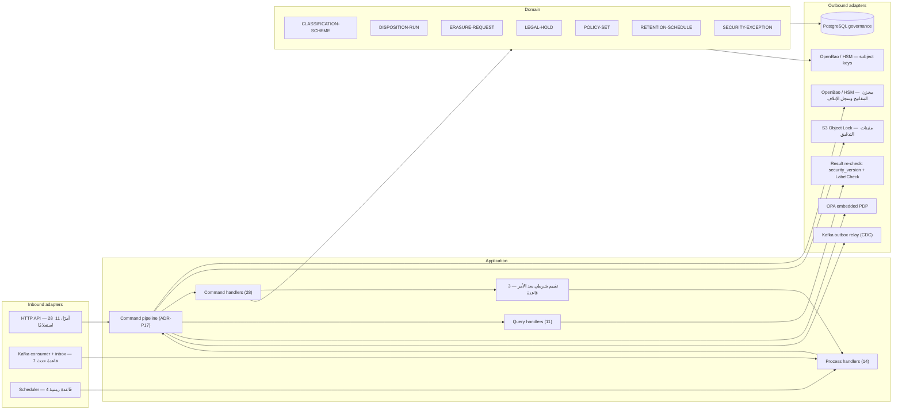

| الـAggregate | الأوامر | الاستعلامات |
|---|---|---|
| `AGG-CLASSIFICATION-SCHEME` | 4 | 1 |
| `AGG-DISPOSITION-RUN` | 3 | 1 |
| `AGG-ERASURE-REQUEST` | 3 | 1 |
| `AGG-LEGAL-HOLD` | 5 | 2 |
| `AGG-POLICY-SET` | 5 | 1 |
| `AGG-RETENTION-SCHEDULE` | 4 | 1 |
| `AGG-SECURITY-EXCEPTION` | 4 | 1 |

**استعلامات بلا Aggregate في الوحدة:** `QRY-AUD-SEARCH`, `QRY-AUD-VERIFY`, `QRY-PDP-DECIDE`

**قواعد `SYS:` (زمني):** DISPOSITION-RUN: scheduled evaluation (daily)؛ ERASURE-REQUEST: all contexts confirmed؛ POLICY-SET: effective_from reached؛ SECURITY-EXCEPTION: end reached

**قواعد `SYS:` (شرطي بعد أمر):** DISPOSITION-RUN: all buckets processed؛ DISPOSITION-RUN: some buckets failed؛ ERASURE-REQUEST: execution started

**قواعد `SYS:` (مدفوع بحدث):** CLASSIFICATION-SCHEME: successor activated؛ DISPOSITION-RUN: execution started؛ ERASURE-REQUEST: subject scope resolved؛ ERASURE-REQUEST: hold matches subject؛ ERASURE-REQUEST: hold released؛ POLICY-SET: successor activated؛ RETENTION-SCHEDULE: successor activated

#### DU-04 Information

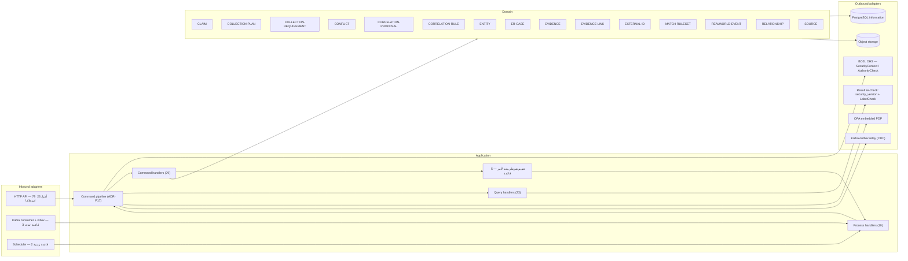

| الـAggregate | الأوامر | الاستعلامات |
|---|---|---|
| `AGG-CLAIM` | 6 | 1 |
| `AGG-COLLECTION-PLAN` | 6 | 1 |
| `AGG-COLLECTION-REQUIREMENT` | 8 | 3 |
| `AGG-CONFLICT` | 6 | 2 |
| `AGG-CORRELATION-PROPOSAL` | 4 | 2 |
| `AGG-CORRELATION-RULE` | 4 | 0 |
| `AGG-ENTITY` | 5 | 4 |
| `AGG-ER-CASE` | 10 | 2 |
| `AGG-EVIDENCE` | 6 | 1 |
| `AGG-EVIDENCE-LINK` | 2 | 0 |
| `AGG-EXTERNAL-ID` | 2 | 1 |
| `AGG-MATCH-RULESET` | 3 | 1 |
| `AGG-REALWORLD-EVENT` | 5 | 1 |
| `AGG-RELATIONSHIP` | 4 | 1 |
| `AGG-SOURCE` | 8 | 1 |

**استعلامات بلا Aggregate في الوحدة:** `QRY-CLUSTER-GET`, `QRY-LIN-TRACE`

**قواعد `SYS:` (زمني):** COLLECTION-REQUIREMENT: due passed؛ CORRELATION-PROPOSAL: not reviewed within 30 days

**قواعد `SYS:` (شرطي بعد أمر):** COLLECTION-REQUIREMENT: validated observation matched؛ CONFLICT: conflict rule matched؛ CONFLICT: incompatible claim joined؛ CORRELATION-PROPOSAL: correlation rule score ≥ threshold؛ ER-CASE: candidate generator score ≥ propose threshold

**قواعد `SYS:` (مدفوع بحدث):** COLLECTION-PLAN: all activity tasks terminal؛ CONFLICT: member set no longer conflicting؛ MATCH-RULESET: successor activated

**عمليات خاصة:** داخلية 0، دون اتصال 1 (`14-api-design.md` §7).

#### DU-05 Ingestion

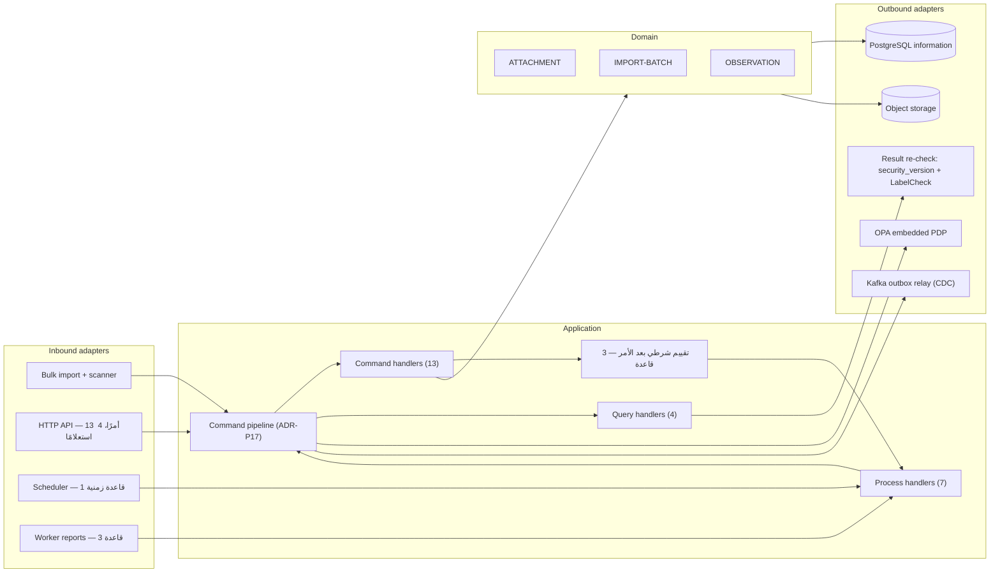

| الـAggregate | الأوامر | الاستعلامات |
|---|---|---|
| `AGG-ATTACHMENT` | 3 | 1 |
| `AGG-IMPORT-BATCH` | 4 | 1 |
| `AGG-OBSERVATION` | 6 | 2 |

**قواعد `SYS:` (زمني):** ATTACHMENT: upload window 24 h elapsed

**قواعد `SYS:` (شرطي بعد أمر):** IMPORT-BATCH: all records applied؛ IMPORT-BATCH: finished with invalid records؛ IMPORT-BATCH: unrecoverable error

**قواعد `SYS:` (مدفوع بعامل):** ATTACHMENT: scan passed؛ ATTACHMENT: scan failed؛ IMPORT-BATCH: processing started

**عمليات خاصة:** داخلية 0، دون اتصال 5 (`14-api-design.md` §7).

#### DU-06 Intelligence

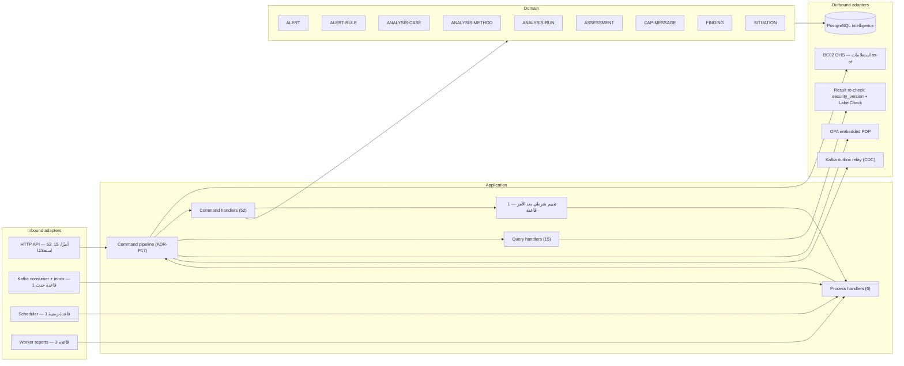

| الـAggregate | الأوامر | الاستعلامات |
|---|---|---|
| `AGG-ALERT` | 3 | 1 |
| `AGG-ALERT-RULE` | 6 | 0 |
| `AGG-ANALYSIS-CASE` | 14 | 2 |
| `AGG-ANALYSIS-METHOD` | 4 | 1 |
| `AGG-ANALYSIS-RUN` | 3 | 2 |
| `AGG-ASSESSMENT` | 7 | 2 |
| `AGG-CAP-MESSAGE` | 4 | 1 |
| `AGG-FINDING` | 4 | 1 |
| `AGG-SITUATION` | 7 | 4 |

**استعلامات بلا Aggregate في الوحدة:** `QRY-SCN-COMPARE`

**قواعد `SYS:` (زمني):** ALERT: unacknowledged beyond escalation delay

**قواعد `SYS:` (شرطي بعد أمر):** CAP-MESSAGE: delivery failed after retries

**قواعد `SYS:` (مدفوع بحدث):** ASSESSMENT: newer version published

**قواعد `SYS:` (مدفوع بعامل):** ANALYSIS-RUN: worker lease acquired؛ ANALYSIS-RUN: completed؛ ANALYSIS-RUN: error or timeout

#### DU-07 Evaluators

لا تملك بيانات ولا خط أوامر: تستهلك الأحداث تدفقيًا، وتقيّم قواعد العضوية والتنبيه، وتصدر أوامر داخلية على عقد DU-06 الذي ينفذها بخط أوامره ويكتب الـoutbox في معاملته (§2). شرط التنبيه يقع على بيانات سياقات أخرى، فـ«الأمر الذي يمس الشرط» (ضابط C-SYS) يصل إليها حدثًا؛ لذا تُقيَّم هنا القواعد المصنفة «شرطي بعد أمر» أيضًا.

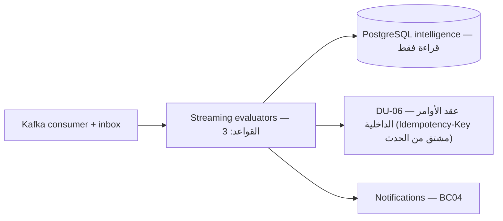

| القاعدة (Aggregate: المحفز) |
|---|
| ALERT: rule condition met |
| ALERT: condition met again within dedupe window |
| ALERT: condition cleared and rule auto_resolve |

#### DU-08 Operations

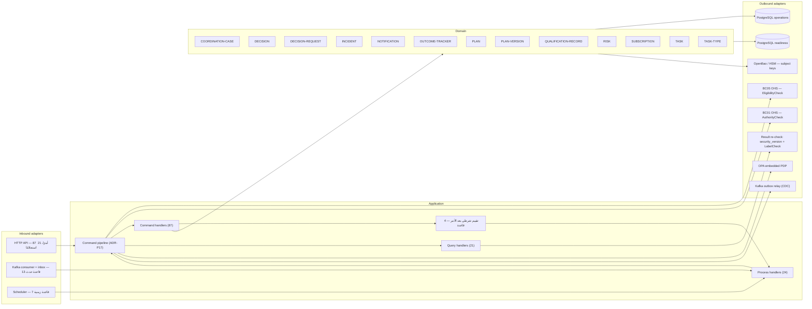

| الـAggregate | الأوامر | الاستعلامات |
|---|---|---|
| `AGG-COORDINATION-CASE` | 9 | 2 |
| `AGG-DECISION` | 2 | 2 |
| `AGG-DECISION-REQUEST` | 5 | 2 |
| `AGG-INCIDENT` | 10 | 3 |
| `AGG-NOTIFICATION` | 1 | 1 |
| `AGG-OUTCOME-TRACKER` | 2 | 1 |
| `AGG-PLAN` | 7 | 2 |
| `AGG-PLAN-VERSION` | 8 | 2 |
| `AGG-QUALIFICATION-RECORD` | 5 | 0 |
| `AGG-RISK` | 5 | 2 |
| `AGG-SUBSCRIPTION` | 5 | 0 |
| `AGG-TASK` | 24 | 3 |
| `AGG-TASK-TYPE` | 4 | 1 |

**قواعد `SYS:` (زمني):** DECISION-REQUEST: deadline passed؛ INCIDENT: response SLA elapsed without dispatch؛ NOTIFICATION: TTL (30 d) elapsed؛ TASK: follow-up window (7 d) elapsed without open follow-ups؛ TASK: due passed and task type expires_on_due؛ TASK: due passed (escalation policy)؛ QUALIFICATION-RECORD: valid_to reached

**قواعد `SYS:` (شرطي بعد أمر):** NOTIFICATION: recipient no longer authorized at delivery؛ NOTIFICATION: delivery failed after retries؛ OUTCOME-TRACKER: target changed by new baseline؛ TASK: all completion criteria satisfied

**قواعد `SYS:` (مدفوع بحدث):** COORDINATION-CASE: linked decision recorded؛ DECISION-REQUEST: decision recorded for this request؛ DECISION: superseding decision recorded؛ NOTIFICATION: notifiable event for recipient؛ NOTIFICATION: delivered to channel؛ OUTCOME-TRACKER: outcome baselined؛ OUTCOME-TRACKER: plan closed or cancelled؛ PLAN-VERSION: newer version baselined؛ PLAN: first version baselined؛ PLAN: implemented decision annulled or superseded؛ RISK: incident references this risk as risk_ref؛ SUBSCRIPTION: subscriber lost visibility of target؛ TASK: plan version baselined without this task

**عمليات خاصة:** داخلية 0، دون اتصال 6 (`14-api-design.md` §7).

#### DU-09 Discovery

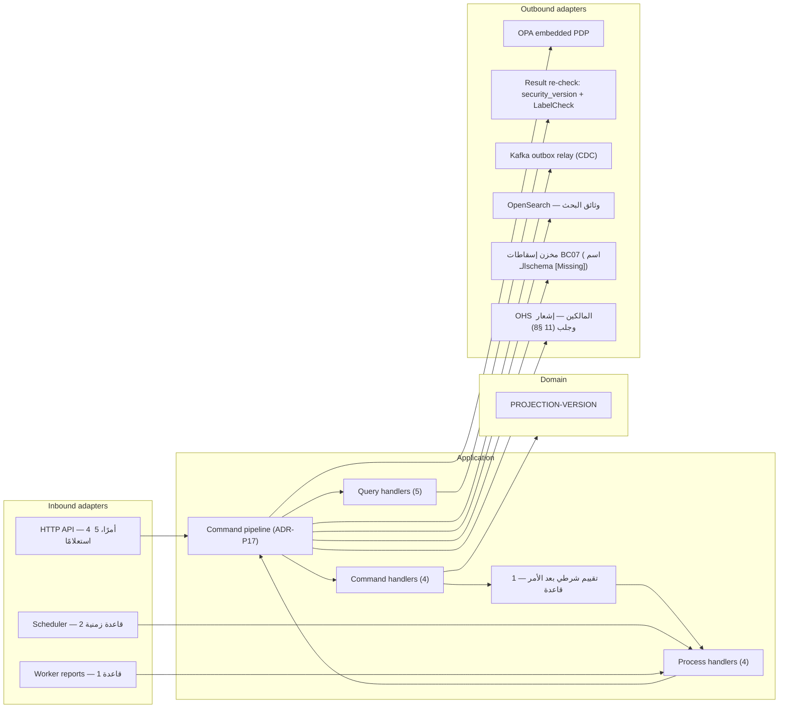

| الـAggregate | الأوامر | الاستعلامات |
|---|---|---|
| `AGG-PROJECTION-VERSION` | 4 | 1 |

**استعلامات بلا Aggregate في الوحدة:** `QRY-GRAPH-NEIGHBORHOOD`, `QRY-GRAPH-PATHS`, `QRY-SRCH-QUERY`, `QRY-SRCH-SUGGEST`

**قواعد `SYS:` (زمني):** PROJECTION-VERSION: full rebuild reached live checkpoint؛ PROJECTION-VERSION: lag back within target

**قواعد `SYS:` (شرطي بعد أمر):** PROJECTION-VERSION: lag above threshold

**قواعد `SYS:` (مدفوع بعامل):** PROJECTION-VERSION: build failed

#### DU-10 Field sync

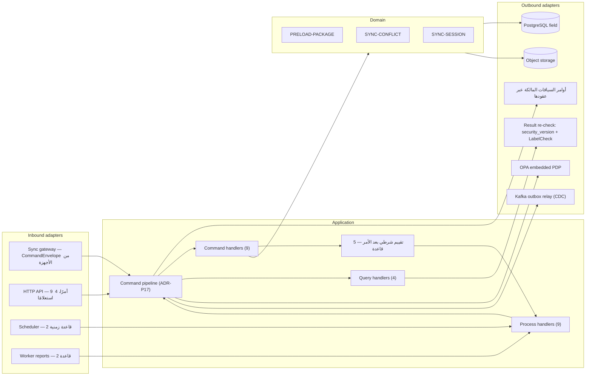

| الـAggregate | الأوامر | الاستعلامات |
|---|---|---|
| `AGG-PRELOAD-PACKAGE` | 3 | 1 |
| `AGG-SYNC-CONFLICT` | 4 | 2 |
| `AGG-SYNC-SESSION` | 2 | 1 |

**قواعد `SYS:` (زمني):** PRELOAD-PACKAGE: expires_at reached؛ SYNC-SESSION: idle timeout (5 min) or transport loss

**قواعد `SYS:` (شرطي بعد أمر):** PRELOAD-PACKAGE: user security_version changed or device not ACTIVE؛ SYNC-CONFLICT: stale state-changing command؛ SYNC-SESSION: device LOST or SUSPENDED at handshake؛ SYNC-SESSION: all uploaded commands processed without conflict؛ SYNC-SESSION: all processed with ≥ 1 sync conflict

**قواعد `SYS:` (مدفوع بعامل):** PRELOAD-PACKAGE: build started؛ PRELOAD-PACKAGE: build finished

#### DU-11 Adapters

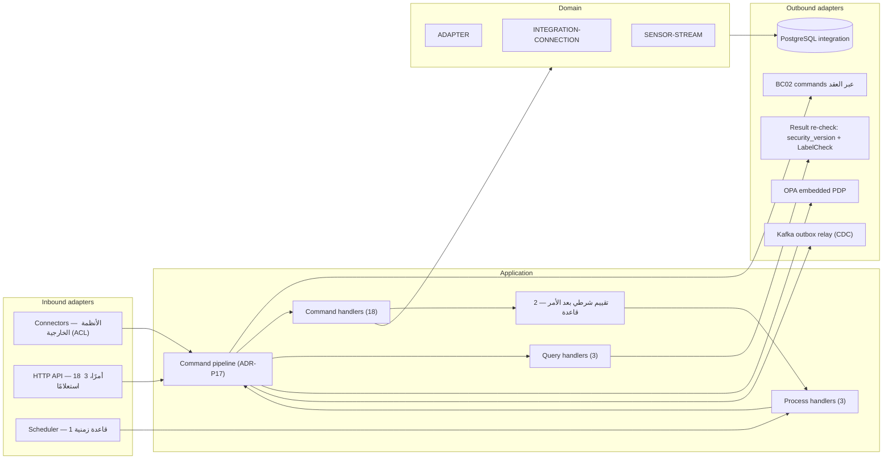

| الـAggregate | الأوامر | الاستعلامات |
|---|---|---|
| `AGG-ADAPTER` | 6 | 1 |
| `AGG-INTEGRATION-CONNECTION` | 7 | 1 |
| `AGG-SENSOR-STREAM` | 5 | 1 |

**قواعد `SYS:` (زمني):** INTEGRATION-CONNECTION: health checks failing 5 min

**قواعد `SYS:` (شرطي بعد أمر):** INTEGRATION-CONNECTION: health restored؛ SENSOR-STREAM: no data beyond stale-after

#### DU-12 Tiles

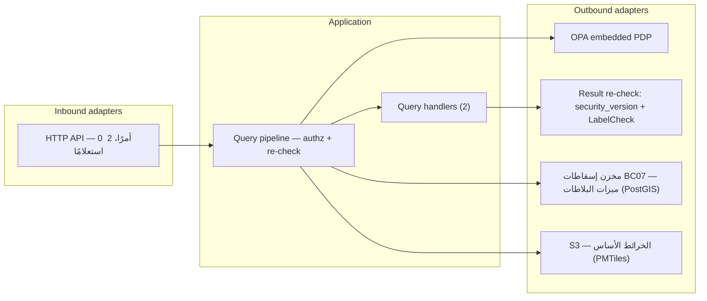

| الـAggregate | الأوامر | الاستعلامات |
|---|---|---|

**استعلامات بلا Aggregate في الوحدة:** `QRY-BASE-TILE`, `QRY-SIT-TILE`

#### DU-14 Readiness (R2)

تعرض هذه الوحدة حالتها في R2. في R1 يعمل جزء BC05 الخاص بالتأهيل والأهلية (AGG-QUALIFICATION-RECORD، `QRY-ELIG-CHECK`، SLC-03) داخل DU-08 بـschema `readiness`، وينتقل مع بقية BC05 إلى هذه الوحدة في R2 (`11-hexagonal-reference.md` §7). وتضم أيضًا Aggregates الإمداد والتمارين (SLC-18، SLC-19، R3) التي لا يذكرها `deployment-units.md` لـDU-14 — إسناد **[Derived]** من ملكية BC05 (§5).

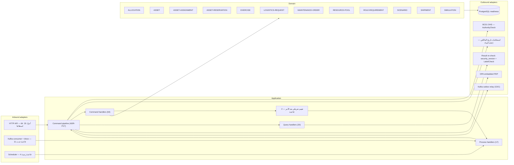

| الـAggregate | الأوامر | الاستعلامات |
|---|---|---|
| `AGG-ALLOCATION` | 6 | 1 |
| `AGG-ASSET` | 12 | 2 |
| `AGG-ASSET-ASSIGNMENT` | 3 | 0 |
| `AGG-ASSET-RESERVATION` | 4 | 0 |
| `AGG-EXERCISE` | 4 | 2 |
| `AGG-LOGISTICS-REQUEST` | 3 | 2 |
| `AGG-MAINTENANCE-ORDER` | 5 | 1 |
| `AGG-RESOURCE-POOL` | 5 | 0 |
| `AGG-ROLE-REQUIREMENT` | 4 | 0 |
| `AGG-SCENARIO` | 4 | 2 |
| `AGG-SHIPMENT` | 7 | 3 |
| `AGG-SIMULATION` | 7 | 3 |

**استعلامات بلا Aggregate في الوحدة:** `QRY-ELIG-CHECK`, `QRY-POL-TIMELINE`, `QRY-QUAL-LIST`, `QRY-READINESS`

**قواعد `SYS:` (زمني):** ALLOCATION: checks passed, policy requires approval؛ ALLOCATION: provisional hold (1 h) elapsed؛ ASSET-RESERVATION: hold expiry (24 h) reached؛ LOGISTICS-REQUEST: linked allocation rejected

**قواعد `SYS:` (شرطي بعد أمر):** ALLOCATION: all checks passed؛ ALLOCATION: a check failed

**قواعد `SYS:` (مدفوع بحدث):** ALLOCATION: linked task terminal؛ ASSET-ASSIGNMENT: linked task terminal؛ ASSET-RESERVATION: linked task or plan terminal؛ EXERCISE: linked simulation completed؛ EXERCISE: linked simulation aborted؛ LOGISTICS-REQUEST: linked allocation committed؛ LOGISTICS-REQUEST: linked allocation requires approval؛ LOGISTICS-REQUEST: linked allocation rejected؛ LOGISTICS-REQUEST: linked allocation committed؛ LOGISTICS-REQUEST: linked shipment delivered in full؛ LOGISTICS-REQUEST: linked shipment resolved short

**عمليات خاصة:** داخلية 1، دون اتصال 0 (`14-api-design.md` §7).

#### DU-15 Knowledge (R2)

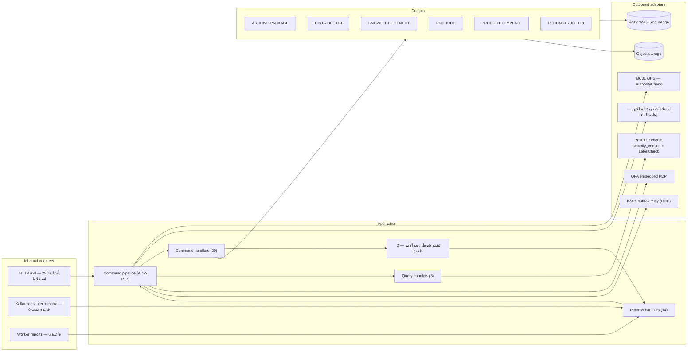

| الـAggregate | الأوامر | الاستعلامات |
|---|---|---|
| `AGG-ARCHIVE-PACKAGE` | 4 | 2 |
| `AGG-DISTRIBUTION` | 2 | 1 |
| `AGG-KNOWLEDGE-OBJECT` | 9 | 2 |
| `AGG-PRODUCT` | 8 | 2 |
| `AGG-PRODUCT-TEMPLATE` | 4 | 0 |
| `AGG-RECONSTRUCTION` | 2 | 1 |

**قواعد `SYS:` (شرطي بعد أمر):** ARCHIVE-PACKAGE: disposition action ARCHIVE for a bucket or record set؛ PRODUCT: generation succeeded

**قواعد `SYS:` (مدفوع بحدث):** ARCHIVE-PACKAGE: disposition DESTROY executed for the package bucket؛ DISTRIBUTION: all recipients authorized and delivered؛ DISTRIBUTION: some recipients not authorized؛ KNOWLEDGE-OBJECT: newer version published؛ PRODUCT: generation failed؛ PRODUCT: newer version approved

**قواعد `SYS:` (مدفوع بعامل):** ARCHIVE-PACKAGE: package validated؛ ARCHIVE-PACKAGE: validation failed؛ ARCHIVE-PACKAGE: integrity check failed؛ RECONSTRUCTION: worker started؛ RECONSTRUCTION: completed؛ RECONSTRUCTION: failed

#### DU-16 AI Serving (R2)

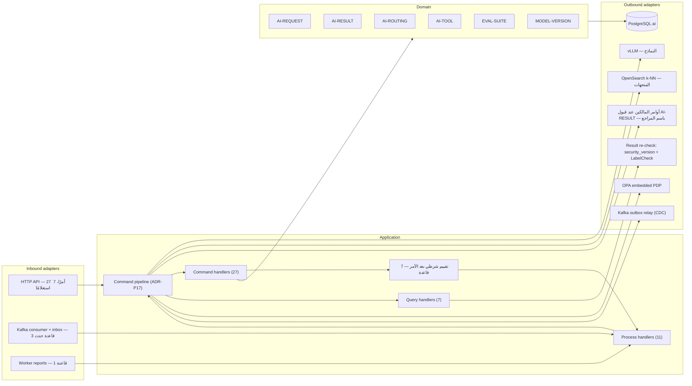

| الـAggregate | الأوامر | الاستعلامات |
|---|---|---|
| `AGG-AI-REQUEST` | 2 | 2 |
| `AGG-AI-RESULT` | 4 | 1 |
| `AGG-AI-ROUTING` | 4 | 1 |
| `AGG-AI-TOOL` | 5 | 1 |
| `AGG-EVAL-SUITE` | 3 | 0 |
| `AGG-MODEL-VERSION` | 9 | 1 |

**استعلامات بلا Aggregate في الوحدة:** `QRY-AI-USAGE`

**قواعد `SYS:` (شرطي بعد أمر):** AI-REQUEST: policy denied؛ AI-REQUEST: retrieval started؛ AI-REQUEST: no sufficient evidence retrieved؛ AI-REQUEST: output grounded؛ AI-REQUEST: output not grounded؛ AI-RESULT: request COMPLETED for a reviewable operation؛ MODEL-VERSION: monitoring drift detected

**قواعد `SYS:` (مدفوع بحدث):** AI-REQUEST: context package sealed؛ AI-ROUTING: successor activated؛ EVAL-SUITE: successor activated

**قواعد `SYS:` (مدفوع بعامل):** AI-REQUEST: error or timeout

<!-- END GENERATED: build_analysis_design.py -->
