# مخطط قاعدة البيانات (Database Schema)

النموذج المنطقي المعتمد في `06-data/logical-model/` (19 ملفًا، ملف لكل شريحة). هذا الملف يجمعه حسب **الـschema** لا حسب الشريحة، ويدمج امتدادات الشرائح اللاحقة للجدول نفسه، ويضيف لكل schema مخطط علاقات (ERD). هو تصميم منطقي: أنواع الأعمدة الفيزيائية والفهارس النهائية تُحسم في ملفات الترحيل.

## 1. المحرك والتوزيع

| المخزن | الاستخدام | القرار |
|---|---|---|
| PostgreSQL 16+ مع PostGIS وbtree_gist وأنواع المدى (tstzrange) وRLS والتقسيم التصريحي | المخزن التشغيلي الوحيد لكل السياقات؛ عنقود لكل خلية (CloudNativePG)؛ **schema ودور لكل سياق** | TD-01، ADR-P05 |
| OpenSearch | وثائق البحث (`EntityDoc`، `ObservationDoc`…) والمتجهات (k-NN) | TD-02، TD-19 |
| جداول إسقاط العلاقات في PostgreSQL | الرسم البياني (`GraphNode`، `GraphEdge`)؛ لا قاعدة رسم بياني في R1 | TD-03 |
| مخزن الكائنات (S3) | المرفقات والحزم والأرشيف ونسخ WORM | TD-06 |
| Valkey | نسخ إصدارات الأمن وذاكرة مؤقتة فقط؛ القيم المرجعية في PostgreSQL | TD-11 |
| الجهاز الميداني | SQLite مشفّر (SQLCipher) | TD-16، ADR-P09 |

## 2. القواعد العامة (كل جدول)

من `06-data/logical-model/slc-01.md`، وتنطبق على كل الشرائح:

1. `tenant_id` **أول عمود** في كل مفتاح أساسي وكل فهرس (FIT-02، SR-02)، وسياسة RLS على كل جدول حاجزًا ثانيًا؛ خط الأوامر يضبط المستأجر في جلسة وحدة العمل (ADR-P04، ADR-P17). الاستثناءات: جداول على مستوى المنصة أو الخلية أو مؤقتة، مسرودة في ملخص §8.
2. كل Aggregate: جدول حالة + جدول `<table>_history` (إصدار غير قابل للتعديل لكل تغيير) + عمود `version` للتزامن المتفائل.
3. الأزمنة: `recorded_at` يعيّنه الخادم؛ لا `created_at` / `updated_at` زمنًا للعمل (FIT-09).
4. الحقول الشخصية (`pii`) مشفرة بمفتاح صاحب البيانات (ADR-P08)؛ المحو = إتلاف المفتاح.
5. كل schema مملوك لسياق واحد، ولا منح وصول عابر (FIT-01)؛ الترحيل لا يلمس إلا schema سياقه (FIT-20).
6. المعرّفات ULID داخليًا مع URN (`urn:<namespace>:<type>:<ulid>`) — ADR-P13، FIT-07.
7. كل هندسة مكانية لها CRS ودقة؛ القانوني EPSG:4326 (ADR-P16، FIT-08).

## 3. الجداول القياسية في كل schema

لا تُكرَّر في الكتالوج أدناه:

| الجدول | الغرض | المصدر |
|---|---|---|
| `outbox` | أحداث المجال المكتوبة في نفس معاملة الحالة، ينقلها CDC إلى Kafka | ADR-P02، FIT-04 |
| `audit_outbox` | سجلات التدقيق في نفس المعاملة، تنتقل إلى `governance.audit_records` | ADR-P02 |
| `inbox` | `event_id` للأحداث المستهلكة؛ عدم التكرار | ADR-P02 |
| `idempotency_keys` | `(tenant_id, key)` ← `command_id`، `request_hash`، `response`، `expires_at`؛ صلاحية 24 ساعة | `slc-01.md` |
| `<table>_history` | إصدار لكل تغيير في كل جدول Aggregate؛ حتى ما سماه النموذج صراحة (`tasks_history`، `qualification_records_history`، `incident_severity_history`) لا يُكرَّر في الكتالوج | القاعدة 2 |
| `security_versions` | إصدار الأمن لكل موضوع — مصدر حقيقة الإلغاء لنقاط فرض السياسة (BC01)، تُنسخ إلى Valkey (TD-11) | `slc-01.md` |

## 4. اصطلاحات الأنواع (مستنتَجة)

النموذج المنطقي يذكر أسماء الأعمدة دون أنواعها في الغالب. الأنواع في هذا الملف **[Derived]** من الأسماء بالقواعد التالية، وتُحسم في الترحيل:

| النمط | النوع المنطقي | النوع في PostgreSQL (مقترح) |
|---|---|---|
| `*_id`، `*_ref`، `*_urn`، `urn`، `owner`، `assignee`… | `urn` | `text` بقيد صيغة URN، أو `char(26)` لـULID داخل السياق |
| `*_at`، `valid_from/to`، `due` | `timestamptz` | `timestamptz`؛ الفترات `tstzrange` |
| `version`، `seq`، `attempt`، `*_count` | `integer` | `bigint` |
| `state`، `kind`، `status`، `severity`… | `enum` | `text` بقيد `CHECK` من قائمة الحالات (لا نوع enum لتسهيل expand/contract) |
| `label`، `*_label` | `security_label` | `jsonb` (المستوى والتحفظات) |
| `(json)` | `json` | `jsonb` |
| `window`، `period` | `period` | `tstzrange` |
| `[]` أو `(array)` | `array` | مصفوفة أو `jsonb` |
| `geom`، `(4326)` | `geometry(4326)` | `geometry(…, 4326)` PostGIS |
| `is_*`، `has_*`، `include_*`، `delegable`… | `boolean` | `boolean` |
| معلَّم `pii` | `text_pii` / `json_pii` | `bytea` مشفر بمفتاح الموضوع |
| `(enc)` | `bytes_encrypted` | `bytea` |
| غير ذلك | `text` | `text` |

## 5. العلاقات (ERD)

- لكل schema مخطط `erDiagram` يعرض المفاتيح والمفاتيح الأجنبية فقط، حتى يبقى مقروءًا؛ الأعمدة كاملة في جدول كل كيان.
- المفتاح الأجنبي **[Derived]**: عمود `x_id` أو `x_ref` (أو `parent_x_id`) يشير إلى الجدول الذي آخر عمود في مفتاحه `x_id` **في نفس الـschema**.
- **لا مفاتيح أجنبية عبر الـschemas.** الإشارة إلى كيان في سياق آخر URN يُتحقق منه عبر عقد ذلك السياق، لا قيد قاعدة بيانات (FIT-01).
- `tenant_id` جزء من كل مفتاح أجنبي ضمنيًا (المفتاح المركب يبدأ به)، عدا الجداول المستثناة من القاعدة 1.
- أعمدة `*_ref` معرّفات URN قد تشير إلى أكثر من نوع أو إلى سياق آخر (مثل `plan_ref` في المهمة: خطة عمليات أو جمع أو طوارئ)، فلا تُرسم مفاتيح أجنبية.
- لا يُرسم مفتاح أجنبي إلا إلى جدول مالك مفتاحه `(tenant_id, x_id)` واسمه جمع `x`.

## 6. الترحيل

وفق `13-project-structure.md` §7 وTD-17: ترحيل للأمام فقط في `deploy/migrations/<schema>/`، بنمط expand/contract؛ لا يُحذف عمود قبل أن يتوقف كل إصدار سابق عن استخدامه.

## 7. فجوات

| البند | الحالة |
|---|---|
| اسم schema مخزن الإسقاطات في PostgreSQL (`projection_versions`، `projection_inbox`، جداول الرسم البياني) | **[Missing]** — `slc-05.md` يقول «BC07 store» فقط؛ وثائق OpenSearch خارج هذه الفجوة |
| اختلاف أسماء أعمدة ومفاتيح الجدول نفسه بين الشرائح | **[Needs Review]** — مسرود في ملخص §8؛ يُحسم في المصدر |
| مخزن المفاتيح `key_store.*` لكل خلية | أُفرد schema `key_store` لأن المصدر يسميه خارج schema المستأجر؛ اسمه ومالكه الفعلي يُحسمان في `22-deployment-design.md` **[Needs Review]** |
| الفهارس غير المذكورة في عمود القيود | تُشتق عند كتابة الترحيل من مسارات الاستعلام (`14-api-design.md`) |
| أنواع الأعمدة | **[Derived]** بالقواعد في §4 |

## 8. الكتالوج

<!-- BEGIN GENERATED: build_analysis_design.py -->

### الملخص

| الـschema | السياق المالك | الجداول |
|---|---|---|
| `ai` | BC07 | 10 |
| `field` | BC07 | 5 |
| `foundation` | BC01 | 18 |
| `governance` | BC08 | 13 |
| `information` | BC02 | 34 |
| `integration` | BC07 | 6 |
| `intelligence` | BC03 | 20 |
| `key_store` | BC08 (مخزن مفاتيح لكل خلية) | 2 |
| `knowledge` | BC06 | 11 |
| `operations` | BC04 | 24 |
| `readiness` | BC05 | 23 |
| إسقاطات PostgreSQL (اسم الـschema **[Missing]**) | BC07 | 4 |
| وثائق OpenSearch | BC07 | 5 |

**جداول مفتاحها بلا `tenant_id`** (مستوى المنصة أو الخلية، أو مؤقتة): `ai.ai_tools`, `ai.eval_reports`, `ai.eval_suites`, `ai.model_versions`, `governance.audit_anchors`, `intelligence.tile_cache`, `key_store.destruction_log`, `operations.notification_templates`.

**جداول لم تُدرج في الكتالوج:** `*_history` (slc-01)؛ `audit_outbox` (slc-01)؛ `idempotency_keys` (slc-01)؛ `inbox` (slc-01)؛ `incident_severity_history` (slc-17)؛ `outbox` (slc-01)؛ `qualification_records_history` (slc-03)؛ `security_versions` (slc-01)؛ `tasks_history` (slc-03) — الجداول القياسية وجداول التاريخ (§3)، ومخزن `security_versions` (BC01، مصدر حقيقة الإلغاء لنقاط فرض السياسة).

**اختلاف تسمية بين الشرائح للجدول نفسه** (لم يُدمج كأعمدة جديدة؛ يُحسم في المصدر) **[Needs Review]**:

| الجدول | الاختلاف |
|---|---|
| `readiness.allocations` | `target` (slc-09) / `target_ref` (slc-18) |
| `readiness.qualification_records` | `evidence` (slc-03) / `evidence_ref` (slc-19) |
| `knowledge.knowledge_objects` | `source` (slc-12) / `source_ref` (slc-19) |
| `knowledge.knowledge_objects` | المفتاح `(tenant_id, knowledge_id, version)` (slc-12) / `(tenant_id, object_id, version)` (slc-19) |

### schema `ai` — BC07

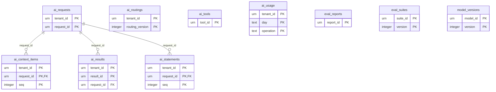

العلاقات مستنتَجة وفق §5 **[Derived]**؛ الأنواع وفق §4 **[Derived]**.

#### `ai.ai_context_items`

- **المفتاح:** `(tenant_id, request_id, seq)` · **المصدر:** `06-data/logical-model/slc-10.md`

| العمود | النوع (مستنتَج) | اختياري | ملاحظة |
|---|---|---|---|
| `urn` | urn | — | — |
| `version` | integer | — | — |
| `known_at` | timestamptz | — | — |
| `label` | security_label | — | — |
| `score` | numeric | — | — |

**القيود:** pinned

#### `ai.ai_requests`

- **المفتاح:** `(tenant_id, request_id)` · **المصدر:** `06-data/logical-model/slc-10.md`

| العمود | النوع (مستنتَج) | اختياري | ملاحظة |
|---|---|---|---|
| `user` | text | — | — |
| `operation` | text | — | — |
| `purpose` | enum | — | — |
| `input` | bytes_encrypted | — | مشفر |
| `state` | enum | — | — |
| `routing_version` | integer | — | — |
| `model_version` | integer | — | — |
| `prompt_template` | text | — | — |
| `package_hash` | text | — | — |
| `output` | bytes_encrypted | — | مشفر |
| `label` | security_label | — | — |
| `created_at` | timestamptz | — | — |

**القيود:** prompts/outputs encrypted with tenant key; record class ai-logs

#### `ai.ai_results`

- **المفتاح:** `(tenant_id, result_id)` · **المصدر:** `06-data/logical-model/slc-10.md`

| العمود | النوع (مستنتَج) | اختياري | ملاحظة |
|---|---|---|---|
| `request_id` | urn | — | — |
| `operation` | text | — | — |
| `target` | text | — | — |
| `items` | json | — | — |
| `state` | enum | — | — |
| `reviewer` | urn | — | — |
| `decisions` | json | — | — |

**القيود:** —

#### `ai.ai_routings`

- **المفتاح:** `(tenant_id, routing_version)` · **المصدر:** `06-data/logical-model/slc-10.md`

| العمود | النوع (مستنتَج) | اختياري | ملاحظة |
|---|---|---|---|
| `routes` | json | — | — |
| `state` | enum | — | — |
| `author` | urn | — | — |
| `approver` | urn | — | — |

**القيود:** one ACTIVE per tenant

#### `ai.ai_statements`

- **المفتاح:** `(tenant_id, request_id, seq)` · **المصدر:** `06-data/logical-model/slc-10.md`

| العمود | النوع (مستنتَج) | اختياري | ملاحظة |
|---|---|---|---|
| `text` | bytes_encrypted | — | مشفر |
| `citations` | array | — | — |
| `entailment_score` | text | — | — |

**القيود:** —

#### `ai.ai_tools`

- **المفتاح:** `(tool_id)` · **المصدر:** `06-data/logical-model/slc-10.md`

| العمود | النوع (مستنتَج) | اختياري | ملاحظة |
|---|---|---|---|
| `name` | text | — | — |
| `input_schema` | json | — | — |
| `binding` | text | — | — |
| `effect` | text | — | — |
| `permission` | text | — | — |
| `max_ail` | text | — | — |
| `state` | enum | — | — |

**القيود:** effect ∈ {read, propose} in R2

#### `ai.ai_usage`

- **المفتاح:** `(tenant_id, day, operation)` · **المصدر:** `06-data/logical-model/slc-10.md`

| العمود | النوع (مستنتَج) | اختياري | ملاحظة |
|---|---|---|---|
| `requests` | text | — | — |
| `gpu_seconds` | text | — | — |
| `tokens_in` | text | — | — |
| `tokens_out` | text | — | — |

**القيود:** cost model input

#### `ai.eval_reports`

- **المفتاح:** `(report_id)` · **المصدر:** `06-data/logical-model/slc-10.md`

| العمود | النوع (مستنتَج) | اختياري | ملاحظة |
|---|---|---|---|
| `model_version` | integer | — | — |
| `suite_version` | integer | — | — |
| `metrics` | json | — | — |
| `run_at` | timestamptz | — | — |

**القيود:** —

#### `ai.eval_suites`

- **المفتاح:** `(suite_id, version)` · **المصدر:** `06-data/logical-model/slc-10.md`

| العمود | النوع (مستنتَج) | اختياري | ملاحظة |
|---|---|---|---|
| `sets` | json | — | — |
| `state` | enum | — | — |

**القيود:** immutable once ACTIVE

#### `ai.model_versions`

- **المفتاح:** `(model_id, version)` · **المصدر:** `06-data/logical-model/slc-10.md`

| العمود | النوع (مستنتَج) | اختياري | ملاحظة |
|---|---|---|---|
| `family` | text | — | — |
| `weights_digest` | text | — | — |
| `licence` | text | — | — |
| `languages` | array | — | — |
| `context_tokens` | text | — | — |
| `hosting` | text | — | — |
| `roles` | array | — | — |
| `state` | enum | — | — |
| `evaluation_report` | text | نعم | — |
| `canary` | json | نعم | — |

**القيود:** platform-level; never deleted

### schema `field` — BC07

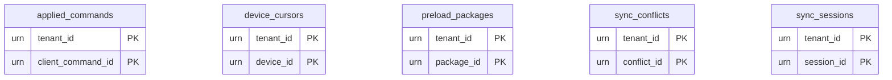

العلاقات مستنتَجة وفق §5 **[Derived]**؛ الأنواع وفق §4 **[Derived]**.

#### `field.applied_commands`

- **المفتاح:** `(tenant_id, client_command_id)` · **المصدر:** `06-data/logical-model/slc-11.md`

| العمود | النوع (مستنتَج) | اختياري | ملاحظة |
|---|---|---|---|
| `device_id` | urn | — | — |
| `seq` | integer | — | — |
| `target_command` | text | — | — |
| `result` | enum | — | applied / conflict / rejected |
| `applied_at` | timestamptz | — | — |

**القيود:** idempotency; retained ≥ 30 d

#### `field.device_cursors`

- **المفتاح:** `(tenant_id, device_id)` · **المصدر:** `06-data/logical-model/slc-11.md`

| العمود | النوع (مستنتَج) | اختياري | ملاحظة |
|---|---|---|---|
| `last_acked_seq` | text | — | — |
| `last_hash` | text | — | — |

**القيود:** resume point

#### `field.preload_packages`

- **المفتاح:** `(tenant_id, package_id)` · **المصدر:** `06-data/logical-model/slc-11.md`

| العمود | النوع (مستنتَج) | اختياري | ملاحظة |
|---|---|---|---|
| `device_id` | urn | — | — |
| `user_id` | urn | — | — |
| `area` | json | — | — |
| `layers` | array | — | — |
| `window` | period | — | — |
| `level` | text | — | — |
| `manifest` | json | — | — |
| `security_version` | integer | — | — |
| `expires_at` | timestamptz | — | — |
| `state` | enum | — | — |

**القيود:** —

#### `field.sync_conflicts`

- **المفتاح:** `(tenant_id, conflict_id)` · **المصدر:** `06-data/logical-model/slc-11.md`

| العمود | النوع (مستنتَج) | اختياري | ملاحظة |
|---|---|---|---|
| `envelope` | json | — | — |
| `state_snapshot` | json | — | — |
| `owner_reason` | text | — | — |
| `reviewer` | urn | نعم | — |
| `state` | enum | — | — |
| `version` | integer | — | — |

**القيود:** —

#### `field.sync_sessions`

- **المفتاح:** `(tenant_id, session_id)` · **المصدر:** `06-data/logical-model/slc-11.md`

| العمود | النوع (مستنتَج) | اختياري | ملاحظة |
|---|---|---|---|
| `device_id` | urn | — | — |
| `user_id` | urn | — | — |
| `clock_offset_ms` | text | — | — |
| `opened_at` | timestamptz | — | — |
| `acked_seq` | text | — | — |
| `state` | enum | — | — |

**القيود:** —

### schema `foundation` — BC01

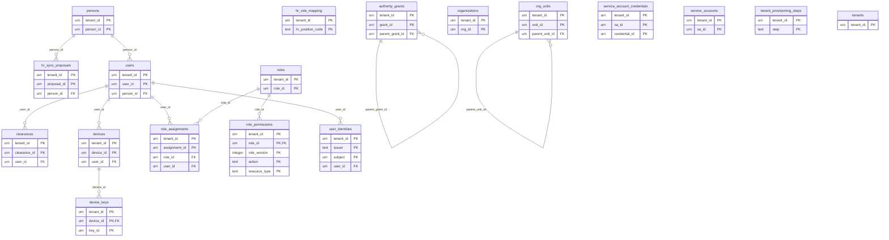

العلاقات مستنتَجة وفق §5 **[Derived]**؛ الأنواع وفق §4 **[Derived]**.

#### `foundation.authority_grants`

- **المفتاح:** `(tenant_id, grant_id)` · **المصدر:** `06-data/logical-model/slc-01.md`

| العمود | النوع (مستنتَج) | اختياري | ملاحظة |
|---|---|---|---|
| `holder_urn` | urn | — | — |
| `parent_grant_id` | urn | نعم | — |
| `depth` | integer | — | — |
| `decision_types` | array | — | — |
| `org_scope_unit_id` | urn | — | — |
| `include_descendants` | boolean | — | — |
| `limits` | json | — | — |
| `valid_from` | timestamptz | — | — |
| `valid_to` | timestamptz | — | — |
| `delegable` | boolean | — | — |
| `state` | enum | — | — |
| `version` | integer | — | — |

**القيود:** depth ≤ 2; CHECK(valid_from < valid_to); parent period ⊇ child (aggregate)

#### `foundation.clearances`

- **المفتاح:** `(tenant_id, clearance_id)` · **المصدر:** `06-data/logical-model/slc-01.md`

| العمود | النوع (مستنتَج) | اختياري | ملاحظة |
|---|---|---|---|
| `user_id` | urn | — | — |
| `level_code` | text | — | — |
| `compartments` | array | — | — |
| `caveat_attributes` | json | — | — |
| `valid_to` | timestamptz | — | — |
| `state` | enum | — | — |
| `requested_by` | urn | — | — |
| `approved_by` | urn | — | — |
| `version` | integer | — | — |

**القيود:** at most one non-terminal per user (partial unique index)

#### `foundation.device_keys`

- **المفتاح:** `(tenant_id, device_id, key_id)` · **المصدر:** `06-data/logical-model/slc-11.md`

| العمود | النوع (مستنتَج) | اختياري | ملاحظة |
|---|---|---|---|
| `public_key` | text | — | — |
| `valid_from` | timestamptz | — | — |
| `revoked_at` | timestamptz | نعم | — |

**القيود:** one current key

#### `foundation.devices`

- **المفتاح:** `(tenant_id, device_id)` · **المصدر:** `06-data/logical-model/slc-11.md`

| العمود | النوع (مستنتَج) | اختياري | ملاحظة |
|---|---|---|---|
| `user_id` | urn | — | — |
| `platform` | text | — | — |
| `mdm_ref` | urn | — | — |
| `state` | enum | — | — |
| `lost_at` | timestamptz | نعم | — |
| `version` | integer | — | — |

**القيود:** ≤ 3 ACTIVE per user

#### `foundation.hr_role_mapping`

- **المفتاح:** `(tenant_id, hr_position_code)` · **المصدر:** `06-data/logical-model/slc-16.md`

| العمود | النوع (مستنتَج) | اختياري | ملاحظة |
|---|---|---|---|
| `role_ids` | array | — | — |
| `org_scope_rule` | text | — | — |

**القيود:** tenant-maintained

#### `foundation.hr_sync_proposals`

- **المفتاح:** `(tenant_id, proposal_id)` · **المصدر:** `06-data/logical-model/slc-16.md`

| العمود | النوع (مستنتَج) | اختياري | ملاحظة |
|---|---|---|---|
| `person_id` | urn | — | — |
| `change_kind` | text | — | — |
| `hr_payload` | bytes_encrypted | — | مشفر |
| `proposed_changes` | json | — | — |
| `state` | enum | — | — |
| `decided_by` | urn | نعم | — |

**القيود:** personal data encrypted with subject key

#### `foundation.org_units`

- **المفتاح:** `(tenant_id, unit_id)` · **المصدر:** `06-data/logical-model/slc-01.md`

| العمود | النوع (مستنتَج) | اختياري | ملاحظة |
|---|---|---|---|
| `org_id` | urn | — | — |
| `parent_unit_id` | urn | — | — |
| `path` | text | — | materialized |
| `name` | json | — | — |
| `state` | enum | — | — |

**القيود:** one root per org; UNIQUE(tenant_id, parent_unit_id, name.normalized); path used for subtree scope checks

#### `foundation.organizations`

- **المفتاح:** `(tenant_id, org_id)` · **المصدر:** `06-data/logical-model/slc-01.md`

| العمود | النوع (مستنتَج) | اختياري | ملاحظة |
|---|---|---|---|
| `name` | json | — | json LocalizedName |
| `state` | enum | — | — |
| `version` | integer | — | — |

**القيود:** UNIQUE(tenant_id, name.normalized)

#### `foundation.persons`

- **المفتاح:** `(tenant_id, person_id)` · **المصدر:** `06-data/logical-model/slc-01.md`

| العمود | النوع (مستنتَج) | اختياري | ملاحظة |
|---|---|---|---|
| `names` | json_pii | — | بيانات شخصية — مشفرة بمفتاح الموضوع (ADR-P08) |
| `hr_id` | text_pii | — | بيانات شخصية — مشفرة بمفتاح الموضوع (ADR-P08) |
| `contact` | json_pii | — | بيانات شخصية — مشفرة بمفتاح الموضوع (ADR-P08) |
| `state` | enum | — | — |
| `subject_key_ref` | urn | — | — |
| `version` | integer | — | — |

**القيود:** UNIQUE(tenant_id, hr_id) when not null

#### `foundation.role_assignments`

- **المفتاح:** `(tenant_id, assignment_id)` · **المصدر:** `06-data/logical-model/slc-01.md`

| العمود | النوع (مستنتَج) | اختياري | ملاحظة |
|---|---|---|---|
| `user_id` | urn | — | — |
| `role_id` | urn | — | — |
| `org_scope_unit_id` | urn | — | — |
| `include_descendants` | boolean | — | — |
| `valid_from` | timestamptz | — | — |
| `valid_to` | timestamptz | — | — |
| `state` | enum | — | — |
| `version` | integer | — | — |

**القيود:** no two ACTIVE SoD-incompatible roles per user (checked in aggregate + deferred constraint)

#### `foundation.role_permissions`

- **المفتاح:** `(tenant_id, role_id, role_version, action, resource_type)` · **المصدر:** `06-data/logical-model/slc-01.md`

| العمود | النوع (مستنتَج) | اختياري | ملاحظة |
|---|---|---|---|
| `` | text | — | — |

**القيود:** per role version

#### `foundation.roles`

- **المفتاح:** `(tenant_id, role_id)` · **المصدر:** `06-data/logical-model/slc-01.md`

| العمود | النوع (مستنتَج) | اختياري | ملاحظة |
|---|---|---|---|
| `code` | text | — | — |
| `name` | json | — | — |
| `system_role` | text | — | — |
| `state` | enum | — | — |
| `version` | integer | — | — |

**القيود:** UNIQUE(tenant_id, code)

#### `foundation.service_account_credentials`

- **المفتاح:** `(tenant_id, sa_id, credential_id)` · **المصدر:** `06-data/logical-model/slc-01.md`

| العمود | النوع (مستنتَج) | اختياري | ملاحظة |
|---|---|---|---|
| `public_key_fingerprint` | text | — | — |
| `expires_at` | timestamptz | — | — |

**القيود:** expires_at ≤ issued + 90 d

#### `foundation.service_accounts`

- **المفتاح:** `(tenant_id, sa_id)` · **المصدر:** `06-data/logical-model/slc-01.md`

| العمود | النوع (مستنتَج) | اختياري | ملاحظة |
|---|---|---|---|
| `name` | text | — | — |
| `owner_user_id` | urn | — | — |
| `purpose` | enum | — | — |
| `state` | enum | — | — |
| `security_version` | integer | — | — |
| `version` | integer | — | — |

**القيود:** owner NOT NULL

#### `foundation.tenant_provisioning_steps`

- **المفتاح:** `(tenant_id, step)` · **المصدر:** `06-data/logical-model/slc-01.md`

| العمود | النوع (مستنتَج) | اختياري | ملاحظة |
|---|---|---|---|
| `status` | enum | — | — |
| `attempt` | integer | — | — |
| `last_error` | text | — | — |
| `recorded_at` | timestamptz | — | — |

**القيود:** idempotent per step

#### `foundation.tenants`

- **المفتاح:** `(tenant_id)` · **المصدر:** `06-data/logical-model/slc-01.md`

| العمود | النوع (مستنتَج) | اختياري | ملاحظة |
|---|---|---|---|
| `namespace` | text | — | — |
| `display_name` | text | — | — |
| `state` | enum | — | — |
| `cell_id` | urn | — | — |
| `cell_mode` | text | — | — |
| `sovereign` | text | — | — |
| `top_level_enabled` | text | — | — |
| `jurisdiction` | text | — | — |
| `quotas` | json | — | — |
| `version` | integer | — | — |

**القيود:** namespace UNIQUE (platform) immutable; state ∈ SM

#### `foundation.user_identities`

- **المفتاح:** `(tenant_id, issuer, subject)` · **المصدر:** `06-data/logical-model/slc-01.md`

| العمود | النوع (مستنتَج) | اختياري | ملاحظة |
|---|---|---|---|
| `user_id` | urn | — | — |
| `linked_at` | timestamptz | — | — |

**القيود:** UNIQUE(tenant_id, issuer, subject)

#### `foundation.users`

- **المفتاح:** `(tenant_id, user_id)` · **المصدر:** `06-data/logical-model/slc-01.md`

| العمود | النوع (مستنتَج) | اختياري | ملاحظة |
|---|---|---|---|
| `username` | text | — | — |
| `person_id` | urn | نعم | — |
| `state` | enum | — | — |
| `security_version` | integer | — | — |
| `version` | integer | — | — |

**القيود:** UNIQUE(tenant_id, username); UNIQUE(tenant_id, person_id)

### schema `governance` — BC08

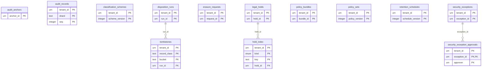

العلاقات مستنتَجة وفق §5 **[Derived]**؛ الأنواع وفق §4 **[Derived]**.

#### `governance.audit_anchors`

- **المفتاح:** `(anchor_id)` · **المصدر:** `06-data/logical-model/slc-01.md`

| العمود | النوع (مستنتَج) | اختياري | ملاحظة |
|---|---|---|---|
| `tenant_id` | urn | — | — |
| `period` | period | — | — |
| `merkle_root` | text | — | — |
| `shard_heads` | json | — | — |
| `anchored_at` | timestamptz | — | — |

**القيود:** write-once store

#### `governance.audit_records`

- **المفتاح:** `(tenant_id, shard, seq)` · **المصدر:** `06-data/logical-model/slc-01.md` · **التقسيم:** partitioned by (tenant_id, month)

| العمود | النوع (مستنتَج) | اختياري | ملاحظة |
|---|---|---|---|
| `audit_id` | urn | — | UNIQUE |
| `source_context` | text | — | — |
| `actor` | urn | — | — |
| `action` | text | — | — |
| `resource` | json | — | — |
| `purpose` | enum | — | — |
| `policy_decision` | json | — | — |
| `outcome` | json | — | — |
| `correlation_id` | urn | — | — |
| `occurred_at` | timestamptz | — | — |
| `prev_hash` | text | — | — |
| `hash` | text | — | — |

**القيود:** insert-only; partitioned by (tenant_id, month)

#### `governance.classification_schemes`

- **المفتاح:** `(tenant_id, scheme_version)` · **المصدر:** `06-data/logical-model/slc-01.md`

| العمود | النوع (مستنتَج) | اختياري | ملاحظة |
|---|---|---|---|
| `state` | enum | — | — |
| `levels` | json | — | — |
| `compartments` | json | — | — |
| `caveats` | json | — | — |
| `audit_threshold` | text | — | — |
| `default_level` | text | — | — |
| `effective_from` | text | — | — |
| `drafted_by` | urn | — | — |
| `activated_by` | urn | — | — |

**القيود:** one ACTIVE per tenant; one DRAFT per tenant

#### `governance.disposition_runs`

- **المفتاح:** `(tenant_id, run_id)` · **المصدر:** `06-data/logical-model/slc-12a.md`

| العمود | النوع (مستنتَج) | اختياري | ملاحظة |
|---|---|---|---|
| `schedule_version` | integer | — | — |
| `candidates` | json | — | json summary |
| `exceptions` | json | — | — |
| `certificate` | json | — | — |
| `state` | enum | — | — |
| `submitted_by` | urn | — | — |
| `approved_by` | urn | — | — |

**القيود:** —

#### `governance.erasure_requests`

- **المفتاح:** `(tenant_id, request_id)` · **المصدر:** `06-data/logical-model/slc-12a.md`

| العمود | النوع (مستنتَج) | اختياري | ملاحظة |
|---|---|---|---|
| `legal_basis` | text | — | — |
| `subject_refs` | text | — | pseudonymous |
| `scope_counts` | json | — | — |
| `confirmations` | json | — | — |
| `state` | enum | — | — |
| `registered_by` | urn | — | — |
| `approved_by` | urn | — | — |

**القيود:** no personal data stored

#### `governance.hold_index`

- **المفتاح:** `(tenant_id, kind, key)` · **المصدر:** `06-data/logical-model/slc-12a.md`

| العمود | النوع (مستنتَج) | اختياري | ملاحظة |
|---|---|---|---|
| `hold_id` | urn | — | — |

**القيود:** fast HoldCheck (class, urn, subject, org, range)

#### `governance.legal_holds`

- **المفتاح:** `(tenant_id, hold_id)` · **المصدر:** `06-data/logical-model/slc-12a.md`

| العمود | النوع (مستنتَج) | اختياري | ملاحظة |
|---|---|---|---|
| `name` | text | — | — |
| `legal_reference` | text | — | — |
| `scope` | json | — | — |
| `state` | enum | — | — |
| `placed_by` | urn | — | — |
| `release_requested_by` | urn | نعم | — |
| `released_by` | urn | نعم | — |

**القيود:** —

#### `governance.policy_bundles`

- **المفتاح:** `(tenant_id, bundle_id)` · **المصدر:** `06-data/logical-model/slc-01.md`

| العمود | النوع (مستنتَج) | اختياري | ملاحظة |
|---|---|---|---|
| `policy_version` | integer | — | — |
| `scheme_version` | integer | — | — |
| `signature` | text | — | — |
| `built_at` | timestamptz | — | — |

**القيود:** signed; distributed to evaluators

#### `governance.policy_sets`

- **المفتاح:** `(tenant_id, policy_version)` · **المصدر:** `06-data/logical-model/slc-01.md`

| العمود | النوع (مستنتَج) | اختياري | ملاحظة |
|---|---|---|---|
| `state` | enum | — | — |
| `decision_tables` | json | — | — |
| `tests` | json | — | — |
| `effective_from` | text | — | — |
| `author` | urn | — | — |
| `approver` | urn | — | — |

**القيود:** one ACTIVE per tenant; approver ≠ author

#### `governance.retention_schedules`

- **المفتاح:** `(tenant_id, schedule_version)` · **المصدر:** `06-data/logical-model/slc-12a.md`

| العمود | النوع (مستنتَج) | اختياري | ملاحظة |
|---|---|---|---|
| `rules` | json | — | — |
| `state` | enum | — | — |
| `drafted_by` | urn | — | — |
| `approved_by` | urn | — | — |
| `effective_from` | text | — | — |
| `retroactive_classes` | array | — | — |

**القيود:** one ACTIVE per tenant

#### `governance.security_exception_approvals`

- **المفتاح:** `(tenant_id, exception_id, approver)` · **المصدر:** `06-data/logical-model/slc-01.md`

| العمود | النوع (مستنتَج) | اختياري | ملاحظة |
|---|---|---|---|
| `approved_at` | timestamptz | — | — |

**القيود:** distinct approvers; approver ≠ requester

#### `governance.security_exceptions`

- **المفتاح:** `(tenant_id, exception_id)` · **المصدر:** `06-data/logical-model/slc-01.md`

| العمود | النوع (مستنتَج) | اختياري | ملاحظة |
|---|---|---|---|
| `policy_rule` | text | — | — |
| `subject_scope` | json | — | — |
| `justification` | text | — | — |
| `starts_at` | timestamptz | — | — |
| `ends_at` | timestamptz | — | — |
| `state` | enum | — | — |
| `requested_by` | urn | — | — |
| `version` | integer | — | — |

**القيود:** ends_at − starts_at ≤ 30 d

#### `governance.tombstones`

- **المفتاح:** `(tenant_id, record_class, bucket)` · **المصدر:** `06-data/logical-model/slc-12a.md`

| العمود | النوع (مستنتَج) | اختياري | ملاحظة |
|---|---|---|---|
| `run_id` | urn | — | — |
| `count` | text | — | — |
| `destroyed_at` | timestamptz | — | — |

**القيود:** non-personal facts only

### schema `information` — BC02

```mermaid
erDiagram
  attachments {
    urn tenant_id PK
    urn attachment_id PK
  }
  blocking_index {
    urn tenant_id PK
    text entity_type PK
    text key_kind PK
    text key_value PK
    urn entity_id PK, FK
  }
  claim_assessments {
    urn tenant_id PK
    urn claim_id PK
    integer version PK
  }
  claims {
    urn tenant_id PK
    text subject_hash_bucket PK
    urn claim_id PK
  }
  claims_current {
    urn tenant_id PK
    urn subject_urn PK
    text predicate PK
    urn claim_id PK
  }
  collection_activities {
    urn tenant_id PK
    urn plan_id PK, FK
    urn activity_id PK
  }
  collection_plans {
    urn tenant_id PK
    urn plan_id PK
  }
  collection_requirements {
    urn tenant_id PK
    urn requirement_id PK
    integer version PK
  }
  conflict_members {
    urn tenant_id PK
    urn conflict_id PK, FK
    urn claim_id PK
  }
  conflict_resolutions {
    urn tenant_id PK
    urn conflict_id PK, FK
    timestamptz recorded_from PK
  }
  conflicts {
    urn tenant_id PK
    urn conflict_id PK
  }
  correlation_buckets {
    urn tenant_id PK
    text geohash6 PK
    text time_bucket PK
    urn urn PK
  }
  correlation_proposals {
    urn tenant_id PK
    urn proposal_id PK
  }
  correlation_rules {
    urn tenant_id PK
    urn rule_id PK
    integer version PK
  }
  entities {
    urn tenant_id PK
    urn entity_id PK
  }
  er_cases {
    urn tenant_id PK
    urn case_id PK
  }
  evidence {
    urn tenant_id PK
    urn evidence_id PK
    urn attachment_id FK
    urn source_id FK
  }
  evidence_custody {
    urn tenant_id PK
    urn evidence_id PK, FK
    integer seq PK
  }
  evidence_links {
    urn tenant_id PK
    urn link_id PK
    urn evidence_id FK
  }
  external_ids {
    urn tenant_id PK
    urn mapping_id PK
  }
  fulfilment_links {
    urn tenant_id PK
    urn requirement_id PK
    urn eei_id PK
    urn observation_id PK
  }
  identity_clusters {
    urn tenant_id PK
    urn entity_id PK, FK
    timestamptz recorded_from PK
  }
  import_batches {
    urn tenant_id PK
    urn batch_id PK
  }
  lineage_records {
    urn tenant_id PK
    urn lineage_id PK
  }
  match_rulesets {
    urn tenant_id PK
    urn ruleset_id PK
  }
  name_forms {
    urn tenant_id PK
    urn claim_id PK
    text form PK
  }
  observation_attachments {
    urn tenant_id PK
    urn observation_id PK
    urn attachment_id PK, FK
  }
  observations {
    urn tenant_id PK
    timestamptz observed_month PK
    urn observation_id PK
    urn source_id FK
  }
  quarantine_records {
    urn tenant_id PK
    urn batch_id PK, FK
    integer seq PK
  }
  realworld_events {
    urn tenant_id PK
    urn event_id PK
  }
  relationships {
    urn tenant_id PK
    urn relationship_id PK
  }
  same_as_links {
    urn tenant_id PK
    urn link_id PK
    urn case_id FK
  }
  source_reliability {
    urn tenant_id PK
    urn source_id PK, FK
    timestamptz valid_from PK
    timestamptz recorded_from PK
  }
  sources {
    urn tenant_id PK
    urn source_id PK
  }
  entities ||--o{ blocking_index : "entity_id"
  collection_plans ||--o{ collection_activities : "plan_id"
  conflicts ||--o{ conflict_members : "conflict_id"
  conflicts ||--o{ conflict_resolutions : "conflict_id"
  attachments ||--o{ evidence : "attachment_id"
  sources ||--o{ evidence : "source_id"
  evidence ||--o{ evidence_custody : "evidence_id"
  evidence ||--o{ evidence_links : "evidence_id"
  entities ||--o{ identity_clusters : "entity_id"
  attachments ||--o{ observation_attachments : "attachment_id"
  sources ||--o{ observations : "source_id"
  import_batches ||--o{ quarantine_records : "batch_id"
  er_cases ||--o{ same_as_links : "case_id"
  sources ||--o{ source_reliability : "source_id"
```

العلاقات مستنتَجة وفق §5 **[Derived]**؛ الأنواع وفق §4 **[Derived]**.

#### `information.attachments`

- **المفتاح:** `(tenant_id, attachment_id)` · **المصدر:** `06-data/logical-model/slc-02.md`

| العمود | النوع (مستنتَج) | اختياري | ملاحظة |
|---|---|---|---|
| `sha256` | text | — | — |
| `size` | text | — | — |
| `mime` | text | — | — |
| `object_key` | text | — | — |
| `key_ref` | urn | — | — |
| `label` | security_label | — | — |
| `state` | enum | — | — |
| `version` | integer | — | — |

**القيود:** partial unique (tenant, sha256) where state non-terminal

#### `information.blocking_index`

- **المفتاح:** `(tenant_id, entity_type, key_kind, key_value, entity_id)` · **المصدر:** `06-data/logical-model/slc-04.md`

| العمود | النوع (مستنتَج) | اختياري | ملاحظة |
|---|---|---|---|
| `computed_at` | timestamptz | — | — |
| `ruleset_version` | integer | — | — |

**القيود:** rebuilt on ruleset activation

#### `information.claim_assessments`

- **المفتاح:** `(tenant_id, claim_id, version)` · **المصدر:** `06-data/logical-model/slc-02.md`

| العمود | النوع (مستنتَج) | اختياري | ملاحظة |
|---|---|---|---|
| `information_confidence` | text | — | — |
| `verification_status` | text | — | — |
| `rationale` | text | — | — |
| `assessed_by` | urn | — | — |
| `recorded_at` | timestamptz | — | — |

**القيود:** versioned T2

#### `information.claims`

- **المفتاح:** `(tenant_id, subject_hash_bucket, claim_id)` · **المصدر:** `06-data/logical-model/slc-02.md` · **التقسيم:** partition by (tenant, hash(subject))

| العمود | النوع (مستنتَج) | اختياري | ملاحظة |
|---|---|---|---|
| `subject_urn` | urn | — | — |
| `predicate` | text | — | — |
| `value` | json | — | — |
| `value_norm` | text | — | typed + normalized |
| `unit_canonical` | text | — | — |
| `valid_from` | timestamptz | — | — |
| `valid_to` | timestamptz | — | — |
| `recorded_from` | timestamptz | — | — |
| `recorded_to` | timestamptz | — | — |
| `supersedes` | text | — | — |
| `sources` | array | — | — |
| `label` | security_label | — | — |
| `security_version` | integer | — | — |
| `derived_from` | array | — | — |

**القيود:** index (tenant, subject_urn, predicate, valid_from, valid_to, recorded_from, recorded_to); `recorded_*` writable only by kernel (FIT-05)

#### `information.claims_current`

- **المفتاح:** `(tenant_id, subject_urn, predicate, claim_id)` · **المصدر:** `06-data/logical-model/slc-02.md`

| العمود | النوع (مستنتَج) | اختياري | ملاحظة |
|---|---|---|---|
| `value_norm` | text | — | — |
| `valid_from` | timestamptz | — | — |
| `valid_to` | timestamptz | — | — |
| `label` | security_label | — | — |

**القيود:** maintained in the same transaction; = claims where recorded_to is null (P-26)

#### `information.collection_activities`

- **المفتاح:** `(tenant_id, plan_id, activity_id)` · **المصدر:** `06-data/logical-model/slc-14.md`

| العمود | النوع (مستنتَج) | اختياري | ملاحظة |
|---|---|---|---|
| `method` | text | — | — |
| `sources` | array | — | — |
| `area` | text | — | — |
| `window` | period | — | — |
| `unit` | text | — | — |
| `task_type` | text | — | — |
| `eei_refs` | array | — | — |
| `task_ref` | urn | نعم | — |

**القيود:** area ⊆ requirement areas (checked in aggregate)

#### `information.collection_plans`

- **المفتاح:** `(tenant_id, plan_id)` · **المصدر:** `06-data/logical-model/slc-14.md`

| العمود | النوع (مستنتَج) | اختياري | ملاحظة |
|---|---|---|---|
| `requirements` | array | — | — |
| `title` | json | — | — |
| `label` | security_label | — | — |
| `state` | enum | — | — |
| `version` | integer | — | — |

**القيود:** —

#### `information.collection_requirements`

- **المفتاح:** `(tenant_id, requirement_id, version)` · **المصدر:** `06-data/logical-model/slc-14.md`

| العمود | النوع (مستنتَج) | اختياري | ملاحظة |
|---|---|---|---|
| `question` | json | — | — |
| `area` | text | — | geom 4326 |
| `window_tstzrange` | text | — | — |
| `priority` | integer | — | — |
| `due` | timestamptz | — | — |
| `eeis` | json | — | — |
| `requester` | urn | — | — |
| `approver` | urn | نعم | — |
| `label` | security_label | — | — |
| `state` | enum | — | — |

**القيود:** spatial index on area for APPROVED

#### `information.conflict_members`

- **المفتاح:** `(tenant_id, conflict_id, claim_id)` · **المصدر:** `06-data/logical-model/slc-04.md`

| العمود | النوع (مستنتَج) | اختياري | ملاحظة |
|---|---|---|---|
| `joined_at` | timestamptz | — | — |

**القيود:** —

#### `information.conflict_resolutions`

- **المفتاح:** `(tenant_id, conflict_id, recorded_from)` · **المصدر:** `06-data/logical-model/slc-04.md`

| العمود | النوع (مستنتَج) | اختياري | ملاحظة |
|---|---|---|---|
| `kind` | enum | — | RESOLVED/ACCEPTED |
| `preferred_claim_id` | urn | نعم | — |
| `rationale` | text | — | — |
| `decided_by` | urn | — | — |
| `recorded_to` | timestamptz | — | — |

**القيود:** bitemporal; one current per conflict

#### `information.conflicts`

- **المفتاح:** `(tenant_id, conflict_id)` · **المصدر:** `06-data/logical-model/slc-04.md`

| العمود | النوع (مستنتَج) | اختياري | ملاحظة |
|---|---|---|---|
| `cluster_id` | urn | — | — |
| `predicate` | text | — | — |
| `window_from` | timestamptz | — | — |
| `window_to` | timestamptz | — | — |
| `detected_by` | urn | — | — |
| `label` | security_label | — | — |
| `state` | enum | — | — |
| `version` | integer | — | — |

**القيود:** partial unique (tenant, cluster_id, predicate, window) where state non-terminal — enforced by engine + exclusion on window overlap

#### `information.correlation_buckets` — مؤقت (ephemeral)

- **المفتاح:** `(tenant_id, geohash6, time_bucket, urn)` · **المصدر:** `06-data/logical-model/slc-15.md`

| العمود | النوع (مستنتَج) | اختياري | ملاحظة |
|---|---|---|---|
| `source` | text | — | — |

**القيود:** TTL = rule window

#### `information.correlation_proposals`

- **المفتاح:** `(tenant_id, proposal_id)` · **المصدر:** `06-data/logical-model/slc-15.md`

| العمود | النوع (مستنتَج) | اختياري | ملاحظة |
|---|---|---|---|
| `kind` | enum | — | — |
| `inputs` | json | — | json: urn, source, reliability, label |
| `score` | json | — | — |
| `rule_version` | integer | — | — |
| `label` | security_label | — | — |
| `state` | enum | — | — |
| `reviewer` | urn | نعم | — |

**القيود:** partial unique on (kind, sorted inputs) where non-terminal

#### `information.correlation_rules`

- **المفتاح:** `(tenant_id, rule_id, version)` · **المصدر:** `06-data/logical-model/slc-15.md`

| العمود | النوع (مستنتَج) | اختياري | ملاحظة |
|---|---|---|---|
| `kind` | enum | — | — |
| `parameters` | json | — | — |
| `evaluation` | json | — | — |
| `state` | enum | — | — |

**القيود:** —

#### `information.entities`

- **المفتاح:** `(tenant_id, entity_id)` · **المصدر:** `06-data/logical-model/slc-02.md`

| العمود | النوع (مستنتَج) | اختياري | ملاحظة |
|---|---|---|---|
| `urn` | urn | — | — |
| `entity_type` | text | — | — |
| `label` | security_label | — | — |
| `state` | enum | — | — |
| `version` | integer | — | — |

**القيود:** —

#### `information.er_cases`

- **المفتاح:** `(tenant_id, case_id)` · **المصدر:** `06-data/logical-model/slc-04.md`

| العمود | النوع (مستنتَج) | اختياري | ملاحظة |
|---|---|---|---|
| `left_entity` | text | — | — |
| `right_entity` | text | — | — |
| `score` | numeric | — | — |
| `ruleset_version` | integer | — | — |
| `feature_comparison` | json | — | — |
| `proposer` | text | — | — |
| `agent` | text | نعم | — |
| `decision_basis_level` | text | — | — |
| `state` | enum | — | — |
| `version` | integer | — | — |

**القيود:** partial unique (tenant, pair) where state non-terminal

#### `information.evidence`

- **المفتاح:** `(tenant_id, evidence_id)` · **المصدر:** `06-data/logical-model/slc-02.md`

| العمود | النوع (مستنتَج) | اختياري | ملاحظة |
|---|---|---|---|
| `type` | text | — | — |
| `attachment_id` | urn | نعم | — |
| `observation_ref` | urn | نعم | — |
| `locator` | json | — | — |
| `source_id` | urn | — | — |
| `collected_at` | timestamptz | — | — |
| `seal_hash` | text | — | — |
| `label` | security_label | — | — |
| `state` | enum | — | — |
| `version` | integer | — | — |

**القيود:** —

#### `information.evidence_custody`

- **المفتاح:** `(tenant_id, evidence_id, seq)` · **المصدر:** `06-data/logical-model/slc-02.md`

| العمود | النوع (مستنتَج) | اختياري | ملاحظة |
|---|---|---|---|
| `holder` | urn | — | — |
| `from` | text | — | — |
| `to` | text | — | — |
| `action` | text | — | — |

**القيود:** gapless seq

#### `information.evidence_links`

- **المفتاح:** `(tenant_id, link_id)` · **المصدر:** `06-data/logical-model/slc-02.md`

| العمود | النوع (مستنتَج) | اختياري | ملاحظة |
|---|---|---|---|
| `evidence_id` | urn | — | — |
| `claim_id` | urn | — | — |
| `stance` | text | — | — |
| `recorded_from` | timestamptz | — | — |
| `recorded_to` | timestamptz | — | — |
| `label` | security_label | — | — |
| `state` | enum | — | — |

**القيود:** partial unique (evidence, claim, stance) where state = ACTIVE

#### `information.external_ids`

- **المفتاح:** `(tenant_id, mapping_id)` · **المصدر:** `06-data/logical-model/slc-02.md`

| العمود | النوع (مستنتَج) | اختياري | ملاحظة |
|---|---|---|---|
| `system` | text | — | — |
| `external_id` | urn | — | — |
| `object_urn` | urn | — | — |
| `valid_from` | timestamptz | — | — |
| `valid_to` | timestamptz | — | — |
| `state` | enum | — | — |

**القيود:** exclusion: no overlapping ACTIVE validity for (tenant, system, external_id)

#### `information.fulfilment_links`

- **المفتاح:** `(tenant_id, requirement_id, eei_id, observation_id)` · **المصدر:** `06-data/logical-model/slc-14.md`

| العمود | النوع (مستنتَج) | اختياري | ملاحظة |
|---|---|---|---|
| `derived_claim` | text | نعم | — |
| `matched_at` | timestamptz | — | — |
| `lineage_ref` | urn | — | — |

**القيود:** observation VALIDATED

#### `information.identity_clusters`

- **المفتاح:** `(tenant_id, entity_id, recorded_from)` · **المصدر:** `06-data/logical-model/slc-04.md`

| العمود | النوع (مستنتَج) | اختياري | ملاحظة |
|---|---|---|---|
| `cluster_id` | urn | — | — |
| `canonical_entity` | text | — | — |
| `recorded_to` | timestamptz | — | — |

**القيود:** one current row per entity; recomputed in decision transaction

#### `information.import_batches`

- **المفتاح:** `(tenant_id, batch_id)` · **المصدر:** `06-data/logical-model/slc-02.md`

| العمود | النوع (مستنتَج) | اختياري | ملاحظة |
|---|---|---|---|
| `adapter_id` | urn | — | — |
| `batch_key` | text | — | — |
| `content_sha256` | text | — | — |
| `mapping_version` | integer | — | — |
| `counts` | json | — | — |
| `state` | enum | — | — |
| `lease_owner` | text | — | — |
| `lease_until` | text | — | — |
| `version` | integer | — | — |

**القيود:** UNIQUE (tenant, adapter_id, batch_key)

#### `information.lineage_records`

- **المفتاح:** `(tenant_id, lineage_id)` · **المصدر:** `06-data/logical-model/slc-02.md`

| العمود | النوع (مستنتَج) | اختياري | ملاحظة |
|---|---|---|---|
| `activity_type` | text | — | — |
| `activity_ref` | urn | — | — |
| `inputs` | json | — | json with versions/known_at |
| `outputs` | json | — | — |
| `transformation_code_version` | text | — | — |
| `agent` | text | — | — |
| `started_at` | timestamptz | — | — |
| `ended_at` | timestamptz | — | — |

**القيود:** append-only; index on inputs/outputs URNs

#### `information.match_rulesets`

- **المفتاح:** `(tenant_id, ruleset_id)` · **المصدر:** `06-data/logical-model/slc-04.md`

| العمود | النوع (مستنتَج) | اختياري | ملاحظة |
|---|---|---|---|
| `entity_type` | text | — | — |
| `version` | integer | — | — |
| `blocking_keys` | json | — | — |
| `features` | json | — | — |
| `thresholds` | json | — | — |
| `evaluation` | json | — | — |
| `state` | enum | — | — |
| `author` | urn | — | — |
| `approver` | urn | — | — |

**القيود:** one ACTIVE per (tenant, entity_type)

#### `information.name_forms`

- **المفتاح:** `(tenant_id, claim_id, form)` · **المصدر:** `06-data/logical-model/slc-02.md`

| العمود | النوع (مستنتَج) | اختياري | ملاحظة |
|---|---|---|---|
| `lang` | text | — | — |
| `original` | text | — | — |
| `normalized` | text | — | — |
| `translit_scheme` | text | — | — |
| `phonetic_key` | text | — | — |
| `normalization_version` | integer | — | — |

**القيود:** index (tenant, normalized), (tenant, phonetic_key)

#### `information.observation_attachments`

- **المفتاح:** `(tenant_id, observation_id, attachment_id)` · **المصدر:** `06-data/logical-model/slc-02.md`

| العمود | النوع (مستنتَج) | اختياري | ملاحظة |
|---|---|---|---|
| `` | text | — | — |

**القيود:** —

#### `information.observations`

- **المفتاح:** `(tenant_id, observed_month, observation_id)` · **المصدر:** `06-data/logical-model/slc-02.md` · **التقسيم:** partition by (tenant, month)

| العمود | النوع (مستنتَج) | اختياري | ملاحظة |
|---|---|---|---|
| `source_id` | urn | — | — |
| `observer` | text | — | — |
| `observed_at` | timestamptz | — | — |
| `event_time` | json | — | — |
| `recorded_from` | timestamptz | — | — |
| `geom` | geometry(4326) | — | 4326 |
| `crs_original` | text | — | — |
| `coords_original` | text | — | — |
| `accuracy_m` | text | — | — |
| `method` | text | — | — |
| `measurements` | json | — | — |
| `narrative` | json | — | — |
| `label` | security_label | — | — |
| `state` | enum | — | — |
| `version` | integer | — | — |
| `data_quality` | json | — | — |

**القيود:** spatial index per partition; index (tenant, observed_at); list queries require time window ≤ 31 d

#### `information.quarantine_records`

- **المفتاح:** `(tenant_id, batch_id, seq)` · **المصدر:** `06-data/logical-model/slc-02.md`

| العمود | النوع (مستنتَج) | اختياري | ملاحظة |
|---|---|---|---|
| `raw` | json | — | json, encrypted |
| `reason_codes` | array | — | — |

**القيود:** excluded from all queries/projections

#### `information.realworld_events`

- **المفتاح:** `(tenant_id, event_id)` · **المصدر:** `06-data/logical-model/slc-02.md`

| العمود | النوع (مستنتَج) | اختياري | ملاحظة |
|---|---|---|---|
| `urn` | urn | — | — |
| `event_type` | text | — | — |
| `label` | security_label | — | — |
| `state` | enum | — | — |
| `version` | integer | — | — |

**القيود:** —

#### `information.relationships`

- **المفتاح:** `(tenant_id, relationship_id)` · **المصدر:** `06-data/logical-model/slc-02.md`

| العمود | النوع (مستنتَج) | اختياري | ملاحظة |
|---|---|---|---|
| `urn` | urn | — | — |
| `type` | text | — | — |
| `source_urn` | urn | — | — |
| `target_urn` | urn | — | — |
| `label` | security_label | — | — |
| `state` | enum | — | — |
| `version` | integer | — | — |
| `existence_claim_id` | urn | — | — |

**القيود:** index (tenant, source_urn), (tenant, target_urn)

#### `information.same_as_links`

- **المفتاح:** `(tenant_id, link_id)` · **المصدر:** `06-data/logical-model/slc-04.md`

| العمود | النوع (مستنتَج) | اختياري | ملاحظة |
|---|---|---|---|
| `left_entity` | text | — | — |
| `right_entity` | text | — | — |
| `kind` | enum | — | MATCH/NOT_A_MATCH |
| `case_id` | urn | — | — |
| `recorded_from` | timestamptz | — | — |
| `recorded_to` | timestamptz | — | — |
| `decided_by` | urn | — | — |

**القيود:** index (tenant, left), (tenant, right)

#### `information.source_reliability`

- **المفتاح:** `(tenant_id, source_id, valid_from, recorded_from)` · **المصدر:** `06-data/logical-model/slc-02.md`

| العمود | النوع (مستنتَج) | اختياري | ملاحظة |
|---|---|---|---|
| `rating_A_F` | text | — | — |
| `valid_to` | timestamptz | — | — |
| `recorded_to` | timestamptz | — | — |
| `rationale` | text | — | — |
| `rated_by` | urn | — | — |

**القيود:** bitemporal; no overlapping current records

#### `information.sources`

- **المفتاح:** `(tenant_id, source_id)` · **المصدر:** `06-data/logical-model/slc-02.md`

| العمود | النوع (مستنتَج) | اختياري | ملاحظة |
|---|---|---|---|
| `type` | text | — | — |
| `name` | json | — | — |
| `owner_org` | text | — | — |
| `protection_level` | text | — | — |
| `label` | json | — | — |
| `state` | enum | — | — |
| `version` | integer | — | — |

**القيود:** —

### schema `integration` — BC07

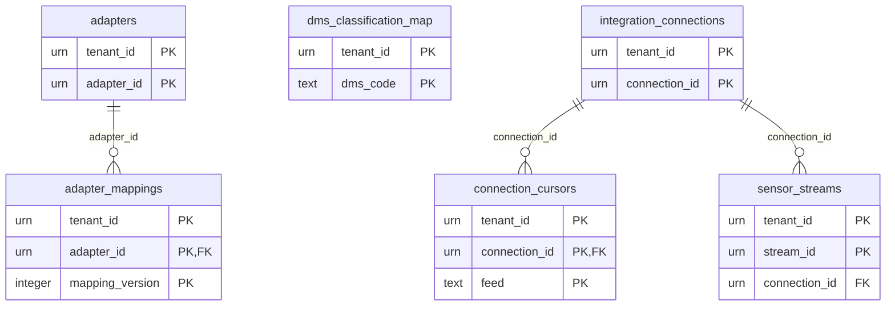

العلاقات مستنتَجة وفق §5 **[Derived]**؛ الأنواع وفق §4 **[Derived]**.

#### `integration.adapter_mappings`

- **المفتاح:** `(tenant_id, adapter_id, mapping_version)` · **المصدر:** `06-data/logical-model/slc-02.md`

| العمود | النوع (مستنتَج) | اختياري | ملاحظة |
|---|---|---|---|
| `spec` | json | — | — |
| `tests` | json | — | — |
| `author` | urn | — | — |
| `approved_by` | urn | — | — |

**القيود:** immutable

#### `integration.adapters`

- **المفتاح:** `(tenant_id, adapter_id)` · **المصدر:** `06-data/logical-model/slc-02.md`

| العمود | النوع (مستنتَج) | اختياري | ملاحظة |
|---|---|---|---|
| `name` | text | — | — |
| `source_urn` | urn | — | — |
| `service_account_urn` | urn | — | — |
| `state` | enum | — | — |
| `version` | integer | — | — |

**القيود:** one source per adapter

#### `integration.connection_cursors`

- **المفتاح:** `(tenant_id, connection_id, feed)` · **المصدر:** `06-data/logical-model/slc-16.md`

| العمود | النوع (مستنتَج) | اختياري | ملاحظة |
|---|---|---|---|
| `watermark` | text | — | — |
| `last_success_at` | timestamptz | — | — |

**القيود:** replay point

#### `integration.dms_classification_map`

- **المفتاح:** `(tenant_id, dms_code)` · **المصدر:** `06-data/logical-model/slc-16.md`

| العمود | النوع (مستنتَج) | اختياري | ملاحظة |
|---|---|---|---|
| `platform_level` | text | — | — |
| `compartments` | array | — | — |

**القيود:** unmapped → highest default

#### `integration.integration_connections`

- **المفتاح:** `(tenant_id, connection_id)` · **المصدر:** `06-data/logical-model/slc-16.md`

| العمود | النوع (مستنتَج) | اختياري | ملاحظة |
|---|---|---|---|
| `name` | text | — | — |
| `system_kind` | text | — | — |
| `endpoint` | text | — | — |
| `protocol` | enum | — | — |
| `direction` | enum | — | — |
| `credentials_ref` | urn | — | — |
| `allow_list` | json | — | — |
| `state` | enum | — | — |
| `health` | json | — | — |

**القيود:** outbound only for cap_endpoint (R2)

#### `integration.sensor_streams`

- **المفتاح:** `(tenant_id, stream_id)` · **المصدر:** `06-data/logical-model/slc-16.md`

| العمود | النوع (مستنتَج) | اختياري | ملاحظة |
|---|---|---|---|
| `connection_id` | urn | — | — |
| `source_urn` | urn | — | — |
| `quantity` | numeric | — | — |
| `unit` | text | — | — |
| `expected_rate` | text | — | — |
| `location` | text | نعم | — |
| `linked_entity` | text | نعم | — |
| `quality_rules` | json | — | — |
| `state` | enum | — | — |
| `last_reading_at` | timestamptz | — | — |

**القيود:** —

### schema `intelligence` — BC03

```mermaid
erDiagram
  alert_rules {
    urn tenant_id PK
    urn rule_id PK
    integer version PK
    urn situation_id FK
  }
  alerts {
    urn tenant_id PK
    urn alert_id PK
  }
  analysis_cases {
    urn tenant_id PK
    urn case_id PK
  }
  analysis_methods {
    urn tenant_id PK
    text method_code PK
    integer method_version PK
  }
  analysis_runs {
    urn tenant_id PK
    urn run_id PK
    urn case_id FK
  }
  assessment_versions {
    urn tenant_id PK
    urn assessment_id PK
    integer version PK
    urn case_id FK
  }
  cap_messages {
    urn tenant_id PK
    urn message_id PK
    urn alert_id FK
  }
  case_assumptions {
    urn tenant_id PK
    urn case_id PK, FK
    urn assumption_id PK
  }
  case_hypotheses {
    urn tenant_id PK
    urn case_id PK, FK
    urn hypothesis_id PK
  }
  case_scenarios {
    urn tenant_id PK
    urn case_id PK, FK
    urn scenario_id PK
  }
  case_selections {
    urn tenant_id PK
    urn case_id PK, FK
    urn selection_id PK
  }
  findings {
    urn tenant_id PK
    urn finding_id PK
    integer version PK
    urn case_id FK
  }
  reproduction_reports {
    urn tenant_id PK
    urn run_id PK
  }
  run_artifacts {
    urn tenant_id PK
    urn run_id PK, FK
    urn artifact_id PK
  }
  run_steps {
    urn tenant_id PK
    urn run_id PK, FK
    integer seq PK
  }
  situation_changes {
    urn tenant_id PK
    urn situation_id PK, FK
    integer seq PK
  }
  situation_definitions {
    urn tenant_id PK
    urn situation_id PK, FK
    integer def_version PK
  }
  situation_members {
    urn tenant_id PK
    urn situation_id PK, FK
    urn member_urn PK
    text member_from PK
  }
  situations {
    urn tenant_id PK
    urn situation_id PK
  }
  tile_cache {
    text situation PK
    text layer PK
    text z PK
    text x PK
    text y PK
    text scope_hash PK
    integer data_version PK
  }
  situations ||--o{ alert_rules : "situation_id"
  analysis_cases ||--o{ analysis_runs : "case_id"
  analysis_cases ||--o{ assessment_versions : "case_id"
  alerts ||--o{ cap_messages : "alert_id"
  analysis_cases ||--o{ case_assumptions : "case_id"
  analysis_cases ||--o{ case_hypotheses : "case_id"
  analysis_cases ||--o{ case_scenarios : "case_id"
  analysis_cases ||--o{ case_selections : "case_id"
  analysis_cases ||--o{ findings : "case_id"
  analysis_runs ||--o{ run_artifacts : "run_id"
  analysis_runs ||--o{ run_steps : "run_id"
  situations ||--o{ situation_changes : "situation_id"
  situations ||--o{ situation_definitions : "situation_id"
  situations ||--o{ situation_members : "situation_id"
```

العلاقات مستنتَجة وفق §5 **[Derived]**؛ الأنواع وفق §4 **[Derived]**.

#### `intelligence.alert_rules`

- **المفتاح:** `(tenant_id, rule_id, version)` · **المصدر:** `06-data/logical-model/slc-06.md`

| العمود | النوع (مستنتَج) | اختياري | ملاحظة |
|---|---|---|---|
| `situation_id` | urn | نعم | — |
| `scope` | text | — | — |
| `kind` | enum | — | — |
| `parameters` | json | — | — |
| `severity` | enum | — | — |
| `dedupe_window` | period | — | — |
| `escalation` | json | — | — |
| `auto_resolve` | text | — | — |
| `label` | security_label | — | — |
| `state` | enum | — | — |

**القيود:** ACTIVE versions immutable

#### `intelligence.alerts`

- **المفتاح:** `(tenant_id, alert_id)` · **المصدر:** `06-data/logical-model/slc-06.md`

| العمود | النوع (مستنتَج) | اختياري | ملاحظة |
|---|---|---|---|
| `rule_id` | urn | — | — |
| `rule_version` | integer | — | — |
| `subject_urn` | urn | — | — |
| `label` | security_label | — | — |
| `severity` | enum | — | — |
| `occurrences` | integer | — | — |
| `first_at` | timestamptz | — | — |
| `last_at` | timestamptz | — | — |
| `state` | enum | — | — |
| `version` | integer | — | — |

**القيود:** partial unique (tenant, rule_id, subject_urn) where non-terminal and last_at within window

#### `intelligence.analysis_cases`

- **المفتاح:** `(tenant_id, case_id)` · **المصدر:** `06-data/logical-model/slc-07.md`

| العمود | النوع (مستنتَج) | اختياري | ملاحظة |
|---|---|---|---|
| `title` | json | — | — |
| `owner` | urn | — | — |
| `question` | json | — | — |
| `extent` | json | نعم | — |
| `window_from` | timestamptz | — | — |
| `window_to` | timestamptz | — | — |
| `state` | enum | — | — |
| `label` | security_label | — | — |
| `version` | integer | — | — |

**القيود:** —

#### `intelligence.analysis_methods`

- **المفتاح:** `(tenant_id, method_code, method_version)` · **المصدر:** `06-data/logical-model/slc-07.md`

| العمود | النوع (مستنتَج) | اختياري | ملاحظة |
|---|---|---|---|
| `parameter_schema` | json | — | — |
| `image_digest` | text | — | — |
| `deterministic` | text | — | — |
| `tolerance` | json | نعم | — |
| `state` | enum | — | — |
| `author` | urn | — | — |
| `approver` | urn | — | — |

**القيود:** immutable content

#### `intelligence.analysis_runs`

- **المفتاح:** `(tenant_id, run_id)` · **المصدر:** `06-data/logical-model/slc-07.md`

| العمود | النوع (مستنتَج) | اختياري | ملاحظة |
|---|---|---|---|
| `case_id` | urn | — | — |
| `method_code` | text | — | — |
| `method_version` | integer | — | — |
| `image_digest` | text | — | — |
| `parameters` | json | — | — |
| `inputs` | json | — | json pins |
| `scenario` | text | نعم | — |
| `seed` | text | نعم | — |
| `label` | security_label | — | — |
| `submitted_by` | urn | — | — |
| `submitted_at` | timestamptz | — | — |
| `state` | enum | — | — |
| `lease` | json | — | — |
| `started_at` | timestamptz | — | — |
| `ended_at` | timestamptz | — | — |
| `error` | text | نعم | — |

**القيود:** —

#### `intelligence.assessment_versions`

- **المفتاح:** `(tenant_id, assessment_id, version)` · **المصدر:** `06-data/logical-model/slc-07.md`

| العمود | النوع (مستنتَج) | اختياري | ملاحظة |
|---|---|---|---|
| `case_id` | urn | — | — |
| `title` | json | — | — |
| `key_judgments` | json | — | — |
| `citations` | json | — | json pinned |
| `assumptions` | json | — | — |
| `uncertainty` | json | — | — |
| `confidence` | text | — | — |
| `methodology` | json | — | — |
| `limitations` | json | — | — |
| `label` | security_label | — | — |
| `author` | urn | — | — |
| `reviewer` | urn | — | — |
| `state` | enum | — | — |
| `published_at` | timestamptz | — | — |

**القيود:** one PUBLISHED per assessment_id (partial unique)

#### `intelligence.cap_messages`

- **المفتاح:** `(tenant_id, message_id)` · **المصدر:** `06-data/logical-model/slc-16.md`

| العمود | النوع (مستنتَج) | اختياري | ملاحظة |
|---|---|---|---|
| `alert_id` | urn | — | — |
| `template` | text | — | — |
| `payload` | text | — | xml |
| `connection_id` | urn | — | — |
| `state` | enum | — | — |
| `preparer` | text | — | — |
| `releaser` | text | نعم | — |
| `ack` | text | نعم | — |

**القيود:** payload validated against CAP 1.2

#### `intelligence.case_assumptions`

- **المفتاح:** `(tenant_id, case_id, assumption_id)` · **المصدر:** `06-data/logical-model/slc-07.md`

| العمود | النوع (مستنتَج) | اختياري | ملاحظة |
|---|---|---|---|
| `statement` | json | — | — |
| `criticality` | text | — | — |
| `retired_at` | timestamptz | نعم | — |
| `retired_reason` | text | — | — |

**القيود:** never deleted

#### `intelligence.case_hypotheses`

- **المفتاح:** `(tenant_id, case_id, hypothesis_id)` · **المصدر:** `06-data/logical-model/slc-07.md`

| العمود | النوع (مستنتَج) | اختياري | ملاحظة |
|---|---|---|---|
| `statement` | json | — | — |
| `status` | enum | — | — |
| `rationale` | text | — | — |
| `findings` | array | — | — |

**القيود:** history in cases_history

#### `intelligence.case_scenarios`

- **المفتاح:** `(tenant_id, case_id, scenario_id)` · **المصدر:** `06-data/logical-model/slc-07.md`

| العمود | النوع (مستنتَج) | اختياري | ملاحظة |
|---|---|---|---|
| `name` | text | — | — |
| `assumptions` | array | — | — |
| `parameter_overrides` | json | — | — |

**القيود:** —

#### `intelligence.case_selections`

- **المفتاح:** `(tenant_id, case_id, selection_id)` · **المصدر:** `06-data/logical-model/slc-07.md`

| العمود | النوع (مستنتَج) | اختياري | ملاحظة |
|---|---|---|---|
| `item_urn` | urn | — | — |
| `known_at` | timestamptz | — | — |
| `selected_by` | urn | — | — |
| `selected_at` | timestamptz | — | — |
| `closed_at` | timestamptz | نعم | — |
| `close_reason` | text | — | — |

**القيود:** item label ≤ case label

#### `intelligence.findings`

- **المفتاح:** `(tenant_id, finding_id, version)` · **المصدر:** `06-data/logical-model/slc-07.md`

| العمود | النوع (مستنتَج) | اختياري | ملاحظة |
|---|---|---|---|
| `case_id` | urn | — | — |
| `statement` | json | — | — |
| `sources` | json | — | json pinned |
| `uncertainty` | json | — | — |
| `label` | security_label | — | — |
| `author` | urn | — | — |
| `reviewer` | urn | — | — |
| `state` | enum | — | — |

**القيود:** ACCEPTED immutable

#### `intelligence.reproduction_reports`

- **المفتاح:** `(tenant_id, run_id)` · **المصدر:** `06-data/logical-model/slc-07.md`

| العمود | النوع (مستنتَج) | اختياري | ملاحظة |
|---|---|---|---|
| `source_run_id` | urn | — | — |
| `outcome` | text | — | REPRODUCED/DIFFERENT |
| `differences` | json | — | — |

**القيود:** —

#### `intelligence.run_artifacts`

- **المفتاح:** `(tenant_id, run_id, artifact_id)` · **المصدر:** `06-data/logical-model/slc-07.md`

| العمود | النوع (مستنتَج) | اختياري | ملاحظة |
|---|---|---|---|
| `kind` | enum | — | — |
| `sha256` | text | — | — |
| `attachment_ref` | urn | — | — |

**القيود:** immutable

#### `intelligence.run_steps`

- **المفتاح:** `(tenant_id, run_id, seq)` · **المصدر:** `06-data/logical-model/slc-07.md`

| العمود | النوع (مستنتَج) | اختياري | ملاحظة |
|---|---|---|---|
| `step` | text | — | — |
| `at` | text | — | — |
| `detail` | json | — | — |

**القيود:** append-only

#### `intelligence.situation_changes`

- **المفتاح:** `(tenant_id, situation_id, seq)` · **المصدر:** `06-data/logical-model/slc-06.md`

| العمود | النوع (مستنتَج) | اختياري | ملاحظة |
|---|---|---|---|
| `member_urn` | urn | — | — |
| `change` | text | — | joined/left/updated |
| `at` | text | — | — |
| `cause_event_id` | urn | — | — |

**القيود:** append-only; cursor for QRY-SIT-CHANGES

#### `intelligence.situation_definitions`

- **المفتاح:** `(tenant_id, situation_id, def_version)` · **المصدر:** `06-data/logical-model/slc-06.md`

| العمود | النوع (مستنتَج) | اختياري | ملاحظة |
|---|---|---|---|
| `extent` | json | — | json, EPSG:4326 |
| `window_from` | timestamptz | — | — |
| `window_to` | timestamptz | — | — |
| `criteria` | json | — | — |
| `recorded_at` | timestamptz | — | — |

**القيود:** immutable

#### `intelligence.situation_members`

- **المفتاح:** `(tenant_id, situation_id, member_urn, member_from)` · **المصدر:** `06-data/logical-model/slc-06.md`

| العمود | النوع (مستنتَج) | اختياري | ملاحظة |
|---|---|---|---|
| `member_to` | text | — | — |
| `cause_event_id` | urn | — | — |
| `def_version` | integer | — | — |
| `member_label` | security_label | — | — |

**القيود:** index (tenant, situation_id, member_to IS NULL)

#### `intelligence.situations`

- **المفتاح:** `(tenant_id, situation_id)` · **المصدر:** `06-data/logical-model/slc-06.md`

| العمود | النوع (مستنتَج) | اختياري | ملاحظة |
|---|---|---|---|
| `name` | json | — | — |
| `owner` | urn | — | — |
| `state` | enum | — | — |
| `label` | security_label | — | — |
| `current_definition_version` | integer | — | — |
| `membership_version` | integer | — | — |
| `version` | integer | — | — |

**القيود:** —

#### `intelligence.tile_cache` — مؤقت (ephemeral)

- **المفتاح:** `(situation, layer, z, x, y, scope_hash, data_version)` · **المصدر:** `06-data/logical-model/slc-06.md`

| العمود | النوع (مستنتَج) | اختياري | ملاحظة |
|---|---|---|---|
| `bytes` | text | — | — |
| `created_at` | timestamptz | — | — |

**القيود:** TTL ≤ 10 min; never shared across scope_hash

### schema `key_store` — BC08

مخزن المفاتيح لكل خلية لا لكل مستأجر (`slc-12a.md`: «key store per cell»؛ TD-07)؛ أُفرد هنا لأن الاسم في المصدر `key_store.<table>` لا يقع في schema `governance` الخاص بالمستأجر.

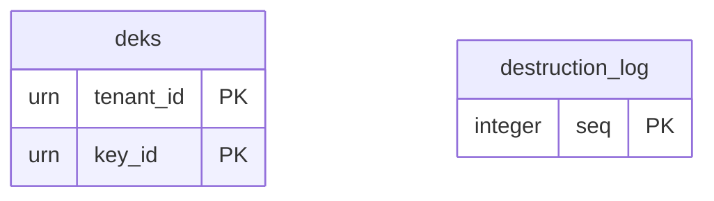

العلاقات مستنتَجة وفق §5 **[Derived]**؛ الأنواع وفق §4 **[Derived]**.

#### `key_store.deks`

- **المفتاح:** `(tenant_id, key_id)` · **المصدر:** `06-data/logical-model/slc-12a.md`

| العمود | النوع (مستنتَج) | اختياري | ملاحظة |
|---|---|---|---|
| `kind` | enum | — | class_bucket / subject / hold |
| `scope_ref` | text | — | — |
| `wrapped_key` | bytes_encrypted | — | — |
| `created_at` | timestamptz | — | — |
| `destroyed_at` | timestamptz | نعم | — |

**القيود:** wrapped by tenant KEK

#### `key_store.destruction_log`

- **المفتاح:** `(seq)` · **المصدر:** `06-data/logical-model/slc-12a.md`

| العمود | النوع (مستنتَج) | اختياري | ملاحظة |
|---|---|---|---|
| `tenant_id` | urn | — | — |
| `key_id` | urn | — | — |
| `destroyed_at` | timestamptz | — | — |
| `run_request_ref` | text | — | — |
| `prev_hash` | text | — | — |
| `hash` | text | — | — |

**القيود:** append-only; replicated; replayed by restore gate

### schema `knowledge` — BC06

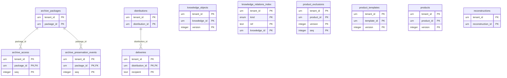

العلاقات مستنتَجة وفق §5 **[Derived]**؛ الأنواع وفق §4 **[Derived]**.

#### `knowledge.archive_access`

- **المفتاح:** `(tenant_id, package_id, seq)` · **المصدر:** `06-data/logical-model/slc-12.md`

| العمود | النوع (مستنتَج) | اختياري | ملاحظة |
|---|---|---|---|
| `actor` | urn | — | — |
| `purpose` | enum | — | — |
| `at` | text | — | — |

**القيود:** append-only (REQ-ARC-003)

#### `knowledge.archive_packages`

- **المفتاح:** `(tenant_id, package_id)` · **المصدر:** `06-data/logical-model/slc-12.md`

| العمود | النوع (مستنتَج) | اختياري | ملاحظة |
|---|---|---|---|
| `record_class` | text | — | — |
| `bucket` | text | — | — |
| `bag_manifest` | json | — | — |
| `representations` | json | — | — |
| `label` | security_label | — | — |
| `state` | enum | — | — |
| `tier` | text | — | warm/cold |
| `last_fixity_at` | timestamptz | — | — |

**القيود:** —

#### `knowledge.archive_preservation_events`

- **المفتاح:** `(tenant_id, package_id, seq)` · **المصدر:** `06-data/logical-model/slc-12.md`

| العمود | النوع (مستنتَج) | اختياري | ملاحظة |
|---|---|---|---|
| `event` | text | — | ingest, fixity, migration, repair, transfer |
| `outcome` | text | — | — |
| `at` | text | — | — |
| `agent` | text | — | — |

**القيود:** append-only

#### `knowledge.deliveries`

- **المفتاح:** `(tenant_id, distribution_id, recipient)` · **المصدر:** `06-data/logical-model/slc-12.md`

| العمود | النوع (مستنتَج) | اختياري | ملاحظة |
|---|---|---|---|
| `watermark_id` | urn | — | — |
| `format` | text | — | — |
| `delivered_at` | timestamptz | — | — |
| `status` | enum | — | delivered/excluded |

**القيود:** —

#### `knowledge.distributions`

- **المفتاح:** `(tenant_id, distribution_id)` · **المصدر:** `06-data/logical-model/slc-12.md`

| العمود | النوع (مستنتَج) | اختياري | ملاحظة |
|---|---|---|---|
| `product_id` | urn | — | — |
| `version` | integer | — | — |
| `formats` | array | — | — |
| `state` | enum | — | — |
| `distributor` | text | — | — |

**القيود:** —

#### `knowledge.knowledge_objects`

- **المفتاح:** `(tenant_id, knowledge_id, version)` · **المصدر:** `06-data/logical-model/slc-12.md` · **امتدادات:** slc-19: source_ref (lesson type) may now reference a completed simulation in addition to a task/plan/incident; column type (urn) unchanged

| العمود | النوع (مستنتَج) | اختياري | ملاحظة |
|---|---|---|---|
| `type` | text | — | — |
| `title` | json | — | — |
| `statements` | json | — | — |
| `relationships` | json | — | — |
| `source` | text | نعم | — |
| `label` | security_label | — | — |
| `state` | enum | — | — |
| `author` | urn | — | — |
| `reviewer` | urn | — | — |
| `reuse_count` | integer | — | — |

**القيود:** one PUBLISHED per knowledge_id

#### `knowledge.knowledge_relations_index`

- **المفتاح:** `(tenant_id, kind, ref, knowledge_id)` · **المصدر:** `06-data/logical-model/slc-12.md`

| العمود | النوع (مستنتَج) | اختياري | ملاحظة |
|---|---|---|---|
| `` | text | — | — |

**القيود:** for suggestions

#### `knowledge.product_exclusions`

- **المفتاح:** `(tenant_id, product_id, version, seq)` · **المصدر:** `06-data/logical-model/slc-12.md`

| العمود | النوع (مستنتَج) | اختياري | ملاحظة |
|---|---|---|---|
| `object_urn` | urn | — | — |
| `reason` | text | — | — |

**القيود:** internal audit only; never rendered

#### `knowledge.product_templates`

- **المفتاح:** `(tenant_id, template_id, version)` · **المصدر:** `06-data/logical-model/slc-12.md`

| العمود | النوع (مستنتَج) | اختياري | ملاحظة |
|---|---|---|---|
| `code` | text | — | — |
| `kind` | enum | — | — |
| `sections` | json | — | — |
| `state` | enum | — | — |

**القيود:** —

#### `knowledge.products`

- **المفتاح:** `(tenant_id, product_id, version)` · **المصدر:** `06-data/logical-model/slc-12.md`

| العمود | النوع (مستنتَج) | اختياري | ملاحظة |
|---|---|---|---|
| `template_id` | urn | — | — |
| `template_version` | integer | — | — |
| `parameters` | json | — | — |
| `audience` | json | — | — |
| `label` | security_label | — | — |
| `state` | enum | — | — |
| `generated_known_at` | timestamptz | — | — |
| `artifacts` | json | — | json: format, sha256, object_key |
| `citations` | json | — | json pinned |
| `author` | urn | — | — |
| `reviewer` | urn | — | — |

**القيود:** APPROVED immutable; one APPROVED per product_id

#### `knowledge.reconstructions`

- **المفتاح:** `(tenant_id, reconstruction_id)` · **المصدر:** `06-data/logical-model/slc-12.md`

| العمود | النوع (مستنتَج) | اختياري | ملاحظة |
|---|---|---|---|
| `scope` | json | — | — |
| `valid_at` | timestamptz | — | — |
| `known_at` | timestamptz | — | — |
| `purpose` | enum | — | — |
| `requester` | urn | — | — |
| `state` | enum | — | — |
| `report_ref` | urn | — | — |

**القيود:** —

### schema `operations` — BC04

```mermaid
erDiagram
  activity_task_map {
    urn tenant_id PK
    urn plan_id PK, FK
    urn activity_id PK
    urn task_id PK, FK
  }
  coordination_cases {
    urn tenant_id PK
    urn case_id PK
  }
  coordination_participants {
    urn tenant_id PK
    urn case_id PK, FK
    text org_unit PK
  }
  coordination_responsibilities {
    urn tenant_id PK
    urn case_id PK, FK
    urn responsibility_id PK
  }
  decision_requests {
    urn tenant_id PK
    urn request_id PK
  }
  decisions {
    urn tenant_id PK
    urn decision_id PK
    urn request_id FK
  }
  incidents {
    urn tenant_id PK
    urn incident_id PK
  }
  notification_templates {
    text template_code PK
    text lang PK
  }
  notifications {
    urn tenant_id PK
    urn recipient_id PK
    urn notification_id PK
  }
  outcome_measurements {
    urn tenant_id PK
    urn plan_id PK, FK
    urn outcome_id PK
    urn measurement_id PK
    timestamptz recorded_from PK
  }
  outcome_trackers {
    urn tenant_id PK
    urn plan_id PK, FK
    urn outcome_id PK
  }
  plan_version_annotations {
    urn tenant_id PK
    urn plan_id PK, FK
    integer plan_version PK
    integer seq PK
  }
  plan_versions {
    urn tenant_id PK
    urn plan_id PK, FK
    integer plan_version PK
  }
  plans {
    urn tenant_id PK
    urn plan_id PK
  }
  risk_treatment_actions {
    urn tenant_id PK
    urn risk_id PK, FK
    urn treatment_task_ref PK
  }
  risks {
    urn tenant_id PK
    urn risk_id PK
  }
  subscriptions {
    urn tenant_id PK
    urn subscription_id PK
  }
  task_criteria {
    urn tenant_id PK
    urn task_id PK, FK
    urn criterion_id PK
  }
  task_dependencies {
    urn tenant_id PK
    urn task_id PK, FK
    urn predecessor_id PK
  }
  task_result_items {
    urn tenant_id PK
    urn task_id PK, FK
    integer seq PK
  }
  task_sync_runs {
    urn tenant_id PK
    urn plan_id PK, FK
    integer from_version PK
    integer to_version PK
  }
  task_timers {
    urn tenant_id PK
    text due_bucket PK
    urn task_id PK, FK
    enum kind PK
  }
  task_types {
    urn tenant_id PK
    urn task_type_id PK
    integer version PK
  }
  tasks {
    urn tenant_id PK
    urn task_id PK
  }
  plans ||--o{ activity_task_map : "plan_id"
  tasks ||--o{ activity_task_map : "task_id"
  coordination_cases ||--o{ coordination_participants : "case_id"
  coordination_cases ||--o{ coordination_responsibilities : "case_id"
  decision_requests ||--o{ decisions : "request_id"
  plans ||--o{ outcome_measurements : "plan_id"
  plans ||--o{ outcome_trackers : "plan_id"
  plans ||--o{ plan_version_annotations : "plan_id"
  plans ||--o{ plan_versions : "plan_id"
  risks ||--o{ risk_treatment_actions : "risk_id"
  tasks ||--o{ task_criteria : "task_id"
  tasks ||--o{ task_dependencies : "task_id"
  tasks ||--o{ task_result_items : "task_id"
  plans ||--o{ task_sync_runs : "plan_id"
  tasks ||--o{ task_timers : "task_id"
```

العلاقات مستنتَجة وفق §5 **[Derived]**؛ الأنواع وفق §4 **[Derived]**.

#### `operations.activity_task_map`

- **المفتاح:** `(tenant_id, plan_id, activity_id, task_id)` · **المصدر:** `06-data/logical-model/slc-08.md`

| العمود | النوع (مستنتَج) | اختياري | ملاحظة |
|---|---|---|---|
| `created_in_version` | integer | — | — |
| `superseded_in_version` | integer | نعم | — |

**القيود:** —

#### `operations.coordination_cases`

- **المفتاح:** `(tenant_id, case_id)` · **المصدر:** `06-data/logical-model/slc-15.md`

| العمود | النوع (مستنتَج) | اختياري | ملاحظة |
|---|---|---|---|
| `title` | json | — | — |
| `purpose` | json | — | — |
| `lead_org` | text | — | — |
| `links` | json | — | — |
| `label` | security_label | — | — |
| `state` | enum | — | — |
| `version` | integer | — | — |

**القيود:** —

#### `operations.coordination_participants`

- **المفتاح:** `(tenant_id, case_id, org_unit)` · **المصدر:** `06-data/logical-model/slc-15.md`

| العمود | النوع (مستنتَج) | اختياري | ملاحظة |
|---|---|---|---|
| `role` | text | — | — |
| `access_scope` | array | — | — |

**القيود:** lead cannot be removed

#### `operations.coordination_responsibilities`

- **المفتاح:** `(tenant_id, case_id, responsibility_id)` · **المصدر:** `06-data/logical-model/slc-15.md`

| العمود | النوع (مستنتَج) | اختياري | ملاحظة |
|---|---|---|---|
| `participant` | text | — | — |
| `item` | json | — | — |
| `due` | timestamptz | — | — |
| `requires_authority` | boolean | نعم | — |
| `decision_request` | text | نعم | — |
| `decision` | text | نعم | — |
| `status` | enum | — | — |

**القيود:** done requires decision when requires_authority

#### `operations.decision_requests`

- **المفتاح:** `(tenant_id, request_id)` · **المصدر:** `06-data/logical-model/slc-08.md`

| العمود | النوع (مستنتَج) | اختياري | ملاحظة |
|---|---|---|---|
| `question` | json | — | — |
| `decision_type` | text | — | — |
| `scope_unit` | text | — | — |
| `deadline` | text | — | — |
| `options` | json | — | — |
| `citations` | json | — | json pinned |
| `label` | security_label | — | — |
| `state` | enum | — | — |
| `version` | integer | — | — |

**القيود:** —

#### `operations.decisions`

- **المفتاح:** `(tenant_id, decision_id)` · **المصدر:** `06-data/logical-model/slc-08.md`

| العمود | النوع (مستنتَج) | اختياري | ملاحظة |
|---|---|---|---|
| `request_id` | urn | نعم | — |
| `selected_option` | text | — | — |
| `rationale` | json | — | — |
| `effective_from` | text | — | — |
| `recorded_at` | timestamptz | — | — |
| `decider` | text | — | — |
| `authority_snapshot` | json | — | — |
| `citations` | json | — | json pinned |
| `supersedes` | text | نعم | — |
| `label` | security_label | — | — |
| `state` | enum | — | — |

**القيود:** immutable except state; CHECK(citations non-empty)

#### `operations.incidents`

- **المفتاح:** `(tenant_id, incident_id)` · **المصدر:** `06-data/logical-model/slc-17.md`

| العمود | النوع (مستنتَج) | اختياري | ملاحظة |
|---|---|---|---|
| `category_ref` | urn | — | — |
| `description` | json | — | — |
| `scope_refs` | array | — | — |
| `risk_ref` | urn | نعم | — |
| `severity` | enum | — | — |
| `affected_scope_refs` | array | نعم | — |
| `commander` | text | نعم | — |
| `response_task_refs` | array | نعم | — |
| `after_action_ref` | urn | نعم | — |
| `label` | security_label | — | — |
| `state` | enum | — | — |
| `version` | integer | — | — |

**القيود:** severity change history kept in incident_severity_history, not overwritten

#### `operations.notification_templates`

- **المفتاح:** `(template_code, lang)` · **المصدر:** `06-data/logical-model/slc-06.md`

| العمود | النوع (مستنتَج) | اختياري | ملاحظة |
|---|---|---|---|
| `text` | text | — | — |

**القيود:** classification-safe list (reviewed by Security Officer)

#### `operations.notifications`

- **المفتاح:** `(tenant_id, recipient_id, notification_id)` · **المصدر:** `06-data/logical-model/slc-06.md` · **التقسيم:** partition by (tenant, month)

| العمود | النوع (مستنتَج) | اختياري | ملاحظة |
|---|---|---|---|
| `ref_urn` | urn | — | — |
| `template_code` | text | — | — |
| `severity` | enum | — | — |
| `state` | enum | — | — |
| `attempts` | integer | — | — |
| `queued_at` | timestamptz | — | — |
| `sent_at` | timestamptz | — | — |
| `read_at` | timestamptz | — | — |

**القيود:** partition by (tenant, month); TTL 30 d → EXPIRED

#### `operations.outcome_measurements`

- **المفتاح:** `(tenant_id, plan_id, outcome_id, measurement_id, recorded_from)` · **المصدر:** `06-data/logical-model/slc-08.md`

| العمود | النوع (مستنتَج) | اختياري | ملاحظة |
|---|---|---|---|
| `value` | text | — | — |
| `unit` | text | — | — |
| `measured_at` | timestamptz | — | — |
| `source` | text | — | — |
| `source_ref` | urn | نعم | — |
| `recorded_to` | timestamptz | نعم | — |

**القيود:** bitemporal; corrections close and add

#### `operations.outcome_trackers`

- **المفتاح:** `(tenant_id, plan_id, outcome_id)` · **المصدر:** `06-data/logical-model/slc-08.md`

| العمود | النوع (مستنتَج) | اختياري | ملاحظة |
|---|---|---|---|
| `metric` | text | — | — |
| `unit` | text | — | — |
| `state` | enum | — | — |
| `targets` | json | — | json history |

**القيود:** one per (plan, outcome)

#### `operations.plan_version_annotations`

- **المفتاح:** `(tenant_id, plan_id, plan_version, seq)` · **المصدر:** `06-data/logical-model/slc-08.md`

| العمود | النوع (مستنتَج) | اختياري | ملاحظة |
|---|---|---|---|
| `annotation` | json | — | — |
| `by` | text | — | — |
| `at` | text | — | — |

**القيود:** minor amendments

#### `operations.plan_versions`

- **المفتاح:** `(tenant_id, plan_id, plan_version)` · **المصدر:** `06-data/logical-model/slc-08.md`

| العمود | النوع (مستنتَج) | اختياري | ملاحظة |
|---|---|---|---|
| `content` | json | — | json: objectives, outcomes, constraints, assumptions, phases, activities, milestones, dependencies, resource_notes |
| `author` | urn | — | — |
| `approver` | urn | نعم | — |
| `change_class` | text | — | — |
| `state` | enum | — | — |
| `submitted_at` | timestamptz | — | — |
| `baselined_at` | timestamptz | — | — |

**القيود:** content immutable from IN_REVIEW; partial unique one BASELINED per plan

#### `operations.plans`

- **المفتاح:** `(tenant_id, plan_id)` · **المصدر:** `06-data/logical-model/slc-08.md` · **امتدادات:** slc-17: triggered_by only set when plan_kind = CONTINGENCY (INV-PLN-04)

| العمود | النوع (مستنتَج) | اختياري | ملاحظة |
|---|---|---|---|
| `title` | json | — | — |
| `owner` | urn | — | — |
| `org_scope` | text | — | — |
| `implements` | array | — | — |
| `window` | period | — | — |
| `label` | security_label | — | — |
| `state` | enum | — | — |
| `baselined_version` | integer | نعم | — |
| `version` | integer | — | — |
| `plan_kind` | text | — | — |
| `triggered_by` | urn | نعم | — |

**القيود:** —

#### `operations.risk_treatment_actions`

- **المفتاح:** `(tenant_id, risk_id, treatment_task_ref)` · **المصدر:** `06-data/logical-model/slc-17.md`

| العمود | النوع (مستنتَج) | اختياري | ملاحظة |
|---|---|---|---|
| `status` | enum | — | — |

**القيود:** —

#### `operations.risks`

- **المفتاح:** `(tenant_id, risk_id)` · **المصدر:** `06-data/logical-model/slc-17.md`

| العمود | النوع (مستنتَج) | اختياري | ملاحظة |
|---|---|---|---|
| `category_ref` | urn | — | — |
| `description` | json | — | — |
| `scope_refs` | array | — | — |
| `likelihood` | numeric | — | — |
| `impact` | numeric | — | — |
| `risk_score` | numeric | — | generated always as likelihood*impact stored |
| `treatment_strategy` | text | نعم | — |
| `treatment_task_refs` | array | نعم | — |
| `rationale` | text | نعم | — |
| `incident_ref` | urn | نعم | — |
| `label` | security_label | — | — |
| `state` | enum | — | — |
| `version` | integer | — | — |

**القيود:** risk_score is a generated column, never written directly

#### `operations.subscriptions`

- **المفتاح:** `(tenant_id, subscription_id)` · **المصدر:** `06-data/logical-model/slc-06.md`

| العمود | النوع (مستنتَج) | اختياري | ملاحظة |
|---|---|---|---|
| `user_id` | urn | — | — |
| `target_urn` | urn | — | — |
| `channels` | array | — | — |
| `quiet_hours` | json | — | — |
| `state` | enum | — | — |
| `version` | integer | — | — |

**القيود:** partial unique (tenant, user, target) where ACTIVE/PAUSED

#### `operations.task_criteria`

- **المفتاح:** `(tenant_id, task_id, criterion_id)` · **المصدر:** `06-data/logical-model/slc-03.md`

| العمود | النوع (مستنتَج) | اختياري | ملاحظة |
|---|---|---|---|
| `kind` | enum | — | — |
| `spec` | json | — | — |
| `satisfied` | text | — | — |
| `satisfied_by` | urn | — | — |
| `satisfied_at` | timestamptz | — | — |

**القيود:** frozen after ASSIGNED (trigger/app)

#### `operations.task_dependencies`

- **المفتاح:** `(tenant_id, task_id, predecessor_id)` · **المصدر:** `06-data/logical-model/slc-03.md`

| العمود | النوع (مستنتَج) | اختياري | ملاحظة |
|---|---|---|---|
| `` | text | — | — |

**القيود:** acyclic (checked in aggregate)

#### `operations.task_result_items`

- **المفتاح:** `(tenant_id, task_id, seq)` · **المصدر:** `06-data/logical-model/slc-03.md`

| العمود | النوع (مستنتَج) | اختياري | ملاحظة |
|---|---|---|---|
| `kind` | enum | — | — |
| `ref` | text | نعم | — |
| `note` | json | نعم | — |
| `measurement` | json | نعم | — |
| `added_by` | urn | — | — |
| `added_at` | timestamptz | — | — |

**القيود:** append-only

#### `operations.task_sync_runs`

- **المفتاح:** `(tenant_id, plan_id, from_version, to_version)` · **المصدر:** `06-data/logical-model/slc-08.md`

| العمود | النوع (مستنتَج) | اختياري | ملاحظة |
|---|---|---|---|
| `status` | enum | — | — |
| `expected` | json | — | — |
| `applied` | json | — | — |
| `started_at` | timestamptz | — | — |
| `ended_at` | timestamptz | — | — |

**القيود:** unique run per transition (idempotency)

#### `operations.task_timers`

- **المفتاح:** `(tenant_id, due_bucket, task_id, kind)` · **المصدر:** `06-data/logical-model/slc-03.md` · **التقسيم:** partitioned by tenant

| العمود | النوع (مستنتَج) | اختياري | ملاحظة |
|---|---|---|---|
| `fire_at` | timestamptz | — | — |
| `lease_owner` | text | — | — |
| `lease_until` | text | — | — |

**القيود:** partitioned by tenant; minute buckets

#### `operations.task_types`

- **المفتاح:** `(tenant_id, task_type_id, version)` · **المصدر:** `06-data/logical-model/slc-03.md`

| العمود | النوع (مستنتَج) | اختياري | ملاحظة |
|---|---|---|---|
| `code` | text | — | — |
| `name` | json | — | — |
| `qualification_requirements` | json | — | — |
| `criteria_templates` | json | — | — |
| `escalation` | json | — | — |
| `expires_on_due` | text | — | — |
| `review_steps` | text | — | — |
| `state` | enum | — | — |

**القيود:** UNIQUE(tenant, code, version)

#### `operations.tasks`

- **المفتاح:** `(tenant_id, task_id)` · **المصدر:** `06-data/logical-model/slc-03.md` · **امتدادات:** slc-17: exactly one of plan_ref / incident_ref / ad_hoc_reason set at creation

| العمود | النوع (مستنتَج) | اختياري | ملاحظة |
|---|---|---|---|
| `task_type_id` | urn | — | — |
| `task_type_version` | integer | — | — |
| `title` | json | — | — |
| `description` | json | — | — |
| `plan_ref` | urn | نعم | — |
| `ad_hoc_reason` | text | نعم | — |
| `owner` | urn | — | — |
| `org_scope` | text | — | — |
| `assignee` | urn | نعم | — |
| `reviewer` | urn | نعم | — |
| `state` | enum | — | — |
| `suspended` | boolean | — | — |
| `due_at` | timestamptz | نعم | — |
| `follow_up_of` | urn | نعم | — |
| `label` | security_label | — | — |
| `eligibility_snapshot` | json | — | — |
| `version` | integer | — | — |
| `incident_ref` | urn | نعم | — |

**القيود:** CHECK(plan_ref IS NOT NULL OR (ad_hoc_reason IS NOT NULL AND owner IS NOT NULL)); index (tenant, assignee, state, due_at); index (tenant, plan_ref, state)

### schema `readiness` — BC05

```mermaid
erDiagram
  allocation_consumption {
    urn tenant_id PK
    urn allocation_id PK, FK
    integer seq PK
  }
  allocations {
    urn tenant_id PK
    urn allocation_id PK
    urn pool_id FK
  }
  asset_assignments {
    urn tenant_id PK
    urn assignment_id PK
    urn asset_id FK
  }
  asset_certifications {
    urn tenant_id PK
    urn asset_id PK, FK
    text code PK
    timestamptz valid_from PK
  }
  asset_custody {
    urn tenant_id PK
    urn asset_id PK, FK
    integer seq PK
  }
  asset_reservations {
    urn tenant_id PK
    urn reservation_id PK
    urn asset_id FK
  }
  assets {
    urn tenant_id PK
    urn asset_id PK
  }
  capacity_ledger {
    urn tenant_id PK
    urn pool_id PK, FK
    text hour PK
  }
  exercises {
    urn tenant_id PK
    urn exercise_id PK
  }
  legacy_resource_notes_migration {
    urn tenant_id PK
    urn source_urn PK
    text note_seq PK
  }
  logistics_requests {
    urn tenant_id PK
    urn request_id PK
  }
  maintenance_orders {
    urn tenant_id PK
    urn order_id PK
    urn asset_id FK
  }
  pool_capacity_series {
    urn tenant_id PK
    urn pool_id PK, FK
    timestamptz valid_from PK
    timestamptz recorded_from PK
  }
  qualification_records {
    urn tenant_id PK
    urn record_id PK
  }
  resource_pools {
    urn tenant_id PK
    urn pool_id PK
  }
  role_requirements {
    urn tenant_id PK
    urn role_id PK
    integer version PK
  }
  scenario_injects {
    urn tenant_id PK
    urn scenario_id PK, FK
    urn inject_id PK
  }
  scenarios {
    urn tenant_id PK
    urn scenario_id PK
  }
  shipment_checkpoints {
    urn tenant_id PK
    urn shipment_id PK, FK
    timestamptz recorded_at PK
  }
  shipments {
    urn tenant_id PK
    urn shipment_id PK
  }
  simulation_evaluations {
    urn tenant_id PK
    urn simulation_id PK, FK
    urn evaluation_id PK
  }
  simulation_inject_deliveries {
    urn tenant_id PK
    urn simulation_id PK, FK
    timestamptz delivered_at PK
  }
  simulations {
    urn tenant_id PK
    urn simulation_id PK
  }
  allocations ||--o{ allocation_consumption : "allocation_id"
  resource_pools ||--o{ allocations : "pool_id"
  assets ||--o{ asset_assignments : "asset_id"
  assets ||--o{ asset_certifications : "asset_id"
  assets ||--o{ asset_custody : "asset_id"
  assets ||--o{ asset_reservations : "asset_id"
  resource_pools ||--o{ capacity_ledger : "pool_id"
  assets ||--o{ maintenance_orders : "asset_id"
  resource_pools ||--o{ pool_capacity_series : "pool_id"
  scenarios ||--o{ scenario_injects : "scenario_id"
  shipments ||--o{ shipment_checkpoints : "shipment_id"
  simulations ||--o{ simulation_evaluations : "simulation_id"
  simulations ||--o{ simulation_inject_deliveries : "simulation_id"
```

العلاقات مستنتَجة وفق §5 **[Derived]**؛ الأنواع وفق §4 **[Derived]**.

#### `readiness.allocation_consumption`

- **المفتاح:** `(tenant_id, allocation_id, seq)` · **المصدر:** `06-data/logical-model/slc-09.md`

| العمود | النوع (مستنتَج) | اختياري | ملاحظة |
|---|---|---|---|
| `quantity` | numeric | — | — |
| `at` | text | — | — |

**القيود:** over-consumption flag

#### `readiness.allocations`

- **المفتاح:** `(tenant_id, allocation_id)` · **المصدر:** `06-data/logical-model/slc-09.md` · **امتدادات:** slc-18: target_ref may now reference a logistics_requests row in addition to a task/activity; column type (urn) unchanged

| العمود | النوع (مستنتَج) | اختياري | ملاحظة |
|---|---|---|---|
| `pool_id` | urn | — | — |
| `quantity` | numeric | — | — |
| `window` | period | — | — |
| `priority` | integer | — | — |
| `target` | text | — | — |
| `requester` | urn | — | — |
| `state` | enum | — | — |
| `reasons` | json | — | — |
| `approver` | urn | نعم | — |
| `preempted_by` | urn | نعم | — |

**القيود:** —

#### `readiness.asset_assignments`

- **المفتاح:** `(tenant_id, assignment_id)` · **المصدر:** `06-data/logical-model/slc-09.md`

| العمود | النوع (مستنتَج) | اختياري | ملاحظة |
|---|---|---|---|
| `asset_id` | urn | — | — |
| `task` | text | نعم | — |
| `unit` | text | نعم | — |
| `window` | period | — | — |
| `state` | enum | — | — |
| `condition_report` | text | نعم | — |

**القيود:** EXCLUDE (asset_id =, window &&) WHERE state = ACTIVE

#### `readiness.asset_certifications`

- **المفتاح:** `(tenant_id, asset_id, code, valid_from)` · **المصدر:** `06-data/logical-model/slc-09.md`

| العمود | النوع (مستنتَج) | اختياري | ملاحظة |
|---|---|---|---|
| `issuer` | text | — | — |
| `valid_to` | timestamptz | — | — |
| `evidence` | text | نعم | — |

**القيود:** history kept

#### `readiness.asset_custody`

- **المفتاح:** `(tenant_id, asset_id, seq)` · **المصدر:** `06-data/logical-model/slc-09.md`

| العمود | النوع (مستنتَج) | اختياري | ملاحظة |
|---|---|---|---|
| `holder` | urn | — | — |
| `from` | text | — | — |
| `to` | text | — | — |
| `actor` | urn | — | — |
| `reason` | text | — | — |

**القيود:** gapless seq

#### `readiness.asset_reservations`

- **المفتاح:** `(tenant_id, reservation_id)` · **المصدر:** `06-data/logical-model/slc-09.md`

| العمود | النوع (مستنتَج) | اختياري | ملاحظة |
|---|---|---|---|
| `asset_id` | urn | — | — |
| `window_tstzrange` | text | — | — |
| `purpose` | enum | — | — |
| `link` | text | نعم | — |
| `state` | enum | — | — |
| `hold_expires_at` | timestamptz | — | — |

**القيود:** EXCLUDE (asset_id =, window &&) WHERE state IN (HELD, CONFIRMED)

#### `readiness.assets`

- **المفتاح:** `(tenant_id, asset_id)` · **المصدر:** `06-data/logical-model/slc-09.md`

| العمود | النوع (مستنتَج) | اختياري | ملاحظة |
|---|---|---|---|
| `asset_type` | text | — | — |
| `name` | json | — | — |
| `owner_org` | text | — | — |
| `custody_holder` | text | — | — |
| `linked_entity_urn` | urn | — | — |
| `state` | enum | — | — |
| `condition_grade` | text | — | — |
| `capabilities` | json | — | — |
| `label` | security_label | — | — |
| `version` | integer | — | — |

**القيود:** —

#### `readiness.capacity_ledger`

- **المفتاح:** `(tenant_id, pool_id, hour)` · **المصدر:** `06-data/logical-model/slc-09.md`

| العمود | النوع (مستنتَج) | اختياري | ملاحظة |
|---|---|---|---|
| `capacity` | text | — | — |
| `committed` | text | — | — |

**القيود:** CHECK(committed ≤ capacity); writable only by allocation role

#### `readiness.exercises`

- **المفتاح:** `(tenant_id, exercise_id)` · **المصدر:** `06-data/logical-model/slc-19.md`

| العمود | النوع (مستنتَج) | اختياري | ملاحظة |
|---|---|---|---|
| `scenario_ref` | urn | — | — |
| `scenario_version_frozen` | text | — | — |
| `objectives` | text | — | — |
| `participants` | array | — | — |
| `purpose` | enum | — | — |
| `role_ref` | urn | نعم | — |
| `window` | json | نعم | — |
| `location` | json | نعم | — |
| `label` | security_label | — | — |
| `state` | enum | — | — |
| `version` | integer | — | — |

**القيود:** scenario_ref must reference an ACTIVE scenario at CMD-EXR-PLAN time; scenario_version_frozen never changes after creation (INV-EXR-01)

#### `readiness.legacy_resource_notes_migration`

- **المفتاح:** `(tenant_id, source_urn, note_seq)` · **المصدر:** `06-data/logical-model/slc-09.md`

| العمود | النوع (مستنتَج) | اختياري | ملاحظة |
|---|---|---|---|
| `note` | text | — | — |
| `proposed_ref` | urn | نعم | — |
| `decision` | text | — | — |
| `decided_by` | urn | — | — |

**القيود:** DEBT-001 migration report

#### `readiness.logistics_requests`

- **المفتاح:** `(tenant_id, request_id)` · **المصدر:** `06-data/logical-model/slc-18.md`

| العمود | النوع (مستنتَج) | اختياري | ملاحظة |
|---|---|---|---|
| `item_pool_ref` | urn | — | — |
| `quantity` | numeric | — | — |
| `destination` | json | — | — |
| `needed_by` | timestamptz | — | — |
| `priority` | integer | — | — |
| `requester` | urn | — | — |
| `justification` | text | — | — |
| `allocation_ref` | urn | — | — |
| `shipment_ref` | urn | نعم | — |
| `delivered_quantity` | numeric | نعم | — |
| `label` | security_label | — | — |
| `state` | enum | — | — |
| `version` | integer | — | — |

**القيود:** exactly one allocation_ref, created in the same unit of work as the row (INV-LGR-01)

#### `readiness.maintenance_orders`

- **المفتاح:** `(tenant_id, order_id)` · **المصدر:** `06-data/logical-model/slc-09.md`

| العمود | النوع (مستنتَج) | اختياري | ملاحظة |
|---|---|---|---|
| `asset_id` | urn | — | — |
| `kind` | enum | — | — |
| `window_tstzrange` | text | — | — |
| `state` | enum | — | — |
| `outcome` | text | نعم | — |
| `technician` | text | — | — |

**القيود:** EXCLUDE (asset_id WITH =, window WITH &&) WHERE state IN (PLANNED, IN_PROGRESS)

#### `readiness.pool_capacity_series`

- **المفتاح:** `(tenant_id, pool_id, valid_from, recorded_from)` · **المصدر:** `06-data/logical-model/slc-09.md`

| العمود | النوع (مستنتَج) | اختياري | ملاحظة |
|---|---|---|---|
| `capacity` | text | — | — |
| `valid_to` | timestamptz | — | — |
| `recorded_to` | timestamptz | — | — |
| `reason` | text | — | — |

**القيود:** bitemporal

#### `readiness.qualification_records`

- **المفتاح:** `(tenant_id, record_id)` · **المصدر:** `06-data/logical-model/slc-03.md` · **امتدادات:** slc-19: evidence_ref may now reference a completed simulation's URN; column type (urn) unchanged

| العمود | النوع (مستنتَج) | اختياري | ملاحظة |
|---|---|---|---|
| `person_id` | urn | — | — |
| `kind` | enum | — | — |
| `code` | text | — | — |
| `level` | text | — | — |
| `valid_from` | timestamptz | — | — |
| `valid_to` | timestamptz | — | — |
| `issuer` | text | — | — |
| `evidence` | text | نعم | — |
| `state` | enum | — | — |
| `version` | integer | — | — |

**القيود:** index (tenant, person_id, code)

#### `readiness.resource_pools`

- **المفتاح:** `(tenant_id, pool_id)` · **المصدر:** `06-data/logical-model/slc-09.md` · **امتدادات:** slc-18: resource_type may now be a logistics item type (RD-LOGISTICS-ITEM-TYPES); no schema change

| العمود | النوع (مستنتَج) | اختياري | ملاحظة |
|---|---|---|---|
| `resource_type` | text | — | — |
| `unit` | text | — | — |
| `org_scope` | text | — | — |
| `state` | enum | — | — |
| `label` | security_label | — | — |
| `version` | integer | — | — |

**القيود:** —

#### `readiness.role_requirements`

- **المفتاح:** `(tenant_id, role_id, version)` · **المصدر:** `06-data/logical-model/slc-09.md`

| العمود | النوع (مستنتَج) | اختياري | ملاحظة |
|---|---|---|---|
| `requirements` | json | — | — |
| `state` | enum | — | — |

**القيود:** one ACTIVE per role

#### `readiness.scenario_injects`

- **المفتاح:** `(tenant_id, scenario_id, inject_id)` · **المصدر:** `06-data/logical-model/slc-19.md`

| العمود | النوع (مستنتَج) | اختياري | ملاحظة |
|---|---|---|---|
| `offset_minutes` | text | — | — |
| `description` | text | — | — |
| `expected_response` | text | — | — |

**القيود:** offset_minutes strictly increasing per scenario version (INV-SCN-01)

#### `readiness.scenarios`

- **المفتاح:** `(tenant_id, scenario_id)` · **المصدر:** `06-data/logical-model/slc-19.md`

| العمود | النوع (مستنتَج) | اختياري | ملاحظة |
|---|---|---|---|
| `title` | json | — | — |
| `exercise_type_ref` | urn | — | — |
| `situation` | text | — | — |
| `target_competencies` | array | — | — |
| `label` | security_label | — | — |
| `state` | enum | — | — |
| `version` | integer | — | — |

**القيود:** injects ordered by strictly increasing offset_minutes (INV-SCN-01)

#### `readiness.shipment_checkpoints`

- **المفتاح:** `(tenant_id, shipment_id, recorded_at)` · **المصدر:** `06-data/logical-model/slc-18.md`

| العمود | النوع (مستنتَج) | اختياري | ملاحظة |
|---|---|---|---|
| `location` | json | — | — |
| `note` | text | — | — |
| `actor` | urn | — | — |

**القيود:** append-only; recorded_at strictly increasing per shipment (INV-SHP-01)

#### `readiness.shipments`

- **المفتاح:** `(tenant_id, shipment_id)` · **المصدر:** `06-data/logical-model/slc-18.md`

| العمود | النوع (مستنتَج) | اختياري | ملاحظة |
|---|---|---|---|
| `logistics_request_ref` | urn | — | — |
| `origin_pool_ref` | urn | — | — |
| `destination` | json | — | — |
| `carrier` | text | — | — |
| `planned_quantity` | numeric | — | — |
| `delivered_quantity` | numeric | نعم | — |
| `damaged_quantity` | numeric | نعم | — |
| `label` | security_label | — | — |
| `state` | enum | — | — |
| `version` | integer | — | — |

**القيود:** planned_quantity ≤ linked allocation's committed quantity at CMD-SHP-PLAN time (INV-SHP-03)

#### `readiness.simulation_evaluations`

- **المفتاح:** `(tenant_id, simulation_id, evaluation_id)` · **المصدر:** `06-data/logical-model/slc-19.md`

| العمود | النوع (مستنتَج) | اختياري | ملاحظة |
|---|---|---|---|
| `participant_ref` | urn | — | — |
| `competency_code` | text | — | — |
| `result` | enum | — | — |
| `evaluator_ref` | urn | — | — |
| `notes` | text | — | — |
| `recorded_at` | timestamptz | — | — |

**القيود:** evaluator_ref ≠ participant_ref (INV-SIM-03); every exercise participant has ≥ 1 row before COMPLETED (INV-SIM-02)

#### `readiness.simulation_inject_deliveries`

- **المفتاح:** `(tenant_id, simulation_id, delivered_at)` · **المصدر:** `06-data/logical-model/slc-19.md`

| العمود | النوع (مستنتَج) | اختياري | ملاحظة |
|---|---|---|---|
| `inject_ref` | urn | — | — |
| `note` | text | — | — |
| `actor` | urn | — | — |

**القيود:** append-only; delivered_at strictly increasing per simulation (INV-SIM-01)

#### `readiness.simulations`

- **المفتاح:** `(tenant_id, simulation_id)` · **المصدر:** `06-data/logical-model/slc-19.md`

| العمود | النوع (مستنتَج) | اختياري | ملاحظة |
|---|---|---|---|
| `exercise_ref` | urn | — | — |
| `scenario_ref` | urn | — | — |
| `started_at` | timestamptz | — | — |
| `ended_at` | timestamptz | نعم | — |
| `label` | security_label | — | — |
| `state` | enum | — | — |
| `version` | integer | — | — |

**القيود:** exactly one simulation per exercise, created in the same unit of work as EVT-EXR-STARTED

### إسقاطات BC07 في PostgreSQL

اسم الـschema غير محدد في `06-data/logical-model/slc-05.md` («BC07 store») **[Missing]**. جداول الرسم البياني بلا قاعدة رسم بياني (TD-03)؛ كل ما هنا قابل لإعادة البناء من المالكين (FIT-11).

| الجدول | المفتاح | الحقول | ملاحظات |
|---|---|---|---|
| GraphNode | `(…, urn)` | type, display name (per visible facts at query), labels | — |
| GraphEdge | `(…, urn)` | type, source, target, valid, recorded, labels | from relationship + existence claim |
| projection_versions | `(tenant_group, kind, version)` | state, schema_version, normalization_version, checkpoints(json), verification(json) | AGG-PROJECTION-VERSION |
| projection_inbox | `(version, consumer, event_id)` | processed_at | dedupe |

### وثائق OpenSearch (BC07)

وثائق البحث والمتجهات في OpenSearch (TD-02، TD-19)، بفهارس مفصولة حسب إصدار الإسقاط؛ قابلة لإعادة البناء (FIT-11).

| الوثيقة | المفتاح | الحقول | ملاحظات |
|---|---|---|---|
| EntityDoc | `(projection_version, tenant, urn)` | canonical_urn, type, labels, security_version, facts[] (nested), current_location_per_level? | facts: predicate, value_text_ar/en, value_norm, translit[], phonetic[], value_num, unit, geo, valid, labels, claim_urn |
| RealWorldEventDoc | `(…, urn)` | type, event_time(fuzzy), facts[] | — |
| ObservationDoc | `(…, month, urn)` | observed_at, geo, method, narrative forms, source_type, labels, state | VALIDATED only; monthly indices |
| TaskDoc | `(…, urn)` | title forms, state, assignee, due_at, plan_ref, labels | from SLC-03 |
| vector projection docs | `(projection_version, tenant, chunk_id)` | urn, labels, embedding, text_ref | same labels as search facts (ADR-P06) |

### المخزن على الجهاز الميداني (مشفر)

| المخزن | المحتوى |
|---|---|
| command_queue | envelopes by seq with prev_hash chain |
| packages | preload content by manifest, encrypted per package key; purged at expiry/revocation |
| outbox_attachments | encrypted blobs awaiting upload |
| my_tasks | last delta snapshot |

<!-- END GENERATED: build_analysis_design.py -->
