# سيناريوهات التشغيل (Runtime Scenarios)

كيف تتعاون الوحدات في المسارات الحرجة، خطوة بخطوة. المسار العام للأمر والاستعلام والحدث في `11-hexagonal-reference.md` §3–§4؛ هنا اثنا عشر مسارًا محددًا، اختيرت لأنها تحمل أصعب ضمانات النظام: التخويل قبل الوصول، الاتساق، عدم الإفصاح، الإلغاء الفوري، الزمن الحرج، العمل دون اتصال، المحو والإتلاف.

**قراءة المخططات:** المشاركون وحدات النشر (`12-components.md`)؛ كل رسالة أمر أو حدث أو استعلام بمعرّفه في المواصفات. التسميات في المخططات بالإنجليزية لتُرسم بلا أخطاء؛ الشرح بالعربية تحتها. ما لا تذكره المصادر صراحة معلَّم **[Derived]**.

| # | السيناريو | الضمانات | الوحدات |
|---|---|---|---|
| 1 | إسناد مهمة | خط الأوامر كاملًا، استدعاء سياق آخر، فشل مغلق | DU-01، DU-08 |
| 2 | اعتماد خطة بمصادقة معززة | `401` ثم إعادة المحاولة، فصل المهام، فحص السلطة | DU-01، DU-08، DU-02 |
| 3 | بحث مؤمَّن | `allowed_scope` قبل العدّ، إعادة فحص النتائج | DU-01، DU-09 |
| 4 | من الملاحظة إلى التنبيه | ≤ 5 ثوانٍ طرفًا لطرف | DU-05، DU-07، DU-06، DU-08 |
| 5 | سحب الصلاحية | نافذ في الطلب التالي | DU-02، كل الوحدات |
| 6 | المزامنة الميدانية | لا «آخر كتابة تفوز»، تعارض صريح | DU-10، الوحدات المالكة |
| 7 | من القرار إلى المهام | تتبع التنفيذ إلى قراره | DU-08، DU-02 |
| 8 | محو صاحب بيانات | غير قابل للاسترجاع في كل النسخ | DU-03، DU-02، DU-04، DU-14 |
| 9 | الإتلاف اليومي | لا إتلاف لمجمَّد | DU-03 |
| 10 | تهيئة مستأجر | ساغا قابلة للتعويض | DU-02، DU-03 |
| 11 | طلب ذكاء اصطناعي (R2) | استرجاع بصلاحيات الطالب، إسناد كل عبارة | DU-16، DU-09 |
| 12 | استعادة مخزن المفاتيح | المفتاح المُتلَف يبقى مُتلَفًا | DU-03 |

---

## 1. إسناد مهمة — `CMD-TASK-ASSIGN`

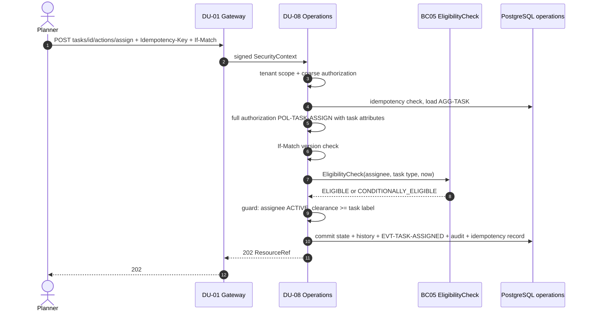

| الخطوة | التفصيل | المصدر |
|---|---|---|
| 3–6 | خطوات الخط 1–7 (ADR-P17)؛ المهمة غير المرئية → `404`، المرئية دون إذن → `403` | ADR-P17، ADR-P19 |
| 7–8 | استدعاء OHS متزامن لـBC05 (في R1 داخل DU-08 نفسها، ومن R2 في DU-14) | `03-domain/context-map.md`، `12-components.md` §2 |
| 9 | الشرط في جدول انتقالات AGG-TASK | AGG-TASK |
| 10 | معاملة واحدة (FIT-04) | ADR-P02 |

**مسارات الفشل:** غير مؤهل → `ASSIGNEE_NOT_ELIGIBLE` (422)؛ BC05 غير متاح → يُرفض الأمر مغلقًا (THR-S03-04؛ الرمز **[Missing]**، CR-78)؛ حالة غير READY → `TASK_INVALID_STATE_TRANSITION` (409)؛ مهمة معلقة → `TASK_SUSPENDED`. **الجودة:** p95 ≤ 300 مللي ث (QAS-PERF-001).

## 2. اعتماد خطة بمصادقة معززة — `CMD-PLV-APPROVE`

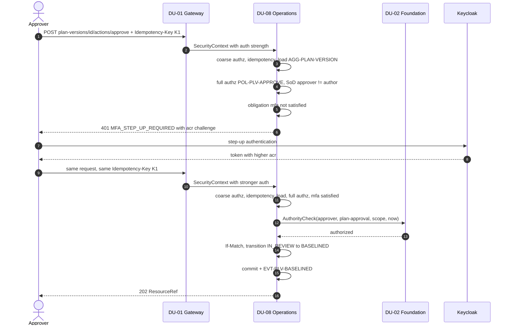

نفس `Idempotency-Key` في المحاولة الثانية آمن لأن المحاولة الأولى لم تُنفِّذ شيئًا (ADR-P19). المؤلف نفسه → `SEGREGATION_OF_DUTIES` (422) قبل طلب MFA (الخطوة 5 قبل 6). فحص السلطة شرط في جدول الانتقالات (AGG-PLAN-VERSION) يُنفَّذ في الخطوة 8 **[Derived]** من موضعه في الشرط. **الأثر اللاحق:** `EVT-PLV-BASELINED` يستهلكه مُزامِن المهام ومتتبعو النتائج وتفعيل الخطة والبحث (السيناريو 7).

## 3. بحث مؤمَّن — `QRY-SRCH-QUERY`

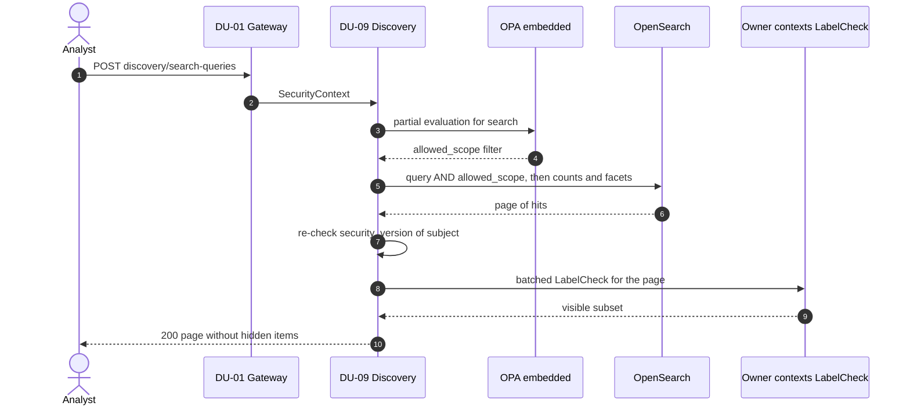

`allowed_scope` يُطبَّق داخل الاستعلام **قبل** العدّ والأوجه والترتيب، فلا يكشف عدد أو وجه وجود كائن مخفي (ADR-P06، THR-005). إعادة الفحص (CR-47) تغلق فجوة تأخر الإسقاط بعد سحب صلاحية (THR-006). **الجودة:** 0 إفصاح في حزمة الاستدلال (QAS-SEC-002، QAS-SEC-011)؛ ميزانية زمن البحث في `07-quality/` (QAS-PERF-003).

## 4. من الملاحظة إلى التنبيه — ≤ 5 ثوانٍ

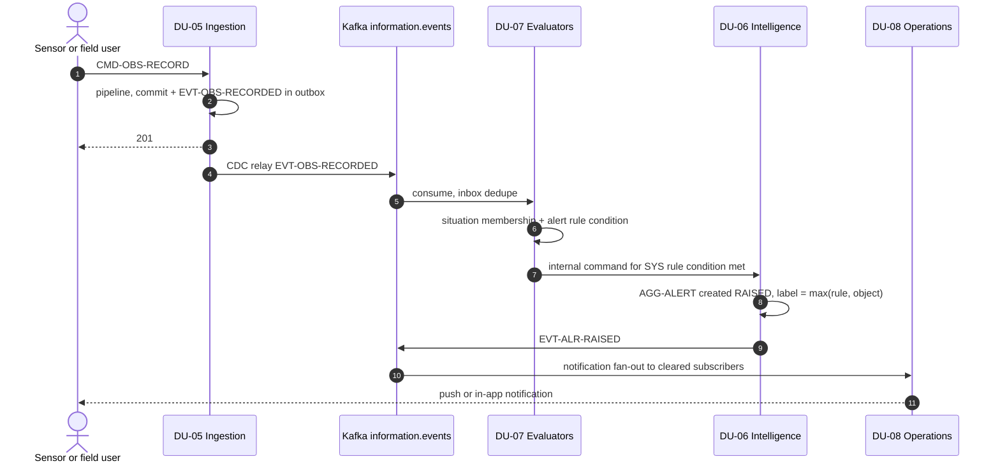

المُقيِّم في DU-07 لا يملك بيانات؛ ينشئ التنبيه بأمر داخلي على عقد DU-06 بهوية عبء عمل (`12-components.md` §2). التنبيه لا يصل إلى مستخدم غير مصرَّح بعلامته ولا يغيّر عدّاده (QAS-SEC-012). **الجودة:** p95 ≤ 5 ثوانٍ طرفًا لطرف (QAS-PERF-005)؛ أثناء الذروة 0 أحداث مفقودة والتنبيه الحرج p95 ≤ 30 ثانية (QAS-SCAL-002). **التكرار:** الحدث نفسه مرتين لا ينشئ تنبيهين (inbox، ونافذة إزالة التكرار في AGG-ALERT).

## 5. سحب الصلاحية — نافذ في الطلب التالي

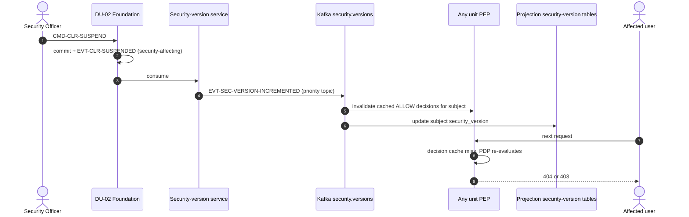

قرارات ALLOW المخزنة ≤ 60 ثانية مفتاحها يتضمن `security_version`، فرفع الإصدار يبطلها فورًا؛ ونتائج البحث تُعاد فحصها بالإصدار، فلا يعيد إسقاط متأخر كائنًا بعد السحب (`authorization-model.md` §5، ADR-P06). **الجودة:** نافذ في الطلب التالي في كل المسارات بغض النظر عن تأخر الفهارس (QAS-SEC-003)؛ تأخر قناة الإصدارات > 2 ثانية ينبّه (`observability-slc01.md`).

## 6. المزامنة الميدانية — `AGG-SYNC-SESSION`

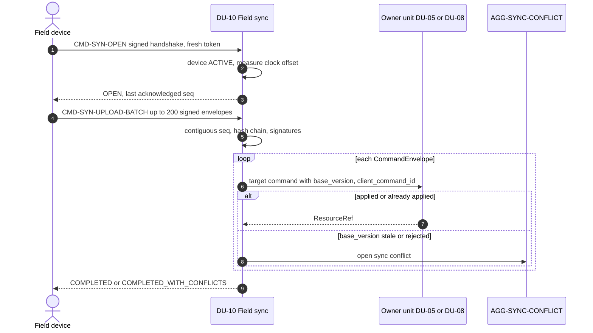

الأوامر الميدانية تُنفَّذ بالصلاحيات **الحالية** لا صلاحيات لحظة الالتقاط (QAS-OFF-002)؛ `client_command_id` يجعل إعادة الرفع آمنة؛ تعارض بيانات T1/T2 لا يُحل بـ«آخر كتابة تفوز» بل بقضية صريحة (ADR-P09، FIT-15). جهاز مفقود أو موقوف عند المصافحة → `REJECTED` مع أمر مسح أو إيقاف فقط. فجوة في التسلسل → `SEQUENCE_GAP`؛ انقطاع أو خمول 5 دقائق → `FAILED` وتستأنف الجلسة التالية من آخر تسلسل مؤكد (REQ-OFF-006). عدد الأوامر المسموحة دون اتصال (6 أو 12) **[Needs Review]** (S-09، `20-integration-design.md`).

## 7. من القرار إلى المهام

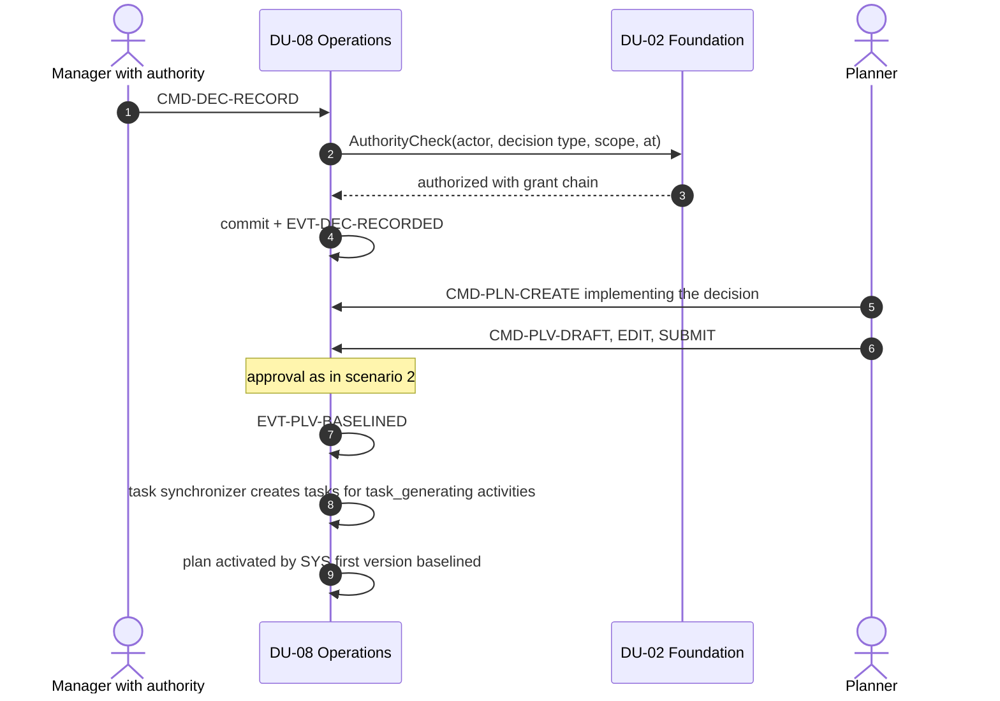

القرار لا يُسجَّل إلا إن حمل صاحبه سلطة نافذة لحظة القرار (BRL-003، REQ-FND-009)؛ الخطة تشير إلى القرار الذي تنفّذه، والمهمة إلى نشاط الخطة، فيُتتبع التنفيذ إلى قراره (`06-process-models.md` تيار VS03). مُزامِن المهام من مستهلكي `EVT-PLV-BASELINED` (SPEC-PLAN §3)؛ تحرير الموارد عند اكتمال المهمة عبر أحداث BC04 إلى BC05.

## 8. محو صاحب بيانات — `AGG-ERASURE-REQUEST`

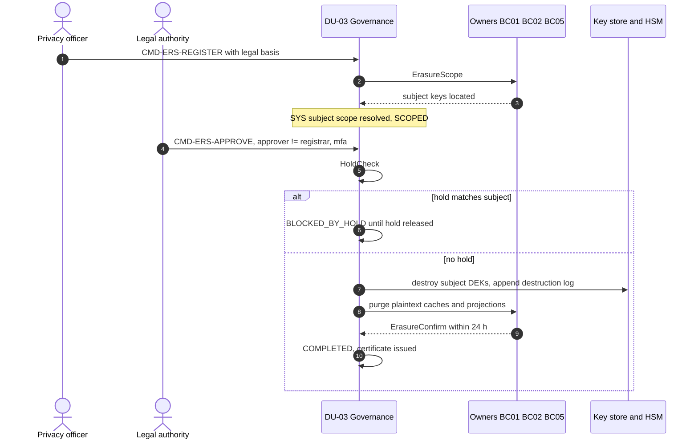

إتلاف مفتاح الموضوع يجعل البيانات الشخصية غير مقروءة في المخازن والإسقاطات والنسخ الاحتياطية والأرشيف دفعة واحدة؛ حقائق التدقيق تبقى بمرجع مستعار (INV-ERS-03). **الجودة:** المخازن والإسقاطات ≤ 24 ساعة، والنسخ غير قابلة للاسترجاع فورًا (QAS-PRV-001؛ REQ-GOV-008).

## 9. الإتلاف اليومي — `AGG-DISPOSITION-RUN`

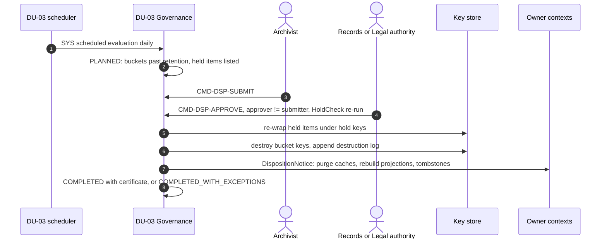

الإتلاف بالحاوية (فئة، شهر) يصل إلى كل النسخ بإتلاف مفتاح واحد (`key-hierarchy-and-disposition.md` §2). **الجودة:** المرشحون ≤ ساعة، و0 سجلات مجمَّدة مُتلَفة (QAS-GOV-001). الحاويات الفاشلة تُعاد في التشغيل التالي.

## 10. تهيئة مستأجر — ساغا BC01

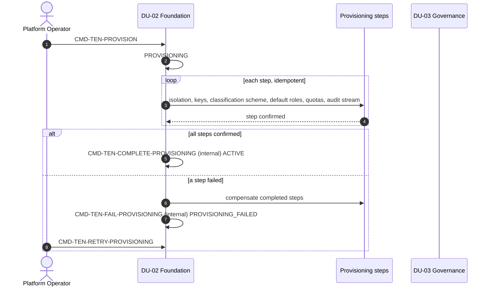

الساغا الوحيدة في النظام (`11-hexagonal-reference.md` §3)؛ كل خطوة أمر مستقل يمر بالخط نفسه، وجدول `tenant_provisioning_steps` يجعل الخطوة idempotent. لا بيانات للمستأجر قبل اكتمال حد العزل والمخطط والأدوار وتيار التدقيق (REQ-FND-003). **الجودة:** آلية بالكامل ≤ ساعة دون تغيير كود أو مخطط (QAS-SCAL-003). المستأجر المخصص أو السيادي في خلية خاصة (REQ-FND-004).

## 11. طلب ذكاء اصطناعي (R2) — `AGG-AI-REQUEST`

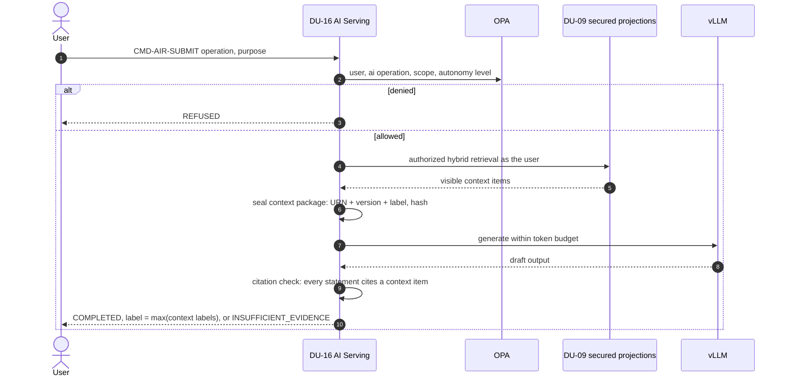

الذكاء الاصطناعي يقرأ الإسقاطات المؤمنة بصلاحيات الطالب فقط، ولا أدوات كتابة في R2: أدوات الاقتراح تنشئ نتائج AI فقط (TB-08، `13-project-structure.md` §4). العبارة غير المسندة تُحذف؛ فإن لم يبق جواب → `INSUFFICIENT_EVIDENCE`. **الجودة:** 0 استرجاع غير مصرَّح و0 تسرب بين المستأجرين في حزم الحقن (QAS-AI-004).

## 12. استعادة مخزن المفاتيح — بوابة الاستعادة

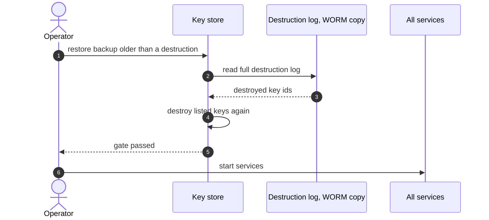

سجل الإتلاف append-only ومكرر ولا يُستعاد من نسخ أقدم؛ لا تُفتح خدمة قبل اجتياز البوابة؛ نسخ مخزن المفاتيح ≤ 35 يومًا (CR-51). **الجودة:** المفتاح المُتلَف غير قابل للاستخدام قبل أن تقرأ أي خدمة بيانات (QAS-PRV-002، FIT-19).

---

## 13. ما لا تغطيه هذه السيناريوهات

| المسار | أين |
|---|---|
| مسار الأمر والاستعلام والحدث العام | `11-hexagonal-reference.md` §3–§4 |
| كل انتقال حالة ورفضه | `08-state-models.md`، `05-user-stories/` |
| الاستيراد والمحوّلات | `20-integration-design.md` |
| التمارين والمحاكاة والإمداد (R3) | `06-process-models.md` تيارات VS04 وVS05 |
| تعافي الخلية من الكوارث | `09-reliability/dr-and-continuity.md`، `22-deployment-design.md` |
