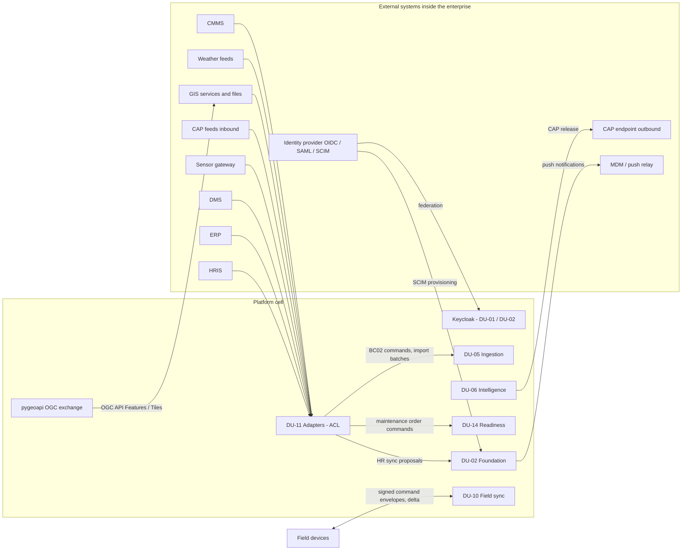
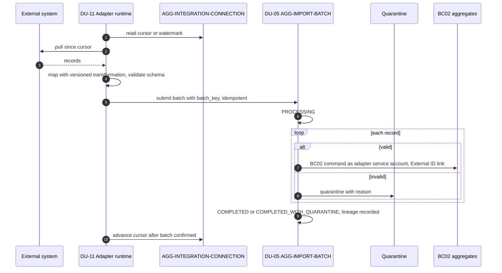

# تصميم التكامل

كيف تتبادل المنصة البيانات مع ما حولها: الأنظمة الخارجية داخل حدود المؤسسة، ومزوّد الهوية، والأجهزة الميدانية التي تعمل دون اتصال. الأنظمة الفعلية لكل مستأجر غير معروفة بعد (UNK-021، تُحدد عند تهيئة المستأجر)، فالتصميم **إطار** يستوعب أي نظام بمحوّل مسجل.

## 1. المبادئ

| المبدأ | التطبيق | المصدر |
|---|---|---|
| الأنظمة الخارجية مصادر لا مستودعات حقيقة | ما يدخل يصبح ادعاءات أو ملاحظات بمصدره وموثوقيته، لا كتابة فوق ما في المنصة؛ القيم المتعارضة تعارضات | BRL-013، `enterprise-integration-spec.md` §1 |
| طبقة مكافحة فساد (ACL) | المحوّل يترجم نموذج النظام الخارجي إلى أوامر المجال؛ لا تتسرب أنواعه إلى الداخل | `03-domain/context-map.md`، TB-06 |
| BC07 لا يملك بيانات أعمال | المحوّلات تكتب عبر أوامر BC02 كأي عميل، بهوية حساب خدمة | `context-map.md` القاعدة 3، REQ-INF-005 |
| لا ثقة تلقائية | تحقق المخطط، حجر ما يفشل، نسب (lineage) لكل دفعة | TB-06، AGG-IMPORT-BATCH |
| شبكة مقفلة افتراضيًا | لكل اتصال قاعدة سماح واحدة في بوابة الخروج/الدخول يعتمدها ضابط أمن غير الطالب؛ تعليق الاتصال يعطّلها فورًا | `enterprise-integration-spec.md` §5، `cell-architecture.md` §3 |
| لا اعتماد على الإنترنت | كل الأنظمة داخل حدود المؤسسة أو الولاية | FIT-12، `12-solution/c4-context.md` |

## 2. خريطة التكامل



| النظام | الاتجاه | النمط | ما يدخل أو يخرج | في المنصة | الإصدار | المصدر |
|---|---|---|---|---|---|---|
| مزوّد الهوية | وارد | اتحاد OIDC/SAML عبر Keycloak؛ SCIM | هويات، تزويد وتعطيل حسابات | AGG-USER، AGG-PERSON (BC01) | R1 | REQ-FND-005، TD-09 |
| HRIS | وارد | محوّل ← Person + **مقترحات** أدوار | أشخاص، وحدات، مناصب، التحاق ومغادرة | AGG-PERSON، AGG-HR-SYNC-PROPOSAL | R2 (SLC-16) | spec §2 |
| ERP | وارد | دفعات استيراد ← ادعاءات على كيانات | مواقع، مرافق، موردون، مخزون | AGG-IMPORT-BATCH، AGG-EXTERNAL-ID | R2 | spec §2 |
| DMS | وارد | مرفقات (فحص محلي) + أدلة + معرّف خارجي | وثائق وبياناتها الوصفية | AGG-ATTACHMENT، AGG-EVIDENCE، جدول `dms_classification_map` | R2 | spec §2 |
| CMMS | وارد | المحوّل يستدعي أوامر أوامر الصيانة بهوية خدمة | أوامر الصيانة وحالتها | AGG-MAINTENANCE-ORDER | R2 | spec §2 |
| بوابة الحساسات | وارد | تدفق ← دفعات ملاحظات ≤ 1,000 idempotent | قراءات | AGG-SENSOR-STREAM ← AGG-OBSERVATION | R2 | spec §2، QAS-PERF-012 |
| CAP وارد | وارد | محوّل ← ملاحظات بمصدر CAP | تنبيهات جهات أخرى | AGG-OBSERVATION (قد تطلق قواعد تنبيه) | R2 | spec §2 |
| GIS والطقس | وارد | محوّلات R1 | طبقات وقياسات | AGG-ADAPTER، AGG-IMPORT-BATCH | R1 | `system-definition.md` §5 |
| CAP صادر | صادر | رسالة CAP 1.2 بقرار إصدار من غير المُعِد | تنبيهات قابلة للإصدار | AGG-CAP-MESSAGE (BC03) | R2 — المخرج الوحيد | spec §4 |
| MDM / مرحّل الإشعارات | صادر | إشعارات دفع للأجهزة | تنبيهات وإشعارات | AGG-NOTIFICATION، AGG-DEVICE | R1 | `c4-context.md` |
| تبادل OGC | صادر/وارد | OGC API Features/Tiles عبر pygeoapi | بيانات جغرافية | DU-12 | R1 | TD-10 |
| HSM الموقع | صادر | PKCS#11 | لف المفاتيح | OpenBao (DU-03) | R1 | TD-07 |

## 3. المحوّل وطبقة مكافحة الفساد



| المكوّن | الدور | المصدر |
|---|---|---|
| AGG-ADAPTER | محوّل مسجل بمصدره وحساب خدمته وإصدار تحويله؛ يسجله مسؤول ويفعّله مسؤول ثانٍ | AGG-ADAPTER، `17-security-design.md` §12.1 |
| AGG-INTEGRATION-CONNECTION | الاتصال بالنظام الخارجي: DRAFT ← TESTING ← ACTIVE، وDEGRADED عند الانقطاع، وSUSPENDED يعطّل قاعدة الشبكة | AGG-INTEGRATION-CONNECTION |
| نقطة التقدم | cursor/watermark لكل اتصال (`integration.connection_cursors`)؛ تتقدم بعد تأكيد الدفعة فقط | spec §3، `16-database-schema.md` |
| AGG-IMPORT-BATCH | دفعة idempotent بـ`batch_key`، حجر للسجلات غير الصالحة (`quarantine_records`)، نسب (`lineage_records`: النشاط، المدخلات بإصداراتها، التحويل وإصداره) | AGG-IMPORT-BATCH، `slc-02.md` |
| AGG-EXTERNAL-ID | ربط معرّف النظام الخارجي بكائن داخلي لفترة؛ لا إعادة كتابة للمعرّف الداخلي عند الدمج | ADR-P13، FIT-07 |
| جداول المقابلة | `integration.adapter_mappings`؛ وتصنيف DMS ← تسمية المنصة (`dms_classification_map`)، وغير المطابق يأخذ **أعلى** مستوى | spec §2 |
| فحوص جودة الحساسات | تعلّم القراءة ولا تحذفها | spec §2 |

**الانقطاع والتراكم:** عند DEGRADED يتوقف السحب دون فقد؛ عند العودة يُعاد السحب من آخر نقطة مؤكدة. **الجودة:** انقطاع 4 ساعات → لا فقد، والتراكم يُعالج خلال ساعة (QAS-INT-001)؛ دفعة 1,000 ملاحظة p95 ≤ ثانية، و0 تكرار عند إعادة المحاولة (QAS-PERF-012).

## 4. الهوية والموارد البشرية

| المسار | التصميم | المصدر |
|---|---|---|
| الاتحاد | Keycloak لكل خلية وسيطًا إلى مزوّد هوية كل مستأجر (OIDC/SAML) | TD-09 |
| SCIM | ينشئ مستخدمين PENDING ويربط الهويات ويعطّل الحسابات؛ لا يسند أدوارًا أبدًا؛ التعطيل نافذ ≤ 5 دقائق | THR-S01-01، QAS-SEC-008 |
| HRIS | يحدّث Person، ويقترح تغييرات الأدوار والوحدات مقترحاتٍ (AGG-HR-SYNC-PROPOSAL) لا تُطبَّق آليًا؛ المغادرة تُصعَّد؛ SCIM يبقى مسار الحساب | spec §2 |

## 5. الإصدار الخارجي (CAP)

```text
prepare(alert A): يتطلب tenant.cap_enabled و label(A) ≤ tenant.external_release_level
  الحمولة: قالب CAP 1.2 من الحقول القابلة للإصدار فقط (الفئة، الحدث، الإلحاح، الخطورة، اليقين،
           المنطقة معمَّمة وفق السياسة، العنوان من قائمة آمنة) ثم تحقق المخطط
release: سلطة إصدار ≠ المُعِد ← إرسال عبر اتصال cap_endpoint ← تسجيل الإقرار
```

(`enterprise-integration-spec.md` §4، AGG-CAP-MESSAGE). `CMD-CAP-RELEASE` يشترط مصادقة معززة (`17-security-design.md` §12.3).

## 6. المزامنة الميدانية

البروتوكول المعتمد في `field-sync-protocol.md`، ومساره التفصيلي في `19-runtime-scenarios.md` §6.

| المرحلة | القاعدة | المصدر |
|---|---|---|
| على الجهاز | المخزن المحلي مشفر بمفتاح مربوط بالمستخدم والجهاز (SQLCipher)؛ الطابور بتسلسل متتال و`client_command_id` (ULID) و`device_time` و`base_version` وتوقيع بمفتاح الجهاز | §1، TD-16 |
| معرّفات الإنشاء | الكائنات الجديدة (ملاحظات، أدلة، مرفقات) بـULID يولده الجهاز، فالإنشاء idempotent وآمن من التصادم | §1، CR-50 |
| الحد الزمني | بعد 72 ساعة بلا اتصال (R1؛ 7 أيام في التصميم) يستمر الالتقاط وتتوقف قراءة البيانات المحملة مسبقًا | §1 |
| المصافحة | التحقق من الجهاز والرمز الحديث والتوقيع؛ قياس انحراف الساعة؛ جهاز مفقود أو موقوف ← رفض مع مسح أو إيقاف | §2 |
| الرفع والتطبيق | دفعات ≤ 200 بتسلسل متصل؛ كل غلاف يصبح أمر السياق المالك بصلاحيات المستخدم **الحالية** و`Idempotency-Key` = `client_command_id`؛ الأوامر الإلحاقية تُطبَّق (مع حراسات المالك)، والمغيرة للحالة فقط إذا طابق `base_version` | §3، ADR-P09 |
| الأزمنة | `observed_at` = زمن الجهاز + الانحراف (ويُحفظ الخام)؛ `recorded_from` = استلام الخادم؛ انحراف > 5 دقائق يعلّم جودة البيانات | §3، INV-OBS-04 |
| التنزيل | تغييرات مهام المستخدم المرئية، حالة الحزم، قائمة الإفراغ، إشعارات التعارض | §4 |
| التعارض (CF-05) | الأمر المتقادم يصبح AGG-SYNC-CONFLICT بلقطة الحالة وسبب الرفض؛ يعيد المراجع التطبيق أو يهمل أو يحسم يدويًا، وحراسات المالك سارية | §5، CR-49 |
| حزم التحميل المسبق | مفلترة بصلاحية المستخدم وقت البناء؛ تُلغى وتُفرَّغ عند خفض التصريح في الاتصال التالي | AGG-PRELOAD-PACKAGE، QAS-OFF-002 |

**الجودة:** 1,000 أمر بعد 72 ساعة على رابط 1 Mbps ≤ 10 دقائق، و0 كتابة صامتة، و0 تكرار (QAS-OFF-001)؛ 5,000 جهاز يعودون خلال 10 دقائق ← كل الجلسات ≤ 30 دقيقة والأقدم انقطاعًا أولًا (QAS-OFF-003).

## 7. الأوامر المسموحة دون اتصال (S-09) — محسوم: 12 أمرًا

| المصدر | ما يقوله |
|---|---|
| `x-offline-capable: true` في العقود | 6 أوامر: `CMD-TASK-ACCEPT`، `START`، `BLOCK`، `RESUME`، `ADD-RESULT-ITEM`، `SUBMIT` |
| `CommandEnvelope.target_command` في `openapi-field-slc11.md` | 12 أمرًا: الستة + `CMD-OBS-RECORD`، `CMD-OBS-AMEND`، `CMD-OBS-ATTACH-EVIDENCE`، `CMD-EVD-REGISTER`، `CMD-ATT-INITIATE-UPLOAD`، `CMD-ATT-COMPLETE-UPLOAD` |
| `field-sync-protocol.md` §1 | «الأوامر المسموحة فقط (x-offline-capable في SLC-02/SLC-03)» — أي أوامر SLC-02 أيضًا |
| `field-sync-protocol.md` §3 | يسرد الأوامر الإلحاقية: RECORD، INITIATE/COMPLETE-UPLOAD، EVD-REGISTER، ATTACH-EVIDENCE، ADD-RESULT-ITEM |
| REQ-OFF-001 | التقاط الملاحظات دون اتصال من نطاق R1 |

**التقييم:** البروتوكول المعتمد والغلاف وREQ-OFF-001 كلها تفترض الاثني عشر؛ علم العقد هو الناقص في أوامر SLC-02. **التوصية:** اعتماد الاثني عشر بتصحيح علم `x-offline-capable` في عقود SLC-02. **القرار (مالك المشروع، 2026-10-01):** الاثنا عشر أمرًا؛ صُحح العلم في عقود SLC-02 بـCR-79 (مطبَّق)، فالعقود و`CommandEnvelope` متطابقة الآن.

## 8. فجوات

| البند | الحالة |
|---|---|
| الأنظمة الخارجية الفعلية لكل مستأجر وواجهاتها | مفتوح (UNK-021، عند تهيئة المستأجر)؛ الإطار مكتمل |
| «External APIs» (DEP-EXT-008) | **[Missing]** — بلا عقد ولا مالك |
| إصدار صادر غير CAP (webhooks، تصدير لأنظمة أخرى) | خارج R2 — CAP هو المخرج الوحيد |
| أرقام إعادة محاولة المحوّل وحدود معدل السحب | إعادة المحاولة: ADR-P20 على ما تستهلكه المحوّلات من Kafka فقط؛ السحب من الأنظمة الخارجية بالحجر وحالة `DEGRADED` (§3)، وأرقام إعادة محاولته **[Missing]**؛ حدود معدل السحب لكل مصدر تبقى إعدادًا للمستأجر |
| عدد الأوامر دون اتصال | §7 — محسوم: 12 (CR-79) |
