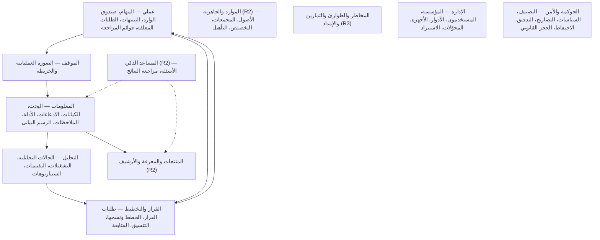
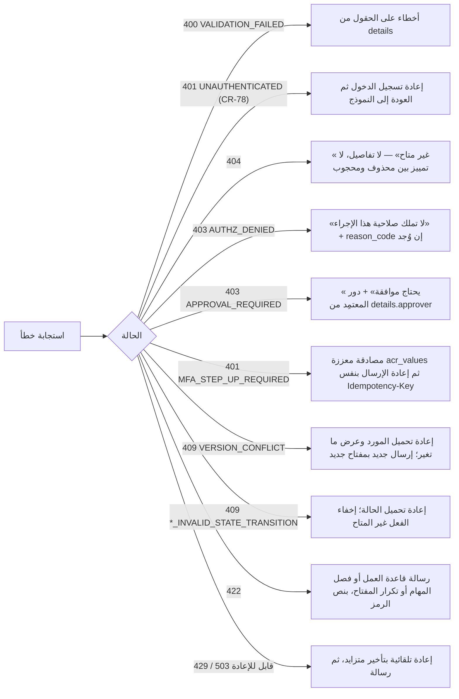
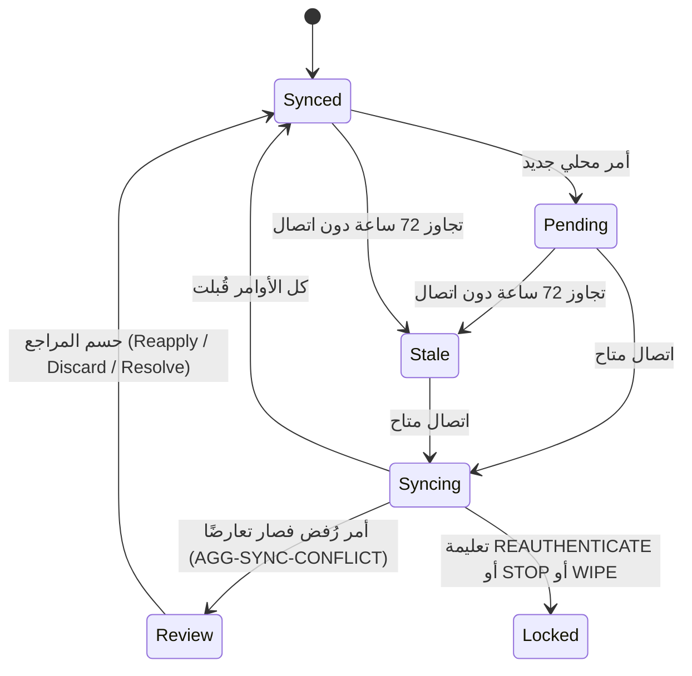

# تصميم الواجهات

ما يراه المستخدم وكيف يتنقل. المواصفات تعطي المعمارية (`12-solution/ui-architecture.md`) والتقنية (TD-16) وأهداف الجودة. ولا تعطي قائمة شاشات ولا نموذج تنقل ولا نماذج أولية (wireframes). لذلك الشاشات هنا **[Derived]**: مشتقة من حالات الاستخدام (`UC-*`) ومن نقاط الاستعلام (`QRY-*`) وسيناريوهات الجودة (`QAS-*`)، وكل شاشة تسمي الاستعلامات والأوامر التي تقوم عليها. هذا الملف قائمة وبنية وقواعد سلوك، وليس تصميمًا بصريًا.

## 1. المبادئ

| المبدأ | القاعدة | المصدر |
|---|---|---|
| لا منطق أعمال في الواجهة | كل قرار صلاحية أو حالة يأتي من الخادم. `DISPUTED` والتعميم المكاني والحجب نتائج من الخادم تعرضها الواجهة كما هي | `ui-architecture.md` (السطر 26) |
| لا أثر لما هو محجوب | العدادات والأوجه (facets) والاقتراحات تحسب المرئي فقط، ولا رسالة «N نتائج مخفية». الأعضاء المخفيون لا يدخلون عدادات الصورة العملياتية | ADR-P06؛ `situation-alerting-spec.md`؛ `products-knowledge-archive-spec.md` |
| الواجهة تشتق الشاشات من العقود | عملاء مولَّدون من OpenAPI (React + TypeScript)، فاسم الحقل ونوعه ورموز الخطأ من العقد | `ui-architecture.md`؛ TD-15 |
| العربية أولًا | العربية أساسية، والإنجليزية ثانية، والواجهة ثنائية الاتجاه | W1-answers؛ REQ-PLT-010 |
| الميدان دون اتصال | تطبيق الجوال يعمل 72 ساعة دون اتصال بالأوامر الاثني عشر | REQ-OFF-001؛ CR-79 |
| إخفاء التنقل للراحة لا للحماية | الواجهة تخفي ما لا يملك المستخدم صلاحيته، لكن الحماية في الخادم (404/403) | ADR-P19؛ **[Derived]** |

## 2. التطبيقات

| التطبيق | التقنية | الأجهزة | الوظيفة | المصدر |
|---|---|---|---|---|
| تطبيق الويب | React + TypeScript، MapLibre GL JS، رسائل ICU، خصائص CSS المنطقية | سطح المكتب واللوحي والهاتف، من عرض 360 px | كل الوظائف عدا الالتقاط دون اتصال | TD-16؛ REQ-PLT-011 |
| التطبيق الميداني | React Native، SQLite مشفرة بـSQLCipher، مفتاح في keystore العتادي، MapLibre Native مع PMTiles محلية | هواتف وألواح Android وiOS | المهام، والالتقاط دون اتصال، والحزم المحملة مسبقًا، والمزامنة | TD-16؛ `commands-slc11.md` (`platform: android, ios`) |
| واجهة الإدارة | جزء من تطبيق الويب بمسار خاص يظهر لأدوار الإدارة والحوكمة في المستأجر | سطح المكتب | المؤسسة والمستخدمون والأدوار والسياسات والمحوّلات | لا تطبيق إدارة مستقل في المصادر **[Derived]** |
| واجهة المشغل | تطبيق منفصل في مستوى المشغل، لا في تطبيق المستأجر، لأن المشغل لا يقرأ بيانات المستأجر (TB-09) | سطح المكتب | المستأجرون والحصص وحالة الإسقاطات والرسائل الميتة (بيانات وصفية فقط) | **[Derived]** من TB-09 و`17-security-design.md` (مستوى تشغيل منفصل) |
| سطح المكتب الأصلي | — | — | مؤجل إلا عند حاجة لمعالجة جغرافية محلية ثقيلة | W1-answers |

كل التطبيقات تمر بـDU-01 (البوابة وBFF). الميداني يزامن عبر DU-10، والبلاطات من DU-12. التطبيقات لا تعتمد على أي خدمة إنترنت عامة (FIT-12): الإشعارات الفورية عبر قناة داخلية أو مرحِّل MDM، مع سحب دوري احتياطي (`situation-alerting-spec.md`). تقنية الإشعار الفوري نفسها **[Missing]** (§13).

## 3. بنية المعلومات والتنقل

المناطق العليا مرتبة على تيارات القيمة (VS01–VS07) وخريطة القدرات (CAP-01..14). كل منطقة تظهر في القائمة إذا كان للمستخدم عملية مسموحة واحدة على الأقل فيها. الواجهة تأخذ ذلك من صلاحيات المستخدم الفعلية في `QRY-SEC-CONTEXT` (`/foundation/me/security-context`)، لا من جدول ثابت، لأن الأدوار يعرّفها المستأجر (`CMD-ROL-DEFINE`، `CMD-ROL-SET-PERMISSIONS`). التوزيع الافتراضي حسب الدور في §5 **[Derived]**.

- **الصفحة الأولى هي «عملي»** لكل دور: ما ينتظر المستخدم، لا لوحة إحصاءات. الأسهم تتبع المسار الطبيعي في تيارات القيمة: معلومة ← فهم ← قرار ← تنفيذ.
- **البحث الموحد** حقل ثابت في الترويسة على كل شاشة (UC-097).
- **التنقل بالروابط:** كل مرجع URN في شاشة رابط إلى صفحة المورد. إن لم يكن المورد مرئيًا يرد الخادم 404 بنفس شكل غير الموجود، والواجهة تعرض «غير متاح» دون أي تفصيل (ADR-P19).
- **الحالة في العنوان:** عنوان URL يحمل المرشحات والموقع الزمني (as-of) ومركز الخريطة، فتُشارَك الروابط. الرابط لا يحمل بيانات، والمتلقي يرى ما تسمح به صلاحيته فقط **[Derived]**.

## 4. قائمة الشاشات

`W` تطبيق الويب، `F` التطبيق الميداني. الأدوار بمجموعاتها في `02-actors-roles.md`. الأوامر بالرمز المختصر، والقائمة الكاملة لكل شاشة في قصص المستخدم (`05-user-stories/`).

### 4.1 عملي (مشتركة)

| الرمز | الشاشة | الاستعلامات والأوامر | الأدوار | الإصدار | التطبيق |
|---|---|---|---|---|---|
| SCR-01 | مهامي | `QRY-TASK-LIST` (أنا)؛ ACCEPT، START، BLOCK، RESUME، SUBMIT | كل مُسند إليه | R1 | W، F |
| SCR-02 | تفاصيل المهمة وسجلها | `QRY-TASK-GET`، `QRY-TASK-HISTORY`؛ ADD-RESULT-ITEM، APPROVE، REASSIGN | المُسند إليه، المخطط، المدير | R1 | W، F |
| SCR-03 | صندوق الوارد | `QRY-NTF-INBOX` | الجميع (UC-099) | R1 | W، F |
| SCR-04 | تنبيهاتي | `QRY-ALR-LIST`؛ CMD-ALR-ACKNOWLEDGE، RESOLVE، DISMISS (بسبب إلزامي، REQ-SIT-005) | المستلمون | R1 | W، F |
| SCR-05 | طلبات قرار تنتظرني | `QRY-DRQ-LIST`، `QRY-DRQ-GET`؛ CMD-DEC-RECORD | صاحب السلطة | R1 | W |
| SCR-06 | قوائم المراجعة | `QRY-ER-QUEUE`، `QRY-CNF-LIST`، `QRY-SCF-LIST`، `QRY-SCF-GET`، `QRY-CRP-QUEUE` و`QRY-CRP-GET` (R2)، `QRY-HRS-QUEUE` (R2)، `QRY-AIRS-QUEUE` (R2) | المحلل، المخطط، الإدارة، المراجع | R1/R2 | W |

### 4.2 الموقف والخريطة

| الرمز | الشاشة | الاستعلامات والأوامر | الأدوار | الإصدار | التطبيق |
|---|---|---|---|---|---|
| SCR-10 | قائمة المواقف | `QRY-SIT-LIST` | الجميع حسب الرؤية | R1 | W |
| SCR-11 | الصورة العملياتية المشتركة (COP) | `QRY-SIT-COP`، `QRY-SIT-TILE`، `QRY-BASE-TILE`، `QRY-SIT-CHANGES` | الجميع (UC-098) | R1 | W، F (للقراءة) |
| SCR-12 | إدارة الموقف وقواعد التنبيه | `QRY-SIT-GET`؛ أوامر SIT وARL | المدير، المحلل | R1 | W |
| SCR-13 | لوحة الجمع | `QRY-CRQ-BOARD`، `QRY-CRQ-GET`، `QRY-CRQ-EVIDENCE`، `QRY-CPL-GET` | المدير، المخطط، المحلل | R2 | W |
| SCR-14 | رسائل الإنذار العام (CAP) | `QRY-CAP-LIST`؛ CMD-CAP-PREPARE، RELEASE، CANCEL، RETRY | المشغل، صاحب سلطة الإصدار، المدقق (قراءة) | R2 | W |

### 4.3 المعلومات

| الرمز | الشاشة | الاستعلامات والأوامر | الأدوار | الإصدار | التطبيق |
|---|---|---|---|---|---|
| SCR-20 | البحث الموحد | `QRY-SRCH-QUERY`، `QRY-SRCH-SUGGEST` | الجميع (UC-097) | R1 | W، F (متصل) |
| SCR-21 | الكيانات والأحداث: العرض المحلول | `QRY-ENT-LIST`، `QRY-ENT-RESOLVED`، `QRY-ENT-CLAIMS`، `QRY-ENT-POSITIONS`، `QRY-CLUSTER-GET`، `QRY-REL-LIST`، `QRY-RWE-GET` | المحلل وكل من يرى الكيان | R1 | W |
| SCR-22 | الادعاء والدليل والمصدر | `QRY-CLM-GET`، `QRY-EVD-GET`، `QRY-SRC-GET`، `QRY-ATT-DOWNLOAD` | المحلل | R1 | W |
| SCR-23 | الملاحظات | `QRY-OBS-LIST`، `QRY-OBS-GET`؛ CMD-OBS-RECORD، VALIDATE | المحلل، المستخدم الميداني | R1 | W، F |
| SCR-24 | الرسم البياني | `QRY-GRAPH-NEIGHBORHOOD` (عمق ≤ 3)، `QRY-GRAPH-PATHS` (≤ 4 قفزات) | المحلل | R1 | W |
| SCR-25 | النسب (lineage) | `QRY-LIN-TRACE` (عمق ≤ 10) | المحلل، المدقق | R1 | W |
| SCR-26 | التعارض ومطابقة الكيانات | `QRY-CNF-GET`، `QRY-ER-GET` (مقارنة جنبًا إلى جنب)، `QRY-MRS-GET` (قواعد المطابقة) | المحلل، المسؤول (القواعد) | R1 | W |

### 4.4 التحليل والقرار والتخطيط

| الرمز | الشاشة | الاستعلامات والأوامر | الأدوار | الإصدار | التطبيق |
|---|---|---|---|---|---|
| SCR-30 | الحالة التحليلية والتشغيلات | `QRY-ACS-LIST`، `QRY-ACS-GET`، `QRY-FND-LIST`، `QRY-RUN-GET`، `QRY-RUN-ARTIFACT`، `QRY-AMT-LIST` (طرق التحليل) | المحلل | R1 | W |
| SCR-31 | التقييم ونسخه | `QRY-ASM-GET`، `QRY-ASM-VERSIONS` | المحلل، المدير | R1 | W |
| SCR-32 | سيناريوهات الحالة التحليلية ومقارنتها | `QRY-ACS-GET` (السيناريوهات)، `QRY-SCN-COMPARE`، `QRY-FND-LIST` | المحلل | R1 | W |
| SCR-33 | القرار وأساسه | `QRY-DEC-GET`، `QRY-DEC-BASIS` (ما كان معروفًا وقت القرار)؛ CMD-DEC-RECORD، CMD-DEC-ANNUL | المدير، صاحب السلطة، المدقق | R1 | W |
| SCR-34 | الخطة ونسخها | `QRY-PLN-GET`، `QRY-PLV-LIST`، `QRY-PLV-DIFF` (الفرق عن الخط الأساس) | المخطط، المدير | R1 | W |
| SCR-35 | متابعة التنفيذ | `QRY-PLN-PROGRESS`، `QRY-OUT-SERIES` | المخطط، المدير، التنفيذي (مجمّع) | R1 | W |
| SCR-36 | حالات التنسيق | `QRY-CRD-LIST`، `QRY-CRD-GET` | المدير | R2 | W |

### 4.5 R2 و R3

| الرمز | الشاشة | الاستعلامات | الأدوار | الإصدار |
|---|---|---|---|---|
| SCR-40 | الأصول وتوفرها والصيانة | `QRY-AST-GET`، `QRY-AST-AVAILABILITY`، `QRY-MNT-SCHEDULE` | مدير الموارد | R2 |
| SCR-41 | المجمعات والتخصيص والجدول الزمني للسعة | `QRY-POL-TIMELINE`، `QRY-ALC-LIST`؛ تفاصيل المجمع **[Missing]** (لا استعلام قراءة لمجمع واحد) | مدير الموارد، المخطط | R2 |
| SCR-42 | التأهيل والأهلية | `QRY-QUAL-LIST`، `QRY-ELIG-CHECK` | مدير الموارد، مدير التدريب | R1 (ضمن المهام)، R2 |
| SCR-43 | المنتجات والتوزيع | `QRY-PRD-LIST`، `QRY-PRD-GET`، `QRY-DST-LOG` | المحلل، المدير، مدير المعرفة | R2 |
| SCR-44 | المعرفة والأرشيف | `QRY-KNO-SEARCH`، `QRY-KNO-SUGGEST`، `QRY-ARC-SEARCH`، `QRY-ARC-RETRIEVE` | مدير المعرفة، أمين الأرشيف | R2 |
| SCR-45 | المساعد الذكي | `QRY-AIR-GET` (الإجابة والعبارات والاستشهادات المرئية) | المستخدمون المخولون | R2 |
| SCR-46 | مراجعة نتيجة ذكية | `QRY-AIRS-QUEUE`، أوامر AI-RESULT (قبول كلي أو جزئي، رفض بسبب) | المراجع (UC-073، UC-074) | R2 |
| SCR-47 | سجل المخاطر والحوادث | `QRY-RIS-REGISTER`، `QRY-RIS-GET`، `QRY-INC-LIST`، `QRY-INC-GET`، `QRY-INC-RECOVERY-STATUS` | مدير المخاطر، المدير | R3 |
| SCR-48 | التمارين والسيناريوهات والمحاكاة والجاهزية | `QRY-EXR-LIST`، `QRY-EXR-GET`، `QRY-SCN-LIST`، `QRY-SCN-GET`، `QRY-SIM-LIST`، `QRY-SIM-GET`، `QRY-SIM-TIMELINE`، `QRY-READINESS` | مدير التدريب | R3 |
| SCR-49 | الإمداد والشحنات | `QRY-LGR-LIST`، `QRY-LGR-GET`، `QRY-SHP-LIST`، `QRY-SHP-GET`، `QRY-SHP-TRACKING` | مستخدم الإمداد، المخطط (الطلب) | R3 |
| SCR-50 | إعادة البناء التاريخي | `QRY-REC-REPORT`؛ CMD-REC-REQUEST، CMD-REC-CANCEL | الطالب، المدقق | R2 |
| SCR-51 | النماذج والتوجيه والأدوات والاستهلاك | `QRY-MDL-LIST`، `QRY-RTG-ACTIVE`، `QRY-TOL-LIST`، `QRY-AI-USAGE` | حوكمة الذكاء الاصطناعي (PLT-AI)، مسؤول الأمن، المدقق، المسؤول (الاستهلاك) | R2 |

### 4.6 الإدارة والحوكمة

| الرمز | الشاشة | الاستعلامات | الأدوار | الإصدار |
|---|---|---|---|---|
| SCR-60 | المستأجر والحصص (واجهة المشغل) | `QRY-TEN-GET` | مشغل المنصة (UC-080، UC-105) | R1 |
| SCR-61 | شجرة المؤسسة | `QRY-ORG-TREE` | المسؤول (UC-081) | R1 |
| SCR-62 | المستخدمون والأدوار والسلطة | `QRY-USR-LIST`، `QRY-USR-GET`، `QRY-AUT-LIST` | المسؤول، مسؤول الأمن (UC-082، UC-084) | R1 |
| SCR-63 | الأجهزة | `QRY-DEV-LIST`؛ CMD-DEV-REPORT-LOST، SUSPEND (المسح تعليمة WIPE في المزامنة — UC-093) | المسؤول | R1 |
| SCR-64 | الاستيراد والحجر | `QRY-IMP-GET` | المسؤول | R1 |
| SCR-65 | المحوّلات والاتصالات والحساسات | `QRY-ADP-GET`، `QRY-CON-LIST`، `QRY-SNS-LIST` | المسؤول، مهندس التكامل | R1/R2 |
| SCR-66 | أنواع المهام | `QRY-TTY-GET` | المسؤول، المخطط | R1 |
| SCR-67 | التصنيف والتصاريح والاستثناءات | `QRY-CLS-ACTIVE`، `QRY-CLR-GET`، `QRY-EXC-LIST` | مسؤول الأمن (UC-085، UC-089) | R1 |
| SCR-68 | سياسات الوصول | `QRY-POL-GET` (نسخة مجموعة السياسات بجداولها واختباراتها) | مسؤول الأمن (UC-086)، المدقق | R1 |
| SCR-69 | التدقيق | `QRY-AUD-SEARCH`، `QRY-AUD-VERIFY`، `QRY-AIR-CONTEXT` | المدقق، مسؤول الأمن (UC-087) | R1 |
| SCR-70 | الاحتفاظ والحجز القانوني والإتلاف والمحو | `QRY-RTS-ACTIVE`، `QRY-LHD-LIST`، `QRY-LHD-CHECK`، `QRY-DSP-GET`، `QRY-ERS-GET` | أمين الأرشيف، القانوني (AUTH-LEGAL)، المدقق | R1 |
| SCR-71 | حالة الإسقاطات (واجهة المشغل) | `QRY-PRJ-STATUS`؛ CMD-PRJ-CREATE-VERSION، PROMOTE | مشغل المنصة | R1 |

## 5. الشاشات حسب الدور

التوزيع الافتراضي، مشتق من سياسات كل دور في `02-actors-roles.md` §6.4 **[Derived]**؛ ما يظهر فعلًا لكل مستخدم يأتي من `QRY-SEC-CONTEXT` (§3). ● عمليات كتابة، ○ قراءة فقط. لا يظهر في الجدول ما يملكه كل مستخدم (ANY-USER): سؤال المساعد (`CMD-AIR-SUBMIT`)، ومسودة المعرفة (`CMD-KNO-DRAFT`، `SUBMIT`)، وطلب استثناء أمني (`CMD-EXC-REQUEST`)، والبحث والصورة العملياتية.

| الدور | عملي | الموقف | المعلومات | التحليل | القرار/التخطيط | الموارد | المنتجات/المعرفة | المساعد | R3 | الإدارة | الحوكمة |
|---|---|---|---|---|---|---|---|---|---|---|---|
| ACT-01 التنفيذي | ● | | | | | | | | | ● (اعتماد منح السلطة، SCR-62) | |
| ACT-02 المدير | ● | ● | ○ | ○ | ● | ○ | ● | | ○ | | |
| ACT-03 المخطط | ● | ● (خطط الجمع) | ○ | ○ | ● | ● | ● | | ● (طلب إمداد) | ● (أنواع المهام) | |
| ACT-04 المحلل | ● | ● | ● | ● | ● (إعداد طلبات القرار) | | ● | ● (مراجعة النتائج) | | | |
| ACT-05 المشغل | ● | ● (رسائل CAP) | | | | | | | | | |
| ACT-06 المستخدم الميداني | ● | ○ | ● (الملاحظات والأدلة) | | | | | | | | |
| ACT-07 مدير الموارد | ● | | | | ○ | ● | | | | | |
| ACT-08 مستخدم الإمداد | ● | | | | | | | | ● | | |
| ACT-09 مدير المخاطر | ● | ○ | | | | | | | ● | | |
| ACT-10 مدير التدريب | ● | | | | | ● | | | ● | | |
| ACT-11 مدير المعرفة | ● | | | | | | ● | | | | |
| ACT-12 أمين الأرشيف | ● | | | | | | ● | | | | ● |
| ACT-13 مسؤول الأمن | ● | ● (إعادة التصنيف) | ● (إعادة التصنيف، حماية المصدر) | ● (إعادة التصنيف) | ● (إعادة التصنيف) | ● (إعادة التصنيف) | ○ (سجل التوزيع) | ● (تفعيل الأدوات، التوجيه) | | ● (قفل المستخدم، الأجهزة، الاتصالات، سحب الحزم) | ● |
| ACT-14 المدقق | ○ | ○ (رسائل CAP) | ○ | | ○ | | ● (طلب إعادة البناء) | ○ (الطلبات وسياقها، النماذج) | | | ○ |
| ACT-15 المسؤول | ● | | | ● (تفعيل طرق التحليل) | | ● (متطلبات الأدوار) | | ○ (الاستهلاك) | | ● | |
| PLT-OPS مشغل المنصة | | | | | | | | | | ● في واجهة المشغل (المستأجر، الحصص، الإسقاطات) | |
| PLT-AI حوكمة الذكاء الاصطناعي | | | | | | | | ● (النماذج، التقييم، التوجيه) | | | |
| PLT-INT مهندس التكامل | | | | | | | | | | ● (المحوّلات والاتصالات) | |
| AUTH-LEGAL القانوني | | | | | | | | | | | ● (الحجز القانوني، المحو) |
| AUTH-GRANT صاحب السلطة أو المعتمِد الثاني | ● | | | | ● (القرار) | ● (اعتماد التخصيص) | | | | | ● (اعتماد الإتلاف) |

التنفيذي يرى إحصاءات T1 مجمّعة فقط، ولا تُعرض مجموعة أصغر من 5 (POL-AGG-STATS: `AGGREGATE(min_group=5)`، `authorization-model.md`). هذا يخص الإحصاءات وحدها، لا كل شاشاته.

## 6. أنماط الشاشات المشتركة

### 6.1 القائمة والتفاصيل والنموذج

| النمط | القاعدة |
|---|---|
| القائمة | ترقيم بالمؤشر (cursor)؛ المرشحات في عنوان URL؛ لا عدد إجمالي إلا ما يحسبه الخادم من المرئي؛ لا «N مخفية» |
| التفاصيل | الحالة شارة، والتصنيف شارة، والإصدار مخزن للنموذج التالي؛ الأفعال المتاحة تعرض حسب الدور (§6.3) |
| النموذج | مولَّد من مخطط العقد؛ حقل `label` إلزامي في إنشاء كائنات T1/T2 (REQ-GOV-002)؛ الأسباب الإلزامية (رفض، إغلاق، تجاهل) حقل نصي إلزامي |
| إرسال الأمر | الواجهة تولّد `Idempotency-Key` (ULID) لكل حمولة: تعيد استعماله فقط لإعادة إرسال الحمولة نفسها (انقطاع، مصادقة معززة)، وتولّد مفتاحًا جديدًا إذا عدّل المستخدم شيئًا، وإلا رد الخادم `IDEMPOTENCY_KEY_REUSED`؛ `If-Match` من الإصدار المعروض |
| الزمن | كل قيمة زمنية تعرض بتوقيت المستخدم المحلي ومعها التوقيت العالمي عند التمرير؛ الهجري اختياري (§9) |
| المسودات | في الويب: مسودات T4 فقط في التخزين المحلي، لا بيانات حساسة (`ui-architecture.md`) |

### 6.2 الاستجابة للأخطاء

الواجهة تتصرف بحسب حالة HTTP والرمز (`18-error-handling.md`)، لا بحسب نص الرسالة:

المصادقة المعززة لا تفقد ما أدخله المستخدم: النموذج يبقى مفتوحًا، والأمر يعاد بالمفتاح نفسه فلا يُنفَّذ مرتين (ADR-P19).

### 6.3 أي الأفعال تظهر

الخادم وحده يقرر (§1). العقود لا تعيد اليوم قائمة «الأفعال المسموحة» مع المورد، فالواجهة تعرض الفعل إذا كانت صلاحيات المستخدم في `QRY-SEC-CONTEXT` تشمله، وكانت حالة المورد المعروضة تسمح به. هذا تلميح فقط: الرد 403 أو 409 يبقى الحكم، وقد يظهر زر يرفضه الخادم بسبب نطاق أو تصنيف أو فصل مهام.

المقترح **[Needs Review]**: حقل اختياري `allowed_actions` في استجابات `*-GET` للتفاصيل فقط، بهذه الشروط:
- يُحسب بعد التخويل الكامل على المورد المحمَّل (ADR-P17 الخطوة 5).
- يعلّم الأفعال التي تحتاج التزامًا قبل التنفيذ (مصادقة معززة، موافقة) بدل إخفائها.
- لا يُخزَّن في ذاكرة مشتركة بين المستخدمين، وهو استشاري لا يغني عن التخويل عند التنفيذ.
- كلفته: N قرارات لكل طلب. يُقيَّم دفعة واحدة بالتقييم الجزئي في المقيّم المضمَّن، ضمن ميزانية QAS-PERF-009 (10,000 قرار/ث، p95 ≤ 5 ms)، ولا يُحسب في القوائم.

## 7. الخريطة

| البند | التصميم | المصدر |
|---|---|---|
| المكتبة | MapLibre GL JS في الويب، MapLibre Native في الميداني | TD-10، TD-16 |
| البلاطات | متجهية من DU-12 (Martin من PostGIS) للطبقات التشغيلية، ونقطية COG عبر TiTiler، والخرائط الأساس PMTiles بمسار منفصل | TD-10؛ `situation-alerting-spec.md` |
| الطبقات | الكيانات، الأحداث، الملاحظات، المهام، التنبيهات، التقييمات (R1: الأربع الأولى + التنبيهات) | `situation-alerting-spec.md` |
| الكثافة | ≤ 5,000 عنصر لكل بلاطة مع تجميع عند التصغير | المصدر نفسه |
| التعميم المكاني | العضو المعمم يرسم في مركز خلية حتمي (1 كم لدور المشغل)، وتظهر له علامة «معمم» لأن الخادم يعيد `GENERALIZED` | invariants-slc06؛ invariants-slc02 |
| الدقة | `accuracy_m` يرسم دائرة حول النقطة؛ أعلام الجودة (`LOW_ACCURACY`، `DEVICE_GPS_SUSPECT`) تظهر في بطاقة العنصر | `spatial-model.md` |
| الزمن | منزلق زمني as-of للصورة العملياتية والتاريخ؛ التغييرات من `QRY-SIT-CHANGES` بتحديث ≤ 10 ث (QAS-PERF-006) | ADR-P01؛ QAS-PERF-006 |
| عرض الإحداثيات | **[Missing]** — مقترح: درجات عشرية WGS 84 (خط العرض، خط الطول) افتراضيًا، وMGRS خيار للمستأجر | ADR-P16 للتخزين فقط |
| الرموز (symbology) | **[Missing]** — لا معيار رموز في المصادر (APP-6 أو غيره)؛ يُحسم مع المستأجر الأول | — |

## 8. التطبيق الميداني

### 8.1 الشاشات

| الشاشة | الوظيفة |
|---|---|
| القفل | فتح بـPIN أو بصمة؛ بعد تعليمة `WIPE` من الخادم تمسح البيانات المحلية |
| مهامي | SCR-01 و SCR-02 من النسخة المحلية؛ الأوامر الستة للمهام دون اتصال |
| التقاط ملاحظة | موقع ووقت وصورة بيد واحدة، الوسيط ≤ 60 ث في اختبار مع 10 مستخدمين ميدانيين (QAS-USA-001)؛ CMD-OBS-RECORD، AMEND، ATTACH-EVIDENCE، EVD-REGISTER، ATT-INITIATE/COMPLETE-UPLOAD |
| الخريطة | الحزم المحملة مسبقًا (PMTiles + الطبقات) |
| الحزم | طلب حزمة لمنطقة (مضلع ≤ الحد الأعلى للمستأجر، تصنيف ≤ الحد دون اتصال، افتراضيًا INTERNAL)، وتنتهي بعد ≤ 72 ساعة في R1 | 
| المزامنة | الحالة (§8.2)، الأوامر المعلقة، التعارضات وإشعاراتها |

### 8.2 حالة المزامنة

المصادر لا تعرّف مؤشر حالة المزامنة في الواجهة. ADR-P09 يقول إن المستخدم قد يرى «pending review» ويطلب تجربة تعارض في SLC-11. المؤشر المقترح **[Derived]**:

| الحالة | ما يراه المستخدم |
|---|---|
| Synced | آخر مزامنة ووقتها |
| Pending | عدد الأوامر المعلقة؛ كل عنصر معلق يحمل علامة «لم يُرسل» |
| Review | العنصر المرفوض يحمل «قيد المراجعة» مع سبب الرفض المسموح عرضه؛ عند Discard يُشعر المستخدم بالسبب (AGG-SYNC-CONFLICT) |
| Stale | الالتقاط مستمر، وقراءة البيانات المحملة تتوقف (`field-sync-protocol.md`) |
| Locked | شاشة إعادة المصادقة أو المسح بحسب التعليمة |

## 9. اللغة واتجاه النص

| البند | القاعدة | المصدر |
|---|---|---|
| اللغات | العربية والإنجليزية، تبديل لكل مستخدم، والبنية تقبل لغات أخرى | REQ-PLT-010؛ W1-answers |
| الاتجاه | RTL وLTR بخصائص CSS المنطقية (`margin-inline-start`…)، وRTL أصلي في الجوال؛ الأيقونات الاتجاهية تنعكس، والخرائط والرسوم والأرقام لا تنعكس **[Derived]** | TD-16 |
| النص المختلط | كل قيمة من المستخدم أو من مصدر تعرض في عزل اتجاهي (`dir="auto"` / `<bdi>`) حتى لا يقلب الاسم اللاتيني جملة عربية **[Derived]** | — |
| الرسائل | رسائل ICU (جمع وجنس)؛ مفتاح رسالة الخطأ = رمز الخطأ (`18-error-handling.md` §1) | `ui-architecture.md` |
| التقويم | التخزين ميلادي UTC؛ عرض هجري اختياري عبر Intl (`islamic-umalqura` أو حسابي حسب إعداد المستأجر) | `ui-architecture.md`؛ `language-model.md` |
| الأسماء | النص الأصلي يعرض كما هو ولا يُعدَّل؛ `LocalizedName` يحمل الاسمين؛ الترجمة الآلية عند الطلب لا تستبدل الأصل (REQ-AI-007) | `language-model.md` |
| المصطلحات | المسرد (90 مصطلحًا، عربي/إنجليزي) ملزم للنصوص | `glossary.md` |
| الأرقام | **[Missing]** — مقترح: أرقام لاتينية في المعرّفات والإحداثيات والقيم التقنية، وتفضيل للمستخدم (عربية-هندية أو لاتينية) في النص | — |
| الخط | **[Missing]** — خط يدعم العربية واللاتينية بأوزان متطابقة، مضمّن في التطبيق (لا تحميل من الإنترنت، FIT-12) | — |

## 10. سهولة الوصول

- WCAG 2.2 المستوى AA بالعربية والإنجليزية لشاشات الويب في R1، باختبار آلي ويدوي. الجوال يتبع معايير منصته (QAS-ACC-001؛ `ui-architecture.md`).
- من AA وما يلزم الميدان **[Derived]**: لوحة مفاتيح كاملة وتركيز مرئي، وتباين ≥ 4.5:1، وأهداف لمس ≥ 24 px (WCAG 2.2 2.5.8)، و≥ 44 px في التطبيق الميداني للاستعمال بيد واحدة (اقتراح لبيئة QAS-USA-001: الميدان، يد واحدة). الحالة والخطورة لا تعتمد على اللون وحده. والخريطة لها بديل جدولي (القائمة في SCR-11).

## 11. الأمن في الواجهة

| البند | القاعدة | المصدر |
|---|---|---|
| المحجوب | لا عدادات ولا رسائل تكشفه؛ الإشارة إلى الحذف فقط حيث تسمح السياسة | ADR-P06؛ REQ-ANL-008 |
| الحجب الجزئي | حقل محجوب (`REDACT`) يعرض بعلامة «محجوب» ثابتة لا تكشف طوله ولا نوعه **[Derived]**؛ مثال: تقييم المصدر (B) بلا هوية المصدر | ADR-P19؛ `claim-evidence-model.md` |
| التصنيف | شارة التصنيف (بالاسم العربي/الإنجليزي من المخطط النشط `QRY-CLS-ACTIVE`) على كل كائن وفي كل نموذج إنشاء. شريط تصنيف للصفحة **[Missing]** — مقترح: أعلى تصنيف بين الكائنات المعروضة، ويحسبه الخادم | REQ-GOV-002؛ `classification-scheme.md` |
| الجلسة | ≤ 15 دقيقة؛ لا محتوى في تخزين المتصفح المحلي | `ui-architecture.md` |
| الجوال | SQLCipher ومفتاح عتادي؛ مسح عن بعد (REQ-OFF-005)؛ الإشعار على شاشة القفل مرجع وقالب آمن فقط | `ui-architecture.md`؛ threat-model-slc06 |
| العلامة المائية | مرئية (المستلم، الإصدار، الوقت) وغير مرئية على المنتجات؛ لا تمنع التصوير لكنها تتبعه | REQ-PRD-005؛ threat-model-slc12 |
| التصدير | صلاحية مستقلة (REQ-FND-014)؛ التصدير الجماعي غير متاح حتى يُحدَّد Aggregate الموافقة الخاص به | ADR-P19 |
| النسخ ولقطات الشاشة | **[Missing]** — لا سياسة في المصادر | — |

## 12. الذكاء الاصطناعي والثقة في الواجهة

| البند | القاعدة | المصدر |
|---|---|---|
| وسم المخرج | كل مسودة من الذكاء الاصطناعي موسومة «مسودة ذكاء اصطناعي»، ولا تُنشر دون مراجعة بشرية | REQ-AI-005 |
| الاستشهادات | كل عبارة باستشهادها؛ «أدلة غير كافية» حالة معروضة لا خطأ؛ المتنازع عليه يعرض متنازعًا عليه | REQ-AI-003/004؛ `grounded-ai-spec.md` |
| المراجعة | قبول كلي أو جزئي بعناصر محددة، أو رفض بسبب؛ لا تغيير في حالة الأعمال دون إنسان يقبل (INV-AIRS-01) | AGG-AI-RESULT |
| مستوى الاستقلالية | **[Missing]** — مقترح: شارة AIL للعملية بجانب كل مخرج (AIL1 سؤال وجواب، AIL2 مسودة…) | `autonomy-matrix.md` |
| الثقة | الشارة المجمعة مشتقة وقابلة للتفسير: عند فتحها تعرض الأبعاد السبعة (موثوقية المصدر A–F، ثقة المعلومة 1–6، الجودة، التحقق ومنه `DISPUTED`، الحداثة، الاكتمال، عدم اليقين) | `confidence-model.md`؛ REQ-INF-026 |
| الاحتمال التقديري | الكلمة والنطاق معًا («مرجح جدًا» = 80–95 %) | `confidence-model.md` |
| إعادة البناء التاريخي | كل عنصر موسوم RECORDED أو RECONSTRUCTED أو INFERRED أو UNKNOWN | REQ-ARC-004 |

## 13. أهداف الأداء في الواجهة

| التفاعل | الهدف | المصدر |
|---|---|---|
| تنفيذ أمر | p95 ≤ 300 ms | QAS-PERF-001 |
| فتح كائن / صفحة قائمة | p95 ≤ 300 ms / ≤ 1 ث | QAS-PERF-002 |
| بحث | p95 ≤ 1 ث | QAS-PERF-003 |
| بلاطة عند التحريك والتكبير | p95 ≤ 500 ms | QAS-PERF-007 |
| تحديث الموقف المفتوح | p95 ≤ 10 ث | QAS-PERF-006 |
| مهامي | p95 ≤ 500 ms | QAS-PERF-016 |
| الرسم البياني بعمق 2 | p95 ≤ 1 ث | QAS-PERF-018 |
| المساعد الذكي | أول رمز ≤ 3 ث، الإجابة كاملة p95 ≤ 20 ث (بث تدريجي) | QAS-AI-003 |
| صندوق الوارد | حالي؛ سحب احتياطي ≤ 60 ث | QAS-OPS-003 |
| تحميل الصفحة الأولى | **[Missing]** — لا هدف في المصادر | — |

## 14. فجوات

| البند | الحالة |
|---|---|
| قائمة الشاشات ونموذج التنقل | **[Derived]** في هذا الملف — المصادر لا تعرّفها؛ مراجعة مع المستخدمين في اختبار القبول (W9، `trace-platform.md`) |
| `allowed_actions` في استجابات القراءة | **[Needs Review]** — اقتراح تغيير عقد غير كاسر (§6.3) |
| استعلام قراءة لمجمع موارد واحد (SCR-41) | **[Missing]** — `QRY-POL-TIMELINE` و`QRY-ALC-LIST` فقط |
| واجهة مشغل منفصلة | **[Derived]** من TB-09 (§2) |
| عرض الإحداثيات، الرموز، الأرقام، الخط، شريط التصنيف، النسخ ولقطات الشاشة، شارة AIL، هدف تحميل الصفحة | **[Missing]** — مقترحات في §7، §9، §11، §12؛ تُحسم مع نظام التصميم |
| نظام التصميم ومكتبة المكوّنات وإدارة الحالة في العميل | **[Missing]** — خارج المصادر؛ قرار تقني في التنفيذ (TD جديد) |
| تقنية الإشعار الفوري الداخلي | **[Missing]** — مؤجلة إلى W8 ولم تُحسم (`w8-inputs.md`)؛ القناة الداخلية أو مرحِّل MDM بحسب المستأجر |
| علم `x-offline-capable` لأوامر الملاحظات | CR-79 بانتظار التطبيق؛ التطبيق الميداني يصمَّم للاثني عشر |
