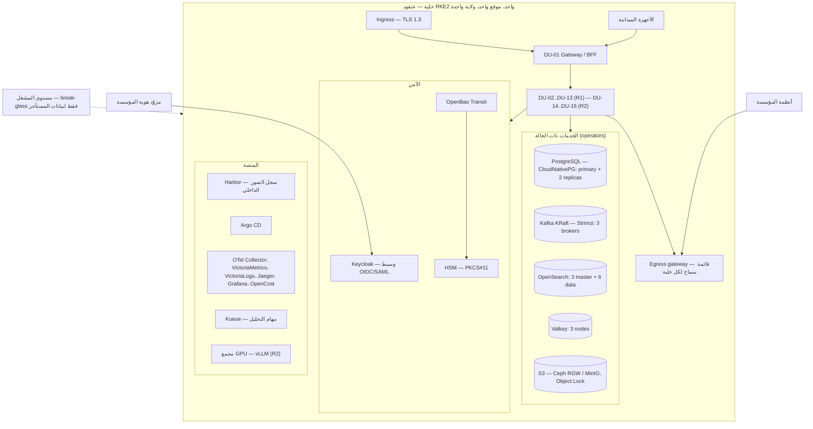
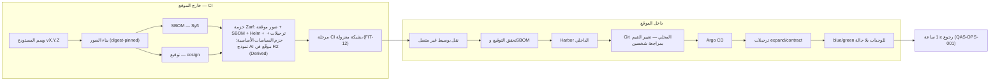
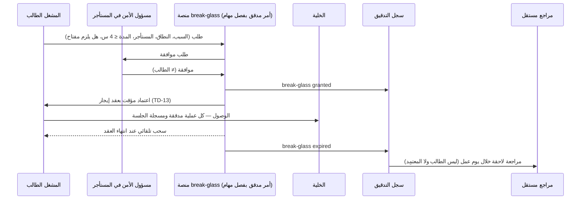

# تصميم النشر

أين تعمل وحدات النشر الست عشرة وخدماتها ذات الحالة، وكيف تصل إلى موقع معزول عن الإنترنت، وكيف تُرقّى وتُستعاد. ما تحدده المصادر ينقل بمرجعه. وما لا تحدده (مساحات الأسماء، مجمعات العقد، البيئات، أقسام Kafka، خطوات break-glass) مقترح بعلامة **[Derived]** أو **[Missing]**، ويُجمع في §13.

## 1. المبادئ

| المبدأ | القاعدة | المصدر |
|---|---|---|
| الخلية وحدة النشر الكبرى | الخلية = عنقود Kubernetes + كل الخدمات ذات الحالة + كل وحدات النشر، في موقع واحد وولاية واحدة؛ لا مسار بيانات بين الخلايا | `cell-architecture.md`؛ TB-05 |
| البيئة المعزولة خط الأساس | التثبيت والترقية والتشغيل دون إنترنت؛ لا اعتماد على أي خدمة عامة | REQ-PLT-001؛ FIT-12؛ W1-answers |
| ملف الخلية تهيئة لا كود | المشتركة والمخصصة والسيادية قيم تهيئة لنفس الحزمة، ونفس مجموعة اختبارات القبول تعمل على الثلاثة | `release-configuration-migration.md` |
| إصدار واحد = حزمة واحدة | وسم المستودع = إصدار المنصة = حزمة Zarf واحدة | ADR-P18 |
| GitOps داخل الموقع | Argo CD يطبق ما في Git المحلي بمراجعة شخصين؛ لا تعديل يدوي على العنقود | TD-17؛ `release-configuration-migration.md` |

## 2. الخلية

### 2.1 ملفات الخلية

| الملف | المستأجرون | متى | المصدر |
|---|---|---|---|
| مشتركة | ≤ 50 لكل خلية، أو حتى 80 % من السعة | الافتراضي | `cell-architecture.md` |
| مخصصة | مستأجر واحد | حمل > 20 % من سعة خلية، أو أعلى مستوى تصنيف | ADR-P04 |
| سيادية | مستأجر واحد بموقع ومشغلين محليين | النشر السيادي | ADR-P04؛ `cell-architecture.md` |

نطاق التصميم 100 مستأجر، والنمو إلى أكثر من 1,000 يكون بالخلايا (`scale-envelope.md`). الترقية من مشتركة إلى مخصصة بتصدير واستيراد على مستوى المستأجر دون تغيير كود (ADR-P04). توجيه المستخدم إلى خليته **[Missing]**: لا موجّه خلايا في المصادر. المقترح **[Derived]** من TB-05: نطاق DNS لكل خلية يعرفه المستأجر عند التهيئة (`cell_id` في سجل المستأجر)، فلا مكوّن مشترك بين الخلايا. ثلاثة شروط: (1) البوابة ترفض أي رمز لا يطابق `cell_id` مستأجره خليتها (INV-TEN-02)؛ (2) أسماء النطاقات لا تحمل اسم المستأجر؛ (3) عند نقل المستأجر بين خليتين: TTL قصير للـDNS قبل القطع، وتعليمة للأجهزة الميدانية بنقطة النهاية الجديدة في رد المزامنة، ونقل جدول `applied_commands` مع المستأجر حتى لا تُطبق مرتين أوامر الأجهزة التي كانت دون اتصال أثناء النقل.

### 2.2 الحجم التصميمي للخلية

5,000 مستخدم متزامن، 7,500 طلب/ث، 5,000 ملاحظة/ث، 500 بحث/ث (`cell-architecture.md`). عقدة PostgreSQL نحو 32 vCPU / 256 GB (primary + نسختان)، ومخزن الكائنات نحو 100 TB في البداية، ونحو 60–120 pod في الذروة. كل رقم فرضية حتى اختبار الأداء، ويُعاد معايرته إذا تجاوز الحمل الفعلي 50 % من النطاق (ASM-010). خطة الاختبار: خط الأساس، 10×، الاندفاع، 24 ساعة متصلة، المستأجر المزعج، عاصفة إعادة الاتصال (5,000 جهاز ≤ 30 دقيقة)، الفوضى، ومجموعة الاستدلال للذكاء الاصطناعي (`performance-test-strategy.md`).

## 3. تخطيط Kubernetes

RKE2 مع operators (CloudNativePG، Strimzi، OpenSearch)، عنقود واحد لكل خلية (TD-05؛ ADR-P05). التقسيم داخل العنقود لا تحدده المصادر **[Missing]**، والمقترح **[Derived]**:

| العنصر | المقترح | المبرر |
|---|---|---|
| مساحات الأسماء | واحدة لكل وحدة نشر (`du-01-gateway` … `du-16-ai-serving`)، ومساحات للمنصة: `data`، `security`، `observability`، `gitops`، `jobs` | حدود NetworkPolicy وحصص وكلفة لكل وحدة (OpenCost لكل namespace، `cost-model.md`) |
| مجمعات العقد | `system`؛ `apps` لوحدات بلا حالة؛ `data` للخدمات ذات الحالة بأقراص محلية؛ `jobs` لـKueue؛ `gpu` لـvLLM في R2 | ملفات حمل مختلفة (`deployment-units.md`)؛ عزل التحليل عن التشغيل (SR-11) |
| التوسع | HPA على الوحدات الأفقية بمقياس الطلبات أو تأخر المستهلك؛ DU-07 حسب أقسام الأحداث؛ DU-13 حسب حصص Kueue؛ DU-16 حسب حصة GPU | عمود التوسع في `deployment-units.md` |
| الحد الأدنى | ≥ 2 نسخة لكل وحدة critical مع PodDisruptionBudget، وتوزيع على عقد مختلفة | هدف 99.9 % (QAS-AVL-001) |
| الشبكة | NetworkPolicy افتراضية تمنع كل خروج، والاستثناءات عبر egress gateway بقائمة سماح لكل خلية؛ مخالفة الخروج تنبيه أمني P1 | `cell-architecture.md` |
| بين الخدمات | mTLS وهوية عبء عمل لكل تطبيق (TB-02)؛ منتج الشبكة الخدمية (service mesh) **[Missing]** | `authorization-model.md`؛ `trust-boundaries.md` |

## 4. وحدات النشر في الخلية

| الوحدة | الطبقة | التوسع | التوفر / RPO / RTO | الإصدار |
|---|---|---|---|---|
| DU-01 Gateway/BFF | critical | أفقي، بلا حالة | 99.9 % / ≤ 5 د / ≤ 1 س | R1 |
| DU-02 Foundation | critical | أفقي | 99.9 % / ≤ 5 د / ≤ 1 س | R1 |
| DU-03 Governance | critical | أفقي؛ عمّال الإتلاف مجدولون | 99.9 % / ≤ 5 د / ≤ 1 س | R1 |
| DU-04 Information | critical | أفقي | 99.9 % / ≤ 5 د / ≤ 1 س | R1 |
| DU-05 Ingestion | critical | أفقي حسب الطابور | 99.9 % / ≤ 5 د / ≤ 1 س | R1 |
| DU-06 Intelligence | important | أفقي | 99.5 % / ≤ 15 د / ≤ 4 س | R1 |
| DU-07 Evaluators | critical | حسب أقسام الأحداث (≤ 5 ث) | 99.9 % / ≤ 5 د / ≤ 1 س | R1 |
| DU-08 Operations | critical (المهام) | أفقي | 99.9 % / ≤ 5 د / ≤ 1 س | R1 |
| DU-09 Discovery | important | أفقي؛ البناة حسب الأقسام | 99.5 % / ≤ 15 د / ≤ 4 س | R1 |
| DU-10 Field sync | critical | أفقي | 99.9 % / ≤ 5 د / ≤ 1 س | R1 |
| DU-11 Adapters | standard | لكل محوّل | 99 % / ≤ 24 س / ≤ 24 س | R1 (+R2) |
| DU-12 Tiles | important | أفقي | 99.5 % / ≤ 15 د / ≤ 4 س | R1 |
| DU-13 Analysis jobs | important | حسب الحصص | 99.5 % / ≤ 15 د / ≤ 4 س | R1 |
| DU-14 Readiness | critical (التخصيص) | أفقي بنطاق المجمع، قفل على مستوى المجمع | 99.9 % / ≤ 5 د / ≤ 1 س | R2 |
| DU-15 Knowledge | important | أفقي؛ تخزين بارد منفصل | 99.5 % / ≤ 15 د / ≤ 4 س | R2 |
| DU-16 AI Serving | important | حصص GPU لكل خلية | 99.5 % / ≤ 15 د / ≤ 4 س | R2 |

المصادر: `deployment-units.md`؛ `dr-and-continuity.md`؛ QAS-AVL/REC. الوحدات DU-14..16 تصميم فقط: لا تُنشر قبل مراجعة Pilot R1 وحسم UNK-012 (حجم مجمع GPU). أرقام DU-14..16 بمطابقة طبقتها **[Derived]**.

## 5. الخدمات ذات الحالة: التوفر والنسخ والتعافي

| الخدمة | التوفر العالي | النسخ الاحتياطي والتعافي | المصدر |
|---|---|---|---|
| PostgreSQL (CloudNativePG) | primary + نسخة متزامنة + نسخة غير متزامنة؛ schema ودور لكل سياق | شحن WAL مستمر بتأخر ≤ 5 د؛ نسخة كاملة يومية؛ استعادة آلية أسبوعية | TD-01؛ `dr-and-continuity.md` |
| Kafka (Strimzi، KRaft) | 3 brokers، replication factor 3 | MirrorMaker 2 للمواضيع الحرجة إلى موقع التعافي | TD-04؛ `dr-and-continuity.md` |
| OpenSearch | 3 master + 6 data؛ عنقود منفصل عن سجلات المراقبة | لقطات كل 15 د إلى مخزن الكائنات؛ استعادة ≤ 4 س. إعادة البناء الكاملة من المالكين تستغرق حتى 24 س فلا تصلح للتعافي، وتبقى لتغيير المخطط (CR-54) | TD-02؛ CR-54؛ `dr-and-continuity.md` |
| مخزن الكائنات | Ceph RGW أو MinIO؛ Object Lock (WORM) | ترميز المحو (erasure coding) + نسخ غير متزامن | TD-06 |
| OpenBao + مخزن المفاتيح | HA؛ KEK في HSM | يُنسخ مع سجل الإتلاف؛ النسخ ≤ 35 يومًا؛ بوابة الاستعادة FIT-19 (لا تُعاد مفاتيح أُتلفت) | TD-07؛ `key-hierarchy-and-disposition.md` |
| Valkey | 3 عقد | لا نسخة تعافي؛ يعاد بناؤه من BC01 | TD-11 |
| Keycloak | **[Missing]** — مقترح: نسختان على الأقل وقاعدته في عنقود PostgreSQL الخلية فيرث نسخه | انقطاع مزوّد الهوية: الجلسات القائمة ≤ 15 د، ثم break-glass | TD-09؛ `dr-and-continuity.md` |

- كل النسخ الاحتياطية مشفرة بمفاتيح المستأجرين (TB-10)، والتحقق من الاستعادة آلي (REQ-PLT-012). موقع التعافي في الولاية نفسها (REQ-GOV-005).
- **تمارين التعافي:** استعادة آلية أسبوعية وتمرين تعافٍ ربع سنوي (`dr-and-continuity.md`).

## 6. Kafka

| البند | القاعدة | المصدر |
|---|---|---|
| التسمية | `{cell}.<domain>.events` لكل سياق: foundation، governance، information، intelligence، operations، readiness، knowledge، integration، discovery، field، ai | `asyncapi-*.md` |
| موضوع الأولوية | `{cell}.security.versions` (مفتاحه `tenant_id + subject_urn`) | `asyncapi-slc01.md`؛ TD-04 |
| الرسائل الميتة | `{cell}.<domain>.events.dlq`، احتفاظه **30 يومًا** **[Derived]**: أطول من زمن التنبيه حتى إعادة التشغيل (P2 خلال يوم عمل، مع عطل نهاية الأسبوع وهامش)، فلا تنتهي رسالة قبل معالجتها؛ الحمولة مشفرة بمفاتيح المستأجر فيصلها الإتلاف بالمفتاح والمحو خلال ≤ 24 س (`key-hierarchy-and-disposition.md`) | ADR-P20 |
| الاحتفاظ والتكرار | 7 أيام، replication factor 3 | `cell-architecture.md`؛ `dr-and-continuity.md` |
| مفتاح التقسيم | `tenant_id + aggregate.id` | كل رسالة AsyncAPI |
| عدد الأقسام | **[Missing]** — مقترح **[Derived]**: 24 لمواضيع information وoperations (أعلى حمل: 5,000 ملاحظة/ث، WL-06)، و12 لغيرها ولموضوع نسخ الأمن (حمله سحب الصلاحيات، وهو قليل). زيادة الأقسام تغير قسم المفتاح، فلا تحفظ الترتيب لكل مفتاح إلا بإجراء: إيقاف المنتجين (ناقل الـoutbox)، واستهلاك كل الأقسام حتى نهايتها، ثم الزيادة، ثم الاستئناف. لذلك يُختار العدد مبكرًا بهامش | WL-06؛ SR-03 |
| الاحتفاظ والإسقاطات | الإسقاطات تُبنى من المالكين لا من Kafka، فلا حاجة لاحتفاظ طويل (FIT-11) | `15-event-design.md` §5 |

## 7. خط التثبيت المعزول وسلسلة التوريد

| البند | القاعدة | المصدر |
|---|---|---|
| الصور | موقعة بـcosign ومثبتة بالـdigest، مع SBOM (Syft)؛ Harbor داخلي | TD-12؛ TD-17 |
| الحزمة | Zarf واحدة لكل إصدار: صور، SBOM، مخططات Helm، ترحيلات، حزم السياسات الأساسية | `release-configuration-migration.md` |
| الترحيلات | أمامية فقط (forward-only)، بنمط expand/contract، فالنسخة السابقة تعمل على الـschema الجديد أثناء blue/green | TD-17 |
| العقود | الإصدار الرئيسي السابق مدعوم ≥ 6 أشهر | QAS-EVO-001 |
| نموذج AI | يُجمَّد على نسخة موقعة عند الترقية (`deployment-units.md`، DU-16)؛ حمله في حزمة الإصدار **[Derived]** — غير مذكور في `release-configuration-migration.md`، وحجمه (عشرات GB) قد يستدعي حزمة منفصلة | — |
| الرجوع | ≤ 1 ساعة من الحزمة وحدها | QAS-OPS-001 |

## 8. البيئات

المصادر تسمي بوابة البناء G7 وبوابة الإنتاج G8، وتضع اختبارات الأداء «pre-G7 + pilot» (`quality-verification-matrix.md`)، ولا تعرّف البيئات **[Missing]**. المقترح **[Derived]**:

| البيئة | الغرض | البيانات | الملف |
|---|---|---|---|
| التطوير | تطوير الوحدات واختبارات الحلقات | اصطناعية | خلية مشتركة مصغرة |
| التكامل | العقود (FIT-14)، واختبارات القبول، ومرحلة الشبكة المعزولة (FIT-12) | اصطناعية | الملفات الثلاثة بالتناوب (نفس مجموعة القبول) |
| ما قبل الإنتاج | اختبار الأداء والفوضى (قبل G7 ثم في Pilot)، وقبل كل ترقية إنتاج، وتمرين الترقية والرجوع | اصطناعية بحجم الإنتاج | مطابقة لملف خلية الإنتاج المستهدفة |
| الإنتاج | خلايا المستأجرين بعد G8 | حقيقية | مشتركة / مخصصة / سيادية |

- **الترقية بين البيئات** بالحزمة نفسها (وسم واحد = حزمة واحدة). لا تُبنى حزمة جديدة للإنتاج.
- **لا بيانات مستأجر خارج الإنتاج.** نقل بيانات من الإنتاج إلى بيئة أخرى يعني مسار بيانات بين الخلايا، وهذا ممنوع (TB-05).

## 9. الشبكة وحدود الثقة

| الحد | القاعدة | المصدر |
|---|---|---|
| TB-01 المستخدم ↔ البوابة | OIDC/SAML، TLS 1.3، رموز قصيرة العمر، حدود معدل | `trust-boundaries.md` |
| TB-02 البوابة ↔ الوحدات | mTLS + هوية عبء العمل؛ SecurityContext موقّع | `trust-boundaries.md` |
| TB-03 الوحدة ↔ قاعدة البيانات | حساب خدمة لكل سياق + RLS | `trust-boundaries.md` |
| TB-05 خلية ↔ خلية | لا مسار بيانات | `trust-boundaries.md` |
| TB-06 الأنظمة الخارجية | المحوّل وطبقة مكافحة الفساد والحجر | `trust-boundaries.md`؛ `20-integration-design.md` |
| TB-09 مستوى المشغل | المشغل لا يقرأ بيانات المستأجر؛ break-glass (§10) | `trust-boundaries.md` |
| TB-10 النسخ الاحتياطية | مشفرة بمفاتيح المستأجرين | `trust-boundaries.md` |
| الخروج | منع افتراضي + egress gateway بقائمة سماح | `cell-architecture.md` |

## 10. Break-glass

المصادر تقول: بموافقة شخصين ومدة محددة وتدقيق، وفصل المفاتيح (TB-09، THR-014)، وإجراء طوارئ بحسابات لشخصين (`dr-and-continuity.md`). لكن degradation-slc01 يقول عند انقطاع مزوّد الهوية «manual: none (security)»، فالمصدران يختلفان على حالة انقطاع الهوية **[Needs Review]**. الخطوات نفسها **[Missing]**. والمقترح **[Derived]** يفصل حالتين:

| الحالة | من يوافق | ما يُمنح | التحقق من الهوية |
|---|---|---|---|
| أ. وصول المشغل إلى بيانات مستأجر (TB-09) | مسؤول الأمن في المستأجر المعني (ACT-13)، لا زميل مشغل | نطاق ومستأجر ومدة ≤ 4 س؛ **لا استعمال لمفاتيح المستأجر** إلا إذا نص الطلب عليه ووافق مسؤول الأمن صراحة (فصل المفاتيح، THR-014) | مزوّد الهوية العادي |
| ب. انقطاع مزوّد الهوية | مشغلان بحسابات طوارئ محلية في الخلية، مختومة مسبقًا | تشغيل المنصة واستعادة الهوية فقط؛ لا بيانات مستأجرين | لا يعتمد على مزوّد الهوية (بيانات اعتماد محفوظة دون اتصال) |

- الحساب لا يملك وصولًا قائمًا: الاعتماد يصدر عند الموافقة وينتهي بانتهاء العقد.
- الموافقة بشخصين **أمر مدقق بقاعدة فصل مهام** في المنصة نفسها، لا ميزة في مخزن الأسرار: OpenBao قد لا يوفر موافقة الشخصين (Control Groups في Vault ميزة تجارية) **[Needs Review]**.
- المراجع المستقل من الحوكمة (المدقق أو الأمن)، لا الطالب ولا المعتمِد.

## 11. المراقبة والاحتفاظ التشغيلي

مكدس المراقبة لكل خلية (TD-14)، ولا يخرج من الخلية. احتفاظ السجلات والتتبع والمقاييس التقنية **[Missing]**. المقترح: سجلات تقنية 30 يومًا، وتتبع 7 أيام، ومقاييس 13 شهرًا لمقارنة سنوية. السجلات بلا محتوى أعمال ولا بيانات شخصية، لكنها تحمل URN المستخدمين (`data-protection.md`)؛ لذلك الاحتفاظ القصير (30 يومًا) يحد التعرض، وإن لم يُطبق عليها جدول الإتلاف **[Derived]**. سجل التدقيق منفصل ويخضع لـBC08.

## 12. الكلفة

OpenCost يوزع الكلفة لكل namespace وتسمية (`cost-model.md`؛ TD-14). تسمية `tenant_id` على أحمال المهام (Kueue) والتخزين المقسّم بالمستأجر تسمح بتوزيع الكلفة المشتركة على المستأجرين **[Derived]**.

## 13. فجوات ومقترحات

| البند | الحالة |
|---|---|
| موجّه الخلايا | **[Missing]** — مقترح: نطاق DNS لكل خلية (§2.1) |
| مساحات الأسماء ومجمعات العقد والحد الأدنى للنسخ | **[Missing]** — مقترح §3 |
| منتج الشبكة الخدمية لـmTLS | **[Missing]** — قرار تقني جديد |
| التوفر العالي لـKeycloak | **[Missing]** — مقترح §5 |
| عدد أقسام Kafka | **[Missing]** — مقترح §6 |
| البيئات والترقية بينها | **[Missing]** — مقترح §8 |
| خطوات break-glass | **[Missing]** — مقترح §10؛ تعارض المصدرين في حالة انقطاع الهوية **[Needs Review]** |
| احتفاظ الـDLQ | مقترح 30 يومًا (§6) |
| احتفاظ المراقبة التقنية | **[Missing]** — مقترح §11 |
| الولاية الفعلية (UNK-002) وحجم مجمع GPU (UNK-012) | مفتوحان — يحسمان قبل G8 وقبل R2 |
