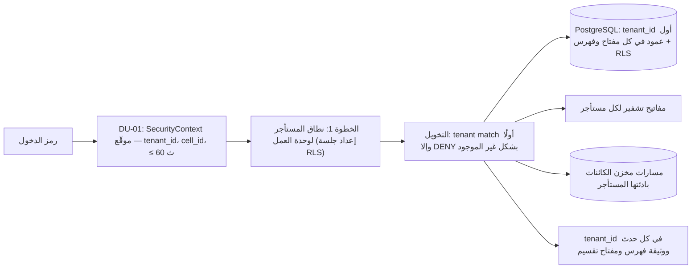
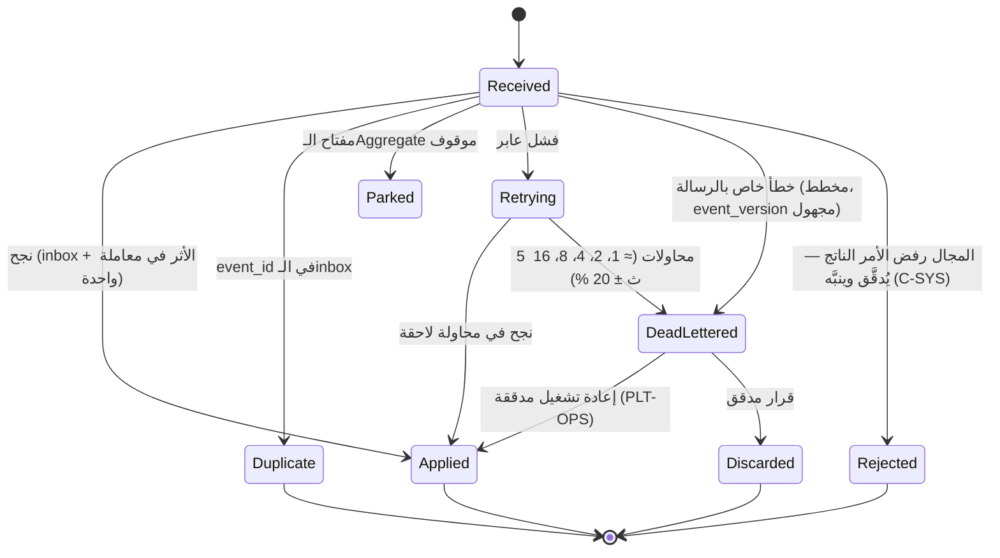

# الاهتمامات المشتركة

قواعد تسري على كل وحدة نشر وكل سياق. مكانها في الكود `platform/` و`shared-kernel/` (`13-project-structure.md`)، فلا يعيد سياق تنفيذها بنفسه. كل قاعدة تذكر مصدرها. وما لم تحدده المصادر مقترح بعلامة **[Derived]** أو **[Missing]**، ويُجمع في §12.

## 1. تعدد المستأجرين

### 1.1 طبقات العزل (ADR-P04)

| الطبقة | القاعدة | المصدر |
|---|---|---|
| مصدر المستأجر | البوابة تبني SecurityContext من الرمز وبيانات BC01 وتوقعه (JWS بمفتاح البوابة في الخلية)، ومدته ≤ 60 ث. المستأجر لا يُقرأ أبدًا من جسم الطلب أو مساره | `security-context.md` |
| قاعدة البيانات | `tenant_id` أول عمود في كل مفتاح أساسي وفهرس، وRLS حاجز ثانٍ، وschema ودور لكل سياق لا لكل مستأجر | `slc-01.md`؛ TD-01؛ FIT-02 |
| التخويل | الخطوة الأولى في تقييم السياسة: «tenant match else DENY (not-found shape)» | `authorization-model.md` |
| بين المستأجرين | لا استعلام يعبر المستأجرين (SR-02)؛ سياسة مستأجر تسمح بقراءة مستأجر آخر تُرفض (`POLICY_TESTS_FAILED`)؛ التنسيق بين المستأجرين بتوزيع المنتجات فقط (INV-CRD-01) | `scale-envelope.md`؛ invariants-slc01؛ AGG-COORDINATION-CASE |
| بين الخلايا | لا مسار بيانات؛ النقل بتصدير واستيراد معتمدين فقط (TB-05) | `trust-boundaries.md` |
| الفحص | FIT-02: `tenant_id` في كل جدول ومفتاح تقسيم ووثيقة فهرس وحدث ومسار كائن (خطأ يوقف البناء) | `fitness-functions.md` |

### 1.2 الخلايا والإقامة

- **الخلية:** مستأجرون مشتركون (≤ 50، أو حتى 80 % من السعة)، أو خلية مخصصة. الخلية المخصصة إلزامية عند نشر سيادي، أو أعلى مستوى تصنيف، أو حمل مستأجر > 20 % من سعة الخلية (ADR-P04؛ `cell-architecture.md`). تفاصيل النشر في `22-deployment-design.md`.
- **الإقامة:** الخلية في ولاية واحدة، والنسخ الاحتياطية وموقع التعافي في الولاية نفسها (REQ-GOV-005). الولاية الفعلية مفتوحة (UNK-002).
- **ارتباط المستأجر:** المستأجر في خلية واحدة في أي لحظة (INV-TEN-02). النقل `CMD-TEN-START-CELL-MIGRATION` ← `MIGRATING` ← الإكمال بعد مطابقة التصدير والاستيراد، وإلا `MIGRATION_NOT_RECONCILED`. لا تغيير في الكود بين الوضعين (ADR-P04).

### 1.3 الحصص والجار المزعج

| البند | القاعدة | المصدر |
|---|---|---|
| الحصص | لكل مستأجر: `requests_per_s`، `storage_gb`، `events_per_s`، `concurrent_jobs`؛ مجموعها ≤ سعة الخلية (`QUOTA_EXCEEDS_CAPACITY`) | REQ-FND-018؛ `TenantQuotas`؛ AGG-TENANT |
| التطبيق | حدود الطلبات في DU-01 (`RATE_LIMITED`، 429)؛ حصص المهام في Kueue (fair share)؛ الاستيعاب يرد `RATE_LIMITED` للمصادر عند امتلاء الطابور | DU-01؛ TD-12؛ degradation-slc02 |
| العزل | مستأجر يتجاوز حصته 10× لا يخرج الآخرين عن QAS-PERF-001 (QAS-SCAL-005)، وزمن بدء مهام الآخرين ≤ 30 ث (QAS-PERF-020) | `quality-scenarios.md`؛ workloads-slc07 |
| القيم الافتراضية | **[Missing]** — لا أرقام افتراضية للحصص؛ تُضبط عند تهيئة المستأجر من ملف الخلية (§8) | — |

## 2. التزامن

| الآلية | القاعدة | المصدر |
|---|---|---|
| القفل المتفائل | كل أمر مغيّر للحالة يحمل `If-Match: <version>` (إلزامي في العقد)؛ عدم التطابق ← `VERSION_CONFLICT` (409، قابل لإعادة المحاولة) دون أي تغيير؛ في كل الـAggregates (89) | REQ-OPS-011؛ ADR-P17؛ QAS-REL-003 («0 silent overwrites») |
| موقع الفحص | الخطوة 7 بعد التخويل الكامل، فلا يكشف الإصدار شيئًا لمن لا يرى المورد | ADR-P17؛ ADR-P19 |
| حدود المعاملة | Aggregate واحد لكل معاملة؛ ما يمس Aggregates أخرى يمر بحدث (ADR-P02). الحالة والتاريخ والـoutbox والتدقيق وسجل عدم التكرار في معاملة واحدة (الخطوة 9) | ADR-P17 |
| قفل صريح | دفتر السعة: دلو `(tenant, pool, hour)` بقيد `committed ≤ capacity`، وأقفال الدلاء بترتيب تصاعدي للساعة (لا جمود)، ونافذة 250 ms مرتبة بالأولوية ثم الوقت | `allocation-readiness-spec.md`؛ `slc-09.md` |
| قيود الاستبعاد | حجز الأصول والإسناد بقيد `EXCLUDE` على (الأصل، النافذة `tstzrange`) — قاعدة البيانات تمنع التداخل لا الكود | `slc-09.md` |
| عقود الإيجار | العمّال والمؤقتات بدلاء زمنية في PostgreSQL وعمّال بعقد إيجار (lease)، بلا محرك سير عمل | TD-13 |
| الترتيب | مفتاح التقسيم `tenant_id + aggregate.id`: أحداث الـAggregate الواحد مرتبة، ولا ترتيب بين Aggregates؛ الأوامر الميدانية تطبق بترتيب الجهاز | SR-03؛ `field-sync-protocol.md` |
| التعارض الميداني | لا كتابة أخيرة تغلب إلا لبيانات T4 (تفضيلات الواجهة)؛ غير ذلك تعارض مزامنة يحسمه إنسان | ADR-P09 |

## 3. عدم التكرار

| المسار | المفتاح | الاحتفاظ | السلوك | المصدر |
|---|---|---|---|---|
| أمر HTTP | `Idempotency-Key` (إلزامي، ≤ 128 حرفًا)؛ الجدول `(tenant_id, key)`، ومقترح `(tenant_id, principal_id, key)` | 24 ساعة | التكرار يعيد الاستجابة الأصلية؛ نفس المفتاح بحمولة مختلفة ← `IDEMPOTENCY_KEY_REUSED` (422) | `slc-01.md`؛ CR-80 |
| حدث وارد | `inbox (tenant_id, consumer, event_id)` في معاملة الأثر | **[Missing]** — مقترح: ≥ احتفاظ الموضوع (7 أيام) + هامش | الحدث المكرر يُتجاهل | REQ-PLT-006؛ `slc-01.md` |
| أمر ميداني | `client_command_id` (ULID من الجهاز) = `Idempotency-Key`؛ `applied_commands (tenant_id, client_command_id)` | ≥ 30 يومًا (يغطي 72 ساعة دون اتصال وإعادة الرفع) | إعادة الرفع لا تطبق مرتين | ADR-P09؛ `slc-11.md` |
| الدفعات | ≤ 1,000 عنصر في الأمر، ومفتاح لكل عنصر | — | إعادة إرسال الدفعة لا تكرر | REQ-INF-007؛ workloads-slc02 |
| أمر داخلي من حدث | مفتاح مشتق حتميًا من `event_id` ومعرّف المعالج **[Derived]** | 24 ساعة | إعادة تسليم الحدث تعيد النتيجة نفسها | ADR-P17 (المعالج يعيد الدخول إلى خط الأوامر) |

## 4. الزمن

| البند | القاعدة | المصدر |
|---|---|---|
| الأزمنة الخمسة | الحدث، والملاحظة، والتسجيل (**الخادم فقط**)، والصلاحية، والنفاذ؛ `created_at` و`updated_at` ليسا زمن أعمال (SL-11، FIT-09) | `temporal-model.md` |
| الفترات | نصف مفتوحة `[from, to)`، UTC، دقة ميكروثانية؛ `tstzrange` في قاعدة البيانات | `temporal-model.md`؛ TD-01 |
| ثنائية الزمن | T1 ثنائي الزمن، وT2 بنسخ زمن الصلاحية؛ الاستعلام `AS OF VALID t` و`AS KNOWN AT k`، والافتراضي الآن لكليهما (`valid_at`، `known_at` في العقود) | ADR-P01؛ QAS-TMP-001 |
| منفذ الساعة | كل زمن يقرؤه الكود من منفذ Clock في `platform/`، لا من ساعة النظام مباشرة؛ الاختبارات تثبّته | `11-hexagonal-reference.md` §5 |
| زمن الجهاز | يُحفظ كـ`observed_at` مع `clock_offset = Ts_receive − Td`؛ `recorded_from` دائمًا وقت استلام الخادم؛ انحراف > 5 دقائق ← `DEVICE_CLOCK_SUSPECT` | `temporal-model.md`؛ `field-sync-protocol.md` |
| التواريخ الغامضة | مقارنة بثلاث نتائج: `CERTAIN_OVERLAP`، `POSSIBLE_OVERLAP`، `NO_OVERLAP` | `temporal-model.md` |
| مزامنة الساعات | **[Missing]** — مقترح: خادم NTP داخل كل خلية (البيئة المعزولة لا تصل إلى خوادم عامة)، وتنبيه عند انحراف عقدة > 100 ms، لأن زمن التسجيل والترتيب يعتمدان على ساعة الخادم | — |
| المنطقة الزمنية | التخزين UTC فقط. العرض بمنطقة المستخدم (IANA) من تفضيله، وإلا منطقة المستأجر **[Missing → مقترح]**. التقويم الهجري للعرض فقط | `language-model.md`؛ `21-ui-design.md` §9 |

## 5. اللغة

| البند | القاعدة | المصدر |
|---|---|---|
| الحفظ | الأصل + المطبَّع + المنقول حرفيًا + الصوتي؛ الأصل لا يُعدَّل أبدًا | ADR-P15 |
| التطبيع | قواعد N1–N10 حتمية ومُصدَّرة؛ كل نص يحمل `lang` (BCP 47) و`normalization_version`؛ ترقية التطبيع تعني إعادة الفهرسة | `language-model.md`؛ ADR-P15 |
| البحث | المحلل العربي يطبق N1–N8 على الفهرس والاستعلام؛ الوزن: المطبَّع > المنقول > الصوتي | TD-02؛ `discovery-architecture.md` |
| الوحدات | UCUM (قائمة RD-UNITS مقفلة) | `reference-data.md` |
| القوائم المرجعية | 26 قائمة RD-*، لكل منها مالك وإصدار ونفاذ وقاعدة مستأجر؛ البيانات التاريخية تحتفظ بإصدار القائمة الذي سُجلت به | ADR-P14؛ `reference-data.md` |
| لغة الاستجابة | **[Missing]** — مقترح: لغة رسالة الخطأ والقوالب من تفضيل المستخدم، ثم `Accept-Language`، ثم العربية | `18-error-handling.md` §1 |

## 6. الفشل: المهل وإعادة المحاولة وقواطع الدائرة

### 6.1 مستهلكو الأحداث (ADR-P20)

- الرسالة الميتة توقف مفتاحها لدى ذلك المستهلك، وما بعدها لنفس المفتاح يذهب إلى مخزن الإيقاف. بقية المفاتيح في القسم تستمر.
- **قاطع الدائرة:** إذا تجاوزت الإخفاقات العابرة العتبة (مقترح 50 % من الرسائل في دقيقة) يتوقف المستهلك عن السحب ويعلن عدم الجاهزية، بدل ملء الـDLQ، ثم يستأنف عند تعافي اعتمادياته.
- التنبيه P2 لكل رسالة في DLQ. المقاييس: `consumer.dlq_total{consumer,class}`، `consumer.parked_keys{consumer}`، `consumer.paused{consumer}`.
- يسري على: معالجات العملية، وبناة الإسقاطات (DU-09، ولهم بديل إعادة البناء من المالك، FIT-11)، واستيعاب التدقيق (DU-03)، والمقيّمين (DU-07)، والمحوّلات الواردة (DU-11).

### 6.2 بقية المسارات

| المسار | السلوك | المصدر |
|---|---|---|
| ناقل الـoutbox (CDC) | يعيد حتى النجاح؛ الترتيب محفوظ من المصدر | ADR-P02؛ ADR-P20 |
| الإشعارات ورسائل CAP | 5 محاولات بتأخير متزايد؛ النسخة داخل التطبيق تبقى دائمًا | AGG-NOTIFICATION؛ AGG-CAP-MESSAGE؛ `situation-alerting-spec.md` |
| محرك السياسات | مضمَّن في كل وحدة؛ الخطأ أو المهلة ← DENY (`POLICY_ENGINE_UNAVAILABLE`)؛ حزمة أقدم من 5 دقائق ← رفض الكتابة وقراءة ≤ INTERNAL فقط | `authorization-model.md`؛ degradation-slc01 |
| التدقيق | تراكم محلي؛ بعد 24 ساعة أو 80 % من السعة تُرفض الأوامر المغيّرة للحالة (`AUDIT_UNAVAILABLE`) | `audit-architecture.md` |
| مزوّد الهوية | الجلسات القائمة تستمر ≤ 15 دقيقة؛ ثم الطوارئ بحسابات break-glass | degradation-slc01؛ `dr-and-continuity.md` |
| اتصال تكامل | `DEGRADED` بعد فشل فحوص الصحة 5 دقائق | AGG-INTEGRATION-CONNECTION |
| تشغيل تحليل | مهلة افتراضية 6 ساعات | `analysis-reproducibility-spec.md` |
| جلسة مزامنة | مهلة خمول 5 دقائق | AGG-SYNC-SESSION |
| استدعاء متزامن لسياق آخر (OHS) | **[Missing]** — مقترح **[Derived]** من QAS-PERF-001 (p95 ≤ 300 ms): مهلة = ما بقي من ميزانية الطلب بحد أقصى 250 ms، بلا إعادة داخل الأمر (العميل يعيد بالمفتاح نفسه)، وقاطع دائرة لكل اعتمادية، والفشل مغلق `DEPENDENCY_UNAVAILABLE` (CR-78) | THR-S03-04 |
| HTTP من العميل | إعادة لـ429 و503 القابل للإعادة و`VERSION_CONFLICT` بشروطها (`18-error-handling.md` §5.1) | — |

**الحواجز (bulkheads):** لا تذكرها المصادر بالاسم. فصل وحدات النشر يحققها بين السياقات (`deployment-units.md`، SR-11). وداخل الوحدة تجمّع اتصالات قاعدة البيانات وعمّال الاستهلاك مستقلان عن خيوط HTTP **[Derived]**.

## 7. المراقبة

| البند | القاعدة | المصدر |
|---|---|---|
| الأدوات | OpenTelemetry SDK وCollector؛ VictoriaMetrics للمقاييس، VictoriaLogs للسجلات، Jaeger للتتبع، Grafana؛ OpenCost لتوزيع الكلفة على المستأجرين | TD-14 |
| التتبع | 100 % من الطلبات قابلة للتتبع من الطرف إلى الطرف (QAS-OBS-001)؛ `X-Correlation-Id` إلزامي، و`ApiError` يحمل `correlation_id` و`trace_id`؛ الـspans: `gateway.resolve_context → pep.decide → command.handle → db.commit`؛ معرّف الارتباط ينتقل في ترويسة كل حدث | observability-slc01؛ `asyncapi-*.md` |
| تسمية المقاييس | **[Derived]** من الأمثلة: `<area>.<name>_<unit>{labels}` (`pdp.latency_ms`، `projection.lag_s{kind}`)؛ `tenant_id` تسمية على مقاييس الأعمال لا على مقاييس عالية التعدد | observability-slc* |
| السجلات | بلا محتوى أعمال ولا بيانات شخصية؛ معرّفات وURN فقط؛ إخفاء آلي للحقول الحساسة؛ محتوى الـprompt في سجل التدقيق المشفر فقط | `data-protection.md` |
| أهداف التوفر | critical ≥ 99.9 %، important ≥ 99.5 %، standard ≥ 99 % شهريًا | QAS-AVL-001..003 |
| ميزانية الخطأ | **[Derived]** من الأهداف: ≈ 43 دقيقة شهريًا (99.9 %)، ≈ 3.6 ساعات (99.5 %)، ≈ 7.2 ساعات (99 %)؛ عند نفادها تُقدَّم الموثوقية على الميزات في الإصدار التالي | — |
| الخطورة | المصادر تستعمل P0 وP1 وP2 دون تعريف **[Missing]**. مقترح: P0 خرق ثابت أمني أو فقد بيانات (مثل فشل التحقق من سلسلة التدقيق)، استدعاء فوري؛ P1 خدمة critical خارج هدفها أو تنبيه أمني، استدعاء فوري؛ P2 تدهور بلا أثر فوري على المستخدم (رسالة في DLQ، تأخر إسقاط)، خلال يوم العمل | observability-slc01/02؛ `cell-architecture.md`؛ ADR-P20 |
| لوحات المراقبة | لكل وحدة نشر: معدل الطلبات والأخطاء حسب الرمز وزمن p95، تأخر المستهلكين والـDLQ، الإسقاطات، التدقيق؛ ولكل مستأجر: الحصص والكلفة **[Derived]** | TD-14 |
| احتفاظ السجلات التقنية | **[Missing]** — يُحدد في `22-deployment-design.md` | — |

## 8. الإعدادات

| المستوى | أين وكيف يُضبط | المصدر |
|---|---|---|
| المنصة والخلية | Git داخل الموقع + Argo CD، بمراجعة شخصين؛ ملفات الخلية (مشتركة، مخصصة، سيادية) قيم تهيئة لا نسخ كود | `release-configuration-migration.md`؛ `cell-architecture.md` |
| المستأجر | Aggregates مدققة ومُصدرة في BC01 وBC08 وBC04: الحصص، السياسات، التصنيف، الاحتفاظ، أنواع المهام؛ سياسات المستأجر تقيّد خط الأساس فقط إلا معاملات معلَّمة قابلة للضبط (INV-POL-02) | المصدر نفسه؛ AGG-POLICY-SET |
| السياسات | حزم موقعة تُوزَّع على المقيّمين المضمَّنين، مجموعة نشطة واحدة لكل مستأجر، والمعتمِد ≠ المؤلف | TD-08؛ `slc-01.md` |
| الأسرار | OpenBao؛ لا أسرار في Git أو الصور | `release-configuration-migration.md` |
| القوائم المرجعية | RD-* مُصدرة بنفاذ (§5) | ADR-P14 |
| الأرقام التصميمية | كل رقم فرضية حتى اختبار الأداء؛ إعادة المعايرة عند تجاوز الحمل الفعلي 50 % من نطاق التصميم (ASM-010) | `cell-architecture.md` |
| أعلام الميزات | **[Missing]** — مقترح: لا خدمة أعلام في وقت التشغيل. الإصدار يحدد ما يُنشر (DU-14..16 لا تنشر قبل R2)، ومسارات الـAggregates اللاحقة داخل وحدة منشورة (`12-components.md` §5) تُفعَّل بإعداد المستأجر المُصدَر **[Derived]** | `deployment-units.md` |

## 9. الذاكرة المؤقتة

| الذاكرة | المفتاح والمدة | الإبطال | المصدر |
|---|---|---|---|
| قرارات التخويل | ALLOW فقط، ≤ 60 ث، المفتاح يشمل `security_version` | أي تغيير صلاحية يرفع الإصدار فيبطلها فورًا | `authorization-model.md` |
| SecurityContext | لكل بوابة، `(subject, security_version)` | مقارنة `security_version` في كل طلب؛ النفاذ في الطلب التالي في كل مسار (QAS-SEC-003) | workloads-slc01؛ `security-context.md` |
| نسخ الأمن | Valkey لكل خلية من موضوع `{cell}.security.versions`؛ القيم المرجعية في PostgreSQL | يعاد بناؤه من BC01 | TD-11؛ `dr-and-continuity.md` |
| البلاطات | `(situation, layer, z, x, y, scope_hash, data_version)`؛ الطبقات التشغيلية فوق أدنى مستوى لا تُشارك أبدًا | تغير `security_version` يغير المفتاح | ADR-P06؛ `situation-alerting-spec.md` |
| المفاتيح | ≤ 10 دقائق في الذاكرة | حدث الإتلاف يفرغها فورًا | `key-hierarchy-and-disposition.md` |
| الذكاء الاصطناعي | لا ذاكرة مشتركة بين المستخدمين | — | threat-model-slc10 |

قاعدة عامة: لا ذاكرة مؤقتة لنتيجة استعلام بين مستخدمين مختلفين إلا إذا كان مفتاحها يشمل نطاق الصلاحية و`security_version` **[Derived]** من ADR-P06.

## 10. الحدود والحصص الرقمية

| البند | القيمة | المصدر |
|---|---|---|
| حجم صفحة القائمة | ≤ 200 | `openapi-foundation-slc01.md` (`limit`) |
| عناصر الدفعة | ≤ 1,000 | workloads-slc02 |
| دفعة المزامنة | ≤ 200 أمر، وحد معدل لكل جهاز | `field-sync-protocol.md` |
| حمل الخلية التصميمي | 7,500 طلب/ث في الذروة؛ ≈ 10,000 قرار تخويل/ث؛ ≈ 2,000 سجل تدقيق/ث | workloads-slc01 |
| الرسم البياني | عمق ≤ 3، مسارات ≤ 4 قفزات، ≤ 500 جار مرئي لكل قفزة | TD-03؛ `discovery-architecture.md` |
| البلاطة | ≤ 5,000 عنصر | `situation-alerting-spec.md` |
| `Retry-After` | **[Missing]** — CR-78 | — |

## 11. الاحتفاظ والحجز القانوني

الإتلاف يتم بإتلاف المفتاح لكل دلو (الفئة، الشهر)، بخطة يومية وموافقة شخصين. الحجز القانوني يمنع الإتلاف والمحو والتعديل حتى رفعه (REQ-GOV-007؛ ADR-P08؛ `key-hierarchy-and-disposition.md`). في خط الأوامر يظهر الحجز التزامًا قبل التنفيذ (`LEGAL_HOLD_ACTIVE`، الخطوة 6). الأحداث في Kafka قد تُحذف بانتهاء الاحتفاظ (ADR-P02)، فالمصدر الوحيد للحقيقة هو المالك (FIT-11). التفاصيل في `17-security-design.md`.

## 12. فجوات ومقترحات

| البند | الحالة |
|---|---|
| القيم الافتراضية لحصص المستأجر | **[Missing]** — من ملف الخلية عند التهيئة |
| احتفاظ الـinbox | **[Missing]** — مقترح ≥ احتفاظ الموضوع + هامش (§3) |
| مزامنة الساعات (NTP داخل الخلية) | **[Missing]** — مقترح §4 |
| منطقة العرض الزمنية ولغة الاستجابة | **[Missing]** — مقترحات §4، §5 |
| مهل الاستدعاء المتزامن بين السياقات | **[Missing]** — مقترح §6.2 |
| تعريف درجات الخطورة P0–P2 وميزانية الخطأ | **[Missing]** — مقترحات §7 |
| أعلام الميزات | **[Missing]** — مقترح §8 |
| مخزن الإيقاف لكل مستهلك (ADR-P20) | إضافة إلى النموذج المنطقي — تُحمل إلى `16-database-schema.md` في جولة التصحيح |
| نطاق مفتاح عدم التكرار | CR-80 |
