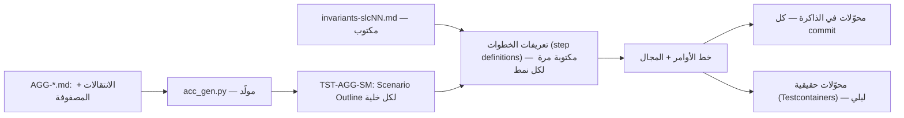
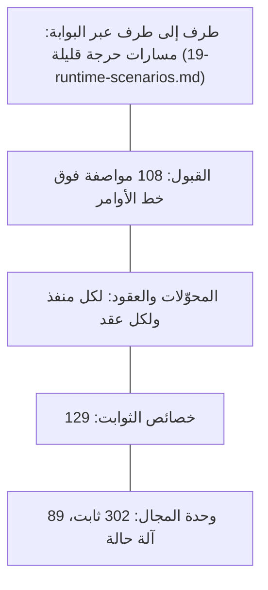

# استراتيجية الاختبار

المواصفة نفسها مصدر الاختبارات. مواصفات القبول وخصائص الثوابت وFitness functions وسيناريوهات الجودة كتبت في مرحلة الدراسة بصيغة قابلة للتنفيذ، ومهمة هذا الملف أن يحدد كيف تصير اختبارات تعمل، وأين تعمل، ومتى تكسر البناء. لا كود هنا. والأدوات المقترحة معلَّمة **[Derived]** لأن المصادر لا تسميها إلا لاختبار الحمل.

## 1. المبادئ

| المبدأ | القاعدة | المصدر |
|---|---|---|
| الاختبار من المواصفة | كل خلية في مصفوفة الحالة × الأمر اختبار؛ كل خاصية ثابت اختبار خصائص؛ كل Fitness function فحص في CI | `16-reports/IMPLEMENTATION-READINESS-R1.md` |
| لا نجاح في المسار الطبيعي وحده | القبول يغطي المسار الطبيعي، وكل انتقال ممنوع، وكل قرار صلاحية (ALLOW / DENY / REDACT…)، وسيناريو استدلال أمني واحدًا على الأقل حيث يوجد استرجاع | V6 §2.2، §20 (G6-SLC)، القاعدة 60 |
| لكل خاصية جودة طريقة تحقق | 95 سيناريو جودة، لكل منها طريقة وتوقيت | V6 القاعدة 57؛ `quality-verification-matrix.md` |
| المخالفة تكسر البناء | Fitness function بمستوى ERROR تكسر البناء، والاستثناء يتطلب ADR | `fitness-functions.md` |
| المجال يُختبر دون بنية | 302 ثابت و89 آلة حالة تعمل في اختبارات وحدة عادية دون قاعدة بيانات أو وسيط | ADR-P17 |
| كل اختبار متتبع | مواصفة القبول تحمل `traces.verifies` (REQ، QAS، AGG)، والمصفوفة في `25-traceability-matrix.md` تُبنى منها | `25-traceability-matrix.md` §1 |

## 2. محفظة الاختبارات

| النوع | النطاق (الحلقة) | المصدر في المواصفة | الحجم | الأداة المقترحة **[Derived]** | متى |
|---|---|---|---|---|---|
| وحدة المجال | Domain | الثوابت (`INV-*`) ومصفوفات الحالة في `AGG-*.md` | 302 ثابت، 89 آلة حالة | Vitest (TypeScript)؛ pytest لطرق التحليل (TD-15) | كل commit |
| خصائص الثوابت | Domain | `invariant-properties-slcNN.md` (`PROP-SLCnn`): تسلسل أوامر عشوائي صالح وغير صالح بفاعلين وأزمنة متعددة، والتحقق بعد كل خطوة | 129 خاصية في 19 ملفًا | fast-check؛ Hypothesis لـPython | كل commit |
| القبول (Gherkin) | التطبيق | `13-verification/acceptance/SLC-*/`: 89 مواصفة آلة حالة (`TST-<AGG>-SM`) و19 مواصفة ثوابت (`TST-SLCnn-INVARIANTS`) | 108 ملفات: ≈ 600 انتقال مسموح، ≈ 1,923 رفضًا، 175 انتقال `SYS:`، ≈ 305 سيناريو ثوابت | Cucumber (cucumber-js) فوق خط الأوامر | كل commit (بمحوّلات في الذاكرة)؛ ليلي (بمحوّلات حقيقية) |
| خط الأوامر | التطبيق | ADR-P17 (الخطوات العشر)، ADR-P19، `18-error-handling.md` §4 | لكل خطوة ولكل نتيجة تخويل | Vitest | كل commit |
| المحوّلات | المحوّلات | منافذ `11-hexagonal-reference.md` §5 | لكل منفذ ومحوّل | Testcontainers بصور من Harbor الداخلي (PostgreSQL مع RLS، Kafka، OPA، OpenSearch) | كل commit للوحدة المعنية |
| العقود | الحدود | `05-contracts/` (OpenAPI 3.1، AsyncAPI 3)؛ FIT-13، FIT-14، FIT-20 | 29 عقد OpenAPI، 19 AsyncAPI | openapi-spec-validator (مستعمل في الدراسة)؛ فحص توافق الإصدارات | كل commit |
| فحوص البنية | المستودع | `fitness-functions.md` | 20 قاعدة (FIT-01..20) | تحليل اعتماديات ثابت؛ lint للمخطط والعقود | كل commit؛ بعضها مجدول (§4) |
| الأمن | النظام | مجموعة عدم الاستدلال (P-51..53، QAS-SEC-002)، اختبارات جداول القرار (INV-POL-04)، 403/404 (ADR-P19)، اختبار الاختراق | 13 سيناريو QAS-SEC | مولِّد حالات للاستدلال + قياس التوقيت | CI + قبل G8 |
| الأداء | النظام | `07-quality/performance-test-strategy.md` | 8 أنواع اختبار | k6 أو Gatling (المصدر)، القياس بـOpenTelemetry | قبل الإنتاج + Pilot |
| المرونة والفوضى | النظام | FIT-16، QAS-REL-001..004، مصفوفات `degradation-slc*.md`، ADR-P20 | لكل مصفوفة تدهور | حقن أعطال في Kubernetes | ليلي + قبل الإنتاج |
| التعافي والاستعادة | الخلية | `dr-and-continuity.md`، FIT-19، REQ-PLT-012 | لكل طبقة خدمة | سكربتات استعادة مجدولة | أسبوعي (استعادة)، ربع سنوي (DR) |
| الميدان ودون اتصال | الجهاز + DU-10 | P-111..116، `invariants-slc11.md`، FIT-15، QAS-OFF-001..003 | 6 خصائص، 16 سيناريو | حقن انقطاع في النقل؛ اختبار أجهزة | CI + Pilot ميداني |
| تقييم الذكاء الاصطناعي | DU-16 | AGG-EVAL-SUITE، AGG-MODEL-VERSION، QAS-AI-001..005 | ≥ 500 بند لكل مجموعة | مشغِّل مجموعات التقييم | قبل G7-R2 ولكل ترقية نموذج |
| قابلية الاستخدام والوصول | الواجهات | QAS-USA-001/002، QAS-ACC-001، REQ-PLT-010/011 | — | تدقيق WCAG 2.2 AA آلي ويدوي؛ اختبار مع 10 مستخدمين ميدانيين | قبل G8 + Pilot |

### 2.1 كيف تصير مواصفة القبول اختبارًا

- **الخطوات عامة لا لكل أمر.** المواصفات المولَّدة تستعمل جملًا ثابتة («When the actor sends <command> with a new Idempotency-Key and If-Match <v>»، «Then the command is rejected with <error> and HTTP 409»، «And exactly one <event> is written to the outbox»)، فتكفي مجموعة صغيرة من تعريفات الخطوات لكل الـ1,923 حالة رفض **[Derived]**.
- **انتقالات `SYS:`** تُختبر بإطلاق المحفِّز بهوية عبء عمل («When the system trigger <trigger> occurs under a workload identity»). مواصفات SLC-19 المكتوبة يدويًا تختبرها بسيناريوهات سردية (DEBT-002).
- **السياسة جزء من الاختبار.** خطوة الخلفية («an authorized actor») تحمّل حزمة السياسات الأساسية نفسها في OPA المضمَّن، فاختبار القبول يمر بقرار تخويل حقيقي لا بمحاكاة.

## 3. الهرم حسب الحلقة

الطبقات السفلى سريعة وتعمل في كل commit. الطرفي قليل ومقصور على السيناريوهات الاثني عشر في `19-runtime-scenarios.md`، لأن القبول يغطي السلوك فوق خط الأوامر نفسه **[Derived]** من `11-hexagonal-reference.md` §9.

## 4. خط CI

```mermaid
flowchart LR
  C["commit"] --> S1["المواصفة: lint (SL-*) + ذهاب وإياب المولِّدات (V5)"]
  S1 --> S2["البناء: contracts/ = مخرج المولِّد (FIT-20)"]
  S2 --> S3["وحدة + خصائص"]
  S3 --> S4["البنية: FIT-01، 02، 06، 07، 08، 09، 10، 13، 17، 20"]
  S4 --> S5["العقود: التحقق + التوافق (FIT-14)"]
  S5 --> S6["القبول بمحوّلات في الذاكرة"]
  S6 --> S7["المحوّلات (Testcontainers) للوحدات المتغيرة"]
  S7 --> S8["مرحلة الشبكة المعزولة (FIT-12)"]
  S8 --> M["دمج"]
  M --> N["ليلي: القبول بمحوّلات حقيقية، FIT-03 (call graph)، FIT-04، FIT-05، FIT-15، FIT-16 (فوضى)، FIT-11 (إعادة البناء)، اختبار حمل مصغر"]
  N --> W["مجدول: الاستعادة الأسبوعية، FIT-19، تمرين DR ربع سنوي، مجموعة عدم الاستدلال الكاملة"]
```

توزيع Fitness functions على المراحل مقترح **[Derived]**. المصادر تسمي مرحلة CI صراحة لـFIT-12 وFIT-20 فقط، وتجعل FIT-11 وFIT-19 مجدولتين، وتكتفي للباقي بتسمية التقنية (`fitness-functions.md`). القاعدة: الفحص الثابت في كل commit، وما يحتاج تشغيل النظام ليلي، وما يحتاج الخلية كاملة مجدول.

## 5. سيناريوهات الجودة: متى تُتحقق

`15-traceability/quality-verification-matrix.md` يعطي لكل سيناريو من الـ95 طريقة تحقق وتوقيتًا. التوقيتات مجمّعة:

| يبدأ في | السيناريوهات | منها ما يتكرر لاحقًا | أكثر الطرق |
|---|---|---|---|
| CI (كل commit أو ليلي) | 44 | 36 تتكرر قبل الإنتاج أو في Pilot | oracle زمني، توافق العقود، مجموعات الثوابت، أمن + عدم استدلال (13، ثم اختراق قبل G8)، فوضى ليلية (4) |
| قبل الإنتاج (pre-G7 / pre-G8، ومنها الربع سنوي) | 42 | معظمها يتكرر في Pilot | اختبار حمل (21)، قابلية التوسع والاندفاع (5)، تمارين DR، تقييم الذكاء الاصطناعي (5) |
| Pilot (شهري أو ميداني) | 9 | — | قابلية الاستخدام، الكلفة الشهرية |

البيئات من `22-deployment-design.md` §8: CI في بيئة التكامل، و«قبل الإنتاج» في بيئة ما قبل الإنتاج بحجم الإنتاج، وPilot في خلية الإنتاج.

## 6. اختبارات ناقصة يجب إضافتها

| البند | لماذا | الاختبارات المقترحة |
|---|---|---|
| ADR-P20 (إعادة المحاولة وDLQ) | `verified_by` فيه **[Missing]** | (1) فشل عابر يُعاد 5 مرات ثم ينجح دون تكرار الأثر؛ (2) رسالة مسمومة تذهب إلى DLQ ويوقف مفتاحها ويستمر غيره في القسم نفسه؛ (3) رسائل المفتاح الموقوف تُطبق بالترتيب بعد إعادة التشغيل؛ (4) تجاوز العتبة يوقف المستهلك ولا يملأ الـDLQ؛ (5) رسالة غير مطبَّقة على `security.versions` تبطل الذاكرة فيرفض الـPEP ولا يُوقف شيء؛ (6) أداة إعادة التشغيل لا تعرض الحمولة |
| ADR-P19 (نتائج التخويل) | السلوك الجديد بعد CR-75 | مورد غير مرئي → 404 بشكل غير الموجود وبتوقيت لا يختلف؛ مرئي → 403 بـ`reason_code` من القائمة المغلقة؛ إنشاء مرفوض → 403؛ `mfa` → 401 ثم نجاح بنفس المفتاح دون تنفيذ مزدوج |
| CR-80 (مفتاح عدم التكرار) | إصلاح أمني | مستخدمان في مستأجر واحد بنفس المفتاح: الثاني لا يتلقى استجابة الأول |
| FMEA | 69 نمط فشل بلا حقل «اختبار» رغم SL-18 | اختبار فوضى لكل نمط بشدة H (S-32) |

## 7. بيانات الاختبار

| القاعدة | التفصيل | المصدر |
|---|---|---|
| اصطناعية خارج الإنتاج | لا بيانات مستأجر في بيئات التطوير والتكامل وما قبل الإنتاج | `22-deployment-design.md` §8؛ TB-05 |
| بحجم التصميم للأداء | 1e8 ادعاء، 1e9 ملاحظة، أسماء عربية بتنوعاتها، ثم عينة Pilot حقيقية | `performance-test-strategy.md` |
| مجموعات مرجعية مُصدَّرة | oracle زمني (500 حالة، QAS-TMP-001)، مجموعة مطابقة الكيانات الموسومة عربي/إنجليزي/مختلط (INV-MRS-03)، اختبار السلطة (50 حالة)، الأهلية (40 حالة)، أسماء عربية (QAS-USA-002) | `claims-temporal-kernel.md`؛ `candidate-generation.md`؛ `requirements.md`؛ `language-model.md` |
| تقييم الذكاء الاصطناعي على بيانات المستأجر | مجموعة التقييم تضم عينات المستأجر قبل خدمته (INV-EVS-02)، وعتبات SLC-10 على بيانات حقيقية؛ لذلك يعمل التقييم داخل خلية المستأجر لا في بيئة اختبار **[Derived]** | AGG-EVAL-SUITE؛ `ENGINEERING-BASELINE-R2.md` |
| إخفاء الهوية | **[Missing]** — لا قاعدة في المصادر؛ مقترح: لا نسخ لبيانات الإنتاج إلى غيرها، فلا حاجة إلى إخفاء الهوية إلا لعينة Pilot داخل خليتها | — |

تمثيل مجموعة مطابقة الكيانات للبيانات الفعلية خطر مسجل (RSK-021).

## 8. معايير الاكتمال

- **لكل قصة:** اختبارات قبولها (الصفوف في Scenario Outline القصة) تمر، ومعها خصائص ثوابت شريحتها وفحوص البنية (`27-engineering-standards.md` §7).
- **لكل شريحة (G6-SLC ثم الدمج):** كل مواصفات القبول والخصائص للشريحة تمر بمحوّلات حقيقية، ولا مخالفة ERROR، وصفوفها في `25-traceability-matrix.md` بلا متطلب بلا تحقق.
- **لكل إصدار (G8):** نجاح حملة الأداء والتعافي واختبار الاختراق ومجموعة عدم الاستدلال تحت الحمل (`IMPLEMENTATION-READINESS-R1.md`).

## 9. فجوات

| البند | الحالة |
|---|---|
| وثائق التحقق المخططة في V6 §8 (`verification-strategy.md`، `security-verification.md`، `ai-evaluation.md`) وخطة التحقق W9 | **[Missing]** — هذا الملف يغطي الأولى؛ الأمن والذكاء الاصطناعي في §2 هنا وفي `17-security-design.md` (S-32) |
| حقل الاختبار في FMEA | **[Missing]** رغم SL-18 (S-32) |
| أطر الاختبار وأهداف التغطية | **[Missing]** — الأدوات في §2 مقترحة؛ لا هدف تغطية رقمي، والمعيار تغطية المواصفة (كل خلية وخاصية) لا نسبة الأسطر **[Derived]** |
| عقود يقودها المستهلك (consumer-driven) | لا حاجة في مستودع واحد: المنتج والمستهلك يتغيران في نفس الـcommit (`13-project-structure.md` §6) **[Derived]** |
| عدد ملفات القبول | ADR-P17 يقول «89 ملفًا» وهي آلات الحالة وحدها؛ المجموع 108 مع ملفات الثوابت (S-33) |
| عدد Fitness functions | `ENGINEERING-BASELINE-R1.md` ما زال يقول 19؛ هي 20 بعد FIT-20 (S-33) |
| طريقة تحقق QAS-OPS-002/003 | مربوطة بـ«air-gapped install/upgrade/rollback rehearsal» ولا تخص التصعيد وصندوق الوارد (S-30) |
| معنى G7 في استراتيجية الأداء | يساويها بالإنتاج خلافًا لـ`RATIFICATION-PACKAGE.md` (S-31) |
