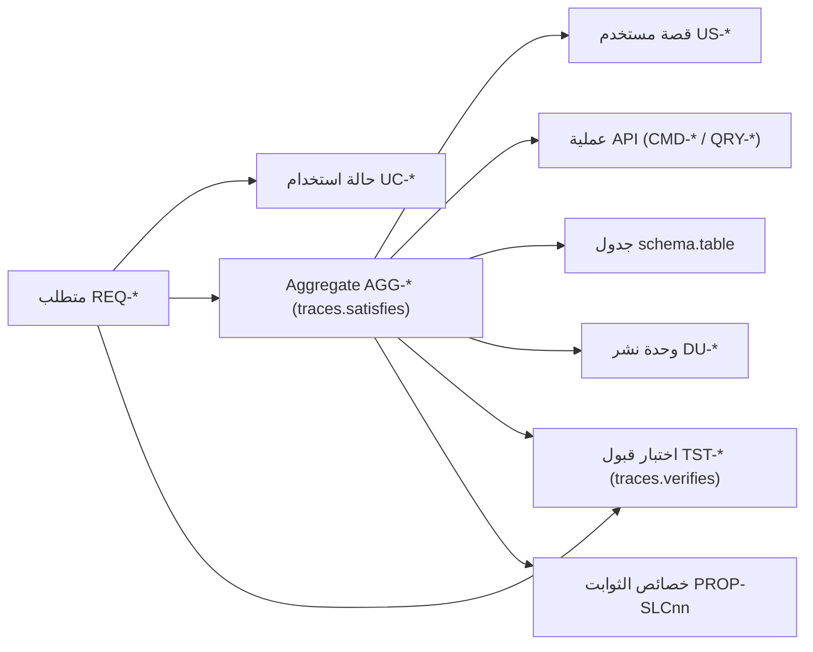

# مصفوفة التتبع

تربط كل متطلب بما يحققه ويتحقق منه، عبر سلسلة واحدة:

## 1. كيف تُبنى

| الحلقة | المصدر | القاعدة |
|---|---|---|
| متطلب ← حالة استخدام | حقل `use_cases` في `02-requirements/requirements.md` | كما في المصدر |
| متطلب ← Aggregate | `traces.satisfies` في كل `AGG-*.md` | المتطلب الذي يحققه الـAggregate؛ هو الحلقة المركزية في التصميم |
| Aggregate ← قصة | القصص المولَّدة في `05-user-stories/` (أمر، استعلام، انتقال `SYS:`) | كل قصة تُنسب إلى الـAggregate الذي تقع تحته |
| Aggregate ← عملية API | `x-aggregate` للأوامر؛ الـAggregate صاحب المورد للاستعلامات (`14-api-design.md`) | العمليات العابرة للـAggregates مسرودة منفصلة |
| Aggregate ← جدول | الجدول الرئيسي في `06-data/logical-model/` (`16-database-schema.md`) | جدول واحد رئيسي لكل Aggregate |
| Aggregate ← وحدة نشر | توزيع `12-components.md` §2 | Aggregate واحد لا يُقسَّم بين وحدتين |
| متطلب / Aggregate ← اختبار | `traces.verifies` و`generated_from` في مواصفات القبول؛ وملف خصائص الثوابت لكل شريحة | الاختبار «المباشر» يسمّي المتطلب؛ و«عبر الـAggregate» يختبر الـAggregate الذي يحققه |

المصفوفة مولَّدة من المصادر في كل تشغيل، فلا تُعدَّل يدويًا. ملفات التتبع المعتمدة في `15-traceability/` (rtm وtrace لكل شريحة) هي مرجع المصدر لعمود `design_elements`. والفروق بينها وبين `traces.satisfies` مسجلة في S-22 (`03-requirements-analysis.md` §3.4).

## 2. القراءة

- **متطلب بلا Aggregate** ليس فجوة بالضرورة. متطلبات المنصة والجودة (CAP-14 مثلًا) تتحقق في `platform/` وبـFitness functions والقياس، لا بـAggregate (`24-testing-strategy.md` §4).
- **متطلب بلا اختبار قبول** يحتاج اختبارًا في خطة الاختبار: إما مواصفة قبول جديدة، أو ربطه بـFitness function أو بسيناريو جودة في `15-traceability/quality-verification-matrix.md`.
- **الاختبار عبر الـAggregate** يغطي سلوك الـAggregate كله (مصفوفة الحالة × الأمر). أما ربطه بمتطلب بعينه فيأتي من `traces.verifies`.

## 3. استعمالها في التنفيذ

- عند تغيير متطلب: الصف في §4.2 يسمّي الـAggregates والقصص والعمليات والجداول والوحدات والاختبارات المتأثرة.
- عند تغيير Aggregate: الصف في §4.3 يسمّي المتطلبات التي يمسها التغيير.
- في مراجعة الكود: كل Pull Request يذكر القصة (US-*) أو المتطلب (REQ-*) الذي ينفذه (`27-engineering-standards.md`)، فيُتتبع من هنا.

## 4. المصفوفة المولَّدة

<!-- BEGIN GENERATED: build_analysis_design.py -->

### 4.1 التغطية

| الحلقة | R1 | R2 | R3 | المجموع |
|---|---|---|---|---|
| المتطلبات | 114 | 51 | 45 | 210 |
| ← حالة استخدام | 85 | 51 | 45 | 181 |
| ← Aggregate (تصميم) | 88 | 50 | 35 | 173 |
| ← قصة مستخدم | 88 | 50 | 35 | 173 |
| ← عملية API | 88 | 50 | 35 | 173 |
| ← جدول | 87 | 50 | 35 | 172 |
| ← وحدة نشر | 88 | 50 | 35 | 173 |
| ← اختبار قبول (مباشر أو عبر الـAggregate) | 99 | 51 | 37 | 187 |
| ← اختبار قبول يسمّي المتطلب مباشرة | 99 | 51 | 37 | 187 |

**بلا Aggregate (37):** REQ-AI-014, REQ-FND-010, REQ-FND-013, REQ-FND-015, REQ-FND-016, REQ-GOV-002, REQ-GOV-005, REQ-INF-023, REQ-INF-029, REQ-INF-030, REQ-INF-031, REQ-LOG-010, REQ-LOG-011, REQ-LOG-012, REQ-PLT-001, REQ-PLT-002, REQ-PLT-003, REQ-PLT-004, REQ-PLT-005, REQ-PLT-006, REQ-PLT-007, REQ-PLT-008, REQ-PLT-009, REQ-PLT-010, REQ-PLT-011, REQ-PLT-012, REQ-PLT-013, REQ-RCM-014, REQ-RCM-015, REQ-RCM-016, REQ-SIT-007, REQ-SRC-001, REQ-SRC-002, REQ-TRX-012, REQ-TRX-013, REQ-TRX-014, REQ-TRX-015 — متطلبات منصة أو جودة تتحقق في `platform/` أو بـFitness functions والقياس (`24-testing-strategy.md` §4).

**بلا مواصفة قبول (23)** — وطريقة تحققها في ملفات التتبع المعتمدة (`15-traceability/`):

| المتطلب | التحقق في المصدر |
|---|---|
| REQ-GOV-002 | contract lint: creation commands of explicit-label aggregates require label |
| REQ-GOV-005 | egress monitoring test in W9 verification plan |
| REQ-LOG-010 | contract lint (OpenAPI operationId presence, allowed_scope enforcement) |
| REQ-LOG-011 | contract lint (OpenAPI operationId presence, allowed_scope enforcement) |
| REQ-LOG-012 | contract lint (OpenAPI operationId presence) |
| REQ-PLT-001 | isolated-network CI stage |
| REQ-PLT-002 | same-release acceptance across shared/dedicated/sovereign modes |
| REQ-PLT-003 | QAS-OBS-001 trace test |
| REQ-PLT-004 | DR drills per tier (W9 plan) |
| REQ-PLT-005 | API lint: no synchronous heavy operations (operations list) |
| REQ-PLT-006 | fault-injection test at commit |
| REQ-PLT-007 | contract compatibility check |
| REQ-PLT-008 | OpenAPI lint |
| REQ-PLT-009 | OpenAPI lint |
| REQ-PLT-010 | bilingual/RTL UI review (W9) |
| REQ-PLT-011 | UI acceptance (W9) |
| REQ-PLT-012 | scheduled restore tests (W9 plan) |
| REQ-PLT-013 | monthly per-tenant cost report (W9) |
| REQ-RCM-014 | contract lint (OpenAPI operationId presence, allowed_scope enforcement) |
| REQ-RCM-015 | contract lint (OpenAPI operationId presence, allowed_scope enforcement) |
| REQ-RCM-016 | contract lint (OpenAPI operationId presence) |
| REQ-TRX-014 | contract lint (OpenAPI operationId presence, allowed_scope enforcement) |
| REQ-TRX-015 | contract lint (OpenAPI operationId presence) |

**بلا أي تحقق مسمّى (0):** لا شيء.

الاختبارات: 108 مواصفة قبول في `13-verification/acceptance/` و19 ملف خصائص ثوابت (`invariant-properties-*.md`).

### 4.2 لكل متطلب

القصص والعمليات بالعدد (تفاصيلها في `05-user-stories/` و`14-api-design.md`)؛ الاختبارات: المباشرة ثم «/» ثم ما يأتي عبر الـAggregate.

#### CAP-01

| المتطلب | الإصدار | حالات الاستخدام | الـAggregates | قصص | عمليات | الجداول | الوحدات | الاختبارات |
|---|---|---|---|---|---|---|---|---|
| REQ-FND-001 | R1 | UC-080 | TENANT | 12 | 12 | `foundation.tenants` | DU-02 | TST-SLC01-INVARIANTS, TST-TENANT-SM |
| REQ-FND-002 | R1 | UC-081 | ORGANIZATION | 9 | 9 | `foundation.organizations` | DU-02 | TST-ORGANIZATION-SM |
| REQ-FND-003 | R1 | UC-080 | TENANT | 12 | 12 | `foundation.tenants` | DU-02 | TST-SLC01-INVARIANTS, TST-TENANT-SM |
| REQ-FND-004 | R1 | UC-080 | TENANT | 12 | 12 | `foundation.tenants` | DU-02 | TST-TENANT-SM |
| REQ-FND-005 | R1 | UC-084 | USER | 13 | 13 | `foundation.users` | DU-02 | TST-USER-SM |
| REQ-FND-006 | R1 | UC-084 | PERSON, SERVICE-ACCOUNT, USER | 23 | 23 | `foundation.persons`, `foundation.service_accounts`, `foundation.users` | DU-02 | TST-PERSON-SM, TST-SERVICE-ACCOUNT-SM, TST-USER-SM |
| REQ-FND-007 | R1 | UC-082 | AUTHORITY-GRANT | 10 | 9 | `foundation.authority_grants` | DU-02 | TST-AUTHORITY-GRANT-SM |
| REQ-FND-008 | R1 | UC-083 | AUTHORITY-GRANT | 10 | 9 | `foundation.authority_grants` | DU-02 | TST-AUTHORITY-GRANT-SM, TST-SLC01-INVARIANTS |
| REQ-FND-009 | R1 | UC-032, UC-035 | AUTHORITY-GRANT | 10 | 9 | `foundation.authority_grants` | DU-02 | TST-AUTHORITY-GRANT-SM, TST-SLC01-INVARIANTS |
| REQ-FND-010 | R1 | — | — | — | — | — | — | TST-SLC01-INVARIANTS, TST-SLC05-INVARIANTS |
| REQ-FND-011 | R1 | UC-086 | POLICY-SET, ROLE-ASSIGNMENT | 11 | 8 | `foundation.role_assignments`, `governance.policy_sets` | DU-02, DU-03 | TST-POLICY-SET-SM, TST-ROLE-ASSIGNMENT-SM |
| REQ-FND-012 | R1 | UC-086 | POLICY-SET | 8 | 6 | `governance.policy_sets` | DU-03 | TST-POLICY-SET-SM |
| REQ-FND-013 | R1 | — | — | — | — | — | — | TST-SLC01-INVARIANTS |
| REQ-FND-014 | R1 | UC-086 | ROLE | 4 | 4 | `foundation.roles` | DU-02 | TST-ROLE-SM |
| REQ-INT-004 | R2 | UC-084 | HR-SYNC-PROPOSAL | 6 | 3 | `foundation.hr_sync_proposals` | DU-02 | TST-HR-SYNC-PROPOSAL-SM, TST-SLC16-INVARIANTS |

#### CAP-02

| المتطلب | الإصدار | حالات الاستخدام | الـAggregates | قصص | عمليات | الجداول | الوحدات | الاختبارات |
|---|---|---|---|---|---|---|---|---|
| REQ-COL-001 | R2 | UC-120 | COLLECTION-REQUIREMENT | 13 | 11 | `information.collection_requirements` | DU-04 | TST-COLLECTION-REQUIREMENT-SM, TST-SLC14-INVARIANTS |
| REQ-COL-002 | R2 | UC-121 | COLLECTION-PLAN | 8 | 7 | `information.collection_plans` | DU-04 | TST-COLLECTION-PLAN-SM, TST-SLC14-INVARIANTS |
| REQ-COL-003 | R2 | UC-122 | COLLECTION-REQUIREMENT | 13 | 11 | `information.collection_requirements` | DU-04 | TST-COLLECTION-REQUIREMENT-SM, TST-SLC14-INVARIANTS |
| REQ-INF-001 | R1 | UC-004, UC-095 | SOURCE | 9 | 9 | `information.sources` | DU-04 | TST-SLC02-INVARIANTS, TST-SOURCE-SM |
| REQ-INF-002 | R1 | UC-005 | OBSERVATION | 8 | 8 | `information.observations` | DU-05 | TST-OBSERVATION-SM, TST-SLC02-INVARIANTS |
| REQ-INF-003 | R1 | UC-005, UC-006 | ATTACHMENT, EVIDENCE | 14 | 11 | `information.attachments`, `information.evidence` | DU-04, DU-05 | TST-ATTACHMENT-SM, TST-EVIDENCE-SM, TST-SLC02-INVARIANTS |
| REQ-INF-004 | R1 | UC-006 | ATTACHMENT, EVIDENCE | 14 | 11 | `information.attachments`, `information.evidence` | DU-04, DU-05 | TST-ATTACHMENT-SM, TST-EVIDENCE-SM, TST-SLC02-INVARIANTS |
| REQ-INF-005 | R1 | UC-094 | ADAPTER, IMPORT-BATCH | 16 | 12 | `information.import_batches`, `integration.adapters` | DU-05, DU-11 | TST-ADAPTER-SM, TST-IMPORT-BATCH-SM, TST-SLC02-INVARIANTS |
| REQ-INF-006 | R1 | UC-094 | IMPORT-BATCH | 9 | 5 | `information.import_batches` | DU-05 | TST-IMPORT-BATCH-SM, TST-SLC02-INVARIANTS |
| REQ-INF-007 | R1 | UC-094 | IMPORT-BATCH | 9 | 5 | `information.import_batches` | DU-05 | TST-IMPORT-BATCH-SM, TST-SLC02-INVARIANTS |
| REQ-INF-008 | R1 | UC-094 | ADAPTER, IMPORT-BATCH | 16 | 12 | `information.import_batches`, `integration.adapters` | DU-05, DU-11 | TST-ADAPTER-SM, TST-IMPORT-BATCH-SM, TST-SLC02-INVARIANTS |
| REQ-INF-009 | R1 | UC-094 | ADAPTER, IMPORT-BATCH | 16 | 12 | `information.import_batches`, `integration.adapters` | DU-05, DU-11 | TST-ADAPTER-SM, TST-IMPORT-BATCH-SM, TST-SLC02-INVARIANTS |
| REQ-INT-001 | R2 | UC-094 | INTEGRATION-CONNECTION | 10 | 8 | `integration.integration_connections` | DU-11 | TST-INTEGRATION-CONNECTION-SM, TST-SLC16-INVARIANTS |
| REQ-INT-002 | R2 | UC-094 | SENSOR-STREAM | 7 | 6 | `integration.sensor_streams` | DU-11 | TST-SENSOR-STREAM-SM, TST-SLC16-INVARIANTS |
| REQ-OFF-001 | R1 | UC-090 | SYNC-SESSION, TASK | 39 | 30 | `field.sync_sessions`, `operations.tasks` | DU-08, DU-10 | TST-SLC03-INVARIANTS, TST-SLC11-INVARIANTS, TST-SYNC-SESSION-SM, TST-TASK-SM |
| REQ-OFF-002 | R1 | UC-090 | PRELOAD-PACKAGE | 8 | 4 | `field.preload_packages` | DU-10 | TST-PRELOAD-PACKAGE-SM, TST-SLC11-INVARIANTS |
| REQ-OFF-003 | R1 | UC-091 | SYNC-SESSION | 7 | 3 | `field.sync_sessions` | DU-10 | TST-SLC11-INVARIANTS, TST-SYNC-SESSION-SM |
| REQ-OFF-004 | R1 | UC-092 | SYNC-CONFLICT, SYNC-SESSION | 14 | 9 | `field.sync_conflicts`, `field.sync_sessions` | DU-10 | TST-SLC11-INVARIANTS, TST-SYNC-CONFLICT-SM, TST-SYNC-SESSION-SM |
| REQ-OFF-005 | R1 | UC-093 | DEVICE, PRELOAD-PACKAGE | 17 | 12 | `field.preload_packages`, `foundation.devices` | DU-02, DU-10 | TST-DEVICE-SM, TST-PRELOAD-PACKAGE-SM, TST-SLC11-INVARIANTS |
| REQ-OFF-006 | R1 | UC-091 | SYNC-SESSION | 7 | 3 | `field.sync_sessions` | DU-10 | TST-SLC11-INVARIANTS, TST-SYNC-SESSION-SM |

#### CAP-03

| المتطلب | الإصدار | حالات الاستخدام | الـAggregates | قصص | عمليات | الجداول | الوحدات | الاختبارات |
|---|---|---|---|---|---|---|---|---|
| REQ-INF-020 | R1 | UC-001, UC-002, UC-003 | ENTITY, REALWORLD-EVENT | 17 | 17 | `information.entities`, `information.realworld_events` | DU-04 | TST-ENTITY-SM, TST-REALWORLD-EVENT-SM, TST-SLC02-INVARIANTS |
| REQ-INF-021 | R1 | UC-006 | CLAIM, ENTITY, EVIDENCE-LINK | 20 | 20 | `information.claims`, `information.entities`, `information.evidence_links` | DU-04 | TST-CLAIM-SM, TST-ENTITY-SM, TST-EVIDENCE-LINK-SM, TST-SLC02-INVARIANTS |
| REQ-INF-022 | R1 | — | CLAIM | 7 | 7 | `information.claims` | DU-04 | TST-CLAIM-SM, TST-SLC02-INVARIANTS |
| REQ-INF-023 | R1 | UC-096 | — | — | — | — | — | TST-SLC02-INVARIANTS |
| REQ-INF-024 | R1 | — | CLAIM, CONFLICT | 18 | 15 | `information.claims`, `information.conflicts` | DU-04 | TST-CLAIM-SM, TST-CONFLICT-SM, TST-SLC02-INVARIANTS, TST-SLC04-INVARIANTS |
| REQ-INF-025 | R1 | UC-008 | CONFLICT | 11 | 8 | `information.conflicts` | DU-04 | TST-CONFLICT-SM, TST-SLC04-INVARIANTS |
| REQ-INF-026 | R1 | — | CLAIM | 7 | 7 | `information.claims` | DU-04 | TST-CLAIM-SM, TST-SLC02-INVARIANTS |
| REQ-INF-027 | R1 | UC-003 | RELATIONSHIP | 4 | 4 | `information.relationships` | DU-04 | TST-RELATIONSHIP-SM, TST-SLC02-INVARIANTS, TST-SLC05-INVARIANTS |
| REQ-INF-028 | R1 | — | OBSERVATION | 8 | 8 | `information.observations` | DU-05 | TST-OBSERVATION-SM, TST-SLC02-INVARIANTS |
| REQ-INF-029 | R1 | — | — | — | — | — | — | TST-SLC02-INVARIANTS |
| REQ-INF-030 | R1 | UC-096 | — | — | — | — | — | TST-SLC02-INVARIANTS |
| REQ-INF-031 | R1 | — | — | — | — | — | — | TST-SLC02-INVARIANTS |
| REQ-INF-032 | R1 | UC-007 | ER-CASE, MATCH-RULESET | 18 | 16 | `information.er_cases`, `information.match_rulesets` | DU-04 | TST-ER-CASE-SM, TST-MATCH-RULESET-SM, TST-SLC04-INVARIANTS |
| REQ-INF-033 | R1 | UC-007 | ER-CASE | 13 | 12 | `information.er_cases` | DU-04 | TST-ER-CASE-SM, TST-SLC04-INVARIANTS |
| REQ-INF-034 | R1 | UC-104 | ER-CASE | 13 | 12 | `information.er_cases` | DU-04 | TST-ER-CASE-SM, TST-SLC04-INVARIANTS |
| REQ-INF-035 | R1 | — | ANALYSIS-RUN, FINDING | 12 | 9 | `intelligence.analysis_runs`, `intelligence.findings` | DU-06 | TST-ANALYSIS-RUN-SM, TST-FINDING-SM, TST-SLC02-INVARIANTS, TST-SLC07-INVARIANTS |
| REQ-INF-036 | R1 | — | ENTITY, EXTERNAL-ID | 14 | 14 | `information.entities`, `information.external_ids` | DU-04 | TST-ENTITY-SM, TST-EXTERNAL-ID-SM, TST-SLC02-INVARIANTS |
| REQ-INF-037 | R1 | — | CLAIM | 7 | 7 | `information.claims` | DU-04 | TST-CLAIM-SM, TST-SLC02-INVARIANTS |
| REQ-SRC-001 | R1 | UC-097 | — | — | — | — | — | TST-SLC05-INVARIANTS |
| REQ-SRC-002 | R1 | UC-097 | — | — | — | — | — | TST-SLC05-INVARIANTS |
| REQ-SRC-003 | R1 | UC-097 | MATCH-RULESET | 5 | 4 | `information.match_rulesets` | DU-04 | TST-MATCH-RULESET-SM, TST-SLC04-INVARIANTS, TST-SLC05-INVARIANTS |
| REQ-SRC-004 | R1 | UC-078 | PROJECTION-VERSION | 9 | 5 | — | DU-09 | TST-PROJECTION-VERSION-SM, TST-SLC05-INVARIANTS |

#### CAP-04

| المتطلب | الإصدار | حالات الاستخدام | الـAggregates | قصص | عمليات | الجداول | الوحدات | الاختبارات |
|---|---|---|---|---|---|---|---|---|
| REQ-ANL-001 | R1 | UC-010, UC-011, UC-012 | ANALYSIS-CASE | 18 | 18 | `intelligence.analysis_cases` | DU-06 | TST-ANALYSIS-CASE-SM, TST-SLC07-INVARIANTS |
| REQ-ANL-002 | R1 | UC-013 | ANALYSIS-METHOD, ANALYSIS-RUN | 13 | 10 | `intelligence.analysis_methods`, `intelligence.analysis_runs` | DU-06 | TST-ANALYSIS-METHOD-SM, TST-ANALYSIS-RUN-SM, TST-SLC07-INVARIANTS |
| REQ-ANL-003 | R1 | UC-013 | ANALYSIS-METHOD, ANALYSIS-RUN | 13 | 10 | `intelligence.analysis_methods`, `intelligence.analysis_runs` | DU-06 | TST-ANALYSIS-METHOD-SM, TST-ANALYSIS-RUN-SM, TST-SLC07-INVARIANTS |
| REQ-ANL-004 | R1 | UC-013 | ANALYSIS-RUN | 8 | 5 | `intelligence.analysis_runs` | DU-06 | TST-ANALYSIS-RUN-SM, TST-SLC07-INVARIANTS |
| REQ-ANL-005 | R1 | UC-015, UC-014 | ASSESSMENT, FINDING | 14 | 13 | `intelligence.assessment_versions`, `intelligence.findings` | DU-06 | TST-ASSESSMENT-SM, TST-FINDING-SM, TST-SLC07-INVARIANTS |
| REQ-ANL-006 | R1 | UC-015 | ASSESSMENT | 10 | 9 | `intelligence.assessment_versions` | DU-06 | TST-ASSESSMENT-SM, TST-SLC07-INVARIANTS |
| REQ-ANL-007 | R1 | UC-016 | ANALYSIS-CASE | 18 | 18 | `intelligence.analysis_cases` | DU-06 | TST-ANALYSIS-CASE-SM, TST-SLC07-INVARIANTS |
| REQ-ANL-008 | R1 | — | ASSESSMENT | 10 | 9 | `intelligence.assessment_versions` | DU-06 | TST-ASSESSMENT-SM, TST-SLC07-INVARIANTS |
| REQ-FUS-001 | R2 | UC-132 | CORRELATION-PROPOSAL, CORRELATION-RULE | 12 | 10 | `information.correlation_proposals`, `information.correlation_rules` | DU-04 | TST-CORRELATION-PROPOSAL-SM, TST-CORRELATION-RULE-SM, TST-SLC15-INVARIANTS |
| REQ-FUS-002 | R2 | UC-132 | CORRELATION-PROPOSAL | 8 | 6 | `information.correlation_proposals` | DU-04 | TST-CORRELATION-PROPOSAL-SM, TST-SLC15-INVARIANTS |

#### CAP-05

| المتطلب | الإصدار | حالات الاستخدام | الـAggregates | قصص | عمليات | الجداول | الوحدات | الاختبارات |
|---|---|---|---|---|---|---|---|---|
| REQ-SIT-001 | R1 | UC-020 | SITUATION | 12 | 12 | `intelligence.situations` | DU-06 | TST-SITUATION-SM, TST-SLC06-INVARIANTS |
| REQ-SIT-002 | R1 | UC-021, UC-022 | SITUATION | 12 | 12 | `intelligence.situations` | DU-06 | TST-SITUATION-SM, TST-SLC06-INVARIANTS |
| REQ-SIT-003 | R1 | UC-024, UC-098 | SITUATION | 12 | 12 | `intelligence.situations` | DU-06 | TST-SITUATION-SM, TST-SLC06-INVARIANTS |
| REQ-SIT-004 | R1 | UC-023 | ALERT, ALERT-RULE | 14 | 10 | `intelligence.alert_rules`, `intelligence.alerts` | DU-06 | TST-ALERT-RULE-SM, TST-ALERT-SM, TST-SLC06-INVARIANTS |
| REQ-SIT-005 | R1 | UC-023 | ALERT | 8 | 4 | `intelligence.alerts` | DU-06 | TST-ALERT-SM, TST-SLC06-INVARIANTS |
| REQ-SIT-006 | R1 | — | ALERT | 8 | 4 | `intelligence.alerts` | DU-06 | TST-ALERT-SM, TST-SLC06-INVARIANTS |
| REQ-SIT-007 | R1 | UC-098 | — | — | — | — | — | TST-SLC06-INVARIANTS |

#### CAP-06

| المتطلب | الإصدار | حالات الاستخدام | الـAggregates | قصص | عمليات | الجداول | الوحدات | الاختبارات |
|---|---|---|---|---|---|---|---|---|
| REQ-CRD-001 | R2 | UC-130 | COORDINATION-CASE | 12 | 11 | `operations.coordination_cases` | DU-08 | TST-COORDINATION-CASE-SM, TST-SLC15-INVARIANTS |
| REQ-CRD-002 | R2 | UC-131 | COORDINATION-CASE | 12 | 11 | `operations.coordination_cases` | DU-08 | TST-COORDINATION-CASE-SM, TST-SLC15-INVARIANTS |
| REQ-DEC-001 | R1 | UC-030, UC-031 | DECISION-REQUEST | 9 | 7 | `operations.decision_requests` | DU-08 | TST-DECISION-REQUEST-SM, TST-SLC08-INVARIANTS |
| REQ-DEC-002 | R1 | UC-032 | DECISION | 5 | 4 | `operations.decisions` | DU-08 | TST-DECISION-SM, TST-SLC08-INVARIANTS |
| REQ-DEC-003 | R1 | UC-032 | DECISION | 5 | 4 | `operations.decisions` | DU-08 | TST-DECISION-SM, TST-SLC08-INVARIANTS |
| REQ-DEC-004 | R1 | UC-032 | DECISION | 5 | 4 | `operations.decisions` | DU-08 | TST-DECISION-SM, TST-SLC08-INVARIANTS |

#### CAP-07

| المتطلب | الإصدار | حالات الاستخدام | الـAggregates | قصص | عمليات | الجداول | الوحدات | الاختبارات |
|---|---|---|---|---|---|---|---|---|
| REQ-OPS-001 | R1 | UC-033 | PLAN, PLAN-VERSION | 23 | 20 | `operations.plan_versions`, `operations.plans` | DU-08 | TST-PLAN-SM, TST-PLAN-VERSION-SM, TST-SLC08-INVARIANTS |
| REQ-OPS-002 | R1 | UC-033, UC-035 | PLAN | 14 | 12 | `operations.plans` | DU-08 | TST-PLAN-SM, TST-SLC08-INVARIANTS |
| REQ-OPS-003 | R1 | UC-035, UC-036 | PLAN, PLAN-VERSION | 23 | 20 | `operations.plan_versions`, `operations.plans` | DU-08 | TST-PLAN-SM, TST-PLAN-VERSION-SM, TST-SLC08-INVARIANTS |
| REQ-OPS-004 | R1 | UC-034, UC-036 | PLAN-VERSION | 9 | 8 | `operations.plan_versions` | DU-08 | TST-PLAN-VERSION-SM, TST-SLC08-INVARIANTS |
| REQ-OPS-005 | R1 | UC-035 | PLAN-VERSION, ROLE-ASSIGNMENT | 12 | 10 | `foundation.role_assignments`, `operations.plan_versions` | DU-02, DU-08 | TST-PLAN-VERSION-SM, TST-ROLE-ASSIGNMENT-SM, TST-SLC08-INVARIANTS |
| REQ-OPS-006 | R1 | UC-040, UC-042, UC-043, UC-044, UC-045 | TASK | 32 | 27 | `operations.tasks` | DU-08 | TST-SLC03-INVARIANTS, TST-TASK-SM |
| REQ-OPS-007 | R1 | UC-041, UC-102 | TASK, TASK-TYPE | 37 | 32 | `operations.task_types`, `operations.tasks` | DU-08 | TST-SLC03-INVARIANTS, TST-TASK-SM, TST-TASK-TYPE-SM |
| REQ-OPS-008 | R1 | UC-045 | TASK | 32 | 27 | `operations.tasks` | DU-08 | TST-SLC03-INVARIANTS, TST-TASK-SM |
| REQ-OPS-009 | R1 | UC-044 | ROLE-ASSIGNMENT, TASK | 35 | 29 | `foundation.role_assignments`, `operations.tasks` | DU-02, DU-08 | TST-ROLE-ASSIGNMENT-SM, TST-SLC03-INVARIANTS, TST-TASK-SM |
| REQ-OPS-010 | R1 | UC-040 | TASK | 32 | 27 | `operations.tasks` | DU-08 | TST-SLC03-INVARIANTS, TST-TASK-SM |
| REQ-OPS-011 | R1 | — | TASK | 32 | 27 | `operations.tasks` | DU-08 | TST-SLC03-INVARIANTS, TST-TASK-SM |
| REQ-OPS-012 | R1 | UC-046 | TASK | 32 | 27 | `operations.tasks` | DU-08 | TST-SLC03-INVARIANTS, TST-TASK-SM |
| REQ-OPS-013 | R1 | UC-101 | OUTCOME-TRACKER | 5 | 2 | `operations.outcome_trackers` | DU-08 | TST-OUTCOME-TRACKER-SM, TST-SLC08-INVARIANTS |
| REQ-OPS-014 | R1 | UC-034, UC-044 | PLAN-VERSION, TASK-TYPE | 14 | 13 | `operations.plan_versions`, `operations.task_types` | DU-08 | TST-PLAN-VERSION-SM, TST-SLC03-INVARIANTS, TST-SLC08-INVARIANTS, TST-TASK-TYPE-SM |

#### CAP-08

| المتطلب | الإصدار | حالات الاستخدام | الـAggregates | قصص | عمليات | الجداول | الوحدات | الاختبارات |
|---|---|---|---|---|---|---|---|---|
| REQ-LOG-001 | R3 | UC-150 | LOGISTICS-REQUEST | 12 | 5 | `readiness.logistics_requests` | DU-14 | TST-LOGISTICS-REQUEST-SM, TST-SLC18-INVARIANTS |
| REQ-LOG-002 | R3 | UC-150 | LOGISTICS-REQUEST | 12 | 5 | `readiness.logistics_requests` | DU-14 | TST-LOGISTICS-REQUEST-SM, TST-SLC18-INVARIANTS |
| REQ-LOG-003 | R3 | UC-150 | LOGISTICS-REQUEST | 12 | 5 | `readiness.logistics_requests` | DU-14 | TST-LOGISTICS-REQUEST-SM, TST-SLC18-INVARIANTS |
| REQ-LOG-004 | R3 | UC-151 | SHIPMENT | 10 | 10 | `readiness.shipments` | DU-14 | TST-SHIPMENT-SM, TST-SLC18-INVARIANTS |
| REQ-LOG-005 | R3 | UC-151 | SHIPMENT | 10 | 10 | `readiness.shipments` | DU-14 | TST-SHIPMENT-SM |
| REQ-LOG-006 | R3 | UC-152 | SHIPMENT | 10 | 10 | `readiness.shipments` | DU-14 | TST-SHIPMENT-SM, TST-SLC18-INVARIANTS |
| REQ-LOG-007 | R3 | UC-152 | SHIPMENT | 10 | 10 | `readiness.shipments` | DU-14 | TST-SHIPMENT-SM |
| REQ-LOG-008 | R3 | UC-152 | LOGISTICS-REQUEST | 12 | 5 | `readiness.logistics_requests` | DU-14 | TST-LOGISTICS-REQUEST-SM, TST-SLC18-INVARIANTS |
| REQ-LOG-009 | R3 | UC-152 | LOGISTICS-REQUEST, SHIPMENT | 22 | 15 | `readiness.logistics_requests`, `readiness.shipments` | DU-14 | TST-LOGISTICS-REQUEST-SM, TST-SHIPMENT-SM, TST-SLC18-INVARIANTS |
| REQ-LOG-010 | R3 | UC-150 | — | — | — | — | — | — |
| REQ-LOG-011 | R3 | UC-151 | — | — | — | — | — | — |
| REQ-LOG-012 | R3 | UC-151 | — | — | — | — | — | — |
| REQ-LOG-013 | R3 | UC-150 | LOGISTICS-REQUEST | 12 | 5 | `readiness.logistics_requests` | DU-14 | TST-LOGISTICS-REQUEST-SM |
| REQ-LOG-014 | R3 | UC-150 | LOGISTICS-REQUEST | 12 | 5 | `readiness.logistics_requests` | DU-14 | TST-LOGISTICS-REQUEST-SM |
| REQ-RDY-001 | R1 | UC-102 | QUALIFICATION-RECORD | 7 | 6 | `readiness.qualification_records` | DU-08 | TST-QUALIFICATION-RECORD-SM, TST-SLC03-INVARIANTS |
| REQ-RDY-002 | R1 | UC-102 | QUALIFICATION-RECORD | 7 | 6 | `readiness.qualification_records` | DU-08 | TST-QUALIFICATION-RECORD-SM, TST-SLC03-INVARIANTS |
| REQ-RES-001 | R2 | UC-050 | ASSET | 14 | 14 | `readiness.assets` | DU-14 | TST-ASSET-SM, TST-SLC09-INVARIANTS |
| REQ-RES-002 | R2 | UC-053 | ASSET | 14 | 14 | `readiness.assets` | DU-14 | TST-ASSET-SM, TST-SLC09-INVARIANTS |
| REQ-RES-003 | R2 | UC-051, UC-053 | ASSET, ASSET-ASSIGNMENT | 18 | 17 | `readiness.asset_assignments`, `readiness.assets` | DU-14 | TST-ASSET-ASSIGNMENT-SM, TST-ASSET-SM, TST-SLC09-INVARIANTS |
| REQ-RES-004 | R2 | UC-051 | MAINTENANCE-ORDER | 6 | 6 | `readiness.maintenance_orders` | DU-14 | TST-MAINTENANCE-ORDER-SM, TST-SLC09-INVARIANTS |
| REQ-RES-005 | R2 | UC-050 | ASSET | 14 | 14 | `readiness.assets` | DU-14 | TST-ASSET-SM, TST-SLC09-INVARIANTS |
| REQ-RES-006 | R2 | UC-054 | RESOURCE-POOL | 6 | 6 | `readiness.resource_pools` | DU-14 | TST-RESOURCE-POOL-SM, TST-SLC09-INVARIANTS |
| REQ-RES-007 | R2 | UC-054 | ALLOCATION | 12 | 7 | `readiness.allocations` | DU-14 | TST-ALLOCATION-SM, TST-SLC09-INVARIANTS |
| REQ-RES-008 | R2 | UC-054 | ALLOCATION | 12 | 7 | `readiness.allocations` | DU-14 | TST-ALLOCATION-SM, TST-SLC09-INVARIANTS |
| REQ-RES-009 | R2 | UC-054 | ALLOCATION | 12 | 7 | `readiness.allocations` | DU-14 | TST-ALLOCATION-SM, TST-SLC09-INVARIANTS |
| REQ-RES-010 | R2 | UC-055 | ALLOCATION | 12 | 7 | `readiness.allocations` | DU-14 | TST-ALLOCATION-SM, TST-SLC09-INVARIANTS |
| REQ-RES-011 | R2 | UC-054 | ALLOCATION | 12 | 7 | `readiness.allocations` | DU-14 | TST-ALLOCATION-SM, TST-SLC09-INVARIANTS |
| REQ-RES-012 | R2 | UC-053, UC-054 | ALLOCATION, ASSET-ASSIGNMENT | 16 | 10 | `readiness.allocations`, `readiness.asset_assignments` | DU-14 | TST-ALLOCATION-SM, TST-ASSET-ASSIGNMENT-SM, TST-SLC09-INVARIANTS |
| REQ-RES-013 | R2 | UC-102 | ROLE-REQUIREMENT | 4 | 4 | `readiness.role_requirements` | DU-14 | TST-ROLE-REQUIREMENT-SM, TST-SLC09-INVARIANTS |
| REQ-RES-014 | R2 | UC-052 | ASSET-RESERVATION | 6 | 4 | `readiness.asset_reservations` | DU-14 | TST-ASSET-RESERVATION-SM, TST-SLC09-INVARIANTS |
| REQ-TRX-001 | R3 | UC-160 | SCENARIO | 6 | 6 | `readiness.scenarios` | DU-14 | TST-SCENARIO-SM |
| REQ-TRX-002 | R3 | UC-160 | SCENARIO | 6 | 6 | `readiness.scenarios` | DU-14 | TST-SCENARIO-SM, TST-SLC19-INVARIANTS |
| REQ-TRX-003 | R3 | UC-161 | EXERCISE | 8 | 6 | `readiness.exercises` | DU-14 | TST-EXERCISE-SM, TST-SLC19-INVARIANTS |
| REQ-TRX-004 | R3 | UC-161 | EXERCISE | 8 | 6 | `readiness.exercises` | DU-14 | TST-EXERCISE-SM |
| REQ-TRX-005 | R3 | UC-162 | EXERCISE | 8 | 6 | `readiness.exercises` | DU-14 | TST-EXERCISE-SM, TST-SLC19-INVARIANTS |
| REQ-TRX-006 | R3 | UC-162 | EXERCISE | 8 | 6 | `readiness.exercises` | DU-14 | TST-EXERCISE-SM, TST-SLC19-INVARIANTS |
| REQ-TRX-007 | R3 | UC-161 | EXERCISE | 8 | 6 | `readiness.exercises` | DU-14 | TST-EXERCISE-SM |
| REQ-TRX-008 | R3 | UC-162 | SIMULATION | 10 | 10 | `readiness.simulations` | DU-14 | TST-SIMULATION-SM |
| REQ-TRX-009 | R3 | UC-162 | SIMULATION | 10 | 10 | `readiness.simulations` | DU-14 | TST-SIMULATION-SM |
| REQ-TRX-010 | R3 | UC-162 | SIMULATION | 10 | 10 | `readiness.simulations` | DU-14 | TST-SIMULATION-SM, TST-SLC19-INVARIANTS |
| REQ-TRX-011 | R3 | UC-162 | SIMULATION | 10 | 10 | `readiness.simulations` | DU-14 | TST-SIMULATION-SM |
| REQ-TRX-012 | R3 | UC-163 | — | — | — | — | — | TST-SLC19-INVARIANTS |
| REQ-TRX-013 | R3 | UC-163 | — | — | — | — | — | TST-SLC19-INVARIANTS |
| REQ-TRX-014 | R3 | UC-161 | — | — | — | — | — | — |
| REQ-TRX-015 | R3 | UC-162 | — | — | — | — | — | — |

#### CAP-09

| المتطلب | الإصدار | حالات الاستخدام | الـAggregates | قصص | عمليات | الجداول | الوحدات | الاختبارات |
|---|---|---|---|---|---|---|---|---|
| REQ-RCM-001 | R3 | UC-140 | RISK | 8 | 7 | `operations.risks` | DU-08 | TST-RISK-SM |
| REQ-RCM-002 | R3 | UC-140 | RISK | 8 | 7 | `operations.risks` | DU-08 | TST-RISK-SM, TST-SLC17-INVARIANTS |
| REQ-RCM-003 | R3 | UC-140 | RISK | 8 | 7 | `operations.risks` | DU-08 | TST-RISK-SM, TST-SLC17-INVARIANTS |
| REQ-RCM-004 | R3 | UC-141 | RISK | 8 | 7 | `operations.risks` | DU-08 | TST-RISK-SM, TST-SLC17-INVARIANTS |
| REQ-RCM-005 | R3 | UC-141 | RISK | 8 | 7 | `operations.risks` | DU-08 | TST-RISK-SM, TST-SLC17-INVARIANTS |
| REQ-RCM-006 | R3 | UC-142 | INCIDENT | 14 | 13 | `operations.incidents` | DU-08 | TST-INCIDENT-SM |
| REQ-RCM-007 | R3 | UC-142 | INCIDENT | 14 | 13 | `operations.incidents` | DU-08 | TST-INCIDENT-SM |
| REQ-RCM-008 | R3 | UC-143 | INCIDENT | 14 | 13 | `operations.incidents` | DU-08 | TST-INCIDENT-SM |
| REQ-RCM-009 | R3 | UC-143 | INCIDENT | 14 | 13 | `operations.incidents` | DU-08 | TST-INCIDENT-SM, TST-SLC17-INVARIANTS |
| REQ-RCM-010 | R3 | UC-143 | INCIDENT | 14 | 13 | `operations.incidents` | DU-08 | TST-INCIDENT-SM, TST-SLC17-INVARIANTS |
| REQ-RCM-011 | R3 | UC-144 | INCIDENT | 14 | 13 | `operations.incidents` | DU-08 | TST-INCIDENT-SM, TST-SLC17-INVARIANTS |
| REQ-RCM-012 | R3 | UC-143 | INCIDENT | 14 | 13 | `operations.incidents` | DU-08 | TST-INCIDENT-SM, TST-SLC17-INVARIANTS |
| REQ-RCM-013 | R3 | UC-143 | INCIDENT | 14 | 13 | `operations.incidents` | DU-08 | TST-INCIDENT-SM, TST-SLC17-INVARIANTS |
| REQ-RCM-014 | R3 | UC-140 | — | — | — | — | — | — |
| REQ-RCM-015 | R3 | UC-142 | — | — | — | — | — | — |
| REQ-RCM-016 | R3 | UC-144 | — | — | — | — | — | — |

#### CAP-10

| المتطلب | الإصدار | حالات الاستخدام | الـAggregates | قصص | عمليات | الجداول | الوحدات | الاختبارات |
|---|---|---|---|---|---|---|---|---|
| REQ-COM-001 | R1 | UC-099 | NOTIFICATION, SUBSCRIPTION | 13 | 7 | `operations.notifications`, `operations.subscriptions` | DU-08 | TST-NOTIFICATION-SM, TST-SLC06-INVARIANTS, TST-SUBSCRIPTION-SM |
| REQ-COM-002 | R1 | UC-099 | NOTIFICATION | 7 | 2 | `operations.notifications` | DU-08 | TST-NOTIFICATION-SM, TST-SLC06-INVARIANTS |
| REQ-INT-003 | R2 | UC-023 | CAP-MESSAGE | 6 | 5 | `intelligence.cap_messages` | DU-06 | TST-CAP-MESSAGE-SM, TST-SLC16-INVARIANTS |
| REQ-PRD-001 | R2 | UC-110 | PRODUCT, PRODUCT-TEMPLATE | 18 | 15 | `knowledge.product_templates`, `knowledge.products` | DU-15 | TST-PRODUCT-SM, TST-PRODUCT-TEMPLATE-SM, TST-SLC12-INVARIANTS |
| REQ-PRD-002 | R2 | UC-110 | PRODUCT | 14 | 11 | `knowledge.products` | DU-15 | TST-PRODUCT-SM, TST-SLC12-INVARIANTS |
| REQ-PRD-003 | R2 | UC-111 | PRODUCT | 14 | 11 | `knowledge.products` | DU-15 | TST-PRODUCT-SM, TST-SLC12-INVARIANTS |
| REQ-PRD-004 | R2 | UC-112 | DISTRIBUTION | 4 | 2 | `knowledge.distributions` | DU-15 | TST-DISTRIBUTION-SM, TST-SLC12-INVARIANTS |
| REQ-PRD-005 | R2 | UC-112 | DISTRIBUTION | 4 | 2 | `knowledge.distributions` | DU-15 | TST-DISTRIBUTION-SM, TST-SLC12-INVARIANTS |

#### CAP-11

| المتطلب | الإصدار | حالات الاستخدام | الـAggregates | قصص | عمليات | الجداول | الوحدات | الاختبارات |
|---|---|---|---|---|---|---|---|---|
| REQ-ARC-001 | R2 | UC-063 | ARCHIVE-PACKAGE | 11 | 6 | `knowledge.archive_packages` | DU-15 | TST-ARCHIVE-PACKAGE-SM, TST-SLC12-INVARIANTS |
| REQ-ARC-002 | R2 | UC-063 | ARCHIVE-PACKAGE | 11 | 6 | `knowledge.archive_packages` | DU-15 | TST-ARCHIVE-PACKAGE-SM, TST-SLC12-INVARIANTS |
| REQ-ARC-003 | R2 | UC-064 | ARCHIVE-PACKAGE | 11 | 6 | `knowledge.archive_packages` | DU-15 | TST-ARCHIVE-PACKAGE-SM, TST-SLC12-INVARIANTS |
| REQ-ARC-004 | R2 | UC-065 | RECONSTRUCTION | 6 | 3 | `knowledge.reconstructions` | DU-15 | TST-RECONSTRUCTION-SM, TST-SLC12-INVARIANTS |
| REQ-GOV-006 | R1 | UC-103 | DISPOSITION-RUN, RETENTION-SCHEDULE | 14 | 9 | `governance.disposition_runs`, `governance.retention_schedules` | DU-03 | TST-DISPOSITION-RUN-SM, TST-RETENTION-SCHEDULE-SM, TST-SLC12A-INVARIANTS |
| REQ-GOV-007 | R1 | UC-103 | DISPOSITION-RUN, LEGAL-HOLD | 15 | 11 | `governance.disposition_runs`, `governance.legal_holds` | DU-03 | TST-DISPOSITION-RUN-SM, TST-LEGAL-HOLD-SM, TST-SLC12A-INVARIANTS |
| REQ-KNW-001 | R2 | UC-060, UC-061, UC-062 | KNOWLEDGE-OBJECT | 12 | 11 | `knowledge.knowledge_objects` | DU-15 | TST-KNOWLEDGE-OBJECT-SM, TST-SLC12-INVARIANTS |
| REQ-KNW-002 | R2 | UC-060 | KNOWLEDGE-OBJECT | 12 | 11 | `knowledge.knowledge_objects` | DU-15 | TST-KNOWLEDGE-OBJECT-SM, TST-SLC12-INVARIANTS |
| REQ-KNW-003 | R2 | UC-062 | KNOWLEDGE-OBJECT | 12 | 11 | `knowledge.knowledge_objects` | DU-15 | TST-KNOWLEDGE-OBJECT-SM, TST-SLC12-INVARIANTS |

#### CAP-12

| المتطلب | الإصدار | حالات الاستخدام | الـAggregates | قصص | عمليات | الجداول | الوحدات | الاختبارات |
|---|---|---|---|---|---|---|---|---|
| REQ-AI-001 | R2 | UC-070, UC-071, UC-072 | AI-REQUEST | 11 | 4 | `ai.ai_requests` | DU-16 | TST-AI-REQUEST-SM, TST-SLC10-INVARIANTS |
| REQ-AI-002 | R2 | UC-071 | AI-REQUEST | 11 | 4 | `ai.ai_requests` | DU-16 | TST-AI-REQUEST-SM, TST-SLC10-INVARIANTS |
| REQ-AI-003 | R2 | UC-072 | AI-REQUEST | 11 | 4 | `ai.ai_requests` | DU-16 | TST-AI-REQUEST-SM, TST-SLC10-INVARIANTS |
| REQ-AI-004 | R2 | UC-072 | AI-REQUEST | 11 | 4 | `ai.ai_requests` | DU-16 | TST-AI-REQUEST-SM, TST-SLC10-INVARIANTS |
| REQ-AI-005 | R2 | UC-073, UC-074 | AI-RESULT | 6 | 5 | `ai.ai_results` | DU-16 | TST-AI-RESULT-SM, TST-SLC10-INVARIANTS |
| REQ-AI-006 | R2 | UC-072, UC-073 | AI-RESULT | 6 | 5 | `ai.ai_results` | DU-16 | TST-AI-RESULT-SM, TST-SLC10-INVARIANTS |
| REQ-AI-007 | R2 | UC-072 | AI-REQUEST | 11 | 4 | `ai.ai_requests` | DU-16 | TST-AI-REQUEST-SM, TST-SLC10-INVARIANTS |
| REQ-AI-008 | R2 | UC-074 | AI-REQUEST, AI-RESULT, AI-ROUTING | 23 | 14 | `ai.ai_requests`, `ai.ai_results`, `ai.ai_routings` | DU-16 | TST-AI-REQUEST-SM, TST-AI-RESULT-SM, TST-AI-ROUTING-SM, TST-SLC10-INVARIANTS |
| REQ-AI-009 | R2 | UC-075 | MODEL-VERSION | 11 | 10 | `ai.model_versions` | DU-16 | TST-MODEL-VERSION-SM, TST-SLC10-INVARIANTS |
| REQ-AI-010 | R2 | UC-075, UC-076 | EVAL-SUITE, MODEL-VERSION | 15 | 13 | `ai.eval_suites`, `ai.model_versions` | DU-16 | TST-EVAL-SUITE-SM, TST-MODEL-VERSION-SM, TST-SLC10-INVARIANTS |
| REQ-AI-011 | R2 | UC-077 | AI-REQUEST, AI-ROUTING | 17 | 9 | `ai.ai_requests`, `ai.ai_routings` | DU-16 | TST-AI-REQUEST-SM, TST-AI-ROUTING-SM, TST-SLC10-INVARIANTS |
| REQ-AI-012 | R2 | UC-071 | AI-REQUEST, AI-TOOL | 17 | 10 | `ai.ai_requests`, `ai.ai_tools` | DU-16 | TST-AI-REQUEST-SM, TST-AI-TOOL-SM, TST-SLC10-INVARIANTS |
| REQ-AI-013 | R2 | UC-077 | AI-TOOL | 6 | 6 | `ai.ai_tools` | DU-16 | TST-AI-TOOL-SM, TST-SLC10-INVARIANTS |
| REQ-AI-014 | R2 | UC-071 | — | — | — | — | — | TST-SLC10-INVARIANTS |

#### CAP-13

| المتطلب | الإصدار | حالات الاستخدام | الـAggregates | قصص | عمليات | الجداول | الوحدات | الاختبارات |
|---|---|---|---|---|---|---|---|---|
| REQ-FND-015 | R1 | UC-087 | — | — | — | — | — | TST-SLC01-INVARIANTS |
| REQ-FND-016 | R1 | UC-087 | — | — | — | — | — | TST-SLC01-INVARIANTS |
| REQ-FND-017 | R1 | UC-088 | SECURITY-EXCEPTION | 6 | 5 | `governance.security_exceptions` | DU-03 | TST-SECURITY-EXCEPTION-SM, TST-SLC01-INVARIANTS |
| REQ-GOV-001 | R1 | UC-085 | CLASSIFICATION-SCHEME | 6 | 5 | `governance.classification_schemes` | DU-03 | TST-CLASSIFICATION-SCHEME-SM |
| REQ-GOV-002 | R1 | — | — | — | — | — | — | — |
| REQ-GOV-003 | R1 | UC-089 | CLEARANCE | 7 | 6 | `foundation.clearances` | DU-02 | TST-CLEARANCE-SM, TST-SLC01-INVARIANTS |
| REQ-GOV-004 | R1 | UC-085, UC-089 | CLASSIFICATION-SCHEME, CLEARANCE | 13 | 11 | `foundation.clearances`, `governance.classification_schemes` | DU-02, DU-03 | TST-CLASSIFICATION-SCHEME-SM, TST-CLEARANCE-SM, TST-SLC01-INVARIANTS, TST-SLC05-INVARIANTS |
| REQ-GOV-005 | R1 | — | — | — | — | — | — | — |
| REQ-GOV-008 | R1 | UC-103 | ATTACHMENT, ERASURE-REQUEST, PERSON | 21 | 13 | `foundation.persons`, `governance.erasure_requests`, `information.attachments` | DU-02, DU-03, DU-05 | TST-ATTACHMENT-SM, TST-ERASURE-REQUEST-SM, TST-PERSON-SM, TST-SLC12A-INVARIANTS |
| REQ-GOV-009 | R1 | UC-086 | CLASSIFICATION-SCHEME, POLICY-SET | 14 | 11 | `governance.classification_schemes`, `governance.policy_sets` | DU-03 | TST-CLASSIFICATION-SCHEME-SM, TST-POLICY-SET-SM |

#### CAP-14

| المتطلب | الإصدار | حالات الاستخدام | الـAggregates | قصص | عمليات | الجداول | الوحدات | الاختبارات |
|---|---|---|---|---|---|---|---|---|
| REQ-FND-018 | R1 | UC-105 | TENANT | 12 | 12 | `foundation.tenants` | DU-02 | TST-TENANT-SM |
| REQ-PLT-001 | R1 | — | — | — | — | — | — | — |
| REQ-PLT-002 | R1 | — | — | — | — | — | — | — |
| REQ-PLT-003 | R1 | — | — | — | — | — | — | — |
| REQ-PLT-004 | R1 | — | — | — | — | — | — | — |
| REQ-PLT-005 | R1 | — | — | — | — | — | — | — |
| REQ-PLT-006 | R1 | — | — | — | — | — | — | — |
| REQ-PLT-007 | R1 | — | — | — | — | — | — | — |
| REQ-PLT-008 | R1 | — | — | — | — | — | — | — |
| REQ-PLT-009 | R1 | — | — | — | — | — | — | — |
| REQ-PLT-010 | R1 | — | — | — | — | — | — | — |
| REQ-PLT-011 | R1 | — | — | — | — | — | — | — |
| REQ-PLT-012 | R1 | — | — | — | — | — | — | — |
| REQ-PLT-013 | R1 | — | — | — | — | — | — | — |

### 4.3 لكل Aggregate

| الـAggregate | الشريحة | المتطلبات | القصص | العمليات | الجدول | الوحدة | اختبار القبول | خصائص الثوابت |
|---|---|---|---|---|---|---|---|---|
| `AGG-ADAPTER` | SLC-02 | 3 | 7 | 7 | `integration.adapters` | DU-11 | TST-ADAPTER-SM | PROP-SLC02, TST-SLC02-INVARIANTS |
| `AGG-AI-REQUEST` | SLC-10 | 8 | 11 | 4 | `ai.ai_requests` | DU-16 | TST-AI-REQUEST-SM | PROP-SLC10, TST-SLC10-INVARIANTS |
| `AGG-AI-RESULT` | SLC-10 | 3 | 6 | 5 | `ai.ai_results` | DU-16 | TST-AI-RESULT-SM | PROP-SLC10, TST-SLC10-INVARIANTS |
| `AGG-AI-ROUTING` | SLC-10 | 2 | 6 | 5 | `ai.ai_routings` | DU-16 | TST-AI-ROUTING-SM | PROP-SLC10, TST-SLC10-INVARIANTS |
| `AGG-AI-TOOL` | SLC-10 | 2 | 6 | 6 | `ai.ai_tools` | DU-16 | TST-AI-TOOL-SM | PROP-SLC10, TST-SLC10-INVARIANTS |
| `AGG-ALERT` | SLC-06 | 3 | 8 | 4 | `intelligence.alerts` | DU-06 | TST-ALERT-SM | PROP-SLC06, TST-SLC06-INVARIANTS |
| `AGG-ALERT-RULE` | SLC-06 | 1 | 6 | 6 | `intelligence.alert_rules` | DU-06 | TST-ALERT-RULE-SM | PROP-SLC06, TST-SLC06-INVARIANTS |
| `AGG-ALLOCATION` | SLC-09 | 6 | 12 | 7 | `readiness.allocations` | DU-14 | TST-ALLOCATION-SM | PROP-SLC09, TST-SLC09-INVARIANTS |
| `AGG-ANALYSIS-CASE` | SLC-07 | 2 | 18 | 18 | `intelligence.analysis_cases` | DU-06 | TST-ANALYSIS-CASE-SM | PROP-SLC07, TST-SLC07-INVARIANTS |
| `AGG-ANALYSIS-METHOD` | SLC-07 | 2 | 5 | 5 | `intelligence.analysis_methods` | DU-06 | TST-ANALYSIS-METHOD-SM | PROP-SLC07, TST-SLC07-INVARIANTS |
| `AGG-ANALYSIS-RUN` | SLC-07 | 4 | 8 | 5 | `intelligence.analysis_runs` | DU-06 | TST-ANALYSIS-RUN-SM | PROP-SLC07, TST-SLC07-INVARIANTS |
| `AGG-ARCHIVE-PACKAGE` | SLC-12 | 3 | 11 | 6 | `knowledge.archive_packages` | DU-15 | TST-ARCHIVE-PACKAGE-SM | PROP-SLC12, TST-SLC12-INVARIANTS |
| `AGG-ASSESSMENT` | SLC-07 | 3 | 10 | 9 | `intelligence.assessment_versions` | DU-06 | TST-ASSESSMENT-SM | PROP-SLC07, TST-SLC07-INVARIANTS |
| `AGG-ASSET` | SLC-09 | 4 | 14 | 14 | `readiness.assets` | DU-14 | TST-ASSET-SM | PROP-SLC09, TST-SLC09-INVARIANTS |
| `AGG-ASSET-ASSIGNMENT` | SLC-09 | 2 | 4 | 3 | `readiness.asset_assignments` | DU-14 | TST-ASSET-ASSIGNMENT-SM | PROP-SLC09, TST-SLC09-INVARIANTS |
| `AGG-ASSET-RESERVATION` | SLC-09 | 1 | 6 | 4 | `readiness.asset_reservations` | DU-14 | TST-ASSET-RESERVATION-SM | PROP-SLC09, TST-SLC09-INVARIANTS |
| `AGG-ATTACHMENT` | SLC-02 | 3 | 7 | 4 | `information.attachments` | DU-05 | TST-ATTACHMENT-SM | PROP-SLC02, TST-SLC02-INVARIANTS |
| `AGG-AUTHORITY-GRANT` | SLC-01 | 3 | 10 | 9 | `foundation.authority_grants` | DU-02 | TST-AUTHORITY-GRANT-SM | PROP-SLC01, TST-SLC01-INVARIANTS |
| `AGG-CAP-MESSAGE` | SLC-16 | 1 | 6 | 5 | `intelligence.cap_messages` | DU-06 | TST-CAP-MESSAGE-SM | PROP-SLC16, TST-SLC16-INVARIANTS |
| `AGG-CLAIM` | SLC-02 | 5 | 7 | 7 | `information.claims` | DU-04 | TST-CLAIM-SM | PROP-SLC02, TST-SLC02-INVARIANTS |
| `AGG-CLASSIFICATION-SCHEME` | SLC-01 | 3 | 6 | 5 | `governance.classification_schemes` | DU-03 | TST-CLASSIFICATION-SCHEME-SM | PROP-SLC01, TST-SLC01-INVARIANTS |
| `AGG-CLEARANCE` | SLC-01 | 2 | 7 | 6 | `foundation.clearances` | DU-02 | TST-CLEARANCE-SM | PROP-SLC01, TST-SLC01-INVARIANTS |
| `AGG-COLLECTION-PLAN` | SLC-14 | 1 | 8 | 7 | `information.collection_plans` | DU-04 | TST-COLLECTION-PLAN-SM | PROP-SLC14, TST-SLC14-INVARIANTS |
| `AGG-COLLECTION-REQUIREMENT` | SLC-14 | 2 | 13 | 11 | `information.collection_requirements` | DU-04 | TST-COLLECTION-REQUIREMENT-SM | PROP-SLC14, TST-SLC14-INVARIANTS |
| `AGG-CONFLICT` | SLC-04 | 2 | 11 | 8 | `information.conflicts` | DU-04 | TST-CONFLICT-SM | PROP-SLC04, TST-SLC04-INVARIANTS |
| `AGG-COORDINATION-CASE` | SLC-15 | 2 | 12 | 11 | `operations.coordination_cases` | DU-08 | TST-COORDINATION-CASE-SM | PROP-SLC15, TST-SLC15-INVARIANTS |
| `AGG-CORRELATION-PROPOSAL` | SLC-15 | 2 | 8 | 6 | `information.correlation_proposals` | DU-04 | TST-CORRELATION-PROPOSAL-SM | PROP-SLC15, TST-SLC15-INVARIANTS |
| `AGG-CORRELATION-RULE` | SLC-15 | 1 | 4 | 4 | `information.correlation_rules` | DU-04 | TST-CORRELATION-RULE-SM | PROP-SLC15, TST-SLC15-INVARIANTS |
| `AGG-DECISION` | SLC-08 | 3 | 5 | 4 | `operations.decisions` | DU-08 | TST-DECISION-SM | PROP-SLC08, TST-SLC08-INVARIANTS |
| `AGG-DECISION-REQUEST` | SLC-08 | 1 | 9 | 7 | `operations.decision_requests` | DU-08 | TST-DECISION-REQUEST-SM | PROP-SLC08, TST-SLC08-INVARIANTS |
| `AGG-DEVICE` | SLC-11 | 1 | 9 | 8 | `foundation.devices` | DU-02 | TST-DEVICE-SM | PROP-SLC11, TST-SLC11-INVARIANTS |
| `AGG-DISPOSITION-RUN` | SLC-12a | 2 | 8 | 4 | `governance.disposition_runs` | DU-03 | TST-DISPOSITION-RUN-SM | PROP-SLC12A, TST-SLC12A-INVARIANTS |
| `AGG-DISTRIBUTION` | SLC-12 | 2 | 4 | 2 | `knowledge.distributions` | DU-15 | TST-DISTRIBUTION-SM | PROP-SLC12, TST-SLC12-INVARIANTS |
| `AGG-ENTITY` | SLC-02 | 3 | 11 | 11 | `information.entities` | DU-04 | TST-ENTITY-SM | PROP-SLC02, TST-SLC02-INVARIANTS |
| `AGG-ER-CASE` | SLC-04 | 3 | 13 | 12 | `information.er_cases` | DU-04 | TST-ER-CASE-SM | PROP-SLC04, TST-SLC04-INVARIANTS |
| `AGG-ERASURE-REQUEST` | SLC-12a | 1 | 9 | 4 | `governance.erasure_requests` | DU-03 | TST-ERASURE-REQUEST-SM | PROP-SLC12A, TST-SLC12A-INVARIANTS |
| `AGG-EVAL-SUITE` | SLC-10 | 1 | 4 | 3 | `ai.eval_suites` | DU-16 | TST-EVAL-SUITE-SM | PROP-SLC10, TST-SLC10-INVARIANTS |
| `AGG-EVIDENCE` | SLC-02 | 2 | 7 | 7 | `information.evidence` | DU-04 | TST-EVIDENCE-SM | PROP-SLC02, TST-SLC02-INVARIANTS |
| `AGG-EVIDENCE-LINK` | SLC-02 | 1 | 2 | 2 | `information.evidence_links` | DU-04 | TST-EVIDENCE-LINK-SM | PROP-SLC02, TST-SLC02-INVARIANTS |
| `AGG-EXERCISE` | SLC-19 | 5 | 8 | 6 | `readiness.exercises` | DU-14 | TST-EXERCISE-SM | PROP-SLC19, TST-SLC19-INVARIANTS |
| `AGG-EXTERNAL-ID` | SLC-02 | 1 | 3 | 3 | `information.external_ids` | DU-04 | TST-EXTERNAL-ID-SM | PROP-SLC02, TST-SLC02-INVARIANTS |
| `AGG-FINDING` | SLC-07 | 2 | 4 | 4 | `intelligence.findings` | DU-06 | TST-FINDING-SM | PROP-SLC07, TST-SLC07-INVARIANTS |
| `AGG-HR-SYNC-PROPOSAL` | SLC-16 | 1 | 6 | 3 | `foundation.hr_sync_proposals` | DU-02 | TST-HR-SYNC-PROPOSAL-SM | PROP-SLC16, TST-SLC16-INVARIANTS |
| `AGG-IMPORT-BATCH` | SLC-02 | 5 | 9 | 5 | `information.import_batches` | DU-05 | TST-IMPORT-BATCH-SM | PROP-SLC02, TST-SLC02-INVARIANTS |
| `AGG-INCIDENT` | SLC-17 | 8 | 14 | 13 | `operations.incidents` | DU-08 | TST-INCIDENT-SM | PROP-SLC17, TST-SLC17-INVARIANTS |
| `AGG-INTEGRATION-CONNECTION` | SLC-16 | 1 | 10 | 8 | `integration.integration_connections` | DU-11 | TST-INTEGRATION-CONNECTION-SM | PROP-SLC16, TST-SLC16-INVARIANTS |
| `AGG-KNOWLEDGE-OBJECT` | SLC-12 | 3 | 12 | 11 | `knowledge.knowledge_objects` | DU-15 | TST-KNOWLEDGE-OBJECT-SM | PROP-SLC12, TST-SLC12-INVARIANTS |
| `AGG-LEGAL-HOLD` | SLC-12a | 1 | 7 | 7 | `governance.legal_holds` | DU-03 | TST-LEGAL-HOLD-SM | PROP-SLC12A, TST-SLC12A-INVARIANTS |
| `AGG-LOGISTICS-REQUEST` | SLC-18 | 7 | 12 | 5 | `readiness.logistics_requests` | DU-14 | TST-LOGISTICS-REQUEST-SM | PROP-SLC18, TST-SLC18-INVARIANTS |
| `AGG-MAINTENANCE-ORDER` | SLC-09 | 1 | 6 | 6 | `readiness.maintenance_orders` | DU-14 | TST-MAINTENANCE-ORDER-SM | PROP-SLC09, TST-SLC09-INVARIANTS |
| `AGG-MATCH-RULESET` | SLC-04 | 2 | 5 | 4 | `information.match_rulesets` | DU-04 | TST-MATCH-RULESET-SM | PROP-SLC04, TST-SLC04-INVARIANTS |
| `AGG-MODEL-VERSION` | SLC-10 | 2 | 11 | 10 | `ai.model_versions` | DU-16 | TST-MODEL-VERSION-SM | PROP-SLC10, TST-SLC10-INVARIANTS |
| `AGG-NOTIFICATION` | SLC-06 | 2 | 7 | 2 | `operations.notifications` | DU-08 | TST-NOTIFICATION-SM | PROP-SLC06, TST-SLC06-INVARIANTS |
| `AGG-OBSERVATION` | SLC-02 | 2 | 8 | 8 | `information.observations` | DU-05 | TST-OBSERVATION-SM | PROP-SLC02, TST-SLC02-INVARIANTS |
| `AGG-ORGANIZATION` | SLC-01 | 1 | 9 | 9 | `foundation.organizations` | DU-02 | TST-ORGANIZATION-SM | PROP-SLC01, TST-SLC01-INVARIANTS |
| `AGG-OUTCOME-TRACKER` | SLC-08 | 1 | 5 | 2 | `operations.outcome_trackers` | DU-08 | TST-OUTCOME-TRACKER-SM | PROP-SLC08, TST-SLC08-INVARIANTS |
| `AGG-PERSON` | SLC-01 | 2 | 5 | 5 | `foundation.persons` | DU-02 | TST-PERSON-SM | PROP-SLC01, TST-SLC01-INVARIANTS |
| `AGG-PLAN` | SLC-08 | 3 | 14 | 12 | `operations.plans` | DU-08 | TST-PLAN-SM | PROP-SLC08, TST-SLC08-INVARIANTS |
| `AGG-PLAN-VERSION` | SLC-08 | 5 | 9 | 8 | `operations.plan_versions` | DU-08 | TST-PLAN-VERSION-SM | PROP-SLC08, TST-SLC08-INVARIANTS |
| `AGG-POLICY-SET` | SLC-01 | 3 | 8 | 6 | `governance.policy_sets` | DU-03 | TST-POLICY-SET-SM | PROP-SLC01, TST-SLC01-INVARIANTS |
| `AGG-PRELOAD-PACKAGE` | SLC-11 | 2 | 8 | 4 | `field.preload_packages` | DU-10 | TST-PRELOAD-PACKAGE-SM | PROP-SLC11, TST-SLC11-INVARIANTS |
| `AGG-PRODUCT` | SLC-12 | 3 | 14 | 11 | `knowledge.products` | DU-15 | TST-PRODUCT-SM | PROP-SLC12, TST-SLC12-INVARIANTS |
| `AGG-PRODUCT-TEMPLATE` | SLC-12 | 1 | 4 | 4 | `knowledge.product_templates` | DU-15 | TST-PRODUCT-TEMPLATE-SM | PROP-SLC12, TST-SLC12-INVARIANTS |
| `AGG-PROJECTION-VERSION` | SLC-05 | 1 | 9 | 5 | — | DU-09 | TST-PROJECTION-VERSION-SM | PROP-SLC05, TST-SLC05-INVARIANTS |
| `AGG-QUALIFICATION-RECORD` | SLC-03 | 2 | 7 | 6 | `readiness.qualification_records` | DU-08 | TST-QUALIFICATION-RECORD-SM | PROP-SLC03, TST-SLC03-INVARIANTS |
| `AGG-REALWORLD-EVENT` | SLC-02 | 1 | 6 | 6 | `information.realworld_events` | DU-04 | TST-REALWORLD-EVENT-SM | PROP-SLC02, TST-SLC02-INVARIANTS |
| `AGG-RECONSTRUCTION` | SLC-12 | 1 | 6 | 3 | `knowledge.reconstructions` | DU-15 | TST-RECONSTRUCTION-SM | PROP-SLC12, TST-SLC12-INVARIANTS |
| `AGG-RELATIONSHIP` | SLC-02 | 1 | 4 | 4 | `information.relationships` | DU-04 | TST-RELATIONSHIP-SM | PROP-SLC02, TST-SLC02-INVARIANTS |
| `AGG-RESOURCE-POOL` | SLC-09 | 1 | 6 | 6 | `readiness.resource_pools` | DU-14 | TST-RESOURCE-POOL-SM | PROP-SLC09, TST-SLC09-INVARIANTS |
| `AGG-RETENTION-SCHEDULE` | SLC-12a | 1 | 6 | 5 | `governance.retention_schedules` | DU-03 | TST-RETENTION-SCHEDULE-SM | PROP-SLC12A, TST-SLC12A-INVARIANTS |
| `AGG-RISK` | SLC-17 | 5 | 8 | 7 | `operations.risks` | DU-08 | TST-RISK-SM | PROP-SLC17, TST-SLC17-INVARIANTS |
| `AGG-ROLE` | SLC-01 | 1 | 4 | 4 | `foundation.roles` | DU-02 | TST-ROLE-SM | PROP-SLC01, TST-SLC01-INVARIANTS |
| `AGG-ROLE-ASSIGNMENT` | SLC-01 | 3 | 3 | 2 | `foundation.role_assignments` | DU-02 | TST-ROLE-ASSIGNMENT-SM | PROP-SLC01, TST-SLC01-INVARIANTS |
| `AGG-ROLE-REQUIREMENT` | SLC-09 | 1 | 4 | 4 | `readiness.role_requirements` | DU-14 | TST-ROLE-REQUIREMENT-SM | PROP-SLC09, TST-SLC09-INVARIANTS |
| `AGG-SCENARIO` | SLC-19 | 2 | 6 | 6 | `readiness.scenarios` | DU-14 | TST-SCENARIO-SM | PROP-SLC19, TST-SLC19-INVARIANTS |
| `AGG-SECURITY-EXCEPTION` | SLC-01 | 1 | 6 | 5 | `governance.security_exceptions` | DU-03 | TST-SECURITY-EXCEPTION-SM | PROP-SLC01, TST-SLC01-INVARIANTS |
| `AGG-SENSOR-STREAM` | SLC-16 | 1 | 7 | 6 | `integration.sensor_streams` | DU-11 | TST-SENSOR-STREAM-SM | PROP-SLC16, TST-SLC16-INVARIANTS |
| `AGG-SERVICE-ACCOUNT` | SLC-01 | 1 | 5 | 5 | `foundation.service_accounts` | DU-02 | TST-SERVICE-ACCOUNT-SM | PROP-SLC01, TST-SLC01-INVARIANTS |
| `AGG-SHIPMENT` | SLC-18 | 5 | 10 | 10 | `readiness.shipments` | DU-14 | TST-SHIPMENT-SM | PROP-SLC18, TST-SLC18-INVARIANTS |
| `AGG-SIMULATION` | SLC-19 | 4 | 10 | 10 | `readiness.simulations` | DU-14 | TST-SIMULATION-SM | PROP-SLC19, TST-SLC19-INVARIANTS |
| `AGG-SITUATION` | SLC-06 | 3 | 12 | 12 | `intelligence.situations` | DU-06 | TST-SITUATION-SM | PROP-SLC06, TST-SLC06-INVARIANTS |
| `AGG-SOURCE` | SLC-02 | 1 | 9 | 9 | `information.sources` | DU-04 | TST-SOURCE-SM | PROP-SLC02, TST-SLC02-INVARIANTS |
| `AGG-SUBSCRIPTION` | SLC-06 | 1 | 6 | 5 | `operations.subscriptions` | DU-08 | TST-SUBSCRIPTION-SM | PROP-SLC06, TST-SLC06-INVARIANTS |
| `AGG-SYNC-CONFLICT` | SLC-11 | 1 | 7 | 6 | `field.sync_conflicts` | DU-10 | TST-SYNC-CONFLICT-SM | PROP-SLC11, TST-SLC11-INVARIANTS |
| `AGG-SYNC-SESSION` | SLC-11 | 4 | 7 | 3 | `field.sync_sessions` | DU-10 | TST-SYNC-SESSION-SM | PROP-SLC11, TST-SLC11-INVARIANTS |
| `AGG-TASK` | SLC-03 | 8 | 32 | 27 | `operations.tasks` | DU-08 | TST-TASK-SM | PROP-SLC03, TST-SLC03-INVARIANTS |
| `AGG-TASK-TYPE` | SLC-03 | 2 | 5 | 5 | `operations.task_types` | DU-08 | TST-TASK-TYPE-SM | PROP-SLC03, TST-SLC03-INVARIANTS |
| `AGG-TENANT` | SLC-01 | 4 | 12 | 12 | `foundation.tenants` | DU-02 | TST-TENANT-SM | PROP-SLC01, TST-SLC01-INVARIANTS |
| `AGG-USER` | SLC-01 | 2 | 13 | 13 | `foundation.users` | DU-02 | TST-USER-SM | PROP-SLC01, TST-SLC01-INVARIANTS |

**عمليات بلا Aggregate (14):** `QRY-AI-USAGE`, `QRY-AUD-SEARCH`, `QRY-AUD-VERIFY`, `QRY-BASE-TILE`, `QRY-ELIG-CHECK`, `QRY-GRAPH-NEIGHBORHOOD`, `QRY-GRAPH-PATHS`, `QRY-LABEL-CHECK`, `QRY-LIN-TRACE`, `QRY-PDP-DECIDE`, `QRY-READINESS`, `QRY-SEC-CONTEXT`, `QRY-SRCH-QUERY`, `QRY-SRCH-SUGGEST` — استعلامات عابرة (`05-user-stories/`، «استعلامات عابرة للـAggregates»).

<!-- END GENERATED: build_analysis_design.py -->
