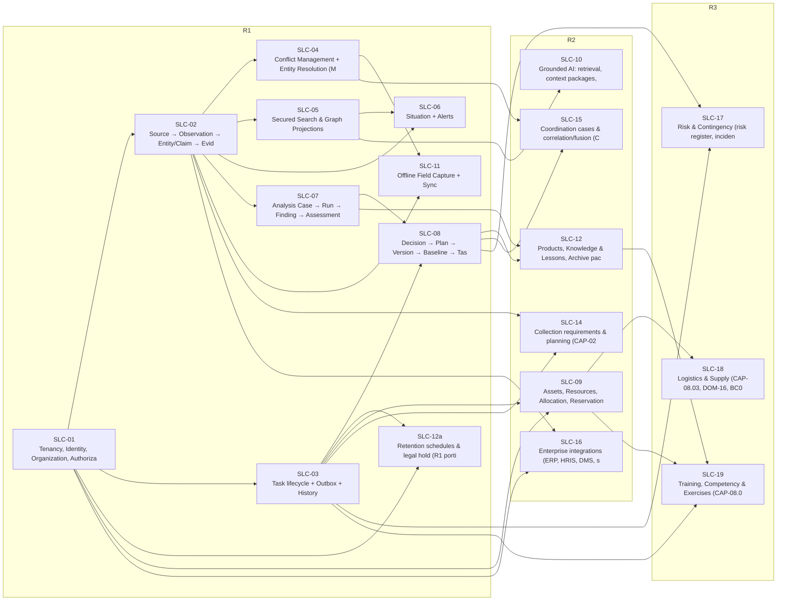

# خارطة التنفيذ

## 4. الـBacklog المولَّد

<!-- BEGIN GENERATED: build_analysis_design.py -->

### 4.1 الشرائح واعتمادياتها

### 4.2 الـEpics بترتيب التنفيذ

الترتيب: الإصدار أولًا، ثم الاعتماديات (`depends_on` في `14-slices/slices.md`)، ثم رقم الشريحة.

| # | Epic | الإصدار | يعتمد على | المحتوى | الـAggregates | قصص أمر / جلب / نظام | العمليات | الوحدات | الاختبارات | G6 |
|---|---|---|---|---|---|---|---|---|---|---|
| 1 | **SLC-01** | R1 | — | Tenancy, Identity, Organization, Authorization, Audit | 12 | 71 / 14 / 7 | 85 | DU-02, DU-03 | 14 | READY (delegated) 2026-09-24 |
| 2 | **SLC-02** | R1 | SLC-01 | Source → Observation → Entity/Claim → Evidence (temporal + spatial) | 12 | 57 / 16 / 7 | 73 | DU-04, DU-05, DU-11 | 14 | READY (delegated) 2026-09-24 |
| 3 | **SLC-03** | R1 | SLC-01 | Task lifecycle + Outbox + History | 3 | 33 / 6 / 6 | 39 | DU-08 | 5 | READY (delegated) 2026-09-24 |
| 4 | **SLC-04** | R1 | SLC-02 | Conflict Management + Entity Resolution (Merge/Split) | 3 | 19 / 6 / 5 | 25 | DU-04 | 5 | READY (delegated) 2026-09-24 |
| 5 | **SLC-05** | R1 | SLC-02 | Secured Search & Graph Projections | 1 | 4 / 5 / 4 | 9 | DU-09 | 3 | READY (delegated) — ADR-P05 condition satisfied by TD-02 (W8) |
| 6 | **SLC-06** | R1 | SLC-02, SLC-05 | Situation + Alerts | 5 | 22 / 8 / 10 | 30 | DU-06, DU-08 | 7 | READY (delegated) 2026-09-24 |
| 7 | **SLC-07** | R1 | SLC-02 | Analysis Case → Run → Finding → Assessment | 5 | 32 / 9 / 4 | 41 | DU-06 | 7 | READY (delegated) 2026-09-24 |
| 8 | **SLC-08** | R1 | SLC-03, SLC-07 | Decision → Plan → Version → Baseline → Tasks | 5 | 24 / 9 / 9 | 33 | DU-08 | 7 | READY (delegated) 2026-09-24 |
| 9 | **SLC-11** | R1 (observation capture + task status only) | SLC-02, SLC-04 | Offline Field Capture + Sync | 4 | 16 / 5 / 10 | 21 | DU-02, DU-10 | 6 | READY (delegated) 2026-09-24 |
| 10 | **SLC-12a** | R1 | SLC-01, SLC-03 | Retention schedules & legal hold (R1 portion of SLC-12) | 4 | 15 / 5 / 10 | 20 | DU-03 | 6 | READY (delegated; legal values pending UNK-002) 2026-09-24 |
| 11 | **SLC-09** | R2 | SLC-03, SLC-01 | Assets, Resources, Allocation, Reservations, Readiness (full) | 7 | 39 / 6 / 8 | 45 | DU-14 | 9 | DESIGN_COMPLETE — G6 held until R1 pilot review (RSK-027) |
| 12 | **SLC-10** | R2 | SLC-05 | Grounded AI: retrieval, context packages, drafting, extraction, trans… | 6 | 27 / 7 / 11 | 34 | DU-16 | 8 | DESIGN_COMPLETE — G6 held until R1 pilot review and first passing model evaluation |
| 13 | **SLC-12** | R2 | SLC-07, SLC-08 | Products, Knowledge & Lessons, Archive packages, Historical Retrieval… | 6 | 29 / 8 / 14 | 37 | DU-15 | 8 | DESIGN_COMPLETE — G6 held until R1 pilot review (RSK-027) |
| 14 | **SLC-14** | R2 | SLC-02, SLC-03 | Collection requirements & planning (CAP-02.01) | 2 | 14 / 4 / 3 | 18 | DU-04 | 4 | DESIGN_COMPLETE — G6 held until R1 pilot review (RSK-027) |
| 15 | **SLC-15** | R2 | SLC-04, SLC-08 | Coordination cases & correlation/fusion (CAP-06.03, CAP-04.04) | 3 | 17 / 4 / 3 | 21 | DU-04, DU-08 | 5 | DESIGN_COMPLETE — G6 held until R1 pilot review (RSK-027) |
| 16 | **SLC-16** | R2 | SLC-02, SLC-01 | Enterprise integrations (ERP, HRIS, DMS, sensors, CAP alerts) | 4 | 18 / 4 / 7 | 22 | DU-02, DU-06, DU-11 | 6 | DESIGN_COMPLETE — G6 held until R1 pilot review and UNK-021 |
| 17 | **SLC-17** | R3 | SLC-08, SLC-03 | Risk & Contingency (risk register, incident lifecycle, contingency pl… | 2 | 15 / 5 / 2 | 20 | DU-08 | 4 | DESIGN_COMPLETE — G6 held until R1 **and** R2 pilot review (RSK-028) |
| 18 | **SLC-18** | R3 | SLC-09 | Logistics & Supply (CAP-08.03, DOM-16, BC05) — Logistics Request and… | 2 | 10 / 5 / 7 | 15 | DU-14 | 4 | DESIGN_COMPLETE — G6 held until R1 **and** R2 pilot review (RSK-028; this slice's actual technical dependency, SLC-09, is genuinely R2 and unmeasured) |
| 19 | **SLC-19** | R3 | SLC-03, SLC-09, SLC-12 | Training, Competency & Exercises (CAP-08.05, DOM-18+19) — extends SLC… | 3 | 15 / 7 / 2 | 22 | DU-14 | 5 | DESIGN_COMPLETE — G6 held until R1 **and** R2 pilot review (RSK-028; narrowest actual exposure among the three R3 slices — see readiness.md) |

شرائح بلا قصص: SLC-00 (Conceptual end-to-end walkthrough (study only)، PROPOSED)، SLC-13 (Risk & Emergency, Training, Exercises, Logistics, Communications، SUPERSEDED).

### 4.3 الـBacklog لكل Epic

كل صف ميزة (Feature) = Aggregate داخل الـEpic؛ القصص في `05-user-stories/` بمعرّفاتها. صف Aggregate من شريحة أخرى يعني أن الـEpic يضيف أوامر أو استعلامات إليه.

#### SLC-01 — Tenancy, Identity, Organization, Authorization, Audit

| الميزة (Aggregate) | شريحته | أمر | جلب | نظام | القصص | الوحدة | اختبار القبول |
|---|---|---|---|---|---|---|---|
| `AGG-AUTHORITY-GRANT` | SLC-01 | 7 | 2 | 1 | US-BC01-AUT-APPROVE-GRANT … US-BC01-S-AUTHORITY-GRANT-01 | DU-02 | TST-AUTHORITY-GRANT-SM |
| `AGG-CLASSIFICATION-SCHEME` | SLC-01 | 4 | 1 | 1 | US-BC08-CLS-ACTIVATE … US-BC08-S-CLASSIFICATION-SCHEME-01 | DU-03 | TST-CLASSIFICATION-SCHEME-SM |
| `AGG-CLEARANCE` | SLC-01 | 6 | 0 | 1 | US-BC01-CLR-APPROVE … US-BC01-S-CLEARANCE-01 | DU-02 | TST-CLEARANCE-SM |
| `AGG-ORGANIZATION` | SLC-01 | 8 | 1 | 0 | US-BC01-ORG-ADD-UNIT … US-BC01-Q-ORG-TREE | DU-02 | TST-ORGANIZATION-SM |
| `AGG-PERSON` | SLC-01 | 5 | 0 | 0 | US-BC01-PER-DEACTIVATE … US-BC01-PER-UPDATE-DETAILS | DU-02 | TST-PERSON-SM |
| `AGG-POLICY-SET` | SLC-01 | 5 | 1 | 2 | US-BC08-POL-APPROVE … US-BC08-S-POLICY-SET-02 | DU-03 | TST-POLICY-SET-SM |
| `AGG-ROLE` | SLC-01 | 4 | 0 | 0 | US-BC01-ROL-ACTIVATE … US-BC01-ROL-SET-PERMISSIONS | DU-02 | TST-ROLE-SM |
| `AGG-ROLE-ASSIGNMENT` | SLC-01 | 2 | 0 | 1 | US-BC01-RAS-ASSIGN … US-BC01-S-ROLE-ASSIGNMENT-01 | DU-02 | TST-ROLE-ASSIGNMENT-SM |
| `AGG-SECURITY-EXCEPTION` | SLC-01 | 4 | 1 | 1 | US-BC08-EXC-APPROVE … US-BC08-S-SECURITY-EXCEPTION-01 | DU-03 | TST-SECURITY-EXCEPTION-SM |
| `AGG-SERVICE-ACCOUNT` | SLC-01 | 5 | 0 | 0 | US-BC01-SVC-CLOSE … US-BC01-SVC-ROTATE-CREDENTIAL | DU-02 | TST-SERVICE-ACCOUNT-SM |
| `AGG-TENANT` | SLC-01 | 11 | 1 | 0 | US-BC01-Q-TEN-GET … US-BC01-TEN-UPDATE-QUOTAS | DU-02 | TST-TENANT-SM |
| `AGG-USER` | SLC-01 | 10 | 3 | 0 | US-BC01-Q-CLR-GET … US-BC01-USR-UNLOCK | DU-02 | TST-USER-SM |
| استعلامات عابرة | — | 0 | 4 | 0 | US-BC01-Q-SEC-CONTEXT … US-BC08-Q-PDP-DECIDE | — | — |

#### SLC-02 — Source → Observation → Entity/Claim → Evidence (temporal + spatial)

| الميزة (Aggregate) | شريحته | أمر | جلب | نظام | القصص | الوحدة | اختبار القبول |
|---|---|---|---|---|---|---|---|
| `AGG-ADAPTER` | SLC-02 | 6 | 1 | 0 | US-BC07-ADP-ACTIVATE … US-BC07-Q-ADP-GET | DU-11 | TST-ADAPTER-SM |
| `AGG-ATTACHMENT` | SLC-02 | 3 | 1 | 3 | US-BC02-ATT-COMPLETE-UPLOAD … US-BC02-S-ATTACHMENT-03 | DU-05 | TST-ATTACHMENT-SM |
| `AGG-CLAIM` | SLC-02 | 6 | 1 | 0 | US-BC02-CLM-ASSERT … US-BC02-Q-CLM-GET | DU-04 | TST-CLAIM-SM |
| `AGG-ENTITY` | SLC-02 | 5 | 5 | 0 | US-BC02-ENT-CHANGE-TYPE … US-BC02-Q-REL-LIST | DU-04 | TST-ENTITY-SM |
| `AGG-EVIDENCE` | SLC-02 | 6 | 1 | 0 | US-BC02-EVD-RECLASSIFY … US-BC02-Q-EVD-GET | DU-04 | TST-EVIDENCE-SM |
| `AGG-EVIDENCE-LINK` | SLC-02 | 2 | 0 | 0 | US-BC02-EVL-LINK … US-BC02-EVL-UNLINK | DU-04 | TST-EVIDENCE-LINK-SM |
| `AGG-EXTERNAL-ID` | SLC-02 | 2 | 1 | 0 | US-BC02-EXT-END … US-BC02-Q-EXT-RESOLVE | DU-04 | TST-EXTERNAL-ID-SM |
| `AGG-IMPORT-BATCH` | SLC-02 | 4 | 1 | 4 | US-BC02-IMP-ACCEPT-QUARANTINE … US-BC02-S-IMPORT-BATCH-04 | DU-05 | TST-IMPORT-BATCH-SM |
| `AGG-OBSERVATION` | SLC-02 | 6 | 2 | 0 | US-BC02-OBS-AMEND … US-BC02-Q-OBS-LIST | DU-05 | TST-OBSERVATION-SM |
| `AGG-REALWORLD-EVENT` | SLC-02 | 5 | 1 | 0 | US-BC02-Q-RWE-GET … US-BC02-RWE-RETIRE | DU-04 | TST-REALWORLD-EVENT-SM |
| `AGG-RELATIONSHIP` | SLC-02 | 4 | 0 | 0 | US-BC02-REL-RECLASSIFY … US-BC02-REL-RETIRE | DU-04 | TST-RELATIONSHIP-SM |
| `AGG-SOURCE` | SLC-02 | 8 | 1 | 0 | US-BC02-Q-SRC-GET … US-BC02-SRC-UPDATE-PROFILE | DU-04 | TST-SOURCE-SM |
| استعلامات عابرة | — | 0 | 1 | 0 | US-BC02-Q-LIN-TRACE | — | — |

#### SLC-03 — Task lifecycle + Outbox + History

| الميزة (Aggregate) | شريحته | أمر | جلب | نظام | القصص | الوحدة | اختبار القبول |
|---|---|---|---|---|---|---|---|
| `AGG-QUALIFICATION-RECORD` | SLC-03 | 5 | 1 | 1 | US-BC05-Q-QUAL-LIST … US-BC05-S-QUALIFICATION-RECORD-01 | DU-08 | TST-QUALIFICATION-RECORD-SM |
| `AGG-TASK` | SLC-03 | 24 | 3 | 5 | US-BC04-Q-TASK-GET … US-BC04-TASK-UNSUSPEND | DU-08 | TST-TASK-SM |
| `AGG-TASK-TYPE` | SLC-03 | 4 | 1 | 0 | US-BC04-Q-TTY-GET … US-BC04-TTY-RETIRE | DU-08 | TST-TASK-TYPE-SM |
| استعلامات عابرة | — | 0 | 1 | 0 | US-BC05-Q-ELIG-CHECK | — | — |

#### SLC-04 — Conflict Management + Entity Resolution (Merge/Split)

| الميزة (Aggregate) | شريحته | أمر | جلب | نظام | القصص | الوحدة | اختبار القبول |
|---|---|---|---|---|---|---|---|
| `AGG-CONFLICT` | SLC-04 | 6 | 2 | 3 | US-BC02-CNF-ACCEPT … US-BC02-S-CONFLICT-03 | DU-04 | TST-CONFLICT-SM |
| `AGG-ER-CASE` | SLC-04 | 10 | 2 | 1 | US-BC02-ER-CONFIRM-MATCH … US-BC02-S-ER-CASE-01 | DU-04 | TST-ER-CASE-SM |
| `AGG-MATCH-RULESET` | SLC-04 | 3 | 1 | 1 | US-BC02-MRS-ACTIVATE … US-BC02-S-MATCH-RULESET-01 | DU-04 | TST-MATCH-RULESET-SM |
| `AGG-ENTITY` | SLC-02 | 0 | 1 | 0 | US-BC02-Q-CLUSTER-GET | DU-04 | TST-ENTITY-SM |

#### SLC-05 — Secured Search & Graph Projections

| الميزة (Aggregate) | شريحته | أمر | جلب | نظام | القصص | الوحدة | اختبار القبول |
|---|---|---|---|---|---|---|---|
| `AGG-PROJECTION-VERSION` | SLC-05 | 4 | 1 | 4 | US-BC07-PRJ-CANCEL-BUILD … US-BC07-S-PROJECTION-VERSION-04 | DU-09 | TST-PROJECTION-VERSION-SM |
| استعلامات عابرة | — | 0 | 4 | 0 | US-BC07-Q-GRAPH-NEIGHBORHOOD … US-BC07-Q-SRCH-SUGGEST | — | — |

#### SLC-06 — Situation + Alerts

| الميزة (Aggregate) | شريحته | أمر | جلب | نظام | القصص | الوحدة | اختبار القبول |
|---|---|---|---|---|---|---|---|
| `AGG-ALERT` | SLC-06 | 3 | 1 | 4 | US-BC03-ALR-ACKNOWLEDGE … US-BC03-S-ALERT-04 | DU-06 | TST-ALERT-SM |
| `AGG-ALERT-RULE` | SLC-06 | 6 | 0 | 0 | US-BC03-ARL-ACTIVATE … US-BC03-ARL-RETIRE | DU-06 | TST-ALERT-RULE-SM |
| `AGG-NOTIFICATION` | SLC-06 | 1 | 1 | 5 | US-BC04-NTF-MARK-READ … US-BC04-S-NOTIFICATION-05 | DU-08 | TST-NOTIFICATION-SM |
| `AGG-SITUATION` | SLC-06 | 7 | 5 | 0 | US-BC03-Q-SIT-CHANGES … US-BC03-SIT-RESUME | DU-06 | TST-SITUATION-SM |
| `AGG-SUBSCRIPTION` | SLC-06 | 5 | 0 | 1 | US-BC04-S-SUBSCRIPTION-01 … US-BC04-SUB-UPDATE-CHANNELS | DU-08 | TST-SUBSCRIPTION-SM |
| استعلامات عابرة | — | 0 | 1 | 0 | US-BC03-Q-BASE-TILE | — | — |

#### SLC-07 — Analysis Case → Run → Finding → Assessment

| الميزة (Aggregate) | شريحته | أمر | جلب | نظام | القصص | الوحدة | اختبار القبول |
|---|---|---|---|---|---|---|---|
| `AGG-ANALYSIS-CASE` | SLC-07 | 14 | 4 | 0 | US-BC03-ACS-ADD-ASSUMPTION … US-BC03-Q-SCN-COMPARE | DU-06 | TST-ANALYSIS-CASE-SM |
| `AGG-ANALYSIS-METHOD` | SLC-07 | 4 | 1 | 0 | US-BC03-AMT-ACTIVATE … US-BC03-Q-AMT-LIST | DU-06 | TST-ANALYSIS-METHOD-SM |
| `AGG-ANALYSIS-RUN` | SLC-07 | 3 | 2 | 3 | US-BC03-Q-RUN-ARTIFACT … US-BC03-S-ANALYSIS-RUN-03 | DU-06 | TST-ANALYSIS-RUN-SM |
| `AGG-ASSESSMENT` | SLC-07 | 7 | 2 | 1 | US-BC03-ASM-DISCARD … US-BC03-S-ASSESSMENT-01 | DU-06 | TST-ASSESSMENT-SM |
| `AGG-FINDING` | SLC-07 | 4 | 0 | 0 | US-BC03-FND-ACCEPT … US-BC03-FND-WITHDRAW | DU-06 | TST-FINDING-SM |

#### SLC-08 — Decision → Plan → Version → Baseline → Tasks

| الميزة (Aggregate) | شريحته | أمر | جلب | نظام | القصص | الوحدة | اختبار القبول |
|---|---|---|---|---|---|---|---|
| `AGG-DECISION` | SLC-08 | 2 | 2 | 1 | US-BC04-DEC-ANNUL … US-BC04-S-DECISION-01 | DU-08 | TST-DECISION-SM |
| `AGG-DECISION-REQUEST` | SLC-08 | 5 | 2 | 2 | US-BC04-DRQ-ADD-OPTION … US-BC04-S-DECISION-REQUEST-02 | DU-08 | TST-DECISION-REQUEST-SM |
| `AGG-OUTCOME-TRACKER` | SLC-08 | 2 | 0 | 3 | US-BC04-OUT-CORRECT … US-BC04-S-OUTCOME-TRACKER-03 | DU-08 | TST-OUTCOME-TRACKER-SM |
| `AGG-PLAN` | SLC-08 | 7 | 5 | 2 | US-BC04-PLN-CANCEL … US-BC04-S-PLAN-02 | DU-08 | TST-PLAN-SM |
| `AGG-PLAN-VERSION` | SLC-08 | 8 | 0 | 1 | US-BC04-PLV-AMEND-MINOR … US-BC04-S-PLAN-VERSION-01 | DU-08 | TST-PLAN-VERSION-SM |

#### SLC-11 — Offline Field Capture + Sync

| الميزة (Aggregate) | شريحته | أمر | جلب | نظام | القصص | الوحدة | اختبار القبول |
|---|---|---|---|---|---|---|---|
| `AGG-DEVICE` | SLC-11 | 7 | 1 | 1 | US-BC01-DEV-CONFIRM … US-BC01-S-DEVICE-01 | DU-02 | TST-DEVICE-SM |
| `AGG-PRELOAD-PACKAGE` | SLC-11 | 3 | 1 | 4 | US-BC07-PKG-CONFIRM-DOWNLOAD … US-BC07-S-PRELOAD-PACKAGE-04 | DU-10 | TST-PRELOAD-PACKAGE-SM |
| `AGG-SYNC-CONFLICT` | SLC-11 | 4 | 2 | 1 | US-BC07-Q-SCF-GET … US-BC07-SCF-RESOLVE-MANUALLY | DU-10 | TST-SYNC-CONFLICT-SM |
| `AGG-SYNC-SESSION` | SLC-11 | 2 | 1 | 4 | US-BC07-Q-SYN-DELTA … US-BC07-SYN-UPLOAD-BATCH | DU-10 | TST-SYNC-SESSION-SM |

#### SLC-12a — Retention schedules & legal hold (R1 portion of SLC-12)

| الميزة (Aggregate) | شريحته | أمر | جلب | نظام | القصص | الوحدة | اختبار القبول |
|---|---|---|---|---|---|---|---|
| `AGG-DISPOSITION-RUN` | SLC-12a | 3 | 1 | 4 | US-BC08-DSP-APPROVE … US-BC08-S-DISPOSITION-RUN-04 | DU-03 | TST-DISPOSITION-RUN-SM |
| `AGG-ERASURE-REQUEST` | SLC-12a | 3 | 1 | 5 | US-BC08-ERS-APPROVE … US-BC08-S-ERASURE-REQUEST-05 | DU-03 | TST-ERASURE-REQUEST-SM |
| `AGG-LEGAL-HOLD` | SLC-12a | 5 | 2 | 0 | US-BC08-LHD-APPROVE-RELEASE … US-BC08-Q-LHD-LIST | DU-03 | TST-LEGAL-HOLD-SM |
| `AGG-RETENTION-SCHEDULE` | SLC-12a | 4 | 1 | 1 | US-BC08-Q-RTS-ACTIVE … US-BC08-S-RETENTION-SCHEDULE-01 | DU-03 | TST-RETENTION-SCHEDULE-SM |

#### SLC-09 — Assets, Resources, Allocation, Reservations, Readiness (full)

| الميزة (Aggregate) | شريحته | أمر | جلب | نظام | القصص | الوحدة | اختبار القبول |
|---|---|---|---|---|---|---|---|
| `AGG-ALLOCATION` | SLC-09 | 6 | 1 | 5 | US-BC05-ALC-APPROVE … US-BC05-S-ALLOCATION-05 | DU-14 | TST-ALLOCATION-SM |
| `AGG-ASSET` | SLC-09 | 12 | 2 | 0 | US-BC05-AST-DISPOSE … US-BC05-Q-AST-GET | DU-14 | TST-ASSET-SM |
| `AGG-ASSET-ASSIGNMENT` | SLC-09 | 3 | 0 | 1 | US-BC05-ASG-ASSIGN … US-BC05-S-ASSET-ASSIGNMENT-01 | DU-14 | TST-ASSET-ASSIGNMENT-SM |
| `AGG-ASSET-RESERVATION` | SLC-09 | 4 | 0 | 2 | US-BC05-RSV-CANCEL … US-BC05-S-ASSET-RESERVATION-02 | DU-14 | TST-ASSET-RESERVATION-SM |
| `AGG-MAINTENANCE-ORDER` | SLC-09 | 5 | 1 | 0 | US-BC05-MNT-CANCEL … US-BC05-Q-MNT-SCHEDULE | DU-14 | TST-MAINTENANCE-ORDER-SM |
| `AGG-RESOURCE-POOL` | SLC-09 | 5 | 1 | 0 | US-BC05-Q-POL-TIMELINE … US-BC05-RPL-SUSPEND | DU-14 | TST-RESOURCE-POOL-SM |
| `AGG-ROLE-REQUIREMENT` | SLC-09 | 4 | 0 | 0 | US-BC05-RRQ-ACTIVATE … US-BC05-RRQ-RETIRE | DU-14 | TST-ROLE-REQUIREMENT-SM |
| استعلامات عابرة | — | 0 | 1 | 0 | US-BC05-Q-READINESS | — | — |

#### SLC-10 — Grounded AI: retrieval, context packages, drafting, extraction, translation, model lifecycle, tool registry, vector projection

| الميزة (Aggregate) | شريحته | أمر | جلب | نظام | القصص | الوحدة | اختبار القبول |
|---|---|---|---|---|---|---|---|
| `AGG-AI-REQUEST` | SLC-10 | 2 | 2 | 7 | US-BC07-AIR-CANCEL … US-BC07-S-AI-REQUEST-07 | DU-16 | TST-AI-REQUEST-SM |
| `AGG-AI-RESULT` | SLC-10 | 4 | 1 | 1 | US-BC07-AIRS-ACCEPT … US-BC07-S-AI-RESULT-01 | DU-16 | TST-AI-RESULT-SM |
| `AGG-AI-ROUTING` | SLC-10 | 4 | 1 | 1 | US-BC07-Q-RTG-ACTIVE … US-BC07-S-AI-ROUTING-01 | DU-16 | TST-AI-ROUTING-SM |
| `AGG-AI-TOOL` | SLC-10 | 5 | 1 | 0 | US-BC07-Q-TOL-LIST … US-BC07-TOL-RETIRE | DU-16 | TST-AI-TOOL-SM |
| `AGG-EVAL-SUITE` | SLC-10 | 3 | 0 | 1 | US-BC07-EVS-ACTIVATE … US-BC07-S-EVAL-SUITE-01 | DU-16 | TST-EVAL-SUITE-SM |
| `AGG-MODEL-VERSION` | SLC-10 | 9 | 1 | 1 | US-BC07-MDL-APPROVE … US-BC07-S-MODEL-VERSION-01 | DU-16 | TST-MODEL-VERSION-SM |
| استعلامات عابرة | — | 0 | 1 | 0 | US-BC07-Q-AI-USAGE | — | — |

#### SLC-12 — Products, Knowledge & Lessons, Archive packages, Historical Retrieval & Reconstruction

| الميزة (Aggregate) | شريحته | أمر | جلب | نظام | القصص | الوحدة | اختبار القبول |
|---|---|---|---|---|---|---|---|
| `AGG-ARCHIVE-PACKAGE` | SLC-12 | 4 | 2 | 5 | US-BC06-ARC-MIGRATE-FORMAT … US-BC06-S-ARCHIVE-PACKAGE-05 | DU-15 | TST-ARCHIVE-PACKAGE-SM |
| `AGG-DISTRIBUTION` | SLC-12 | 2 | 0 | 2 | US-BC06-DST-CANCEL … US-BC06-S-DISTRIBUTION-02 | DU-15 | TST-DISTRIBUTION-SM |
| `AGG-KNOWLEDGE-OBJECT` | SLC-12 | 9 | 2 | 1 | US-BC06-KNO-DISCARD … US-BC06-S-KNOWLEDGE-OBJECT-01 | DU-15 | TST-KNOWLEDGE-OBJECT-SM |
| `AGG-PRODUCT` | SLC-12 | 8 | 3 | 3 | US-BC06-PRD-APPROVE … US-BC06-S-PRODUCT-03 | DU-15 | TST-PRODUCT-SM |
| `AGG-PRODUCT-TEMPLATE` | SLC-12 | 4 | 0 | 0 | US-BC06-PTM-ACTIVATE … US-BC06-PTM-RETIRE | DU-15 | TST-PRODUCT-TEMPLATE-SM |
| `AGG-RECONSTRUCTION` | SLC-12 | 2 | 1 | 3 | US-BC06-Q-REC-REPORT … US-BC06-S-RECONSTRUCTION-03 | DU-15 | TST-RECONSTRUCTION-SM |

#### SLC-14 — Collection requirements & planning (CAP-02.01)

| الميزة (Aggregate) | شريحته | أمر | جلب | نظام | القصص | الوحدة | اختبار القبول |
|---|---|---|---|---|---|---|---|
| `AGG-COLLECTION-PLAN` | SLC-14 | 6 | 1 | 1 | US-BC02-CPL-ACTIVATE … US-BC02-S-COLLECTION-PLAN-01 | DU-04 | TST-COLLECTION-PLAN-SM |
| `AGG-COLLECTION-REQUIREMENT` | SLC-14 | 8 | 3 | 2 | US-BC02-CRQ-AMEND … US-BC02-S-COLLECTION-REQUIREMENT-02 | DU-04 | TST-COLLECTION-REQUIREMENT-SM |

#### SLC-15 — Coordination cases & correlation/fusion (CAP-06.03, CAP-04.04)

| الميزة (Aggregate) | شريحته | أمر | جلب | نظام | القصص | الوحدة | اختبار القبول |
|---|---|---|---|---|---|---|---|
| `AGG-COORDINATION-CASE` | SLC-15 | 9 | 2 | 1 | US-BC04-CRD-ACTIVATE … US-BC04-S-COORDINATION-CASE-01 | DU-08 | TST-COORDINATION-CASE-SM |
| `AGG-CORRELATION-PROPOSAL` | SLC-15 | 4 | 2 | 2 | US-BC02-CRP-ACCEPT … US-BC02-S-CORRELATION-PROPOSAL-02 | DU-04 | TST-CORRELATION-PROPOSAL-SM |
| `AGG-CORRELATION-RULE` | SLC-15 | 4 | 0 | 0 | US-BC02-CRR-ACTIVATE … US-BC02-CRR-RETIRE | DU-04 | TST-CORRELATION-RULE-SM |

#### SLC-16 — Enterprise integrations (ERP, HRIS, DMS, sensors, CAP alerts)

| الميزة (Aggregate) | شريحته | أمر | جلب | نظام | القصص | الوحدة | اختبار القبول |
|---|---|---|---|---|---|---|---|
| `AGG-CAP-MESSAGE` | SLC-16 | 4 | 1 | 1 | US-BC03-CAP-CANCEL … US-BC03-S-CAP-MESSAGE-01 | DU-06 | TST-CAP-MESSAGE-SM |
| `AGG-HR-SYNC-PROPOSAL` | SLC-16 | 2 | 1 | 3 | US-BC01-HRS-APPROVE … US-BC01-S-HR-SYNC-PROPOSAL-03 | DU-02 | TST-HR-SYNC-PROPOSAL-SM |
| `AGG-INTEGRATION-CONNECTION` | SLC-16 | 7 | 1 | 2 | US-BC07-CON-ACTIVATE … US-BC07-S-INTEGRATION-CONNECTION-02 | DU-11 | TST-INTEGRATION-CONNECTION-SM |
| `AGG-SENSOR-STREAM` | SLC-16 | 5 | 1 | 1 | US-BC07-Q-SNS-LIST … US-BC07-SNS-SET-QUALITY-RULES | DU-11 | TST-SENSOR-STREAM-SM |

#### SLC-17 — Risk & Contingency (risk register, incident lifecycle, contingency plan activation via SLC-08 reuse)

| الميزة (Aggregate) | شريحته | أمر | جلب | نظام | القصص | الوحدة | اختبار القبول |
|---|---|---|---|---|---|---|---|
| `AGG-INCIDENT` | SLC-17 | 10 | 3 | 1 | US-BC04-INC-ACTIVATE-CONTINGENCY … US-BC04-S-INCIDENT-01 | DU-08 | TST-INCIDENT-SM |
| `AGG-RISK` | SLC-17 | 5 | 2 | 1 | US-BC04-Q-RIS-GET … US-BC04-S-RISK-01 | DU-08 | TST-RISK-SM |

#### SLC-18 — Logistics & Supply (CAP-08.03, DOM-16, BC05) — Logistics Request and Shipment reuse SLC-09's Resource Pool/Allocation directly for inventory (R3-Q3); no separate stock model

| الميزة (Aggregate) | شريحته | أمر | جلب | نظام | القصص | الوحدة | اختبار القبول |
|---|---|---|---|---|---|---|---|
| `AGG-LOGISTICS-REQUEST` | SLC-18 | 3 | 2 | 7 | US-BC05-LGR-CANCEL … US-BC05-S-LOGISTICS-REQUEST-07 | DU-14 | TST-LOGISTICS-REQUEST-SM |
| `AGG-SHIPMENT` | SLC-18 | 7 | 3 | 0 | US-BC05-Q-SHP-GET … US-BC05-SHP-REPORT-LOST | DU-14 | TST-SHIPMENT-SM |

#### SLC-19 — Training, Competency & Exercises (CAP-08.05, DOM-18+19) — extends SLC-03's Qualification Record and SLC-09's Role Requirement (both unmodified), stores After Action Review as an SLC-12 Knowledge Object (CR-63); adds 3 new aggregates (Scenario, Exercise, Simulation)

| الميزة (Aggregate) | شريحته | أمر | جلب | نظام | القصص | الوحدة | اختبار القبول |
|---|---|---|---|---|---|---|---|
| `AGG-EXERCISE` | SLC-19 | 4 | 2 | 2 | US-BC05-EXR-CANCEL … US-BC05-S-EXERCISE-02 | DU-14 | TST-EXERCISE-SM |
| `AGG-SCENARIO` | SLC-19 | 4 | 2 | 0 | US-BC05-Q-SCN-GET … US-BC05-SCN-RETIRE | DU-14 | TST-SCENARIO-SM |
| `AGG-SIMULATION` | SLC-19 | 7 | 3 | 0 | US-BC05-Q-SIM-GET … US-BC05-SIM-START | DU-14 | TST-SIMULATION-SM |

<!-- END GENERATED: build_analysis_design.py -->
