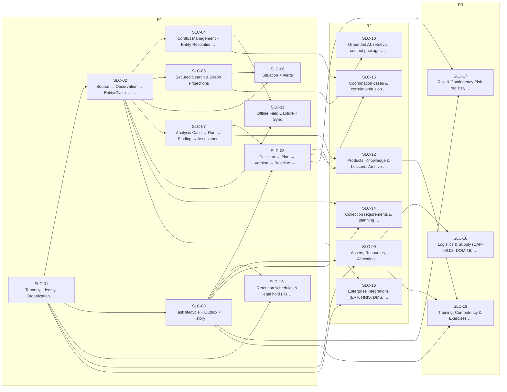

# خارطة التنفيذ

من الدراسة إلى البناء: بأي ترتيب تُبنى الشرائح، وما الذي يسبقها، وأي بوابة تفصل بين المراحل. الـBacklog في §4 مولَّد من القصص (739 قصة). كل Epic شريحة، وكل ميزة Aggregate داخلها. لا تقديرات زمنية ولا جهد هنا: الإصدارات «تُعرَّف بالنطاق لا بالتاريخ» (W1-answers)، وحجم الفريق والجدول مفتوحان (UNK-012).

## 1. المبادئ

| المبدأ | القاعدة | المصدر |
|---|---|---|
| الشريحة وحدة البناء | الشريحة قابلة للبناء والاختبار خلال دورة تطوير واحدة محدودة؛ إن تجاوزت ذلك تُقسَّم | V6 §11.3 |
| الاعتماديات قبل الرقم | لا تبدأ شريحة قبل اعتمادياتها (`depends_on`)؛ وفي R2 وR3 الترتيب المعلن في الخطة | `14-slices/slices.md` |
| المولَّد لا يُعدَّل يدويًا | تغيير السلوك يبدأ من بيانات الشريحة ← إعادة التوليد ← الفحص ← المراجعة | `16-reports/ENGINEERING-BASELINE-R1.md` |
| البوابة تحكم الإصدار التالي | لا G6 لشرائح R2 قبل مراجعة Pilot R1 (RSK-027)، ولا G6 لشرائح R3 قبل مراجعة Pilot R2 أيضًا (RSK-028) | `slices.md`؛ `release-3-scope.md` |
| الأرقام فرضيات | كل رقم في R2 وR3 موسوم «تُعاد معايرته بعد Pilot»؛ والأداء يُقاس قبل الإنتاج | `release-2-scope.md`؛ `performance-test-strategy.md` |
| الفريق | فريق هندسي واحد من 6–10 مهندسين في R1، قابل للتوسع إلى 8 فرق (افتراض ASM-009)؛ التقدير لكل شريحة **[Missing]** | `assumptions.md`؛ UNK-012 |

## 2. الخطوة 0: هيكل المنصة

الخطوة 0 في المصدر (`16-reports/IMPLEMENTATION-READINESS-R1.md` §4): «Platform skeleton: cell (K8s, PG, Kafka, OpenSearch, Valkey, S3, OpenBao/HSM, Keycloak, Harbor), Zarf bundle, CI with lint + contract validation + generators». بيئة البناء المعزولة (FIT-12) شرط قبل G7 (§2 في المصدر)، لا جزء من الخطوة. وما يضيفه هذا الملف للخطوة **[Derived]** من ADR-P17 وADR-P18 اللاحقين للتقرير، وهو ما يحتاجه كل سياق قبل أول Aggregate:

| العنصر | لماذا أولًا | المرجع |
|---|---|---|
| `contracts/` مولَّد من `05-contracts/`، وعملاء وخوادم مولَّدة | كل وحدة تبدأ من العقد | ADR-P18؛ TD-15 |
| خط الأوامر ذو الخطوات العشر في حلقة Application، وآلياته في `platform/` (Unit of Work، outbox، audit outbox، idempotency، inbox، عميل الـPEP) | كل أمر في كل شريحة يمر به | ADR-P17؛ ADR-P18؛ `11-hexagonal-reference.md` §3 |
| PEP مع OPA مضمَّن وحزمة سياسات أساسية | لا مسار استرجاع دون قرار (FIT-03) | TD-08 |
| فحوص البنية في CI: FIT-10، FIT-20، FIT-02، FIT-13، FIT-14 | تكسر البناء من اليوم الأول | `fitness-functions.md` |
| المراقبة: OpenTelemetry وcorrelation_id | QAS-OBS-001 من أول طلب | TD-14 |
| الخلية والحزمة: Kubernetes والخدمات ذات الحالة وKeycloak وHarbor وحزمة Zarf | نص الخطوة 0 في المصدر | `22-deployment-design.md` |
| مسار طرف إلى طرف واحد: البوابة ← DU-02 ← أمر إنشاء ← حدث في Kafka ← سجل تدقيق | يثبت أن الحلقات متصلة قبل توسيع النطاق | `19-runtime-scenarios.md` |

مراجعة المنهجية تقترح أن تصير هذه الخطوة شريحة منصة صريحة «SLC-00P» (`16-reports/METHODOLOGY-RETROSPECTIVE.md`). والمعيار المقترح لإغلاقها: المسار الطرفي يمر، وكل فحص في CI يعمل ويكسر البناء عند المخالفة **[Derived]**.

## 3. ترتيب R1 والبوابات

ترتيب البناء المقترح لـR1 (عنوان المصدر: «ترتيب البناء المقترح»، `IMPLEMENTATION-READINESS-R1.md` §4) مع ما يمكن تنفيذه بالتوازي:

| الخطوة | الشرائح | ملاحظة المصدر |
|---|---|---|
| 0 | هيكل المنصة | §2 |
| 1 | SLC-01 | المستأجرون والهوية والتخويل والتدقيق |
| 2 | SLC-02 | مكتبة نواة الادعاءات الزمنية **أولًا**، مع مجموعة oracle من 500 حالة (QAS-TMP-001) |
| 3 | SLC-03 ∥ SLC-04 | بالتوازي؛ تطبيق الجوال يبدأ من هنا بالتوازي |
| 4 | SLC-05 | مع مجموعة اختبارات عدم الاستدلال |
| 5 | SLC-06 ∥ SLC-07 | بالتوازي |
| 6 | SLC-08 | |
| 7 | SLC-11 | الالتقاط دون اتصال وحالة المهام فقط في R1 |
| 8 | SLC-12a | مع بوابة الاستعادة (FIT-19) |
| 9 | حملة الأداء والتعافي ← Pilot ← أدلة G7/G8 | `performance-test-strategy.md`؛ `dr-and-continuity.md` |

```mermaid
flowchart LR
  G6R1["G6 R1 — مصادَق (HAP-10)"] --> G7["G7 البناء: فريق البناء (UNK-012)، بيئة معزولة، CI (FIT-12)"]
  G7 --> B0["الخطوة 0: هيكل المنصة"] --> R1["شرائح R1 (الخطوات 1–8)"]
  R1 --> PERF["حملة الأداء والتعافي + اختبار الاختراق"] --> G8["G8 الإنتاج: UNK-002، مراجعة التراخيص، HSM/MDM، فريق التشغيل"]
  G8 --> P1["Pilot R1"] --> RV1["مراجعة Pilot R1 (RSK-027)"]
  RV1 --> G6R2["G6 لشرائح R2"] --> R2["R2: SLC-09 → 12 → 10 → 14 → 15 → 16"]
  R2 --> P2["Pilot R2"] --> RV2["مراجعة Pilot R2 (RSK-028)"] --> G6R3["G6 لشرائح R3"] --> R3["R3: SLC-17 → 18 → 19"]
```

| البوابة | تعني | شروطها في المصادر |
|---|---|---|
| G6-SLC | جاهزية الشريحة | G3 ناجحة وADR-P01/02/03 معتمدة، بنود الـAggregate الأحد عشر، لا خطأ في فحص المواصفة، نموذج التهديد وFMEA، تغطية القبول، لا مجهول حاجب، مراجعة مستقلة، اعتماد HAP-09 (V6 §20) |
| G6 | جاهزية الإصدار | كل شرائحه G6-SLC، ومصفوفات التتبع مولَّدة، وكل متطلب يصل إلى اختبار — لـR1 مصادَق (HAP-10)؛ و`25-traceability-matrix.md` تحقق الشرط الأخير إلا لـ23 متطلبًا يُتحقق منها بفحص العقود أو خطة W9 بدل مواصفة قبول (§4.1 هناك) |
| G7 | البناء | خارج مرحلة الدراسة؛ يحتاج فريق البناء (UNK-012)، ومالكي البيانات لكل سياق (DEP-HUM-002)، وبيئة بناء معزولة بسجل صور ومرآة حزم وCI (FIT-12) |
| G8 | الإنتاج | الإطار القانوني (UNK-002)، مراجعة التراخيص (DEP-HUM-004)، حجم فريق التشغيل، نجاح اختبارات الأداء والتعافي (FIT-19، تمارين DR)، اختبار الاختراق ومجموعة عدم الاستدلال تحت الحمل، HSM وMDM |

ملاحظة: `performance-test-strategy.md` كان يساوي G7 بالإنتاج، بينما `RATIFICATION-PACKAGE.md` يجعل G7 البناء وG8 الإنتاج؛ صُحح بـCR-82 (S-31)، و«pre-G7» في مصفوفة التحقق يعني قبل الإنتاج.

## 4. الـBacklog المولَّد

<!-- BEGIN GENERATED: build_analysis_design.py -->

### 4.1 الشرائح واعتمادياتها

### 4.2 الـEpics بترتيب التنفيذ

الترتيب: الإصدار أولًا، ثم الاعتماديات (`depends_on`)، ثم الترتيب المعلن في الخطة (`r2_order`، `r3_order` في `14-slices/slices.md`)، ثم رقم الشريحة.

| # | Epic | الإصدار | يعتمد على | المحتوى | الـAggregates | قصص أمر / جلب / نظام | العمليات | الوحدات | مواصفات القبول + ملف الخصائص | G6 |
|---|---|---|---|---|---|---|---|---|---|---|
| 1 | **SLC-01** | R1 | — | Tenancy, Identity, Organization, Authorization, Audit | 12 | 71 / 14 / 7 | 85 | DU-02, DU-03 | 14 | READY (delegated) 2026-09-24 |
| 2 | **SLC-02** | R1 | SLC-01 | Source → Observation → Entity/Claim → Evidence (temporal + spatial) | 12 | 57 / 16 / 7 | 73 | DU-04, DU-05, DU-11 | 14 | READY (delegated) 2026-09-24 |
| 3 | **SLC-03** | R1 | SLC-01 | Task lifecycle + Outbox + History | 3 | 33 / 6 / 6 | 39 | DU-08 | 5 | READY (delegated) 2026-09-24 |
| 4 | **SLC-04** | R1 | SLC-02 | Conflict Management + Entity Resolution (Merge/Split) | 3 | 19 / 6 / 5 | 25 | DU-04 | 5 | READY (delegated) 2026-09-24 |
| 5 | **SLC-05** | R1 | SLC-02 | Secured Search & Graph Projections | 1 | 4 / 5 / 4 | 9 | DU-09 | 3 | READY (delegated) — ADR-P05 condition satisfied by TD-02 (W8) |
| 6 | **SLC-06** | R1 | SLC-02, SLC-05 | Situation + Alerts | 5 | 22 / 8 / 10 | 30 | DU-06, DU-08 | 7 | READY (delegated) 2026-09-24 |
| 7 | **SLC-07** | R1 | SLC-02 | Analysis Case → Run → Finding → Assessment | 5 | 32 / 9 / 4 | 41 | DU-06 | 7 | READY (delegated) 2026-09-24 |
| 8 | **SLC-08** | R1 | SLC-03, SLC-07 | Decision → Plan → Version → Baseline → Tasks | 5 | 24 / 9 / 9 | 33 | DU-08 | 7 | READY (delegated) 2026-09-24 |
| 9 | **SLC-11** | R1 (observation capture + task status only) | SLC-02, SLC-04 | Offline Field Capture + Sync | 4 | 16 / 5 / 10 | 21 | DU-02, DU-10 | 6 | READY (delegated) 2026-09-24 |
| 10 | **SLC-12a** | R1 | SLC-01, SLC-03 | Retention schedules & legal hold (R1 portion of SLC-12) | 4 | 15 / 5 / 10 | 20 | DU-03 | 6 | READY (delegated; legal values pending UNK-002) 2026-09-24 |
| 11 | **SLC-09** | R2 | SLC-03, SLC-01 | Assets, Resources, Allocation, Reservations, Readiness (full) | 7 | 39 / 6 / 8 | 45 | DU-14 | 9 | DESIGN_COMPLETE — G6 held until R1 pilot review (RSK-027) |
| 12 | **SLC-12** | R2 | SLC-07, SLC-08 | Products, Knowledge & Lessons, Archive packages, Historical Retrieval… | 6 | 29 / 8 / 14 | 37 | DU-15 | 8 | DESIGN_COMPLETE — G6 held until R1 pilot review (RSK-027) |
| 13 | **SLC-10** | R2 | SLC-05 | Grounded AI: retrieval, context packages, drafting, extraction, trans… | 6 | 27 / 7 / 11 | 34 | DU-16 | 8 | DESIGN_COMPLETE — G6 held until R1 pilot review and first passing model evaluation |
| 14 | **SLC-14** | R2 | SLC-02, SLC-03 | Collection requirements & planning (CAP-02.01) | 2 | 14 / 4 / 3 | 18 | DU-04 | 4 | DESIGN_COMPLETE — G6 held until R1 pilot review (RSK-027) |
| 15 | **SLC-15** | R2 | SLC-04, SLC-08 | Coordination cases & correlation/fusion (CAP-06.03, CAP-04.04) | 3 | 17 / 4 / 3 | 21 | DU-04, DU-08 | 5 | DESIGN_COMPLETE — G6 held until R1 pilot review (RSK-027) |
| 16 | **SLC-16** | R2 | SLC-02, SLC-01 | Enterprise integrations (ERP, HRIS, DMS, sensors, CAP alerts) | 4 | 18 / 4 / 7 | 22 | DU-02, DU-06, DU-11 | 6 | DESIGN_COMPLETE — G6 held until R1 pilot review and UNK-021 |
| 17 | **SLC-17** | R3 | SLC-08, SLC-03 | Risk & Contingency (risk register, incident lifecycle, contingency pl… | 2 | 15 / 5 / 2 | 20 | DU-08 | 4 | DESIGN_COMPLETE — G6 held until R1 **and** R2 pilot review (RSK-028) |
| 18 | **SLC-18** | R3 | SLC-09 | Logistics & Supply (CAP-08.03, DOM-16, BC05) — Logistics Request and… | 2 | 10 / 5 / 7 | 15 | DU-14 | 4 | DESIGN_COMPLETE — G6 held until R1 **and** R2 pilot review (RSK-028; this slice's actual technical dependency, SLC-09, is genuinely R2 and unmeasured) |
| 19 | **SLC-19** | R3 | SLC-03, SLC-09, SLC-12 | Training, Competency & Exercises (CAP-08.05, DOM-18+19) — extends SLC… | 3 | 15 / 7 / 2 | 22 | DU-14 | 5 | DESIGN_COMPLETE — G6 held until R1 **and** R2 pilot review (RSK-028; narrowest actual exposure among the three R3 slices — see readiness.md) |

مجموع العمليات 610 من 611: `QRY-LABEL-CHECK` عقد عابر للسياقات بلا كتالوج ولا شريحة (`25-traceability-matrix.md` §4.3).

شرائح بلا قصص: SLC-00 (Conceptual end-to-end walkthrough (study only)، PROPOSED)، SLC-13 (Risk & Emergency, Training, Exercises, Logistics, Communications، SUPERSEDED).

### 4.3 الـBacklog لكل Epic

كل صف ميزة (Feature) = Aggregate داخل الـEpic، وقصصه في `05-user-stories/` تحت عنوان الـAggregate. صف Aggregate من شريحة أخرى يعني أن الـEpic يضيف إليه أوامر أو استعلامات.

#### SLC-01 — Tenancy, Identity, Organization, Authorization, Audit

| الميزة (Aggregate) | شريحته | أمر | جلب | نظام | الوحدة | اختبار القبول |
|---|---|---|---|---|---|---|
| `AGG-AUTHORITY-GRANT` | SLC-01 | 7 | 2 | 1 | DU-02 | TST-AUTHORITY-GRANT-SM |
| `AGG-CLASSIFICATION-SCHEME` | SLC-01 | 4 | 1 | 1 | DU-03 | TST-CLASSIFICATION-SCHEME-SM |
| `AGG-CLEARANCE` | SLC-01 | 6 | 0 | 1 | DU-02 | TST-CLEARANCE-SM |
| `AGG-ORGANIZATION` | SLC-01 | 8 | 1 | 0 | DU-02 | TST-ORGANIZATION-SM |
| `AGG-PERSON` | SLC-01 | 5 | 0 | 0 | DU-02 | TST-PERSON-SM |
| `AGG-POLICY-SET` | SLC-01 | 5 | 1 | 2 | DU-03 | TST-POLICY-SET-SM |
| `AGG-ROLE` | SLC-01 | 4 | 0 | 0 | DU-02 | TST-ROLE-SM |
| `AGG-ROLE-ASSIGNMENT` | SLC-01 | 2 | 0 | 1 | DU-02 | TST-ROLE-ASSIGNMENT-SM |
| `AGG-SECURITY-EXCEPTION` | SLC-01 | 4 | 1 | 1 | DU-03 | TST-SECURITY-EXCEPTION-SM |
| `AGG-SERVICE-ACCOUNT` | SLC-01 | 5 | 0 | 0 | DU-02 | TST-SERVICE-ACCOUNT-SM |
| `AGG-TENANT` | SLC-01 | 11 | 1 | 0 | DU-02 | TST-TENANT-SM |
| `AGG-USER` | SLC-01 | 10 | 3 | 0 | DU-02 | TST-USER-SM |
| استعلامات عابرة: QRY-AUD-SEARCH, QRY-AUD-VERIFY, QRY-PDP-DECIDE, QRY-SEC-CONTEXT | — | 0 | 4 | 0 | — | — |

#### SLC-02 — Source → Observation → Entity/Claim → Evidence (temporal + spatial)

| الميزة (Aggregate) | شريحته | أمر | جلب | نظام | الوحدة | اختبار القبول |
|---|---|---|---|---|---|---|
| `AGG-ADAPTER` | SLC-02 | 6 | 1 | 0 | DU-11 | TST-ADAPTER-SM |
| `AGG-ATTACHMENT` | SLC-02 | 3 | 1 | 3 | DU-05 | TST-ATTACHMENT-SM |
| `AGG-CLAIM` | SLC-02 | 6 | 1 | 0 | DU-04 | TST-CLAIM-SM |
| `AGG-ENTITY` | SLC-02 | 5 | 5 | 0 | DU-04 | TST-ENTITY-SM |
| `AGG-EVIDENCE` | SLC-02 | 6 | 1 | 0 | DU-04 | TST-EVIDENCE-SM |
| `AGG-EVIDENCE-LINK` | SLC-02 | 2 | 0 | 0 | DU-04 | TST-EVIDENCE-LINK-SM |
| `AGG-EXTERNAL-ID` | SLC-02 | 2 | 1 | 0 | DU-04 | TST-EXTERNAL-ID-SM |
| `AGG-IMPORT-BATCH` | SLC-02 | 4 | 1 | 4 | DU-05 | TST-IMPORT-BATCH-SM |
| `AGG-OBSERVATION` | SLC-02 | 6 | 2 | 0 | DU-05 | TST-OBSERVATION-SM |
| `AGG-REALWORLD-EVENT` | SLC-02 | 5 | 1 | 0 | DU-04 | TST-REALWORLD-EVENT-SM |
| `AGG-RELATIONSHIP` | SLC-02 | 4 | 0 | 0 | DU-04 | TST-RELATIONSHIP-SM |
| `AGG-SOURCE` | SLC-02 | 8 | 1 | 0 | DU-04 | TST-SOURCE-SM |
| استعلامات عابرة: QRY-LIN-TRACE | — | 0 | 1 | 0 | — | — |

#### SLC-03 — Task lifecycle + Outbox + History

| الميزة (Aggregate) | شريحته | أمر | جلب | نظام | الوحدة | اختبار القبول |
|---|---|---|---|---|---|---|
| `AGG-QUALIFICATION-RECORD` | SLC-03 | 5 | 1 | 1 | DU-08 | TST-QUALIFICATION-RECORD-SM |
| `AGG-TASK` | SLC-03 | 24 | 3 | 5 | DU-08 | TST-TASK-SM |
| `AGG-TASK-TYPE` | SLC-03 | 4 | 1 | 0 | DU-08 | TST-TASK-TYPE-SM |
| استعلامات عابرة: QRY-ELIG-CHECK | — | 0 | 1 | 0 | — | — |

#### SLC-04 — Conflict Management + Entity Resolution (Merge/Split)

| الميزة (Aggregate) | شريحته | أمر | جلب | نظام | الوحدة | اختبار القبول |
|---|---|---|---|---|---|---|
| `AGG-CONFLICT` | SLC-04 | 6 | 2 | 3 | DU-04 | TST-CONFLICT-SM |
| `AGG-ER-CASE` | SLC-04 | 10 | 2 | 1 | DU-04 | TST-ER-CASE-SM |
| `AGG-MATCH-RULESET` | SLC-04 | 3 | 1 | 1 | DU-04 | TST-MATCH-RULESET-SM |
| `AGG-ENTITY` | SLC-02 | 0 | 1 | 0 | DU-04 | TST-ENTITY-SM |

#### SLC-05 — Secured Search & Graph Projections

| الميزة (Aggregate) | شريحته | أمر | جلب | نظام | الوحدة | اختبار القبول |
|---|---|---|---|---|---|---|
| `AGG-PROJECTION-VERSION` | SLC-05 | 4 | 1 | 4 | DU-09 | TST-PROJECTION-VERSION-SM |
| استعلامات عابرة: QRY-GRAPH-NEIGHBORHOOD, QRY-GRAPH-PATHS, QRY-SRCH-QUERY, QRY-SRCH-SUGGEST | — | 0 | 4 | 0 | — | — |

#### SLC-06 — Situation + Alerts

| الميزة (Aggregate) | شريحته | أمر | جلب | نظام | الوحدة | اختبار القبول |
|---|---|---|---|---|---|---|
| `AGG-ALERT` | SLC-06 | 3 | 1 | 4 | DU-06 | TST-ALERT-SM |
| `AGG-ALERT-RULE` | SLC-06 | 6 | 0 | 0 | DU-06 | TST-ALERT-RULE-SM |
| `AGG-NOTIFICATION` | SLC-06 | 1 | 1 | 5 | DU-08 | TST-NOTIFICATION-SM |
| `AGG-SITUATION` | SLC-06 | 7 | 5 | 0 | DU-06 | TST-SITUATION-SM |
| `AGG-SUBSCRIPTION` | SLC-06 | 5 | 0 | 1 | DU-08 | TST-SUBSCRIPTION-SM |
| استعلامات عابرة: QRY-BASE-TILE | — | 0 | 1 | 0 | — | — |

#### SLC-07 — Analysis Case → Run → Finding → Assessment

| الميزة (Aggregate) | شريحته | أمر | جلب | نظام | الوحدة | اختبار القبول |
|---|---|---|---|---|---|---|
| `AGG-ANALYSIS-CASE` | SLC-07 | 14 | 4 | 0 | DU-06 | TST-ANALYSIS-CASE-SM |
| `AGG-ANALYSIS-METHOD` | SLC-07 | 4 | 1 | 0 | DU-06 | TST-ANALYSIS-METHOD-SM |
| `AGG-ANALYSIS-RUN` | SLC-07 | 3 | 2 | 3 | DU-06 | TST-ANALYSIS-RUN-SM |
| `AGG-ASSESSMENT` | SLC-07 | 7 | 2 | 1 | DU-06 | TST-ASSESSMENT-SM |
| `AGG-FINDING` | SLC-07 | 4 | 0 | 0 | DU-06 | TST-FINDING-SM |

#### SLC-08 — Decision → Plan → Version → Baseline → Tasks

| الميزة (Aggregate) | شريحته | أمر | جلب | نظام | الوحدة | اختبار القبول |
|---|---|---|---|---|---|---|
| `AGG-DECISION` | SLC-08 | 2 | 2 | 1 | DU-08 | TST-DECISION-SM |
| `AGG-DECISION-REQUEST` | SLC-08 | 5 | 2 | 2 | DU-08 | TST-DECISION-REQUEST-SM |
| `AGG-OUTCOME-TRACKER` | SLC-08 | 2 | 0 | 3 | DU-08 | TST-OUTCOME-TRACKER-SM |
| `AGG-PLAN` | SLC-08 | 7 | 5 | 2 | DU-08 | TST-PLAN-SM |
| `AGG-PLAN-VERSION` | SLC-08 | 8 | 0 | 1 | DU-08 | TST-PLAN-VERSION-SM |

#### SLC-11 — Offline Field Capture + Sync

| الميزة (Aggregate) | شريحته | أمر | جلب | نظام | الوحدة | اختبار القبول |
|---|---|---|---|---|---|---|
| `AGG-DEVICE` | SLC-11 | 7 | 1 | 1 | DU-02 | TST-DEVICE-SM |
| `AGG-PRELOAD-PACKAGE` | SLC-11 | 3 | 1 | 4 | DU-10 | TST-PRELOAD-PACKAGE-SM |
| `AGG-SYNC-CONFLICT` | SLC-11 | 4 | 2 | 1 | DU-10 | TST-SYNC-CONFLICT-SM |
| `AGG-SYNC-SESSION` | SLC-11 | 2 | 1 | 4 | DU-10 | TST-SYNC-SESSION-SM |

#### SLC-12a — Retention schedules & legal hold (R1 portion of SLC-12)

| الميزة (Aggregate) | شريحته | أمر | جلب | نظام | الوحدة | اختبار القبول |
|---|---|---|---|---|---|---|
| `AGG-DISPOSITION-RUN` | SLC-12a | 3 | 1 | 4 | DU-03 | TST-DISPOSITION-RUN-SM |
| `AGG-ERASURE-REQUEST` | SLC-12a | 3 | 1 | 5 | DU-03 | TST-ERASURE-REQUEST-SM |
| `AGG-LEGAL-HOLD` | SLC-12a | 5 | 2 | 0 | DU-03 | TST-LEGAL-HOLD-SM |
| `AGG-RETENTION-SCHEDULE` | SLC-12a | 4 | 1 | 1 | DU-03 | TST-RETENTION-SCHEDULE-SM |

#### SLC-09 — Assets, Resources, Allocation, Reservations, Readiness (full)

| الميزة (Aggregate) | شريحته | أمر | جلب | نظام | الوحدة | اختبار القبول |
|---|---|---|---|---|---|---|
| `AGG-ALLOCATION` | SLC-09 | 6 | 1 | 5 | DU-14 | TST-ALLOCATION-SM |
| `AGG-ASSET` | SLC-09 | 12 | 2 | 0 | DU-14 | TST-ASSET-SM |
| `AGG-ASSET-ASSIGNMENT` | SLC-09 | 3 | 0 | 1 | DU-14 | TST-ASSET-ASSIGNMENT-SM |
| `AGG-ASSET-RESERVATION` | SLC-09 | 4 | 0 | 2 | DU-14 | TST-ASSET-RESERVATION-SM |
| `AGG-MAINTENANCE-ORDER` | SLC-09 | 5 | 1 | 0 | DU-14 | TST-MAINTENANCE-ORDER-SM |
| `AGG-RESOURCE-POOL` | SLC-09 | 5 | 1 | 0 | DU-14 | TST-RESOURCE-POOL-SM |
| `AGG-ROLE-REQUIREMENT` | SLC-09 | 4 | 0 | 0 | DU-14 | TST-ROLE-REQUIREMENT-SM |
| استعلامات عابرة: QRY-READINESS | — | 0 | 1 | 0 | — | — |

#### SLC-12 — Products, Knowledge & Lessons, Archive packages, Historical Retrieval & Reconstruction

| الميزة (Aggregate) | شريحته | أمر | جلب | نظام | الوحدة | اختبار القبول |
|---|---|---|---|---|---|---|
| `AGG-ARCHIVE-PACKAGE` | SLC-12 | 4 | 2 | 5 | DU-15 | TST-ARCHIVE-PACKAGE-SM |
| `AGG-DISTRIBUTION` | SLC-12 | 2 | 0 | 2 | DU-15 | TST-DISTRIBUTION-SM |
| `AGG-KNOWLEDGE-OBJECT` | SLC-12 | 9 | 2 | 1 | DU-15 | TST-KNOWLEDGE-OBJECT-SM |
| `AGG-PRODUCT` | SLC-12 | 8 | 3 | 3 | DU-15 | TST-PRODUCT-SM |
| `AGG-PRODUCT-TEMPLATE` | SLC-12 | 4 | 0 | 0 | DU-15 | TST-PRODUCT-TEMPLATE-SM |
| `AGG-RECONSTRUCTION` | SLC-12 | 2 | 1 | 3 | DU-15 | TST-RECONSTRUCTION-SM |

#### SLC-10 — Grounded AI: retrieval, context packages, drafting, extraction, translation, model lifecycle, tool registry, vector projection

| الميزة (Aggregate) | شريحته | أمر | جلب | نظام | الوحدة | اختبار القبول |
|---|---|---|---|---|---|---|
| `AGG-AI-REQUEST` | SLC-10 | 2 | 2 | 7 | DU-16 | TST-AI-REQUEST-SM |
| `AGG-AI-RESULT` | SLC-10 | 4 | 1 | 1 | DU-16 | TST-AI-RESULT-SM |
| `AGG-AI-ROUTING` | SLC-10 | 4 | 1 | 1 | DU-16 | TST-AI-ROUTING-SM |
| `AGG-AI-TOOL` | SLC-10 | 5 | 1 | 0 | DU-16 | TST-AI-TOOL-SM |
| `AGG-EVAL-SUITE` | SLC-10 | 3 | 0 | 1 | DU-16 | TST-EVAL-SUITE-SM |
| `AGG-MODEL-VERSION` | SLC-10 | 9 | 1 | 1 | DU-16 | TST-MODEL-VERSION-SM |
| استعلامات عابرة: QRY-AI-USAGE | — | 0 | 1 | 0 | — | — |

#### SLC-14 — Collection requirements & planning (CAP-02.01)

| الميزة (Aggregate) | شريحته | أمر | جلب | نظام | الوحدة | اختبار القبول |
|---|---|---|---|---|---|---|
| `AGG-COLLECTION-PLAN` | SLC-14 | 6 | 1 | 1 | DU-04 | TST-COLLECTION-PLAN-SM |
| `AGG-COLLECTION-REQUIREMENT` | SLC-14 | 8 | 3 | 2 | DU-04 | TST-COLLECTION-REQUIREMENT-SM |

#### SLC-15 — Coordination cases & correlation/fusion (CAP-06.03, CAP-04.04)

| الميزة (Aggregate) | شريحته | أمر | جلب | نظام | الوحدة | اختبار القبول |
|---|---|---|---|---|---|---|
| `AGG-COORDINATION-CASE` | SLC-15 | 9 | 2 | 1 | DU-08 | TST-COORDINATION-CASE-SM |
| `AGG-CORRELATION-PROPOSAL` | SLC-15 | 4 | 2 | 2 | DU-04 | TST-CORRELATION-PROPOSAL-SM |
| `AGG-CORRELATION-RULE` | SLC-15 | 4 | 0 | 0 | DU-04 | TST-CORRELATION-RULE-SM |

#### SLC-16 — Enterprise integrations (ERP, HRIS, DMS, sensors, CAP alerts)

| الميزة (Aggregate) | شريحته | أمر | جلب | نظام | الوحدة | اختبار القبول |
|---|---|---|---|---|---|---|
| `AGG-CAP-MESSAGE` | SLC-16 | 4 | 1 | 1 | DU-06 | TST-CAP-MESSAGE-SM |
| `AGG-HR-SYNC-PROPOSAL` | SLC-16 | 2 | 1 | 3 | DU-02 | TST-HR-SYNC-PROPOSAL-SM |
| `AGG-INTEGRATION-CONNECTION` | SLC-16 | 7 | 1 | 2 | DU-11 | TST-INTEGRATION-CONNECTION-SM |
| `AGG-SENSOR-STREAM` | SLC-16 | 5 | 1 | 1 | DU-11 | TST-SENSOR-STREAM-SM |

#### SLC-17 — Risk & Contingency (risk register, incident lifecycle, contingency plan activation via SLC-08 reuse)

| الميزة (Aggregate) | شريحته | أمر | جلب | نظام | الوحدة | اختبار القبول |
|---|---|---|---|---|---|---|
| `AGG-INCIDENT` | SLC-17 | 10 | 3 | 1 | DU-08 | TST-INCIDENT-SM |
| `AGG-RISK` | SLC-17 | 5 | 2 | 1 | DU-08 | TST-RISK-SM |

#### SLC-18 — Logistics & Supply (CAP-08.03, DOM-16, BC05) — Logistics Request and Shipment reuse SLC-09's Resource Pool/Allocation directly for inventory (R3-Q3); no separate stock model

| الميزة (Aggregate) | شريحته | أمر | جلب | نظام | الوحدة | اختبار القبول |
|---|---|---|---|---|---|---|
| `AGG-LOGISTICS-REQUEST` | SLC-18 | 3 | 2 | 7 | DU-14 | TST-LOGISTICS-REQUEST-SM |
| `AGG-SHIPMENT` | SLC-18 | 7 | 3 | 0 | DU-14 | TST-SHIPMENT-SM |

#### SLC-19 — Training, Competency & Exercises (CAP-08.05, DOM-18+19) — extends SLC-03's Qualification Record and SLC-09's Role Requirement (both unmodified), stores After Action Review as an SLC-12 Knowledge Object (CR-63); adds 3 new aggregates (Scenario, Exercise, Simulation)

| الميزة (Aggregate) | شريحته | أمر | جلب | نظام | الوحدة | اختبار القبول |
|---|---|---|---|---|---|---|
| `AGG-EXERCISE` | SLC-19 | 4 | 2 | 2 | DU-14 | TST-EXERCISE-SM |
| `AGG-SCENARIO` | SLC-19 | 4 | 2 | 0 | DU-14 | TST-SCENARIO-SM |
| `AGG-SIMULATION` | SLC-19 | 7 | 3 | 0 | DU-14 | TST-SIMULATION-SM |

<!-- END GENERATED: build_analysis_design.py -->
