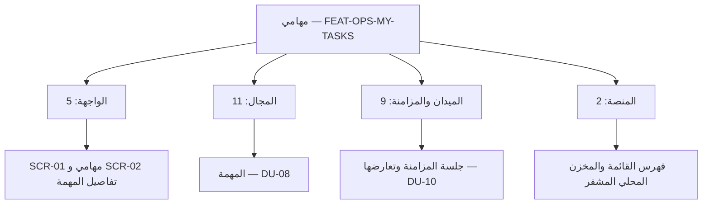

# تجربة: ميزة «مهامي» بقالب القصص المطوَّر

عينة لترى شكل النتيجة قبل تعميمها. ميزة أعمال واحدة، وتحتها سبع قصص مكتوبة كاملة بالقالب المطوَّر، واحدة من كل نوع (جلب، أمر، نظام، واجهة، منصة، قصة فرعية من تقسيم). وبقية قصص الميزة مسرودة في §4 وتُكتب بالقالب نفسه عند التعميم.

**قواعد الكتابة:**
- كل قصة تُقرأ وحدها دون فتح ملف آخر.
- لا رمز وحده: كل رمز معه معناه، والرموز التقنية مجمّعة في القسم 8 من كل قصة.
- معايير القبول بـGherkin العربية (`# language: ar`)، وتمر بمحلل Gherkin الرسمي.
- رسائل المستخدم في جداول الرفض **نصوص مقترحة**، تُعتمد في جدول المصطلحات عند التعميم.

## 1. بطاقة الميزة

| البند | القيمة |
|---|---|
| **المعرّف** | FEAT-OPS-MY-TASKS |
| **الاسم** | مهامي: عرض المهام المسندة إليّ وتنفيذها، متصلًا ودون اتصال |
| **القيمة** | المستخدم الميداني ينفّذ عمله من قائمة واحدة، حتى 72 ساعة دون شبكة، ولا يضيع ما سجّله |
| **القدرة** | CAP-07.03 — إدارة المهام (R1) |
| **الشرائح** | SLC-03 (دورة حياة المهمة)، SLC-11 (المزامنة الميدانية) |
| **حالات الاستخدام** | UC-042 تنفيذ المهمة · UC-043 تقديم النتيجة · UC-091 مزامنة الجهاز الميداني |
| **المتطلبات** | REQ-OPS-006 المهمة تتبع دورة حالات محددة · REQ-OPS-008 لا إكمال قبل استيفاء المعايير · REQ-OFF-001 العمل 72 ساعة دون اتصال |
| **الجودة** | QAS-PERF-016 فتح «مهامي» ≤ 500 ms · QAS-OFF-001 مزامنة 1,000 أمر ≤ 10 دقائق بلا كتابة صامتة ولا تكرار · QAS-USA-001 تسجيل بيد واحدة ≤ 60 ثانية |
| **الشاشات** | SCR-01 مهامي · SCR-02 تفاصيل المهمة |
| **المكوّنات** | المهمة (AGG-TASK)، جلسة المزامنة (AGG-SYNC-SESSION)، تعارض المزامنة (AGG-SYNC-CONFLICT) |
| **وحدات النشر** | DU-08 العمليات · DU-10 المزامنة الميدانية · التطبيق الميداني |
| **عدد القصص** | 27 |



## 2. القصص المكتوبة كاملة

---

### US-BC04-Q-TASK-LIST — قائمة مهامي

| الميزة | الإصدار | النوع | الأولوية | الحالة |
|---|---|---|---|---|
| مهامي | R1 | جلب | Must | جاهزة |

#### 1. القصة
**كـ** موظف مسندة إليه مهام، **أريد** قائمة بمهامي حسب الحالة والموعد، **حتى** أعرف ما عليّ الآن وما يقترب موعده.

**باختصار:** يطلب المستخدم مهامه فيحصل على قائمة مرتبة، فيها ما يحق له رؤيته فقط. القائمة تُجلب صفحةً بعد صفحة، ولا تكشف بعددها أو اقتراحاتها وجود مهام محجوبة عنه.

#### 2. القواعد
- **من يستطيع:** أي مستخدم مخوَّل، ويرى فقط المهام داخل نطاقه المسموح (الوحدة التنظيمية والتصنيف الأمني).
- **متى يُسمح:** دائمًا، والنتيجة مقصورة على النطاق.
- **قيد خاص:** لا يُعرض عدد إجمالي يشمل المهام المحجوبة.

#### 3. البيانات
| المرشح | معناه | إلزامي |
|---|---|---|
| المُسند إليه | «أنا» افتراضيًا | لا |
| الحالة | مثل «مقبولة» و«قيد التنفيذ» | لا |
| الموعد قبل | المهام المستحقة قبل تاريخ | لا |
| الخطة / الوحدة | تقييد بخطة أو وحدة تنظيمية | لا |
| المؤشر والحد | الصفحة التالية، وحجمها حتى 200 | لا |

**النتيجة:** صفحة مهام، كل مهمة بعنوانها وحالتها وموعدها، ومؤشر للصفحة التالية.

#### 4. معايير القبول

```gherkin
# language: ar
خاصية: قائمة مهامي

  الخلفية:
    بفرض مستأجر نشط وسياسات أساسية
    و مستخدم مخوَّل له مهام داخل نطاقه وأخرى خارجه

  سيناريو: يرى المستخدم مهامه فقط
    عندما يطلب المستخدم قائمة مهامه
    اذاً تُعاد المهام داخل نطاقه فقط
    و يُعاد فحص صلاحية كل مهمة قبل عرضها
    و لا يكشف أي عدد أو اقتراح وجود مهمة محجوبة

  سيناريو: الصفحة التالية
    بفرض أن مهامه أكثر من صفحة واحدة
    عندما يطلب الصفحة التالية بالمؤشر
    اذاً تُعاد المهام التالية دون تكرار ولا فجوة

  سيناريو: مستخدم بلا صلاحية
    بفرض أن السياسة ترفض المستخدم
    عندما يطلب قائمة المهام
    اذاً يتلقى ردًا بنفس شكل المورد غير الموجود
```

#### 5. الآثار الجانبية
لا شيء: القراءة لا تغيّر حالة.

#### 6. متطلبات الجودة
| الجانب | المطلوب | المصدر |
|---|---|---|
| الأداء | فتح «مهامي» خلال 500 ms (p95) | QAS-PERF-016 |
| الترقيم | بالمؤشر لا بالصفحات المرقمة | FIT-13 |

#### 7. الاعتماديات والأسئلة المفتوحة
- **تعتمد على:** US-PLT-MYTASKS-READ (فهرس القراءة).

#### 8. ملاحظات تقنية
| البند | القيمة | معناه |
|---|---|---|
| الواجهة | `GET /api/v1/operations/tasks` | نقطة جلب المهام |
| الاستعلام | `QRY-TASK-LIST` | استعلام «المهام حسب المُسند إليه والخطة والحالة والموعد والوحدة» |
| السياسة | `POL-TASK-LIST` | تصفية مسبقة بالنطاق المسموح؛ الرفض بشكل غير الموجود |
| الجدول | `operations.tasks` | جدول المهام، مفتاحه يبدأ بالمستأجر |
| وحدة النشر | DU-08 | خدمة العمليات |

#### 9. التتبع
| المتطلب | حالة الاستخدام | الاختبار |
|---|---|---|
| REQ-OPS-006 — المهمة تتبع دورة حالات محددة | UC-042 — تنفيذ المهمة | TST-TASK-SM |

#### 10. تعريف الاكتمال
- [ ] سيناريوهات القبول تمر آليًا
- [ ] اختبار الحمل يحقق 500 ms
- [ ] فحوص البنية تمر (المستأجر أولًا، لا ترقيم بالإزاحة)
- [ ] المراجعة مكتملة

---

### US-BC04-TASK-START — بدء المهمة

| الميزة | الإصدار | النوع | الأولوية | الحالة |
|---|---|---|---|---|
| مهامي | R1 | أمر | Must | جاهزة |

#### 1. القصة
**كـ** الموظف المسندة إليه المهمة، **أريد** أن أبدأ تنفيذها، **حتى** يعرف المخطط أن العمل بدأ وتُتابع المهمة من الآن.

**باختصار:** حين يكون الموظف قد قبل مهمة، يبدؤها فتتحول إلى «قيد التنفيذ». يستطيع ذلك دون اتصال، ويُرسل الأمر عند المزامنة.

#### 2. القواعد
- **من يستطيع:** الموظف المسندة إليه المهمة فقط.
- **متى يُسمح:** المهمة «مقبولة»، وكل المهام التي يجب أن تسبقها مكتملة أو مغلقة، والمهمة غير معلّقة.
- **قيد خاص:** مسموح دون اتصال.

#### 3. البيانات
لا حقول. يُرسل مع الطلب مفتاح منع التكرار والإصدار الذي يراه المستخدم.

**النتيجة:** المهمة «قيد التنفيذ»، ويعود للمستخدم مرجعها وإصدارها الجديد.

#### 4. معايير القبول

```gherkin
# language: ar
خاصية: بدء المهمة

  الخلفية:
    بفرض مستأجر نشط وسياسات أساسية
    و موظف مسندة إليه مهمة

  سيناريو: الموظف يبدأ مهمة قبلها
    بفرض أن المهمة في حالة "مقبولة"
    و كل المهام السابقة لها مكتملة أو مغلقة
    عندما يبدأ الموظف المهمة
    اذاً تصبح حالتها "قيد التنفيذ"
    و يُسجَّل حدث "بدأت المهمة" وسجل تدقيق في المعاملة نفسها

  سيناريو مخطط: رفض بدء المهمة
    بفرض <الحالة>
    عندما يحاول الموظف بدء المهمة
    اذاً يُرفض الطلب برمز <الرمز> ويرى <الرسالة>
    و لا يتغير شيء في المهمة

    امثلة:
      | الحالة                                | الرمز                         | الرسالة                                  |
      | أن المهمة ليست في حالة "مقبولة"      | TASK_INVALID_STATE_TRANSITION | لا يمكن بدء المهمة في حالتها الحالية     |
      | أن مهمة سابقة لم تكتمل               | DEPENDENCIES_NOT_MET          | يجب إكمال المهام السابقة أولًا           |
      | أن المهمة معلّقة                      | TASK_SUSPENDED                | المهمة معلّقة                             |
      | أن شخصًا آخر عدّل المهمة في الأثناء   | VERSION_CONFLICT              | تغيّرت المهمة، راجع التغييرات ثم أعد     |

  سيناريو: من ليس صاحب المهمة لا يعرف أنها موجودة
    بفرض أن المهمة مسندة إلى موظف آخر وخارج نطاقي
    عندما أحاول بدءها
    اذاً أتلقى ردًا بنفس شكل المورد غير الموجود

  سيناريو: تكرار الطلب نفسه
    بفرض أنني بدأت المهمة بمفتاح منع تكرار
    عندما يُعاد الطلب نفسه بالمفتاح نفسه
    اذاً تُعاد النتيجة الأولى ولا يُسجَّل حدث ثانٍ
```

#### 5. الآثار الجانبية
- **الحدث:** «بدأت المهمة»، يستهلكه الإشعار، ومتابعة تقدم الخطة، وقياس النتائج، والبحث.
- **التدقيق:** من بدأ المهمة ومتى.

#### 6. متطلبات الجودة
| الجانب | المطلوب | المصدر |
|---|---|---|
| الأداء | تنفيذ الأمر خلال 300 ms (p95) | QAS-PERF-001 |
| دون اتصال | يُنفَّذ محليًا ويُرسل عند المزامنة | REQ-OFF-001 |

#### 7. الاعتماديات والأسئلة المفتوحة
- **تعتمد على:** قبول المهمة (US-BC04-TASK-ACCEPT).

#### 8. ملاحظات تقنية
| البند | القيمة | معناه |
|---|---|---|
| الواجهة | `POST /api/v1/operations/tasks/{id}/actions/start` | نقطة الأمر |
| الأمر | `CMD-TASK-START` | أمر «بدء المهمة» |
| السياسة | `POL-TASK-START` | المسندة إليه فقط، داخل المستأجر والنطاق، ومسموح دون اتصال |
| الحدث | `EVT-TASK-STARTED` | «بدأت المهمة» |
| الكيان | `AGG-TASK` | المهمة وحالاتها |
| الثابت | `INV-TASK-06` | المهمة المعلّقة ترفض كل تغيير عدا الإلغاء ورفع التعليق |
| وحدة النشر | DU-08 | خدمة العمليات |

#### 9. التتبع
| المتطلب | حالة الاستخدام | الاختبار |
|---|---|---|
| REQ-OPS-006 — دورة حالات المهمة | UC-042 — تنفيذ المهمة | TST-TASK-SM |
| REQ-OFF-001 — العمل دون اتصال | UC-091 — مزامنة الجهاز | TST-SLC11-INVARIANTS |

#### 10. تعريف الاكتمال
- [ ] سيناريوهات القبول تمر آليًا
- [ ] الأمر يعمل دون اتصال ويُطبَّق عند المزامنة
- [ ] الرسائل بالعربية والإنجليزية
- [ ] المراجعة مكتملة

---

### US-BC04-TASK-SUBMIT — تقديم المهمة للمراجعة

| الميزة | الإصدار | النوع | الأولوية | الحالة |
|---|---|---|---|---|
| مهامي | R1 | أمر | Must | جاهزة |

#### 1. القصة
**كـ** الموظف المسندة إليه المهمة، **أريد** أن أقدّم نتيجتها، **حتى** يراجعها المسؤول ويعتمدها.

**باختصار:** بعد أن يسجّل الموظف بندًا واحدًا على الأقل من النتيجة، يقدّم المهمة مع ملخص، فتنتقل إلى «مقدَّمة» بانتظار المراجعة.

#### 2. القواعد
- **من يستطيع:** الموظف المسندة إليه المهمة فقط.
- **متى يُسمح:** المهمة «قيد التنفيذ»، وفيها بند نتيجة واحد على الأقل، وغير معلّقة.
- **قيد خاص:** مسموح دون اتصال.

#### 3. البيانات
| الحقل | معناه | إلزامي |
|---|---|---|
| الملخص | ملخص النتيجة بلغته الأصلية | نعم |

**النتيجة:** المهمة «مقدَّمة».

#### 4. معايير القبول

```gherkin
# language: ar
خاصية: تقديم المهمة للمراجعة

  الخلفية:
    بفرض مستأجر نشط وسياسات أساسية
    و موظف مسندة إليه مهمة في حالة "قيد التنفيذ"

  سيناريو: تقديم مهمة لها نتيجة
    بفرض أن للمهمة بند نتيجة واحدًا على الأقل
    عندما يقدّم الموظف المهمة مع ملخص
    اذاً تصبح حالتها "مقدَّمة"
    و يُسجَّل حدث "قُدِّمت المهمة" وسجل تدقيق في المعاملة نفسها

  سيناريو مخطط: رفض التقديم
    بفرض <الحالة>
    عندما يحاول الموظف تقديم المهمة
    اذاً يُرفض الطلب برمز <الرمز> ويرى <الرسالة>
    و لا يتغير شيء في المهمة

    امثلة:
      | الحالة                              | الرمز                         | الرسالة                             |
      | أن المهمة بلا أي بند نتيجة          | RESULT_REQUIRED               | أضف بند نتيجة واحدًا على الأقل      |
      | أن الملخص فارغ                      | VALIDATION_FAILED             | الملخص مطلوب                         |
      | أن المهمة ليست "قيد التنفيذ"        | TASK_INVALID_STATE_TRANSITION | لا يمكن تقديم المهمة في حالتها      |
      | أن المهمة معلّقة                    | TASK_SUSPENDED                | المهمة معلّقة                        |
```

#### 5. الآثار الجانبية
- **الحدث:** «قُدِّمت المهمة»، يستهلكه الإشعار (ليصل إلى المراجع)، ومتابعة تقدم الخطة، وقياس النتائج، والبحث.
- **التدقيق:** من قدّم ومتى.

#### 6. متطلبات الجودة
| الجانب | المطلوب | المصدر |
|---|---|---|
| الأداء | 300 ms (p95) | QAS-PERF-001 |
| دون اتصال | مسموح | REQ-OFF-001 |

#### 7. الاعتماديات والأسئلة المفتوحة
- **تعتمد على:** بدء المهمة، وإضافة بند نتيجة (US-BC04-TASK-ADD-RESULT-ITEM).
- **بعدها:** المراجعة والاعتماد، والمراجع غير الموظف نفسه (REQ-OPS-009).

#### 8. ملاحظات تقنية
| البند | القيمة | معناه |
|---|---|---|
| الواجهة | `POST /api/v1/operations/tasks/{id}/actions/submit` | نقطة الأمر |
| الأمر | `CMD-TASK-SUBMIT` | «تقديم المهمة» |
| السياسة | `POL-TASK-SUBMIT` | المسندة إليه فقط، ومسموح دون اتصال |
| الحدث | `EVT-TASK-SUBMITTED` | «قُدِّمت المهمة» |
| الكيان | `AGG-TASK` | المهمة |

#### 9. التتبع
| المتطلب | حالة الاستخدام | الاختبار |
|---|---|---|
| REQ-OPS-006 — دورة حالات المهمة | UC-043 — تقديم النتيجة | TST-TASK-SM |
| REQ-OPS-008 — لا إكمال قبل استيفاء المعايير | UC-043 | TST-SLC03-INVARIANTS |

#### 10. تعريف الاكتمال
- [ ] سيناريوهات القبول تمر آليًا · [ ] يعمل دون اتصال · [ ] المراجعة مكتملة

---

### US-BC04-S-TASK-05 — تصعيد المهمة عند فوات موعدها

| الميزة | الإصدار | النوع | الأولوية | الحالة |
|---|---|---|---|---|
| مهامي | R1 | نظام | Must | جاهزة |

#### 1. القصة
**كـ** النظام، **أريد** أن أصعّد المهمة حين يفوت موعدها، **حتى** يعرف المسؤولون أنها متأخرة قبل أن تتعطل الخطة.

**باختصار:** لا يطلقه مستخدم. المجدول يفحص المهام عند موعدها ثم بعد فترة سماح يحددها نوع المهمة، ويصعّد المتأخرة دون أن يغيّر حالتها.

#### 2. القواعد
- **المحفِّز:** زمني، عند الموعد ثم عند الموعد مضافًا إليه فترة السماح من نوع المهمة.
- **على أي حالة:** أي حالة غير نهائية.
- **الهوية:** النظام بهوية عبء عمل، ويخضع لثوابت المهمة نفسها.

#### 4. معايير القبول

```gherkin
# language: ar
خاصية: تصعيد المهمة المتأخرة

  سيناريو: فات موعد مهمة مفتوحة
    بفرض مهمة في حالة غير نهائية تجاوزت موعدها
    عندما يحين وقت فحص المجدول
    اذاً تبقى حالة المهمة كما هي
    و يُسجَّل حدث "صُعِّدت المهمة" وسجل تدقيق بهوية النظام

  سيناريو: مهمة منتهية لا تُصعَّد
    بفرض مهمة مغلقة تجاوزت موعدها
    عندما يحين وقت فحص المجدول
    اذاً لا يُسجَّل أي تصعيد
```

#### 5. الآثار الجانبية
- **الحدث:** «صُعِّدت المهمة»، يستهلكه الإشعار ومتابعة تقدم الخطة.

#### 6. متطلبات الجودة
| الجانب | المطلوب | المصدر |
|---|---|---|
| التوقيت | حدث التصعيد خلال 60 ثانية من الموعد | QAS-OPS-002 |

#### 8. ملاحظات تقنية
| البند | القيمة | معناه |
|---|---|---|
| المحفِّز | `SYS:due passed (escalation policy)` | انتقال تلقائي في جدول المهمة |
| الحدث | `EVT-TASK-ESCALATED` | «صُعِّدت المهمة» |
| الجدول | مؤقتات المهام بدلاء زمنية بالدقيقة | `06-data/logical-model/slc-03.md` |

#### 9. التتبع
| المتطلب | حالة الاستخدام | الاختبار |
|---|---|---|
| REQ-OPS-006 | UC-046 — تصعيد المهمة | TST-TASK-SM (سيناريو «system-triggered transition») |

#### 10. تعريف الاكتمال
- [ ] السيناريو يمر آليًا · [ ] قياس زمن التصعيد ضمن 60 ثانية

---

### US-UI-SCR01-OFFLINE — العمل وحالة المزامنة دون اتصال (جديدة)

| الميزة | الإصدار | النوع | الأولوية | الحالة |
|---|---|---|---|---|
| مهامي | R1 | واجهة (التطبيق الميداني) | Must | جديدة |

#### 1. القصة
**كـ** مستخدم ميداني، **أريد** أن أنفّذ مهامي دون اتصال وأرى حالة كل تحديث، **حتى** أعمل حتى 72 ساعة بلا شبكة وأعرف ما لم يُرسل بعد.

**باختصار:** التطبيق الميداني يحتفظ بنسخة محلية مشفرة من المهام. كل تحديث يُطبَّق محليًا فورًا ويُعلَّم «لم يُرسل»، ثم يتحول إلى «متزامن» بعد الرفع، أو «قيد المراجعة» إذا رفضه الخادم لأن الحالة تغيرت.

#### 2. القواعد
- **من يستطيع:** المستخدم الميداني على جهاز مسجَّل وغير مبلَّغ عن فقده.
- **الأوامر المسموحة دون اتصال:** قبول المهمة وبدؤها وتعليقها واستئنافها وإضافة نتيجة وتقديمها.
- **بعد 72 ساعة:** يستمر التسجيل، وتتوقف قراءة البيانات المحمّلة مسبقًا.

#### 4. معايير القبول

```gherkin
# language: ar
خاصية: العمل دون اتصال وحالة المزامنة

  سيناريو: تحديث دون اتصال ثم مزامنة ناجحة
    بفرض أن الجهاز دون اتصال
    عندما يبدأ المستخدم مهمة ويضيف بند نتيجة
    اذاً يُطبَّق التغيير محليًا ويحمل العنصر علامة "لم يُرسل"
    عندما يعود الاتصال وتكتمل المزامنة
    اذاً تصبح العلامة "متزامن"

  سيناريو: تحديث رفضه الخادم لأن الحالة تغيرت
    بفرض أن المستخدم بدأ مهمة دون اتصال
    و أن المخطط علّق المهمة على الخادم في الأثناء
    عندما تكتمل المزامنة
    اذاً تحمل المهمة علامة "قيد المراجعة" مع سبب الرفض
    و لا يُكتب تحديث المستخدم فوق ما على الخادم

  سيناريو: تجاوز 72 ساعة دون اتصال
    بفرض أن الجهاز دون اتصال منذ أكثر من 72 ساعة
    عندما يفتح المستخدم التطبيق
    اذاً يستطيع التسجيل
    لكن لا تُعرض البيانات المحمّلة مسبقًا

  سيناريو: الجهاز مبلَّغ عن فقده
    بفرض أن الخادم أرسل تعليمة مسح للجهاز
    عندما يتصل الجهاز
    اذاً تُمسح البيانات المحلية وتظهر شاشة إعادة المصادقة
```

#### 6. متطلبات الجودة
| الجانب | المطلوب | المصدر |
|---|---|---|
| دون اتصال | 72 ساعة على الأقل | REQ-OFF-001 |
| المزامنة | 1,000 أمر معلق ≤ 10 دقائق، بلا كتابة صامتة ولا تكرار | QAS-OFF-001 |
| الوصول | أهداف لمس ≥ 44 px، والحالة لا تعتمد على اللون وحده | `21-ui-design.md` §10 |

#### 7. الاعتماديات والأسئلة المفتوحة
- **تعتمد على:** US-PLT-DEVICE-STORE (المخزن المحلي)، وقصص المزامنة في §4.
- **سؤال مفتوح:** شكل مؤشر المزامنة مقترح في الدراسة ولا تعرّفه المصادر **[Derived]**.

#### 8. ملاحظات تقنية
| البند | القيمة | معناه |
|---|---|---|
| الشاشة | SCR-01 | «مهامي» في التطبيق الميداني |
| التخزين | SQLite مشفرة بـSQLCipher ومفتاح في keystore العتادي | TD-16 |
| المزامنة | `CMD-SYN-UPLOAD-BATCH` و`QRY-SYN-DELTA` | رفع الأوامر المعلقة وتنزيل التغييرات |
| وحدة النشر | DU-10 | المزامنة الميدانية |

#### 9. التتبع
| المتطلب | حالة الاستخدام | الاختبار |
|---|---|---|
| REQ-OFF-001 — العمل 72 ساعة دون اتصال | UC-091 — مزامنة الجهاز | TST-SLC11-INVARIANTS + اختبار أجهزة |

#### 10. تعريف الاكتمال
- [ ] السيناريوهات تمر على جهاز Android وiOS · [ ] النصوص بالعربية والإنجليزية وRTL · [ ] المراجعة مكتملة

**المصدر:** `21-ui-design.md` §8.

---

### US-PLT-MYTASKS-READ — قراءة «مهامي» خلال 500 ms (جديدة)

| الميزة | الإصدار | النوع | الأولوية | الحالة |
|---|---|---|---|---|
| مهامي | R1 | منصة | Must | جديدة |

#### 1. القصة
**كـ** فريق المنصة، **أريد** أن تُخدم قائمة المهام من فهرس يبدأ بالمستأجر ثم المُسند إليه ثم الموعد، **حتى** تفتح «مهامي» خلال نصف ثانية تحت حمل التصميم.

**باختصار:** هذه القصة لا يراها المستخدم، لكنها شرط لتحقيق سرعة قائمة المهام. تُقبل حين يثبت اختبار الحمل الهدف.

#### 4. معايير القبول

```gherkin
# language: ar
خاصية: أداء قائمة مهامي

  سيناريو: الهدف تحت حمل التصميم
    بفرض حمل بمزيج استراتيجية اختبار الأداء
    و بيانات اصطناعية بحجم التصميم
    عندما يفتح المستخدمون الميدانيون "مهامي"
    اذاً يكون زمن الاستجابة 500 ms أو أقل عند المئين 95

  سيناريو: الفهرس يعزل المستأجرين
    عندما يُفحص مخطط قاعدة البيانات
    اذاً يبدأ فهرس قائمة المهام بعمود المستأجر
```

#### 6. متطلبات الجودة
| الجانب | المطلوب | المصدر |
|---|---|---|
| الأداء | p95 ≤ 500 ms | QAS-PERF-016 |
| العزل | المستأجر أول عمود في كل فهرس | FIT-02 |

#### 8. ملاحظات تقنية
| البند | القيمة | معناه |
|---|---|---|
| الجدول | `operations.tasks` | جدول المهام |
| أداة الحمل | k6 أو Gatling | `07-quality/performance-test-strategy.md` |

#### 9. التتبع
| المتطلب | الاختبار |
|---|---|
| QAS-PERF-016 — فتح «مهامي» ≤ 500 ms | اختبار الحمل قبل الإنتاج وفي الـPilot |

#### 10. تعريف الاكتمال
- [ ] اختبار الحمل يحقق الهدف · [ ] فحص المخطط يمر

**المصدر:** QAS-PERF-016؛ `24-testing-strategy.md` §2.

---

### US-BC07-SYN-UPLOAD-BATCH-b — أمر ميداني بُني على حالة قديمة (قصة فرعية)

| الميزة | الإصدار | النوع | الأولوية | الحالة |
|---|---|---|---|---|
| مهامي | R1 | أمر (مسار من قصة مقسَّمة) | Must | جديدة بالتقسيم |

#### 1. القصة
**كـ** مستخدم ميداني، **أريد** ألا يضيع تحديثي ولا يمحو تحديث غيري إذا تغيرت المهمة وأنا دون اتصال، **حتى** يحسم إنسان الخلاف بدل أن يغلب آخر من كتب.

**باختصار:** هذا مسار من أربعة في قصة «رفع دفعة المزامنة». إذا وصل أمر يغيّر حالة المهمة وكان مبنيًا على إصدار قديم، لا يُطبَّق ولا يُرفض بصمت. يُفتح «تعارض مزامنة» يحفظ الأمر الأصلي ولقطة الحالة الحالية وسبب الرفض، ويحسمه المراجع.

#### 2. القواعد
- **ينطبق على:** الأوامر المغيِّرة للحالة (البدء، التعليق، التقديم…)، لا الإلحاقية (إضافة نتيجة).
- **المراجع الافتراضي:** صاحب المهمة أو المخطط.
- **ممنوع:** «آخر كتابة تغلب».

#### 4. معايير القبول

```gherkin
# language: ar
خاصية: تعارض مزامنة لأمر مبني على حالة قديمة

  سيناريو: فتح تعارض بدل الكتابة فوق الحالة
    بفرض أن المستخدم بدأ مهمة دون اتصال على الإصدار 5
    و أن المهمة على الخادم أصبحت في الإصدار 6
    عندما يرفع الجهاز الدفعة
    اذاً لا يُطبَّق أمر البدء
    و يُفتح تعارض مزامنة يحفظ الأمر الأصلي ولقطة الحالة وسبب الرفض
    و يُبلَّغ المراجع، ويصل إشعار التعارض إلى المستخدم في التنزيل التالي

  سيناريو مخطط: حسم التعارض
    بفرض تعارض مزامنة مفتوح
    عندما يختار المراجع <القرار>
    اذاً <النتيجة>

    امثلة:
      | القرار           | النتيجة                                                         |
      | إعادة التطبيق    | يُعاد الأمر على الإصدار الحالي وتنطبق عليه شروط المهمة كاملة    |
      | الإسقاط بسبب     | يُسقط الأمر ويُبلَّغ المستخدم بالسبب                            |
      | الحل يدويًا      | يُسجَّل الحل بملاحظة ومرجع                                     |
```

#### 5. الآثار الجانبية
- **الحدث:** «فُتح تعارض مزامنة»، يستهلكه إشعار المراجع وتنزيل المزامنة.

#### 6. متطلبات الجودة
| الجانب | المطلوب | المصدر |
|---|---|---|
| السلامة | صفر كتابة صامتة | QAS-OFF-001 |
| الثبات | لا «آخر كتابة تغلب» لبيانات T1/T2 | FIT-15 |

#### 8. ملاحظات تقنية
| البند | القيمة | معناه |
|---|---|---|
| القاعدة | CF-05: `base_version` ≠ الإصدار الحالي | `field-sync-protocol.md` §3، §5 |
| المحفِّز | `SYS:stale state-changing command` | ينشئ AGG-SYNC-CONFLICT في حالة OPEN |
| الحدث | `EVT-SCF-OPENED` | «فُتح تعارض مزامنة» |
| أوامر الحسم | `CMD-SCF-REAPPLY` · `CMD-SCF-DISCARD` · `CMD-SCF-RESOLVE-MANUALLY` | الخيارات الثلاثة |

#### 9. التتبع
| المتطلب | حالة الاستخدام | الاختبار |
|---|---|---|
| REQ-OFF-001 — العمل دون اتصال | UC-091 — مزامنة الجهاز | TST-SYNC-CONFLICT-SM، TST-SLC11-INVARIANTS |

#### 10. تعريف الاكتمال
- [ ] السيناريوهات تمر مع حقن انقطاع · [ ] المراجعة مكتملة

## 3. ما يتولّده المولِّد وما يُكتب

| القسم | المصدر | كيف |
|---|---|---|
| القواعد، البيانات، الرفض ورموزه، الآثار، التقني، التتبع | العقود، السياسات، جداول الانتقالات، كتالوجات الأحداث والمتطلبات | مولَّد آليًا |
| أسماء الحالات والأحداث بالعربية | جدول المصطلحات (`ar_terms.py`) | مولَّد، ويُكمَّل الناقص مرة واحدة |
| الفقرة المختصرة ورسائل المستخدم | جدول مصطلحات جديد | يُكتب مرة لكل نوع رسالة ويُعاد استعماله |
| قصص الواجهة والمنصة والتكامل | ملفات التصميم (21، 22، 23، 20) | تُكتب بمصادرها |

## 4. بقية قصص الميزة (تُكتب بالقالب نفسه عند التعميم)

| القصة | النوع | باختصار |
|---|---|---|
| US-BC04-Q-TASK-GET | جلب | تفاصيل المهمة: المعايير والنتيجة والاعتماديات |
| US-BC04-Q-TASK-HISTORY | جلب | سجل حالات المهمة |
| US-BC04-TASK-ACCEPT | أمر | قبول المهمة المسندة |
| US-BC04-TASK-DECLINE | أمر | رفض قبولها بسبب |
| US-BC04-TASK-BLOCK | أمر | تعليقها كمحجوبة بسبب |
| US-BC04-TASK-RESUME | أمر | استئنافها بعد الحجب |
| US-BC04-TASK-ADD-RESULT-ITEM | أمر | إضافة بند نتيجة |
| US-BC07-SYN-OPEN | أمر | فتح جلسة مزامنة |
| US-BC07-SYN-UPLOAD-BATCH-a | أمر (مسار) | كل الأوامر تُطبَّق بترتيب الجهاز |
| US-BC07-SYN-UPLOAD-BATCH-c | أمر (مسار) | أمر مكرر لا يُطبَّق مرتين |
| US-BC07-SYN-UPLOAD-BATCH-d | أمر (مسار) | جهاز مفقود: رفض الجلسة وتعليمة مسح |
| US-BC07-Q-SYN-DELTA | جلب | تنزيل تغييرات مهامي والتعليمات |
| US-BC07-S-SYNC-SESSION-02 | نظام | إغلاق الجلسة حين تُقبل كل الأوامر |
| US-BC07-S-SYNC-SESSION-03 | نظام | إغلاق الجلسة مع تعارض |
| US-UI-SCR01-LIST | واجهة | قائمة مهامي مجمّعة حسب الحالة |
| US-UI-SCR01-ACTIONS | واجهة | الأزرار المتاحة حسب الحالة |
| US-UI-SCR02-RESULT | واجهة | تسجيل النتيجة بيد واحدة |
| US-UI-SCR01-ERRORS | واجهة | الاستجابة لرفض الخادم |
| US-PLT-DEVICE-STORE | منصة | المخزن المحلي المشفر والمسح عن بعد |
| US-BC07-S-SYNC-CONFLICT-01 | نظام | يُغطّيه مسار التقسيم (b) أعلاه |

## 5. ملاحظات على التجربة

- **الطول:** قصة الأمر نحو 70–90 سطرًا، والجلب نحو 60، والنظام نحو 40. وتُقرأ كل قصة وحدها.
- **الرموز:** لا يظهر رمز في الأقسام 1–7 إلا في جداول الرفض، حيث الرمز هو ما يتلقاه العميل فعلًا. والباقي في القسم 8 مع معناه.
- **Gherkin:** الكتل السبع تمر بمحلل Gherkin الرسمي بالعربية (`gherkin-official`).
