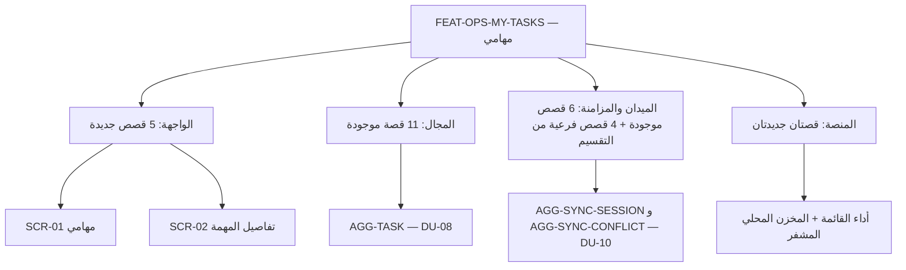

# تجربة: ميزة «مهامي» بكل طبقاتها

هذه عينة واحدة لترى شكل النتيجة قبل تعميمها على المشروع. ميزة أعمال واحدة، وما تحتها من قصص في كل الطبقات: القصص الموجودة تُربط بمعرّفاتها كما هي، والجديدة معلَّمة **(جديدة)** وكل منها يذكر مصدره في ملفات التصميم. لا نطاق خارج المتطلبات المعتمدة.

## 1. بطاقة الميزة

| البند | القيمة |
|---|---|
| **المعرّف** | FEAT-OPS-MY-TASKS |
| **الاسم** | مهامي: عرض المهام المسندة إليّ وتنفيذها، متصلًا ودون اتصال |
| **القيمة لصاحب العمل** | المستخدم الميداني ينفّذ عمله من قائمة واحدة، حتى 72 ساعة دون شبكة، ولا يضيع ما سجّله |
| **القدرة** | CAP-07.03 إدارة المهام (R1) |
| **الإصدار والشريحة** | R1 · SLC-03 (المجال) + SLC-11 (المزامنة الميدانية) |
| **حالات الاستخدام** | UC-042 تنفيذ المهمة، UC-043 تقديم النتيجة، UC-091 مزامنة الجهاز الميداني |
| **المتطلبات** | REQ-OPS-006 (آلة حالة المهمة)، REQ-OPS-008 (لا إكمال قبل استيفاء المعايير)، REQ-OFF-001 (72 ساعة دون اتصال) |
| **سيناريوهات الجودة** | QAS-PERF-016 (فتح «مهامي» p95 ≤ 500 ms)، QAS-OFF-001 (1,000 أمر معلق تُزامن ≤ 10 د، 0 كتابة صامتة، 0 تكرار)، QAS-USA-001 (يد واحدة، ≤ 60 ث) |
| **الشاشات** | SCR-01 مهامي، SCR-02 تفاصيل المهمة (`21-ui-design.md` §4.1) |
| **المكوّنات (Aggregates)** | AGG-TASK؛ AGG-SYNC-SESSION وAGG-SYNC-CONFLICT |
| **وحدات النشر** | DU-08 Operations، DU-10 Field sync، والتطبيق الميداني |
| **اختبارات القبول** | TST-TASK-SM، TST-SLC03-INVARIANTS، TST-SLC11-INVARIANTS |

## 2. خريطة الميزة



## 3. القصص حسب الطبقة

### 3.1 المجال (موجودة، تُربط فقط)

| القصة | ماذا تفعل |
|---|---|
| US-BC04-Q-TASK-LIST | جلب مهامي (حسب المُسند إليه والحالة والموعد) |
| US-BC04-Q-TASK-GET | تفاصيل المهمة: المعايير والنتيجة والاعتماديات |
| US-BC04-Q-TASK-HISTORY | سجل حالات المهمة |
| US-BC04-TASK-ACCEPT | قبول المهمة |
| US-BC04-TASK-DECLINE | رفض قبول المهمة |
| US-BC04-TASK-START | بدء المهمة |
| US-BC04-TASK-BLOCK | تعليقها كمحجوبة بسبب |
| US-BC04-TASK-RESUME | استئنافها |
| US-BC04-TASK-ADD-RESULT-ITEM | إضافة بند نتيجة |
| US-BC04-TASK-SUBMIT | تقديم المهمة للمراجعة |
| US-BC04-S-TASK-05 | تصعيد تلقائي عند فوات الموعد |

### 3.2 الواجهة (جديدة — المصدر `21-ui-design.md`)

**US-UI-SCR01-LIST — قائمة مهامي (جديدة)**
> بصفتي مستخدمًا مُسندة إليه مهام، أريد قائمة بمهامي مرتبة بالموعد ومجمّعة حسب الحالة، لكي أعرف ما عليّ الآن.

```gherkin
Scenario: فتح «مهامي»
  Given لدي مهام في حالات ASSIGNED وACCEPTED وIN_PROGRESS وBLOCKED
  When أفتح شاشة «مهامي»
  Then تظهر مهامي فقط، مجمّعة حسب الحالة، والأقرب موعدًا أولًا
  And تظهر خلال 500 ms (p95) — QAS-PERF-016
  And لا يظهر عدد إجمالي يشمل مهامًا لا أراها
```
المصدر: `21-ui-design.md` §4.1 (SCR-01)، §6.1 (القائمة)، §13.

**US-UI-SCR01-ACTIONS — الأفعال المتاحة حسب الحالة (جديدة)**
> بصفتي المُسند إليه، أريد أن أرى على كل مهمة الأفعال المتاحة لحالتها فقط، لكي لا أضغط زرًا سيُرفض.

```gherkin
Scenario Outline: الأزرار حسب الحالة
  Given مهمة في الحالة <state>
  Then تظهر الأفعال <actions> فقط
  Examples:
    | state       | actions                    |
    | ASSIGNED    | قبول، رفض القبول           |
    | ACCEPTED    | بدء                         |
    | IN_PROGRESS | تعليق، إضافة نتيجة، تقديم |
    | BLOCKED     | استئناف                     |
```
المصدر: `21-ui-design.md` §6.3؛ مصفوفة الحالة × الأمر في AGG-TASK. الزر تلميح فقط، والخادم يبقى الحكم.

**US-UI-SCR01-OFFLINE — العمل والحالة دون اتصال (جديدة)**
> بصفتي مستخدمًا ميدانيًا، أريد أن أنفّذ مهامي دون اتصال وأرى حالة كل تحديث، لكي أعمل 72 ساعة بلا شبكة وأعرف ما لم يُرسل بعد.

```gherkin
Scenario: تحديث دون اتصال ثم مزامنة
  Given الجهاز دون اتصال
  When أبدأ مهمة وأضيف بند نتيجة
  Then يُطبَّق التغيير محليًا ويحمل العنصر علامة «لم يُرسل»
  When يعود الاتصال وتكتمل المزامنة
  Then تصير العلامة «متزامن»، أو «قيد المراجعة» مع سبب الرفض إن صار تعارضًا

Scenario: تجاوز 72 ساعة
  Given الجهاز دون اتصال منذ أكثر من 72 ساعة
  Then يستمر التسجيل وتتوقف قراءة البيانات المحمّلة مسبقًا
```
المصدر: `21-ui-design.md` §8.2 (مؤشر المزامنة)؛ REQ-OFF-001؛ `field-sync-protocol.md`.

**US-UI-SCR02-RESULT — تسجيل النتيجة بيد واحدة (جديدة)**
> بصفتي مستخدمًا ميدانيًا، أريد إضافة بند نتيجة بصورة وموقع بيد واحدة، لكي أنهي التسجيل في أقل من دقيقة.

```gherkin
Scenario: بند نتيجة بصورة
  When أضيف بند نتيجة بصورة من الكاميرا
  Then يُلتقط الموقع والوقت تلقائيًا
  And الأزرار بحجم ≥ 44 px
  And الوسيط ≤ 60 ث في اختبار مع 10 مستخدمين ميدانيين — QAS-USA-001
```
المصدر: `21-ui-design.md` §8.1، §10.

**US-UI-SCR01-ERRORS — الاستجابة للرفض (جديدة)**
> بصفتي المُسند إليه، أريد رسالة واضحة حين يرفض الخادم فعلًا، لكي أعرف ماذا أفعل.

```gherkin
Scenario Outline: رفض من الخادم
  When أرسل فعلًا ويرد الخادم <code>
  Then <behaviour>
  Examples:
    | code                          | behaviour                                              |
    | 409 TASK_INVALID_STATE_TRANSITION | تُعاد قراءة المهمة ويختفي الفعل غير المتاح          |
    | 409 VERSION_CONFLICT          | تُعرض التغييرات الجديدة ويُطلب مني تأكيد الفعل         |
    | 422 TASK_SUSPENDED            | رسالة «المهمة معلّقة» ولا يُعاد الإرسال               |
    | 404                           | «غير متاح» دون تفاصيل                                  |
```
المصدر: `21-ui-design.md` §6.2؛ `18-error-handling.md`.

### 3.3 الميدان والمزامنة (موجودة، تُربط فقط)

| القصة | ماذا تفعل |
|---|---|
| US-BC07-SYN-OPEN | فتح جلسة مزامنة |
| US-BC07-SYN-UPLOAD-BATCH | رفع دفعة الأوامر المعلقة — مقسّمة في §4 |
| US-BC07-Q-SYN-DELTA | تنزيل تغييرات مهامي والتعليمات (CONTINUE / STOP / WIPE / REAUTHENTICATE) |
| US-BC07-S-SYNC-CONFLICT-01 | فتح تعارض تلقائيًا لأمر بنى على حالة قديمة |
| US-BC07-S-SYNC-SESSION-02 | إغلاق الجلسة حين تُقبل كل الأوامر |
| US-BC07-S-SYNC-SESSION-03 | إغلاق الجلسة مع تعارض واحد أو أكثر |

### 3.4 المنصة (جديدة)

**US-PLT-MYTASKS-READ — قراءة «مهامي» ضمن 500 ms (جديدة)**
> بصفتي فريق المنصة، أريد أن تُخدم قائمة المهام بفهرس بنطاق المستأجر والمُسند إليه والموعد، لكي يتحقق QAS-PERF-016 تحت حمل التصميم.

القبول: اختبار حمل بمزيج `performance-test-strategy.md` يعطي p95 ≤ 500 ms؛ والفهرس يبدأ بـ`tenant_id` (FIT-02). المصدر: QAS-PERF-016؛ `16-database-schema.md`؛ `24-testing-strategy.md` §2.

**US-PLT-DEVICE-STORE — المخزن المحلي المشفر (جديدة)**
> بصفتي فريق التطبيق الميداني، أريد تخزين المهام والأوامر المعلقة في SQLite مشفرة بمفتاح في keystore العتادي، لكي تُحمى البيانات إذا فُقد الجهاز ويمكن مسحها عن بعد.

القبول: لا شيء من المهام مقروء خارج التطبيق؛ وتعليمة `WIPE` في رد المزامنة تمسح المخزن. المصدر: TD-16؛ `ui-architecture.md`؛ REQ-OFF-005.

## 4. مثال تقسيم قصة كبيرة

`US-BC07-SYN-UPLOAD-BATCH` قصة واحدة اليوم، وفيها أربعة مسارات مختلفة في `field-sync-protocol.md`، فتُقسَّم:

| القصة الفرعية | المسار | النتيجة المتوقعة |
|---|---|---|
| US-BC07-SYN-UPLOAD-BATCH-a | كل الأوامر تبني على الإصدار الحالي | تُطبَّق بترتيب الجهاز، وتُغلق الجلسة متزامنة |
| US-BC07-SYN-UPLOAD-BATCH-b | أمر يبني على `base_version` قديم | لا يُكتب فوق الحالة؛ يُفتح تعارض مزامنة لمراجعة بشرية (لا «آخر كتابة تفوز») |
| US-BC07-SYN-UPLOAD-BATCH-c | إعادة رفع أمر سبق تطبيقه (`client_command_id` نفسه) | لا يُطبَّق مرتين؛ تُعاد النتيجة الأصلية |
| US-BC07-SYN-UPLOAD-BATCH-d | الجهاز مُبلَّغ عنه مفقودًا أو معلقًا | تُرفض الجلسة وتُرسل تعليمة المسح |

## 5. التتبع

| المتطلب | → الميزة | → القصص | → الاختبار |
|---|---|---|---|
| REQ-OPS-006 | FEAT-OPS-MY-TASKS | قصص المجال الإحدى عشرة، US-UI-SCR01-ACTIONS | TST-TASK-SM |
| REQ-OPS-008 | FEAT-OPS-MY-TASKS | US-BC04-TASK-SUBMIT، US-UI-SCR01-ERRORS | TST-SLC03-INVARIANTS |
| REQ-OFF-001 | FEAT-OPS-MY-TASKS | US-UI-SCR01-OFFLINE، قصص المزامنة، US-PLT-DEVICE-STORE | TST-SLC11-INVARIANTS |
| QAS-PERF-016 | FEAT-OPS-MY-TASKS | US-UI-SCR01-LIST، US-PLT-MYTASKS-READ | اختبار الحمل |
| QAS-USA-001 | FEAT-OPS-MY-TASKS | US-UI-SCR02-RESULT | اختبار مع 10 مستخدمين ميدانيين |

## 6. الأرقام في هذه الميزة

| الطبقة | قبل | بعد |
|---|---|---|
| المجال | 11 (موزعة تحت AGG-TASK) | 11 (تُربط بالميزة) |
| الميدان والمزامنة | 6 (تحت BC07) | 6 + 4 قصص فرعية بعد التقسيم (تحل محل قصة الرفع) |
| الواجهة | 0 | 5 |
| المنصة | 0 | 2 |
| **المجموع** | 17 قصة متفرقة بلا ميزة تجمعها | 27 قصة تحت ميزة واحدة |

**ما يتغير لو عُمّم:** كل ميزة أعمال تُبنى بهذا الشكل؛ القصص الموجودة لا تُعاد كتابتها بل تُربط؛ والجديدة تُشتق من ملفات التصميم بمصادرها؛ والـAggregates تصير عمود «المكوّنات» في بطاقة الميزة.
